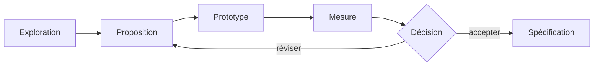

# Contribuer à Metaverse

## Règles essentielles

1. Ne pas présenter une hypothèse comme une technologie disponible.
2. Ne pas renommer un concept existant sans expliquer la différence sémantique réelle.
3. Toute primitive de langage proposée doit préciser sa syntaxe, ses règles de typage, sa sémantique d'exécution, ses erreurs et au moins un exemple.
4. Toute affirmation de performance doit être accompagnée d'un benchmark reproductible.
5. Toute décision importante doit référencer une fiche `HC-xxx` et une entrée `ADR-xxx`.
6. Les documents officiels sont écrits en français ; les termes techniques anglais peuvent être conservés lorsqu'ils sont standards.

## Cycle d'une idée

## Ajouter une discussion

1. Copier [le modèle de fiche](templates/DISCUSSION_TEMPLATE.md).
2. Attribuer le prochain identifiant `HC-xxx`.
3. Ajouter les URL de partage autorisées.
4. Résumer les conclusions sans effacer les désaccords.
5. Relier les projets et décisions concernés.
6. Mettre à jour [l'index](docs/02-gouvernance/DISCUSSIONS.md).

## Ajouter une décision

1. Copier [le modèle ADR](templates/DECISION_TEMPLATE.md).
2. Attribuer le prochain identifiant `ADR-xxx`.
3. Lier les discussions qui justifient la décision.
4. Définir les conséquences et critères de réexamen.
5. Mettre à jour [le registre](docs/02-gouvernance/DECISIONS.md).

## Travail avec une IA

Une IA doit commencer par lire le `README`, le registre des décisions et les documents directement concernés. Elle peut critiquer une décision, mais ne doit pas modifier son statut sans validation explicite du responsable du projet.
