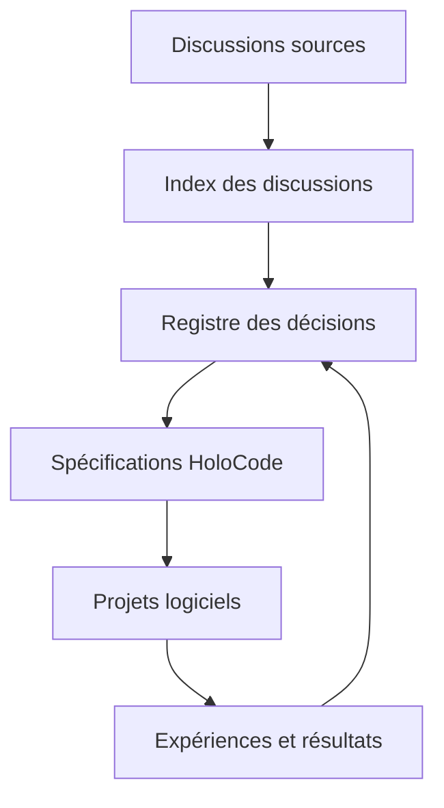

# Metaverse

Référentiel privé de recherche, de conception et de transmission du projet **Holoverse** et de son langage **HoloCode**.

Ce dépôt relie trois niveaux d'information :

1. les **discussions**, qui conservent le raisonnement et les explorations ;
2. les **décisions**, qui indiquent ce qui a réellement été retenu ;
3. les **projets**, qui transforment les décisions en logiciels, expériences et prototypes.

> Les conversations servent à réfléchir. Les documents servent à transmettre. Les spécifications servent à construire.

## Vision

Holoverse étudie la création d'une infrastructure informatique pour des mondes numériques interactifs, spatiaux, persistants et potentiellement distribués. HoloCode est le langage envisagé pour décrire ces mondes à travers des abstractions natives : mondes, espaces, entités, relations, lois, temps et phénomènes.

Le projet commence sur le matériel actuel. Les processeurs spatiaux, interfaces holographiques et nouvelles architectures matérielles restent des axes de recherche à long terme, jamais des capacités supposées acquises.

## Carte du référentiel



## Commencer ici

| Besoin | Document |
|---|---|
| Comprendre l'ambition générale | [Vision de Holoverse](docs/00-vision/VISION.md) |
| Comprendre le paradigme proposé | [Paradigme holoscénique](docs/01-holocode/PARADIGME-HOLOSCENIQUE.md) |
| Comprendre la chaîne technique | [Architecture de HoloCode](docs/01-holocode/ARCHITECTURE.md) |
| Retrouver les conversations sources | [Index des discussions](docs/02-gouvernance/DISCUSSIONS.md) |
| Savoir ce qui est décidé ou encore hypothétique | [Registre des décisions](docs/02-gouvernance/DECISIONS.md) |
| Faire collaborer plusieurs IA sans perdre la cohérence | [Protocole de collaboration IA](docs/02-gouvernance/PROTOCOLE-IA.md) |
| Voir les sous-projets prévus | [Carte des projets](docs/03-projets/PROJETS.md) |
| Suivre les étapes de réalisation | [Feuille de route](docs/04-roadmap/ROADMAP.md) |
| Contribuer correctement | [Guide de contribution](CONTRIBUTING.md) |

## Statuts documentaires

Chaque proposition importante doit porter l'un de ces statuts :

| Statut | Signification |
|---|---|
| `EXPLORATION` | Idée à examiner, sans engagement. |
| `PROPOSITION` | Solution assez précise pour être critiquée ou prototypée. |
| `EXPÉRIMENTATION` | Hypothèse actuellement testée. |
| `ACCEPTÉ` | Décision officielle du projet. |
| `REJETÉ` | Option examinée puis écartée, avec justification conservée. |
| `REMPLACÉ` | Ancienne décision supplantée par une décision plus récente. |

## Principe de traçabilité

Toute décision architecturale importante doit indiquer :

- la ou les discussions sources (`HC-xxx`) ;
- le problème traité ;
- les alternatives étudiées ;
- son statut ;
- les projets affectés ;
- les critères qui permettraient de la confirmer ou de la remplacer.

Les URL de conversations qui ne sont pas encore disponibles sont marquées `À AJOUTER`. Elles ne doivent jamais être inventées.

## État actuel

Le dépôt contient maintenant **Proposition code by GPT5.6 — HoloCode v0.1**, une première preuve exécutable capable de définir un monde minimal, d'instancier des entités, d'évaluer une relation spatiale et de déclencher un phénomène observable.

### Exécuter la première scène

Prérequis : Python 3.11 ou plus récent.

```bash
cd proposals/GPT5.6/holocode-v0.1
python -m holocode examples/automatic_door.holo --ticks 2
```

Lancer les tests :

```bash
python -m unittest discover -s tests -v
```

Le prototype, sa syntaxe et ses limites sont décrits dans la [spécification HoloCode v0.1](docs/01-holocode/SPECIFICATION-V0.1.md).

Les implémentations expérimentales sont classées par auteur dans le [registre des propositions de code](proposals/README.md). Toute modification doit rester visible sur GitHub selon la [politique de synchronisation](GITHUB-SYNC-POLICY.md).
