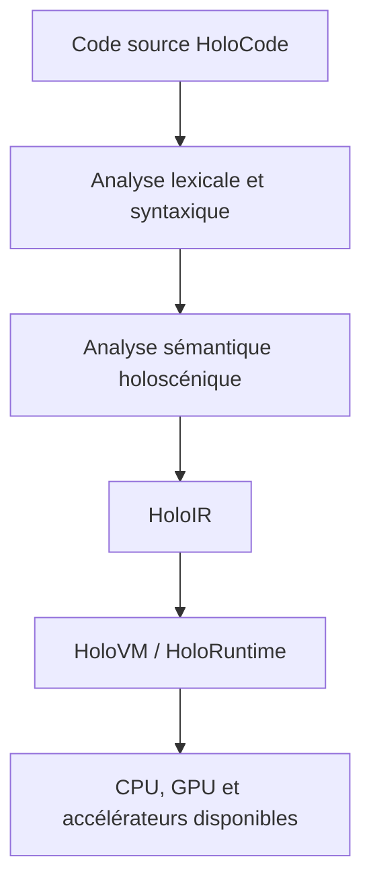

# Architecture technique de HoloCode

> **Mise à jour v0.1 :** un interpréteur de référence expérimental implémente désormais le chemin `source → lexer → AST → runtime` pour les entités, relations de proximité et phénomènes. HoloIR, HoloVM et la compilation native restent des cibles futures. Voir la [spécification exécutable](SPECIFICATION-V0.1.md).

**Statut : `PROPOSITION`**
**Discussions sources : `HC-005`, `HC-006`, `HC-007`, `HC-013`**

## Architecture décidée le 2026-09-21 (ajouté ; `ADR-010` et `ADR-011` acceptées, `ADR-013` acceptée pour la direction, `ADR-012` rejetée ; état du 2026-10-06)

- **Un moteur écrit en Rust, deux enveloppes.** Le moteur lit les fichiers `.holo` et dessine le résultat. Compilé en WebAssembly, il tourne dans les navigateurs actuels, avec `wgpu` (WebGPU, ou WebGL 2 en repli). Compilé en natif, le même moteur deviendra le navigateur propre au projet, qui ouvrira directement une adresse vers un fichier `.holo` ; la vue à plat y restera du vrai HTML (`ADR-011`, précision du 2026-10-06).
- **Un rendu par vue.** La vue à plat est traduite en HTML et CSS générés, pour rester légère, lisible par les moteurs de recherche et par les téléphones anciens. La vue en profondeur est dessinée par le moteur dans une zone de dessin. Dans les deux cas, l'auteur n'écrit que du `.holo`.
- **Deux étages.** HoloCode en haut : pages, mondes, règles, comportements, utilisation d'une IA ; sûr, petit, réapprenable. En bas, des modules compilés en WebAssembly (Rust, C, Zig…) pour le rendu, la physique lourde, les réseaux de neurones ; chaque module est enfermé (mémoire plafonnée, temps limité, droits déclarés) et se présente en holoscénique. Trois sortes d'import : `import` (du `.holo`), `module` (une boîte fermée), ~~`pont js` / `pont css`~~ (rejeté le 2026-10-06, `ADR-011` partie B).
- **Première réalisation :** le [sprint Big Bang](../../moteur/README.md) : 1 529 lignes de Rust, 489 Ko transférés, un fichier `.holo` de huit lignes. Les mesures sur téléphone décideront du passage de ces décisions en `ACCEPTÉ`.

Les sections qui suivent décrivent la chaîne cible de départ (compilateur, HoloIR, VM). HoloIR reste une proposition (`ADR-006`) : le moteur lit aujourd'hui directement le `.holo`.

## Chaîne cible

## Composants

| Projet | Responsabilité | Première cible réaliste |
|---|---|---|
| HoloCode | Langage principal de description et logique des mondes | Petit langage textuel exécutable |
| HoloCode-Core | Couche système et bas niveau | Bibliothèque/runtime sûr, probablement implémenté d'abord en Rust ou C++ |
| HoloCompiler | Analyse, typage et compilation | Parseur + vérificateur + génération de HoloIR |
| HoloIR | Représentation intermédiaire spatiale et temporelle | Graphe sérialisable d'entités, relations et phénomènes |
| HoloVM | Machine virtuelle éventuelle | Interpréteur déterministe avant JIT |
| HoloRuntime | Simulation, événements, autorité et persistance | Boucle de simulation mono-machine |
| HoloEngine | Rendu et intégration média | Adaptateur vers un moteur existant au départ |
| Holoverse | Plateforme de mondes | Démonstrateur multi-utilisateur ultérieur |

## Séparation des responsabilités

- Le **compilateur** démontre que le programme est bien formé.
- **HoloIR** conserve les relations nécessaires à l'analyse et à l'optimisation.
- La **VM** exécute une sémantique stable et observable.
- Le **runtime** gère le temps, les événements, l'autorité, la persistance et la distribution.
- Le **moteur** affiche et sonorise le monde ; il ne définit pas à lui seul sa vérité logique.

## Contraintes d'ingénierie

- Déterminisme configurable pour la simulation et les tests.
- Unités physiques et référentiels vérifiés par le système de types.
- Journal causal expliquant chaque transformation importante.
- Budget explicite pour les relations actives et les requêtes spatiales.
- Modèle d'autorité empêchant un client, script ou agent IA de modifier un état sans capacité.
- Format de sauvegarde versionné et migrable.

## Stratégie matérielle

Phase 1 : CPU et GPU disponibles.
Phase 2 : mesures des goulots d'étranglement.
Phase 3 : kernels spécialisés si les mesures les justifient.
Phase 4 : étude d'une ISA ou de coprocesseurs spatiaux uniquement si un bénéfice reproductible est établi.
