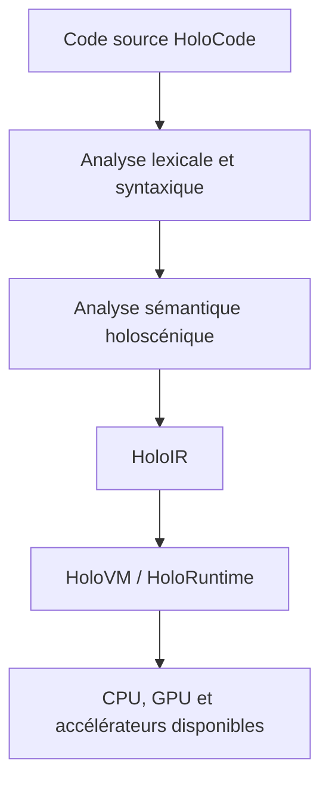

# Architecture technique de HoloCode

**Statut : `PROPOSITION`**
**Discussions sources : `HC-005`, `HC-006`, `HC-007`**

## Chaîne cible

## Composants

| Projet | Responsabilité | Première cible réaliste |
|---|---|---|
| HoloCode | Langage principal de description et logique des mondes | Petit langage textuel exécutable |
| HoloCode-Core | Couche système et bas niveau | Bibliothèque/runtime sûr, probablement implémenté d'abord en Rust ou C++ |
| HoloCompiler | Analyse, typage et compilation | Parseur + vérificateur + génération de HoloIR |
| HoloIR | Représentation intermédiaire spatiale et temporelle | Graphe sérialisable d'entités, relations et phénomènes |
| HoloVM | Machine virtuelle éventuelle | Interpréteur déterministe avant JIT |
| HoloRuntime | Simulation, événements, autorité et persistance | Boucle de simulation mono-machine |
| HoloEngine | Rendu et intégration média | Adaptateur vers un moteur existant au départ |
| Holoverse | Plateforme de mondes | Démonstrateur multi-utilisateur ultérieur |

## Séparation des responsabilités

- Le **compilateur** démontre que le programme est bien formé.
- **HoloIR** conserve les relations nécessaires à l'analyse et à l'optimisation.
- La **VM** exécute une sémantique stable et observable.
- Le **runtime** gère le temps, les événements, l'autorité, la persistance et la distribution.
- Le **moteur** affiche et sonorise le monde ; il ne définit pas à lui seul sa vérité logique.

## Contraintes d'ingénierie

- Déterminisme configurable pour la simulation et les tests.
- Unités physiques et référentiels vérifiés par le système de types.
- Journal causal expliquant chaque transformation importante.
- Budget explicite pour les relations actives et les requêtes spatiales.
- Modèle d'autorité empêchant un client, script ou agent IA de modifier un état sans capacité.
- Format de sauvegarde versionné et migrable.

## Stratégie matérielle

Phase 1 : CPU et GPU disponibles.
Phase 2 : mesures des goulots d'étranglement.
Phase 3 : kernels spécialisés si les mesures les justifient.
Phase 4 : étude d'une ISA ou de coprocesseurs spatiaux uniquement si un bénéfice reproductible est établi.
