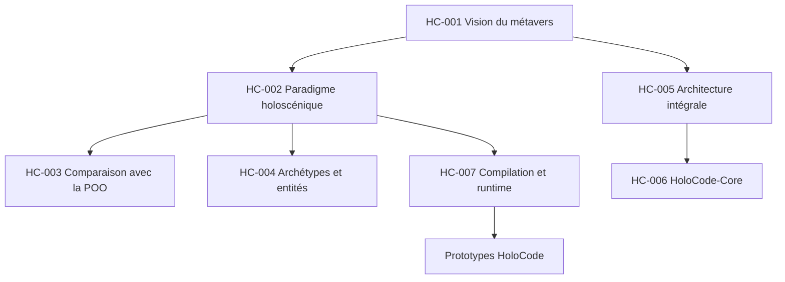

# Index des discussions

Ce fichier relie les conversations aux connaissances et aux projets. Les liens de partage exacts doivent être ajoutés par le propriétaire du projet ou par une IA autorisée à accéder à ces conversations.

## Graphe thématique



## Catalogue

| ID | Sujet | Sources | Documents produits | Projets liés |
|---|---|---|---|---|
| `HC-001` | Vision générale du métavers et Holoverse | [ChatGPT — à ajouter](#liens-à-compléter) | [Vision](../00-vision/VISION.md) | Holoverse |
| `HC-002` | Définition du paradigme holoscénique | [ChatGPT — à ajouter](#liens-à-compléter) | [Paradigme](../01-holocode/PARADIGME-HOLOSCENIQUE.md) | HoloCode |
| `HC-003` | HoloCode face à la programmation orientée objet | [ChatGPT — à ajouter](#liens-à-compléter) | [Paradigme](../01-holocode/PARADIGME-HOLOSCENIQUE.md) | HoloCode, HoloCompiler |
| `HC-004` | Archétypes, entités, capacités, lois et phénomènes | [ChatGPT — à ajouter](#liens-à-compléter) | Spécification formelle à créer | HoloCode, HoloIR |
| `HC-005` | Réinvention intégrale de l'architecture informatique du métavers | [ChatGPT — à ajouter](#liens-à-compléter) | [Architecture](../01-holocode/ARCHITECTURE.md) | Tous |
| `HC-006` | HoloCode-Core et programmation bas niveau | [ChatGPT — à ajouter](#liens-à-compléter) | Spécification à créer | HoloCode-Core |
| `HC-007` | HoloCompiler, HoloIR, HoloVM et HoloRuntime | [ChatGPT — à ajouter](#liens-à-compléter) | [Architecture](../01-holocode/ARCHITECTURE.md) | Chaîne d'exécution |
| `HC-008` | Hologrammes, interfaces et matériel futur | [ChatGPT — à ajouter](#liens-à-compléter) | Dossier de recherche à créer | HoloEngine, HoloHardware Research |
| `HC-009` | Coordination entre ChatGPT, Claude, Gemini et autres IA | Conversation actuelle — URL à ajouter | [Protocole IA](PROTOCOLE-IA.md) | Gouvernance |

## Liens à compléter

Les identifiants `HC-xxx` sont permanents même si une conversation est déplacée. Pour chaque fiche, ajouter si possible :

```text
ChatGPT : https://chatgpt.com/share/...
Claude   : https://claude.ai/share/...
Gemini   : https://share.google/...
Projet ChatGPT : lien ou nom stable du projet
Projet Claude  : lien ou nom stable du projet
```

Un lien partagé peut exposer son contenu à toute personne qui le possède. Ne jamais y inclure de secrets, données médicales ou informations personnelles non nécessaires.

## Relations entre conversations et projets

Chaque future fiche de discussion doit posséder les champs suivants :

- `Parents` : conversations nécessaires pour comprendre celle-ci ;
- `Enfants` : discussions qui approfondissent un point ;
- `Décisions` : ADR produites ou modifiées ;
- `Projets` : logiciels ou recherches affectés ;
- `Documents` : spécifications mises à jour ;
- `Questions ouvertes` : travaux qui peuvent créer une nouvelle discussion.
