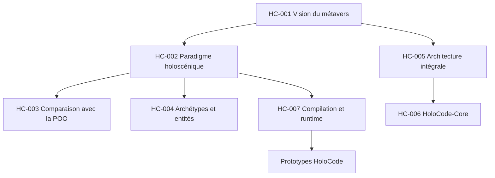

# Index des discussions

Ce fichier relie les conversations aux connaissances et aux projets. Une même conversation peut alimenter plusieurs fiches `HC-*` lorsqu'elle couvre plusieurs domaines.

## Graphe thématique



## Catalogue

| ID | Sujet | Sources | Documents produits | Projets liés |
|---|---|---|---|---|
| `HC-001` | Vision générale du métavers et Holoverse | [Métaverse : Origines et Technologies][CG-004] · [Créer le metaverse de zéro][CG-001] | [Vision](../00-vision/VISION.md) | Holoverse |
| `HC-002` | Définition du paradigme holoscénique | [Paradigme holoscénique développement][CG-003] | [Paradigme](../01-holocode/PARADIGME-HOLOSCENIQUE.md) | HoloCode |
| `HC-003` | HoloCode face à la programmation orientée objet | [Paradigme holoscénique développement][CG-003] | [Paradigme](../01-holocode/PARADIGME-HOLOSCENIQUE.md) | HoloCode, HoloCompiler |
| `HC-004` | Archétypes, entités, capacités, lois et phénomènes | [Paradigme holoscénique développement][CG-003] | Spécification formelle à créer | HoloCode, HoloIR |
| `HC-005` | Réinvention intégrale de l'architecture informatique du métavers | [Créer le metaverse de zéro][CG-001] | [Architecture](../01-holocode/ARCHITECTURE.md) | Tous |
| `HC-006` | HoloCode-Core et programmation bas niveau | [Métavers expliqué][CG-002] | Spécification à créer | HoloCode-Core |
| `HC-007` | HoloCompiler, HoloIR, HoloVM et HoloRuntime | [Paradigme holoscénique développement][CG-003] · [Métavers expliqué][CG-002] | [Architecture](../01-holocode/ARCHITECTURE.md) | Chaîne d'exécution |
| `HC-008` | Hologrammes, interfaces et matériel futur | [Métaverse : Origines et Technologies][CG-004] · [Créer le metaverse de zéro][CG-001] | Dossier de recherche à créer | HoloEngine, HoloHardware Research |
| `HC-009` | Coordination entre ChatGPT, Claude, Gemini et autres IA | [Conversation Claude privée][CL-001] · conversation ChatGPT actuelle non partagée | [Protocole IA](PROTOCOLE-IA.md) | Gouvernance |
| `HC-013` | Le web devient le métavers : format `.holo`, moteur Rust, imports, place de l'IA, description honnête du paradigme | [Fiche](../05-discussions/HC-013-web-metavers-et-format-holo.md) — session Claude Code, sans URL de partage | [`ADR-007` à `ADR-015`](DECISIONS.md) | Tous |

Les identifiants `HC-010` à `HC-012` sont réservés à des fiches Claude antérieures, pas encore publiées.

## Registre des conversations sources

| Référence | Plateforme | Titre identifié | URL | Accessibilité |
|---|---|---|---|---|
| `CG-001` | ChatGPT | Créer le metaverse de zéro | [Ouvrir][CG-001] | Lien partagé |
| `CG-002` | ChatGPT | Métavers expliqué | [Ouvrir][CG-002] | Lien partagé |
| `CG-003` | ChatGPT | Paradigme holoscénique développement | [Ouvrir][CG-003] | Lien partagé |
| `CG-004` | ChatGPT | Métaverse : Origines et Technologies | [Ouvrir][CG-004] | Lien partagé |
| `CL-001` | Claude | Conversation Metaverse/HoloCode — titre à confirmer | [Ouvrir][CL-001] | Lien privé `/chat/`, accès lié au compte Claude |

[CG-001]: https://chatgpt.com/share/6ab12b91-df08-83ea-a3c5-5dde56b87077
[CG-002]: https://chatgpt.com/share/6ab12bd4-38a8-83ea-bfc4-e23b5d720404
[CG-003]: https://chatgpt.com/share/6ab12be8-5eb0-83ea-9a12-7c3d2f7808a0
[CG-004]: https://chatgpt.com/share/6ab12c0a-dd3c-83e9-a972-9daeec0964b2
[CL-001]: https://claude.ai/chat/d190ccde-b231-4a19-a81e-b5cba2432b52

## Liens restant à compléter

Les identifiants `HC-xxx` et les références de sources sont permanents même si une conversation est déplacée. Il reste à ajouter, lorsqu'ils seront disponibles :

```text
Gemini   : https://share.google/...
Projet ChatGPT : lien ou nom stable du projet
Projet Claude  : lien ou nom stable du projet
```

Un lien partagé peut exposer son contenu à toute personne qui le possède. Ne jamais y inclure de secrets, données médicales ou informations personnelles non nécessaires.

## Relations entre conversations et projets

Chaque future fiche de discussion doit posséder les champs suivants :

- `Parents` : conversations nécessaires pour comprendre celle-ci ;
- `Enfants` : discussions qui approfondissent un point ;
- `Décisions` : ADR produites ou modifiées ;
- `Projets` : logiciels ou recherches affectés ;
- `Documents` : spécifications mises à jour ;
- `Questions ouvertes` : travaux qui peuvent créer une nouvelle discussion.
