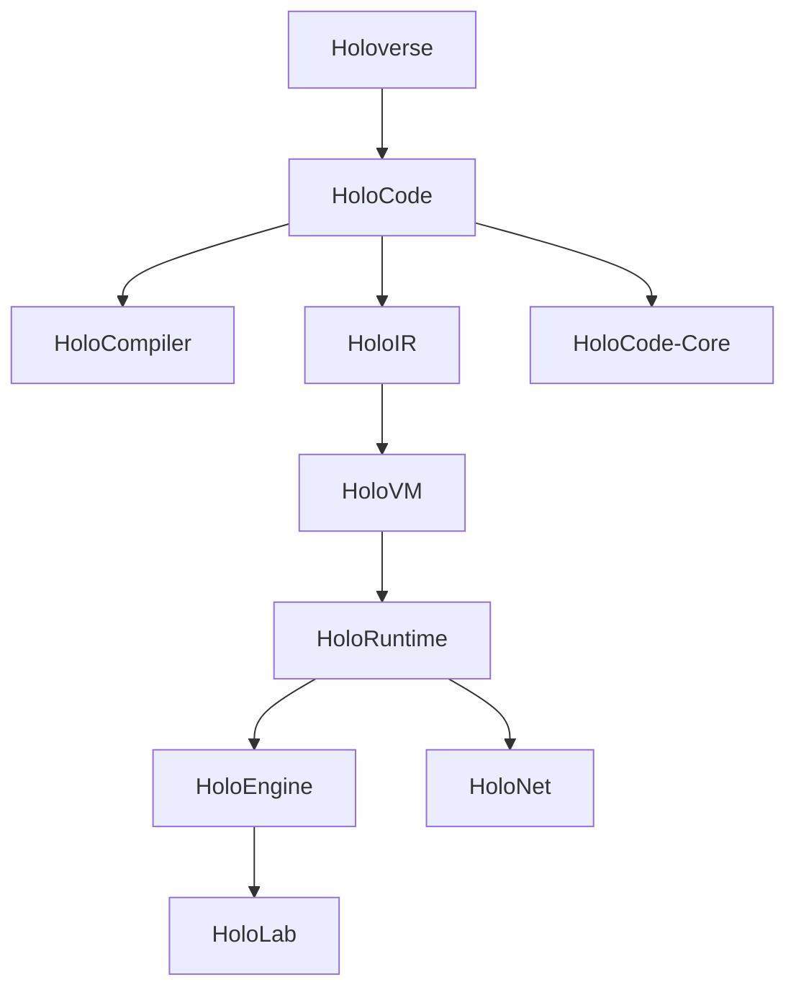

# Carte des projets issus de Holoverse

**Statut global : `PROPOSITION`**

## Portefeuille proposé

| Projet | But | Dépendances documentaires | Première livraison |
|---|---|---|---|
| Holoverse | Plateforme globale de mondes | Vision, toutes les ADR majeures | Démonstrateur cohérent |
| HoloCode | Langage holoscénique | Paradigme, sémantique formelle | Grammaire minimale |
| HoloCompiler | Transformer et vérifier le code | HoloCode, HoloIR | Parseur + diagnostics |
| HoloIR | Représenter le programme spatial | Sémantique, architecture | Schéma versionné |
| HoloVM | Exécuter HoloIR | HoloIR | Interpréteur déterministe |
| HoloRuntime | Gérer le monde en activité | VM, temps, autorité | Simulation mono-machine |
| HoloCode-Core | Mémoire, FFI et systèmes | Sécurité, runtime | API système expérimentale |
| HoloEngine | Rendu, audio et interaction | Runtime | Adaptateur moteur existant |
| HoloNet | Réplication et mondes partagés | Runtime, sécurité | Prototype client-serveur |
| HoloLab | Benchmarks et recherches matérielles | Tous les résultats mesurés | Banc d'expérimentation |

## Règle de création d'un dépôt enfant

Un projet devient un dépôt séparé seulement lorsqu'il possède :

1. une mission distincte ;
2. une interface définie avec les autres composants ;
3. un responsable ou une équipe ;
4. un premier jalon testable ;
5. au moins une décision architecturale qui justifie sa séparation.

Avant cela, il demeure un dossier ou un prototype dans ce référentiel afin d'éviter une constellation de dépôts vides — le multivers administratif n'est pas encore une priorité.
