# Journal d'évolution du projet

Ce journal raconte ce qui a été fait, ce qui a raté et ce qui a été décidé, étape par étape, avec les captures. Il est tenu par Claude après chaque étape, à la demande de Yocthan, sans le lui annoncer. La dernière entrée est en haut. Les captures sont dans [`images/`](images/).

Pour l'état courant en un coup d'œil, voir [`AGENTS.md`](../../AGENTS.md) à la racine.

---

## 2026-10-10 — Travailler un texte : des majuscules, sa longueur, le couper, le découper

- Fait (issue #232 ; `ADR-103`, ACCEPTÉ d'avance par Yocthan : « tu le valides déjà, tu le fais déjà ») : le travail d'un agent de la session du PC (`wip/langage/textes`, af8bd0d), relu par elle, puis fini par la session du nuage quand le PC s'est éteint (passation dans #255).
  - Quatre formats de texte (`ADR-043`) : `{code:upper}` et `{code:lower}`, dans la langue de la page (« ß » → « SS » ; en turc, « i » → « İ » ; en grec, les accents tombent en majuscules et le sigma final s'écrit « ς ») ; `{message:length}`, les caractères comptés comme une personne les compte ; `{message:max40}`, au plus 40 caractères, coupé à la fin d'un mot si l'on garde ainsi la moitié de la place, jamais au milieu d'une lettre, avec « … ».
  - Un caractère est une grappe de graphèmes d'Unicode (UAX #29), comme `Intl.Segmenter` : 👍🏽, 🇫🇷, 👨‍👩‍👧, « é » écrit en deux morceaux, « क्षि » comptent chacun pour un. La table des lettres (Unicode 16.0, 711 plages, moins de 3 Ko) est fabriquée par `moteur/outils/graphemes.py`.
  - `computed: [ Split(name: tags, from: keywords, by: ",") ]` : une liste calculée qui suit son texte ; les blancs autour retirés, les morceaux vides oubliés, deux cents au plus ; `","` coupe aux virgules de toutes les écritures (, ، 、 ， …), `";"` aux points-virgules, `" "` aux blancs, `lines` à chaque ligne.
  - Partout où un texte se montre : une phrase, le titre de l'onglet, une ligne de liste (`{item.title:max40}`), et sans JavaScript (`holo serve`).
  - La leçon 126, le guide (« 6 quaterquadragies »), `NOMS.md`, `DECISIONS.md`, le sommaire des leçons, un essai dans Chrome.
- Fini par la session du nuage :
  - `main` fusionnée (les PR 256 à 263) : NOMS, l'essai Chrome et `styles.rs` résolus en gardant les deux côtés, rangés par numéro ; le guide sans conflit.
  - cette entrée du journal, la preuve complète, la preuve que l'essai sait échouer, la PR.
- Exécuté (conteneur du nuage, Linux, Chromium 1194) :
  - après la fusion de `main` : `cargo test --release --locked`, **268** passent, 0 échec.
  - L'essai Chrome sait échouer : le moteur changé un instant pour compter les points de code au lieu des lettres (`count` → `text.chars().count()`), reconstruit, l'essai seul rate : « compté "👍🏽🇫🇷" : 4 au lieu de 2 », « "été" : 5 au lieu de 3 », « "👨‍👩‍👧 et 🏴󠁧󠁢󠁳󠁣󠁴󠁿" : 16 au lieu de 6 », et de même pour le devanagari, le coréen, l'arabe, le tamoul et le thaï. Le code remis (`git checkout`).
  - La preuve complète (`check-locked.sh`, sur 672ed1a) : `cargo test --release --locked` et `cargo test`, **268** passent ; les deux WebAssembly, `holo` et les liaisons se construisent ; la suite Chrome (`CI=1`, axe-core 4.10.3) : **88 essais sur 91**, dont celui de la leçon 126 (« au départ : AB-12 », les huit textes difficiles comptés comme `Intl.Segmenter`, « 北京，上海、 广州,, » en trois étiquettes, et sans JavaScript « ISTANBUL ILIK ») ; 132 leçons s'ouvrent sans erreur. Les 3 ratés sont ceux du conteneur : « pincer à deux doigts » (passe relancé seul), « la vue points se lit au lecteur d'écran », « parcours 8 et 9 » (la vidéo H.264 ne joue pas dans ce Chromium). `holo check` sur la leçon 126 : `ok`.
- Erreurs en route : l'agent de la session du PC a été arrêté vers 15 h, avant le journal et la preuve complète ; puis le PC s'est éteint (plus de charge). Rien n'était perdu : tout était sur `wip/langage/textes`.
- Reste (les dettes de l'`ADR-103`) :
  - la limite d'un champ (`max:`) compte encore en signes écrits, pas en lettres : à aligner, avec le `maxlength` du navigateur ;
  - une condition sur une longueur (`If` sur `{message:length}`) ;
  - rejoindre une liste en un texte, une majuscule seulement au début, le grec ancien et la règle du point en lituanien ;
  - `{item:upper}` dans une répétition écrite dans le fichier (`Repeat(items: …)`) ;
  - refaire la table quand Unicode changera (`python moteur/outils/graphemes.py`) ;
  - le grand tableau du web (« texte : majuscules, longueur, découper » passe à « Oui ») et la suite des leçons, refaits à la fin.

---

## 2026-10-10 — Une page dans la page : `Embed(from:, label:, image:)`

- Fait (issue #249, la session du nuage ; `ADR-117`, ACCEPTÉ) : l'une des huit fonctions ouvertes sous conditions, la page d'un autre site dans la page.
  - `Embed(from: "https://…", label: "…", image: "…")`, d'un site listé dans `Page(embeds: [ … ])`, comparé exactement, en HTTPS. Le nom que les sites donnent eux-mêmes (« Intégrer », « Embed ») ; les mots repris : `from:`, `label:`, `image:` (la comparaison est dans l'ADR).
  - Une façade : une image du site de l'auteur, le titre, « Charger depuis www.openstreetmap.org », sur un vrai bouton. Rien ne part vers l'autre site avant le toucher : ni cadre, ni connexion préparée, ni image chargée chez lui ; l'adresse n'est que dans `data-embed`.
  - Au toucher (doigt, souris, Entrée, Espace), la page légère pose la page intégrée, sans attendre le moteur : `sandbox="allow-scripts allow-same-origin"` (`allow-scripts` seul pour une adresse de la même origine que la page), `allow="fullscreen"`, `referrerpolicy="strict-origin"`, son titre ; le clavier y entre.
  - Sans JavaScript, un lien dans `noscript`, avec le titre, qui s'ouvre dans un nouvel onglet.
  - `holo serve` envoie `Content-Security-Policy: frame-src` : les sites listés, `'none'` sinon. Il n'envoyait aucune politique de sécurité du contenu.
  - La taille suit l'écran : 16/9, un style la change.
  - La leçon 140 : une carte d'OpenStreetMap et la première vidéo de YouTube, avec deux images de façade de moins de 600 octets. Le guide (chapitre « 6 duodesexagies »), `NOMS.md`, `DECISIONS.md`, le sommaire des leçons, le README du moteur.
- Exécuté :
  - `check-locked.sh` : `cargo test --release --locked` et `cargo test`, **267** tests passent, 0 échec. Nouveaux : les cinq essais de `embed.rs` et `server::embed_tests::a_page_says_which_sites_it_may_embed`.
  - `holo check` sur la leçon 140 : `ok`.
  - Dans Chrome, « une page dans la page … (leçon 140, serve) » passe. « L'autre site » est une fausse page, rendue par l'interception des demandes (Fetch), qui dit au parent ce qu'elle voit.
    - Avant le toucher : 0 demande vers l'autre site (par l'interception et par le réseau), aucun cadre, aucune adresse de l'autre site dans un `src` ou un `href`.
    - Au clavier, Tab jusqu'à la façade, Entrée : le cadre enfermé, son titre, le clavier dedans (la touche « k » y arrive). Au doigt, la vidéo.
    - La fausse page : la page de l'auteur lui est fermée ; pendant la touche, ni fenêtre, ni navigation de la page de l'auteur ; seul `fullscreen` ; la position refusée ; elle reçoit `http://localhost:…/`, pas l'adresse de la page.
    - `frame-src` refuse un cadre non listé ; une adresse de la même origine, sur la leçon servie en HTTPS, n'a que `allow-scripts`.
    - Sans JavaScript : deux liens nommés, aucun bouton, aucun cadre, aucune demande. axe-core : zéro défaut, avant et après le toucher.
  - L'essai sait échouer. Chaque mutation a été faite, puis retirée, et l'essai repasse :
    - le cadre posé d'emblée, comme le web : 2 demandes vers l'autre site avant le toucher ;
    - sans `frame.focus()` : le clavier n'entre pas ;
    - sans `sandbox` : pendant une touche, la page intégrée emmène la page de l'auteur vers `https://pirate.example.org/dessus` ;
    - sans l'en-tête de `holo serve` : pas de `frame-src`, le cadre non listé n'est pas refusé ;
    - sans la façade : les boutons restent cachés, le clavier ne les atteint pas.
  - Dans le moteur, `http://` accepté, puis un sous-domaine accepté : `only_https_to_a_listed_site_compared_exactly` rate.
  - La suite Chrome entière (`CI=1`, axe-core 4.10.3), par `check-locked.sh` (sur 94096fc, puis de nouveau sur fa1606e, après le clavier redonné) : **88 essais sur 91** chaque fois, dont le nouveau ; 132 leçons s'ouvrent sans erreur. Les 3 ratés sont ceux du conteneur : « pincer à deux doigts » (passe relancé seul), « la vue points se lit au lecteur d'écran », « parcours 8 et 9 » (la vidéo H.264 ne joue pas dans ce Chromium).
- Erreurs en route :
  - Le nom lu par le lecteur d'écran collait les deux lignes de la façade ; une virgule cachée laissait une espace avant elle (Chrome compte l'élément caché comme un bloc). Le bouton et le lien ont maintenant un nom exact (`aria-label`), qui reprend le texte montré, dans l'ordre.
  - La fenêtre ouverte sans geste était déjà bloquée par Chrome, enfermée ou non : l'essai ne tranchait pas. La fausse page la tente maintenant pendant une touche, un vrai geste.
  - La garde de la même origine ne s'éprouvait pas sur `http://localhost` : la page légère refuse d'abord une adresse qui n'est pas en HTTPS. La leçon est servie à une adresse en HTTPS par l'interception, qui prend chaque fichier à `holo serve`.
  - Le choix de `referrerpolicy` : `no-referrer` aurait fait rater le lecteur de YouTube (« erreur 153 » sans `Referer`, et `Referrer-Policy: same-origin`, l'en-tête de `holo serve`, suffit à la déclencher) ; vu par une recherche, les pages n'étant pas joignables d'ici.
  - La limite de séance a arrêté l'agent au début, pendant sa lecture ; le conteneur a redémarré, et `main` (les PR 256 à 263) a été fusionnée avant de commencer.
  - Sur GitHub, le Chrome des machines perdait le clavier : juste après Entrée, le cadre avait le focus, mais la touche « k » n'arrivait pas dans la page intégrée (« la touche k reçue : false », le seul raté de la suite, commit c406cbc), alors que tout passait dans le Chromium du conteneur. La page de l'autre site arrive dans un autre processus du navigateur : quand elle a fini d'arriver, si le clavier est toujours sur le cadre, la page légère le lui redonne (`frame.contentWindow.focus()`). L'essai attend aussi que la fausse page dise qu'elle a le focus, et remet l'onglet au premier plan (un essai d'avant en ouvre un autre). Le conteneur ne reproduit pas ce raté : la preuve que l'essai le voit est le raté de GitHub lui-même. La CI est verte sur fa1606e (les trois travaux), et l'ADR le dit.
- Reste :
  - essayer sur les vrais sites, sur un téléphone ;
  - refermer une page intégrée, et revenir à sa façade ;
  - `frame-src` aussi avec le serveur d'essai de Node ;
  - la miniature cherchée par le serveur de l'auteur ;
  - la suite des leçons (la 140 revient à la 124 et mène à la 1) et le grand tableau du web (`iframe` : « En partie »), refaits à la fin.

---

## 2026-10-10 — Les données d'un autre site, lues par le serveur de l'auteur : `Data(from: "https://…")`

- Fait (issue #248, prise par un agent de la session du nuage ; `ADR-116`, ACCEPTÉ : Yocthan a dit « Oui » le 2026-10-09 à l'ouverture sous ces conditions) :
  - `Data(from: "https://…")` : le même bloc, une adresse HTTPS. C'est `holo serve` qui lit l'autre site ; le moteur de la page lui demande `?remote-data`, à sa propre adresse. Le navigateur du visiteur ne parle jamais à l'autre site, et ne reçoit pas son adresse.
  - Les sites permis et leurs clés dans `holo-data/sites.txt` : une ligne par site, la clé sur sa ligne, en paramètre (`?appid=…`) ou en en-tête (`X-Api-Key: …`), comme la documentation du site la montre. La page ne nomme jamais une clé. Comparé, dans l'ADR, avec une liste dans la page (`Allowed(sources:)`), une clé nommée par la page, une variable d'environnement.
  - Les sept règles, tenues par le moteur, chacune avec son essai : HTTPS et un nom exact (jamais une adresse IP) ; rien vers ce PC ni le réseau privé, en IPv4 et en IPv6, une IPv4 portée par une IPv6 comprise, et la connexion à l'adresse vérifiée ; aucune redirection ; 4 s, 8 s, 64 Ko coupés, un objet JSON, 32 sites, 64 adresses, 8 par site ; une demande au plus par adresse et par `every` (une minute au moins), même avec beaucoup de visiteurs ; les clés jamais hors du serveur ; un `User-Agent` honnête, rien du visiteur.
  - Ce qui arrive est réduit à ce que la page déclare (un numéro de compte ou l'adresse IP du serveur, dans la réponse, n'arrivent pas chez le visiteur). Sans JavaScript, la page arrive avec ses données ou dit l'échec ; `refresh` relit ce qui est gardé.
  - La bibliothèque : `ureq` 3.4.2 (`=3.4.2`, avec `rustls`), seulement pour le PC ; aucun proxy, aucune redirection, aucune connexion gardée.
  - L'interrupteur des essais, `HOLO_TEST_ONLY_INSECURE_SITE` : un nom en `.test` lu sur ce PC, en HTTP clair, pour le faux « autre site » de l'essai Chrome ; éteint par défaut, lu seulement dans l'environnement, annoncé au démarrage.
  - La leçon 139 (le résumé de Kinshasa sur Wikipédia ; liens vers la 124 et la 1) ; le guide (chapitre « 6 septemquinquagies », une ligne au tableau des limites, et « ce qui n'existe pas encore » dit ce qui reste) ; `NOMS.md`, `DECISIONS.md`, le sommaire des leçons, le README du moteur.
- Exécuté, dans `moteur/` :
  - `cargo test --release` : les essais nouveaux passent du premier coup, puis huit mutations ont été essayées et retirées, une à la fois, et chacune fait rater au moins un essai : le proxy de l'environnement, un résolveur qui ne vérifie plus, dix redirections, la lecture non coupée, plus rien de gardé, la clé dans la page acceptée, la clé recopiée acceptée, un sous-domaine deviné ;
  - l'essai Chrome nouveau passe seul (sept lectures par holo serve, une seule demande à l'autre site) ; il rate quand on retire la route `?remote-data` (« relues sans échec : false ») ou la demande du serveur (« arrivées : false, 0 demande ») ;
  - `holo check` sur la leçon 139 : ok ;
  - dix-sept essais Rust nouveaux : quatorze dans `remote.rs`, un dans `state.rs`, un dans `lib.rs`, un dans `server.rs` ;
  - la preuve complète, `check-locked.sh`, après la fusion de `main` (PR 258 à 263) : `cargo test --release --locked` → 272 essais passent ; `cargo test` → 272 ; dans Chrome, 87 essais sur 90 ;
  - la preuve complète, de nouveau, après la seconde fusion de `main` (PR 262 ; commit 4363055) :
    - `cargo test --release --locked` → 278 essais passent ; `cargo test` → 278 ;
    - les deux WebAssembly, `holo` et les liaisons se construisent ;
    - la suite Chrome entière : 88 essais sur 91 passent ; 132 leçons s'ouvrent sans erreur, la 139 comprise ; l'audit axe-core des parcours : zéro défaut ;
    - les trois ratés sont ceux de ce conteneur : « pincer à deux doigts » (passe relancé seul), « la vue points se lit au lecteur d'écran », « parcours 8 et 9 » (la vidéo H.264 ne joue pas dans ce Chromium).
- Erreurs en route :
  - La limite de séance a coupé le travail deux fois, et le conteneur a redémarré : les fichiers étaient intacts ; les constructions ont été relancées.
  - Un envoi de sauvegarde sur `wip/…` a été refusé par la garde des permissions : pas de contournement ; les commits locaux ont suffi.
  - Dans mes essais : une variable qui cachait la fonction du même nom ; une réponse d'essai à quatre niveaux, que le lecteur JSON de `Data` refuse (trois au plus). Corrigés.
  - L'essai de l'ADR-030 refusait toute adresse `https://` : il suit maintenant la règle de l'ADR-116 (HTTP clair refusé).
  - La fusion de `main` (PR 258 à 263, en style diff3) : six conflits, tous des ajouts, gardés des deux côtés et rangés par numéro. Les nombres négatifs (ADR-102) avaient ajouté `Json::Negative` : la réduction le garde, et son essai le vérifie.
- Reste : choisir et nommer une valeur rangée plus bas dans la réponse (la plupart des services de météo) ; la dernière valeur, avec son âge, pendant une panne ; une clé par variable d'environnement ; un proxy choisi par l'auteur ; les réponses gardées dans la base. Le grand tableau du web : « les données d'un autre serveur » peut passer à « oui ».

---

## 2026-10-10 — Se souvenir le temps d'une visite : `Page(visit: [prenom])`

- Fait (issue #242, la session du nuage ; `ADR-113`, ACCEPTÉ) : le dernier « non » du grand tableau du web, `sessionStorage`.
  - `Page(visit: [prenom, personnes])`, à côté de `keep:` : ces valeurs de `State` sont retenues le temps de la visite, d'une page à l'autre du site, dans le même onglet, et effacées quand l'onglet se ferme.
  - Chaque valeur est rangée sous son nom (`holo-visit:prenom`), en JSON. La page qui la reprend la vérifie comme un import : sa sorte, ses bornes, sans arrondir ni couper. Sinon elle est ignorée, sans erreur. Une page n'écrit que ce qui change chez elle.
  - Refusés, avec la raison : une valeur aussi dans `keep`, `shared` ou `address:` ; le nom du fichier, l'heure, le compte ; une liste calculée ; un nom inconnu ou répété ; dans un monde.
  - Rien ne part au serveur, aucun cookie ; sans JavaScript, rien n'est retenu. La page légère ne fait venir le moteur que si l'onglet retient déjà une de ses valeurs.
  - Le mot `visit:` plutôt que `session:`, auquel le web donne trois durées (la comparaison est dans l'ADR).
  - La leçon 136, un formulaire en deux pages (`136-inscription/etape-2.holo`) ; le guide (chapitre « 6 quaterquinquagies »), `NOMS.md`, `DECISIONS.md`, le sommaire des leçons.
- Exécuté :
  - `cargo test --release --locked` et `cargo test` : 246 tests passent avant la dernière fusion de `main`, 253 après (avec le partage et la vibration) ; nouveaux : les cinq essais de `visit.rs` et `a_page_and_its_source_say_they_vary_with_accept`.
  - Dans Chrome, « se souvenir le temps d'une visite … (leçon 136) » passe. La page 2 a les valeurs de la page 1, dans le même onglet. « Précédent » rend la page 1 à jour. Un nouvel onglet ne les a pas. Les valeurs abîmées ou étrangères sont ignorées, une valeur sur deux lignes comprise. Aucun cookie.
  - L'essai sait échouer : sans la lecture de `sessionStorage` dans `recallVisit` (`page-engine.js`), il rate (« la page 2 les a, dans le même onglet : false ») ; la lecture remise, il passe.
  - La suite entière (`CI=1`, axe-core 4.10.3), après la fusion de la #256 : 82 essais sur 85 passent ; les 3 ratés sont ceux du conteneur (« pincer à deux doigts », « la vue points se lit au lecteur d'écran », la vidéo H.264 des parcours 8 et 9).
- Erreurs en route :
  - « Précédent », sans le cache des pages, montrait le texte du fichier lu par le moteur : `holo serve` et le serveur d'essai disent maintenant `Vary: Accept` pour une adresse `.holo`.
  - Une valeur rangée à la main avec un retour à la ligne aurait glissé une ligne de plus, pour une autre valeur : elle est ignorée, car le moteur écrit chaque valeur sur une seule ligne.
  - La limite de séance a arrêté l'agent deux fois, et le conteneur a redémarré ; `main` fusionnée trois fois (la #256, la #261, puis la #258 et la #260), avec les lignes des fichiers partagés rangées par numéro.
  - Les nombres négatifs (#260) sont entrés dans `main` pendant cette PR, et la visite relit ses nombres sans signe. Vérifié : la vérification des nombres négatifs refuse déjà `visit:` sur une valeur négative, avec sa raison. Un essai le garde.
- Reste :
  - la valeur de départ se voit un instant avant celle de la visite, comme avec `keep` ;
  - deux pages qui donnent deux sortes au même nom ne sont pas refusées (`holo check` sur un dossier pourrait le dire) ;
  - retenir un nombre négatif (`negative:`) ;
  - rien pour oublier toute la visite d'un coup ;
  - un essai sur un vrai téléphone.

---

## 2026-10-10 — Les fusions de la matinée, et l'outil de fusion réparé (le style diff3)

- Fait (la session du PC) :
  - Fusionnées dans `main`, chaque fois par `outils/fusionner.sh` après les trois tests verts : la 256 (le partage, #236, la session du nuage), la 257 (réordonner, #234), la 258 (la grille, #233), la 261 (la vibration, #239, la session du nuage), la 260 (les nombres négatifs, #231) et la 259 (mélanger des sons, #241, la session du nuage). Six des douze dernières dettes sont dans `main`.
  - J'ai relu en entier la PR 259 de la session du nuage avant sa fusion : le fondu est borné de 100 ms à 5 s, le volume suivi va de 0 à 100 et il est vérifié avec les autres valeurs, et aucun son ne part avant un geste du visiteur.
  - Quand une PR de la session du nuage est en conflit, elle y fusionne `main` elle-même, comme elle l'a demandé dans l'issue 255 : je ne touche plus aux branches de ses PR.
  - Trois agents relancés après la limite de séance, chacun à partir de ce qui était sauvé sur GitHub : 237 (les filtres), puis 240 (les formes découpées) ; 235 (le défilement et `sticky`) ; 232 (les textes), puis 238 (les heures). Les 246 et 247 suivront.
  - Les dossiers des agents arrêtés sont effacés. Avant, j'ai vérifié que le dernier commit de chacun était sur une branche de GitHub. Un dossier, verrouillé par un processus, partira au redémarrage du PC.
- Erreur : mon outil de fusion a cassé trois fois des fichiers partagés, en fusionnant `main` dans une branche de PR :
  - le guide de la 256 (un chapitre au milieu d'un exemple ; la session du nuage l'a réparé, 58c2b2d) ;
  - un essai de `browser-tests.mjs` sans sa ligne de fermeture `}],` (62cbece) ;
  - le guide de la 258 (le chapitre de la grille coupé, réparé en 674f11d). Le test du moteur qui relit les exemples du guide l'a vu (« ligne 18, colonne 1 : caractère inattendu « # » ») ; rien de cassé n'est entré dans `main`.
- La cause : deux branches ajoutent chacune un bloc au même endroit, et ces blocs finissent par les mêmes lignes (`  }],`, une barrière de code, une fin de tableau). Avec le style de conflit par défaut, git sort ces lignes du conflit et ne les garde qu'une fois. Garder « les deux côtés » laisse alors un bloc sans sa fin. Ma première réparation, remettre ces lignes entre les deux blocs, marchait pour le guide mais pas pour les essais.
- La réparation : fusionner en style diff3 (`git -c merge.conflictstyle=diff3 merge origin/main`). Git ne rogne plus les lignes communes : chaque côté du conflit est complet, et garder les deux est juste. L'outil refuse aussi un conflit où l'ancêtre commun avait du texte, car c'est une modification des deux côtés : elle se règle à la main.
  - Essayé sur le cas exact qui avait cassé (la grille, d43ab50, avec `main`) : tous les fichiers sont résolus ; le guide fait 2 741 lignes, soit les 2 697 de `main` et les 44 de la branche ; `browser-tests.mjs` fait 2 155 lignes, soit 2 105 et 50 ; `node --check` passe ; 154 barrières de code, en paires ; le chapitre de la grille est entier.
  - Puis employé pour la 260.
  - La règle est écrite dans `AGENTS.md` pour toutes les IA (« Fusionner `main` dans sa branche sans rien perdre »), et donnée aux agents.
- Erreur d'ordre : je voulais faire passer la 259 avant la 260, pour que la session du nuage n'ait pas à refaire sa mise à jour. J'ai arrêté la boucle qui attendait la 260, mais pas le script de fusion qu'elle avait déjà lancé. Ce script a fusionné la 260 vers 11 h 20 UTC, dès ses tests verts. La 259 est retombée en conflit, et la session du nuage y a refait la fusion de `main` (b4cc27d). Rien de cassé : `main` est restée verte. Depuis, quand j'arrête une boucle, j'arrête aussi les scripts qu'elle a lancés, et je vérifie qu'il n'en reste aucun.
- Reste :
  - dettes : 232, 235, 237, 238 et 240 (les agents du PC), 242 (la session du nuage) ;
  - fonctions ouvertes : 246 et 247 (le PC), 248 à 252 (la session du nuage), 253 avec la 3D ;
  - à la fin, la session du nuage refait la suite des leçons et le grand tableau.

---

## 2026-10-10 — Faire vibrer le téléphone : `Device(kind: vibration)`

- Fait (issue #239, la session du nuage ; `ADR-110`, ACCEPTÉ) :
  - `Device(name: Buzz, kind: vibration, for: 200ms)` : `Buzz.play` fait vibrer, `Buzz.stop` arrête. Une vibration se joue comme un son : d'un toucher, d'une touche ou d'une règle de jeu (`When`, une rencontre, `Every`, `After`), sans permission.
  - `for:` prend une durée, ou une liste qui alterne vibration et silence ; 200 ms si rien n'est écrit ; dix durées et une seconde en tout au plus.
  - Jamais avant que le visiteur ait touché la page, ni sous le mouvement réduit. Là où le navigateur ne vibre pas (iPhone, ordinateur), rien ne casse, et la zone d'état le dit.
  - Elle ne dit rien en retour (`On(Buzz.done, …)` est refusé) : le signe se montre à l'écran, dans la règle qui la joue.
  - La leçon 133 ; le guide (chapitre « 6 unquinquagies »), `NOMS.md`, `DECISIONS.md`, le sommaire des leçons.
  - Empilée sur la #236 (le partage, PR 256), fusionnée avant elle ; `main` fusionnée ensuite.
- Exécuté :
  - `cargo test --release --locked` et `cargo test` : 242 tests passent, dont les deux nouveaux (`a_vibration_plays_like_a_sound_and_says_nothing_back`, `a_vibration_is_short`) ; `holo check` accepte la leçon 133.
  - Dans Chrome, « faire vibrer le téléphone … (leçon 133) » passe : rien avant le toucher, puis `[200]` au toucher et `[100,80,100]` à la rencontre ; sous le mouvement réduit émulé, rien ne vibre et la zone d'état le dit ; sans `navigator.vibrate`, aucune erreur ; axe-core : zéro défaut.
  - L'essai sait échouer : sans l'appel `navigator.vibrate(spec.pattern)` de `capabilities.js`, il rate (aucune vibration après le toucher) ; l'appel remis, il passe.
  - La suite entière (`CI=1`, axe-core 4.10.3) : 82 essais sur 85 passent ; les 3 ratés sont ceux du conteneur (« pincer à deux doigts », « la vue points se lit au lecteur d'écran », la vidéo H.264 des parcours 8 et 9).
- Erreurs en route : la limite de séance a arrêté l'agent deux fois, et le conteneur a redémarré. La fusion de `main` faite par la session du PC dans la branche de la #236 avait coupé un exemple du guide ; réparé (58c2b2d) avant de fusionner la #236 ici.
- Reste : essayer sur un vrai téléphone Android ; l'iPhone ne vibre pas (Safari n'a pas `navigator.vibrate`).

---

## 2026-10-10 — Mélanger des sons : un fondu, un volume qui suit une valeur

- Fait (issue #241, la session du nuage ; `ADR-112`, ACCEPTÉ d'avance par Yocthan : « tu le valides déjà, tu le fais déjà ») :
  - Vérifié d'abord dans Chrome, avec le moteur de `main` (leçon 79) : deux sons différents jouent déjà ensemble, aucun n'est mis en pause ; un même son relancé repart du début. Plusieurs sons à la fois ne demandent donc aucun mot nouveau.
  - `Sound(fade: 2s)` : le son monte du silence jusqu'à son volume quand il commence ; `stop` le fait descendre jusqu'au silence en jouant encore, puis le met en pause au début. De 100ms à 5s.
  - `Sound(volume: pluie)` : le volume suit une valeur de la page, de 0 à 100, et glisse jusqu'à elle en un dixième de seconde ; la valeur ne dépasse jamais 100. Une glissière par son fait une table de mixage.
  - Le mélangeur de la page (Web Audio, deux gains par son) : il naît au premier son mélangé et s'endort quand aucun ne joue ; un son d'un autre serveur n'y passe pas. Sur iPhone, `audio.volume` ne se règle pas, un gain si (pas essayé ici).
  - Jamais un son avant un geste du visiteur, même si le navigateur le permet : le moteur oublie la demande.
  - Un lecteur (`Sound(label:)`) ne change pas : `fade:` et un volume suivi y sont refusés.
  - La leçon 135, avec deux ambiances fabriquées par un petit programme (du bruit filtré qui boucle sans couture : une pluie, un vent, 44 Ko chacune) ; une page d'essai, `son-avant-un-geste.holo` ; le guide (chapitre « 6 terquinquagies »), `NOMS.md`, `DECISIONS.md`, le sommaire des leçons.
- Exécuté :
  - `cargo test --release --locked` → 241 tests passent après la fusion de `main` (237 avant ; deux nouveaux : `a_sound_fades_in_and_out`, `a_sound_follows_a_value_of_the_page`) ; `cargo test` (debug) → 241 ;
  - `holo check` sur la leçon 135 et la page d'essai → `ok` ;
  - dans Chrome, les deux essais nouveaux passent : la pluie mesurée 0,05 → 0,17 → 0,29 → 0,41, puis 0,60 ; avec le vent, les deux jouent ; la glissière à 20 au clavier, le volume suit ; arrêtée, la pluie descend 0,14 → 0,09 → 0,05 en jouant, puis se met en pause au début, et le vent continue ; tout arrêté, le mélangeur s'endort ; axe-core sans défaut. Avant un geste, la règle a demandé les sons trois fois : aucun entendu, pas de mélangeur ; après un toucher, les deux ;
  - ils savent échouer, avant et après la fusion de `main` : sans le fondu (0,60 dès le départ), sans le volume suivi (la pluie à 1,00), sans le fondu de sortie (en pause tout de suite), sans la règle stricte (les deux sons entendus avant tout geste) : RATÉ chaque fois ;
  - sous la vraie politique de Chrome (`document-user-activation-required`), le premier toucher rejoué après l'arrivée du moteur : la pluie monte (0,02 → 0,14 → 0,26 → 0,38) ; sans geste, rien ;
  - la suite entière, après la fusion de `main` (PR 257) : 82 essais `OK` sur 85 (avant : 81 sur 84) ; les 3 ratés propres au conteneur : « pincer à deux doigts » (passe relancé seul), « la vue points se lit au lecteur d'écran », « parcours 8 et 9 ».
- Erreurs en route :
  - mon premier mélangeur se réveillait sur un `stop` d'un son qui n'avait jamais joué (« Tout arrêter », touché en premier), et restait éveillé pour rien : un `stop` ne crée plus rien ;
  - la limite de séance a coupé le travail, puis le conteneur a redémarré, pendant la relance de « pincer à deux doigts » ; rien n'était envoyé, la reprise est partie des commits ;
  - la PR 257 a apporté un `follow` (une constante d'un bloc intérieur) : ma fonction s'appelle désormais `followVolume`, pour ne pas être masquée à la lecture.
- Reste : un écho et les autres effets ; `fadeIn:` et `fadeOut:` séparés ; le volume écrit seul passe encore par `audio.volume` (sans effet sur iPhone) ; essayer à l'oreille sur le téléphone de Yocthan, et sur un iPhone ; la leçon 135 revient à la 124 et mène à la 1, en attendant que la suite 124 → … → 136 → 1 soit refaite.

---

---

## 2026-10-10 — Des nombres négatifs : `negative: [temperature]`

- Fait (issue #231, prise par un agent de la session du PC ; l'agent précédent s'est arrêté à la limite de séance, un second a repris sur `wip/langage/nombres-negatifs` ; `ADR-102`, ACCEPTÉ : « tu le valides déjà, tu le fais déjà ») :
  - `negative: [temperature, balance]`, sur la page, comme `keep:` : ces valeurs descendent jusqu'à −1 000 000 000 ; les autres s'arrêtent à 0, comme avant (un panier ne compte jamais −1 article, le défaut classique du compteur JavaScript). `State(temperature: -2)`, `sub` sous zéro, `set(-10)`, `mul(-1)` ; `add(-5)` est refusé avec le bon mot, `sub(5)`. Un nombre négatif se calcule comme sans son signe : −7 ÷ 2 = −3, la moitié s'arrondit en s'éloignant de zéro (−14,025 → −14,03) ; exact, aussi à virgule (`balance: -12.50`, `ADR-066`).
  - `If(temperature, under: -20)`, `When(balance, under: -100, …)` ; le signe moins de la langue de la page, celui du CLDR : « -2 » en français et en anglais, « −2 » (U+2212) en suédois, une marque de direction en arabe ; jamais « -0 » ; `number`, `cents`, `00` et le titre de l'onglet suivent.
  - Un champ `Input(value: temperature, min: -50, max: 50)` : `type="number"` sans `inputmode`, pour que le clavier du téléphone ait le signe moins (ceux de `numeric` et `decimal` n'en ont pas sur l'iPhone) ; « -12 » et « −12 » compris. L'état écrit, `keep`, des données reçues, un formulaire et `holo serve` sans JavaScript gardent le signe.
  - Refusés, avec la raison : un départ sous zéro sans `negative:` ; une valeur négative dans une glissière, une barre, une case, un plateau, un dessin, `limit:`, un module, `Transfer`, l'adresse, un chronomètre ; une valeur partagée ou une quantité qui a un prix dans `negative:`.
  - Le mot `negative` plutôt que `signed` (se lit « signé » en français) ou `belowZero` ; un réglage de la page plutôt qu'un plancher par valeur (`Number(0, min: -500)`) ou un signe devant le départ (`+0`, obscur, et `-0` est un défaut de JavaScript).
  - La leçon 125 (précédente : 124, suivante : 1, selon la convention avec la session du nuage) ; le guide (chapitre « 6 terquadragies », une ligne au § 10 bis, le § 11), `NOMS.md`, `DECISIONS.md`, le sommaire des leçons ; l'essai Chrome joue la leçon 125 et une page suédoise (`exemples/.essais-navigateur/nombres-negatifs-suedois.holo`).
- Exécuté, dans `moteur/` : `cargo test --release --locked` → 245 tests passent (six nouveaux, dans `src/negative.rs`) ; `cargo test` → 245 ; `node outils/browser-tests.mjs` (la suite entière) : 83 essais sur 84 passent, 126 leçons s'ouvrent sans erreur, en 654 s ; le seul raté est l'audit axe-core des parcours, parce qu'axe-core n'est pas sur ce PC et que l'agent n'installe rien (les machines de GitHub l'installent avant la suite). L'essai de la leçon 125 : « départ « -2 °C », il gèle ; −5 = −7 ; +10 = 3 ; champ number, sans inputmode, −50 à 50 ; −40 écrit ; −90 gardé à −50 ; spinbutton ; en suédois « Temperatur: −7 °C » ».
- Erreurs en route : la reprise a fusionné `main` (PR 243 à 245, 254, 257) dans la branche : quatre conflits dans les fichiers partagés (le guide, `NOMS.md`, `DECISIONS.md`, le sommaire des leçons), résolus en gardant les deux côtés, rangés par numéro (« 6 terquadragies » avant « 6 sexquadragies », `ADR-102` avant `ADR-105`, la leçon 125 avant la 128) ; `browser-tests.mjs`, `lib.rs`, `flat.rs` et `server.rs` se sont fusionnés seuls (`node --check` vert).
- Reste : une glissière, une valeur partagée, l'adresse et un fichier exporté avec un nombre négatif ; `Days` qui rend 0 quand le départ vient après l'arrivée (`ADR-067`) pourrait compter à rebours ; la lecture TalkBack de « -7 °C » à essayer sur le téléphone de Yocthan. Le grand tableau du web : « variables » peut passer de « en partie » à « oui ».

---

## 2026-10-09 — Réordonner une liste : `Repeat(over:, reorder: true)`

- Fait (issue #234, prise par un agent de la session du PC ; `ADR-105`, ACCEPTÉ : « tu le valides déjà, tu le fais déjà ») :
  - `Repeat(over: tasks, reorder: true)` : le moteur pose sur chaque ligne une poignée ⠿ (souris et doigt) et deux boutons, « Monter » et « Descendre » (doigt, souris, clavier, lecteur d'écran ; sans JavaScript, reçus par `holo serve`). La page envoie `move:tasks@2:0` à l'arbitre, qui déplace l'élément. Pendant le glissement, les autres lignes s'écartent autour de celle qu'on tient, qui ne quitte jamais sa place dans la page (le doigt et le clavier la gardent) ; on pose, un seul geste. Chaque déplacement est annoncé (`aria-live`) : « « La porte bleue » : position 1 sur 4. » Le clavier reste sur le bouton touché ; près des bords de l'écran, la page défile.
  - Le mot `reorder:` (celui de Flutter), plutôt que `drag:` (le plateau), `draggable:` (le glisser-déposer de HTML) ou `sortable:` (qu'on confondrait avec `sortBy`). Deux boutons en plus de la poignée : WCAG 2.2 (2.5.7) demande un moyen sans glisser, et TalkBack n'a pas de flèches.
  - Refusés, avec la raison : une liste calculée, une liste partagée (pas encore), `Repeat(items:)`, autre chose que `true` ou `false`.
  - Un membre connecté : le déplacement est renvoyé au serveur comme ses touchers ; sans cela, le « Retirer » suivant aurait retiré une autre ligne de la liste que garde son compte. C'est la seule ligne de `page-engine.js` réécrite (le filtre des gestes renvoyés) ; le reste est ajouté.
  - La leçon 128 (précédente : 124, suivante : 1, selon la convention avec la session du nuage, qui refera la suite) ; le guide (chapitre « 6 sexquadragies », une ligne au § 10 bis), `NOMS.md`, `DECISIONS.md`, le sommaire des leçons.
- Exécuté, dans `moteur/` : `cargo test --release --locked` → 239 tests passent (quatre nouveaux, dans `src/reorder.rs`) ; `cargo test` → 239 ; dans Chrome, l'essai de la leçon 128 passe seul (souris, clavier, Espace en tête, lecteur d'écran, doigt sur un écran de 400 px, puis `holo serve` sans JavaScript) et rate avec le `page-engine.js` de `main` (rien ne bouge) ; la suite Chrome entière (`node outils/browser-tests.mjs`) : 82 essais sur 83 passent, 125 leçons s'ouvrent sans erreur, en 477 s ; le seul raté est l'audit axe-core des parcours, parce qu'axe-core n'est pas sur ce PC et que l'agent n'installe rien (les machines de GitHub l'installent avant la suite).
- Erreurs en route : deux assertions de mes tests comptaient « holo-movable », qui est aussi dans le style de la page ; elles comptent maintenant `class="holo-movable"`. Une commande trop longue a été refusée par la garde du dossier de l'agent : découpée en commandes simples.
- Reste : réordonner une liste partagée ; faire passer une ligne d'une liste à une autre ; « tout en haut » d'un seul geste ; un style pour la poignée et les boutons ; un pas `move` dans `holo test`. Le grand tableau du web : « glisser-déposer » peut passer à « oui ».

---

## 2026-10-09 — Une grille qui place ses cases : plusieurs colonnes, des zones nommées

- Fait (issue #233, prise par un agent de la session du PC ; `ADR-104`, ACCEPTÉ : « tu le valides déjà, tu le fais déjà ») :
  - `columnSpan: 2` et `rowSpan: 2` sur un bloc de `Grid`. Une grille trop étroite donne toute la ligne à la case, au lieu d'ajouter une colonne : sans ce repli, à 280px (un Galaxy Z Fold fermé), la colonne ajoutée rétrécit toutes les cases à 120px.
  - `Grid(areas: ["haut haut", "menu texte"])` et `area: menu` : les zones dessinées avec des mots. Les blocs s'écrivent dans l'ordre des zones, celui de la lecture ; sous 480px de grille, ou quand une zone aurait moins de 120px, elles s'empilent dans cet ordre.
  - La grille se mesure elle-même (`container-type`, une `@container` par seuil employé dans le fichier) : du CSS fabriqué par le moteur, qui marche sans JavaScript. Vingt-sept refus, dont `grid-area` dans un style.
  - La leçon 127 ; le guide (« 6 quinquadragies »), `NOMS.md`, `DECISIONS.md`, le sommaire des leçons.
- Exécuté :
  - `cargo test --release --locked` : 240 tests passent, dont les cinq nouveaux de `grid.rs` ; `cargo test` : 240 passent.
  - `node outils/browser-tests.mjs` : 82 essais sur 83 passent (500 s). Le seul raté est l'audit axe-core des parcours : la bibliothèque (axe-core 4.10.3) n'est pas installée sur ce PC, et l'agent n'installe rien ; GitHub l'installe avant ses essais.
  - L'essai de la leçon 127 rate quand on retire le repli (à 280px, les cases tombent à 120px, et les zones ne s'empilent plus à 360px) ; l'ancien moteur refuse la leçon (« « Column » n'a pas de paramètre « columnSpan » »).
- 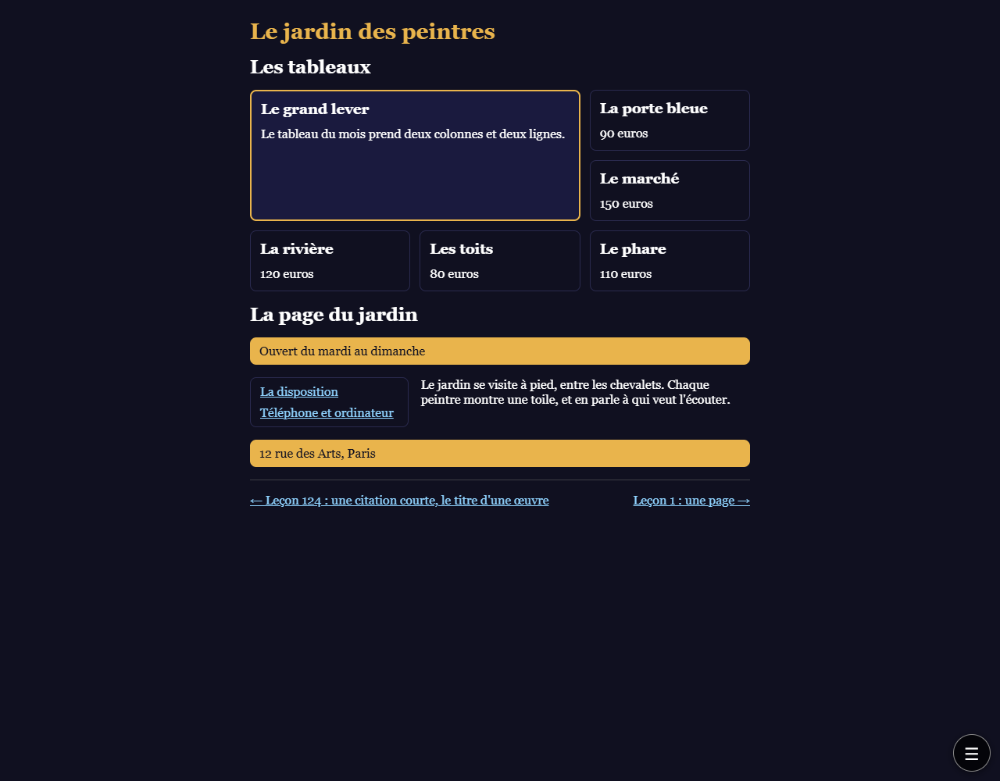
- 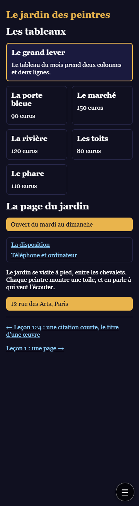
- Erreurs en route :
  - ma première construction en arrière-plan écrivait son journal dans un dossier qui n'existe pas (un `..` de trop peu) : elle n'a pas tourné ; et un nom de fichier de journal partagé avec un autre agent mêlait leurs lignes. Chaque agent écrit maintenant dans son propre dossier ;
  - la première leçon employait `border-left`, que HoloCode n'a pas : refusée par `holo check` ;
  - une zone inconnue était annoncée comme « une zone sans bloc » : la vérification regarde maintenant d'abord si la zone existe.
- Reste : une case d'une liste qui change (`Repeat(over:)`) ne prend pas plusieurs colonnes ; un composant se range dans un `Column(columnSpan: 2, …)` ; le seuil de 480px ne se règle pas ; la ligne `grid` du grand tableau passe à « oui » à la prochaine publication.

---

## 2026-10-09 — Les huit limites s'ouvrent sous conditions ; un paiement international

- Les avis sont rangés :
  - Gemini (`proposals/Gemini/contraintes-2026-10-09/`, PR 245) ;
  - la conversation Claude de Yocthan (`proposals/Claude/contraintes-2026-10-09/`, PR 244).

  Les deux disent la même chose : aucune des huit ne doit rester fermée, chacune s'ouvre sous conditions, et c'est le moteur qui tient les règles de sécurité. La session Claude du PC s'y range : son « limité exprès » était trop fort.
- Yocthan : « Oui ». Huit tâches entrent dans la file, les issues 246 à 253 (`ADR-114` à `ADR-121`, leçons 137 à 144) :
  - le champ mot de passe, que la page ne lit jamais ;
  - une zone de dessin pour le visiteur ;
  - les données d'un autre serveur, lues par le serveur de l'auteur ;
  - une page dans la page, de sites listés, chargée au toucher ;
  - des modules venus d'ailleurs, avec leur empreinte ;
  - le « push » avec les clés de l'auteur ;
  - le paiement ;
  - des effets 3D prêts à l'emploi, avec la phase 3D.
- **Le paiement est international** (Yocthan : « ce sera utilisé peut-être par un Chinois à des millions de kilomètres de moi […] il va coder ses propres méthodes de gestion d'argent »). C'est une prise universelle :
  - la page déclare le montant ;
  - le serveur de l'auteur passe la main au moyen qu'il a branché ;
  - une confirmation signée revient au serveur ;
  - jamais aucun numéro de carte sur la page ni sur le serveur.

  Le mobile money n'est qu'un branchement parmi d'autres.

---

## 2026-10-09 — Partager la page : la feuille du téléphone, sinon l'adresse copiée

- Fait (issue #236, prise dans la file par la session du nuage ; `ADR-107`, ACCEPTÉ d'avance par Yocthan) :
  - `Device(kind: share)` et `Share.request`, sur le toucher d'un bouton : la feuille de partage du téléphone, avec le titre et l'adresse de la page. Le moteur appelle le navigateur dans le clic même, avant toute attente : un navigateur n'ouvre la feuille que pendant le geste du visiteur.
  - Sans feuille de partage (un ordinateur), le même bouton copie l'adresse. La page dit ce qu'elle a fait, à l'écran et au lecteur d'écran, dans la zone d'état du bloc.
  - `Share.done` : partagée, ou l'adresse copiée. `Share.failed` : rien n'a marché, et l'adresse est écrite à l'écran. La feuille fermée sans rien choisir (`AbortError`) n'est ni l'un ni l'autre : « Partage annulé. ».
  - Sans JavaScript, une phrase dit comment partager quand même. Refusés : `Share.write`, `value:`, et le partage hors du toucher d'un bouton.
  - La leçon 130 ; le guide (chapitre « 6 duodequinquagies »), `NOMS.md`, `DECISIONS.md`, le sommaire des leçons.
- Exécuté (`check-locked.sh`) :
  - `cargo test --release --locked` et `cargo test` : 236 tests passent, dont le nouveau, `a_page_is_shared_from_a_button_and_nothing_else` ;
  - `holo check` sur la leçon 130 : ok ;
  - l'essai nouveau dans Chrome passe. Ce Chromium de Linux n'a pas `navigator.share` : l'essai retire le partage avant la page (un ordinateur), puis le remplace avant la page (un téléphone). L'adresse est relue dans le presse-papiers ; le faux partage reçoit le titre et l'adresse pendant le clic (`window.event` : « click ») ; la feuille fermée dit « Partage annulé. » sans compter ; une panne écrit l'adresse ; axe-core : zéro défaut ;
  - il sait échouer : sans la branche du partage dans `capabilities.js`, il rate (« Requested device not found » : l'ancien code prend la sorte inconnue pour un microphone) ; avec une attente glissée avant l'appel, il rate aussi (le partage n'arrive plus pendant le clic, même si le navigateur dit encore le geste actif) ;
  - la suite entière : 79 essais sur 83. Les ratés : « pincer à deux doigts » (passe relancé seul), « la vue points se lit au lecteur d'écran », « parcours 8 et 9 » (la vidéo H.264 ne joue pas dans ce Chromium), et « comptes : effacement confirmé… » (« database is locked »), qui passe relancé seul.
- Erreur en route, relevée dans l'essai de Codex (`proposals/GPT5.6/fin-comptes-2026-10-08/browser-tests.mjs`), sans la corriger : il ouvre la base de `holo serve` pendant que le serveur écrit encore le panier renvoyé par la page, sans délai d'attente ; sous la charge, la base est occupée. Un délai d'attente à l'ouverture de la base le réglerait.
- Reste : un texte choisi par l'auteur (`text:`) ; un vrai téléphone (la feuille d'Android et de l'iPhone, avec TalkBack) ; le grand tableau, « presse-papiers, partage » à passer en « Oui » à la fusion ; la suite des leçons, 124 → 125 → … → 136 → 1, refaite quand les douze dettes seront dans `main`.

---

## 2026-10-09 — Les « en partie » du tableau : douze vrais manques à construire, huit limites soumises aux autres IA

- Yocthan : « pourquoi il y a toujours 21 en partie ? Réponds-moi vraiment, sérieusement. Et si c'est utile, oui ou non ? ».
- Réponse de Claude, ligne par ligne :
  - 2 sont la 3D, la phase suivante ;
  - 11 sont de vrais petits manques, plus le seul « non » (`sessionStorage`) : 12 en tout ;
  - 8 sont limités exprès : iframe, champ mot de passe, `fetch` vers d'autres serveurs, 3D libre, paquets extérieurs, dessin libre, notifications « push », paiement.
- **Les 12 vrais manques** : Yocthan, « tu le valides déjà, tu le fais déjà ». Ils sont dans la file, les issues 231 à 242 (`ADR-102` à `ADR-113`, leçons 125 à 136, décidées d'avance). Trois agents de la session du PC en prennent 8 ; la session du nuage, les 4 autres.
- **Les 8 limites**, Yocthan n'est pas d'accord sur plusieurs :
  - les réseaux sociaux marchent avec des iframes ;
  - un champ mot de passe est dans tous les formulaires ;
  - `fetch` est essentiel en JavaScript ;
  - tôt ou tard il faudra importer des modules ;
  - un site de dessin où l'on ne dessine pas n'a pas de sens ;
  - il n'aime pas les services extérieurs pour le « push » ;
  - un paiement est possible avec un bon serveur.

  Le prompt `docs/05-discussions/prompts/2026-10-09-contraintes-des-huit-limites.md` demande aux autres IA de trouver, ou d'inventer, des contraintes pour chacune, avec leurs sources, et de confirmer ou de contredire. Claude fait la même recherche de son côté. Le tableau ne change pas avant leurs réponses.
- **Corrigé par Claude en répondant** :
  - il avait confondu le code de dessin écrit par l'auteur (refusé) et un visiteur qui dessine librement (utile : un bloc à faire) ;
  - « pas de code extérieur » était trop fort : un module extérieur enfermé est déjà permis.

---

## 2026-10-09 — Le web est fini, et validé par Yocthan

- Yocthan, après avoir tout essayé : « j'ai tout essayé et c'est bon déjà ». À sa demande (« fini le travail correctement »), tout ce qui était prêt est fusionné, et tout ce qui restait « à valider » passe en `ACCEPTÉ` : `ADR-090`, `091`, `092` et `097` à `101`. Seule HoloIR (`ADR-006`) reste une proposition, puisque rien n'en est construit.
- Fusionné dans la journée :
  - le lot 9 de la session du nuage : PR 171, 172, 174, 191 à 195, et ses corrections, PR 208 ;
  - le lot 7 avec la correction de Codex : PR 177, qui contient la 199, et ses sondes, PR 198 ;
  - le catalogue et les parcours 1 à 9 (PR 211, travail de Codex) ; la fin du lot 9 (PR 219, travail de Codex) ; le parcours 10 (PR 222) ;
  - les comptes, les clés d'accès et le partage finis, avec le travail de Gemini : PR 224, qui reprend les 205 à 207 de Codex ;
  - les cinq petites dettes HTML : PR 220, 223, 225, 226 et 227 ;
  - la file de travail et la règle de reprise : PR 190, 218 et 221 ;
  - l'extension VS Code 0.2.1 (PR 196) ; le tableau (PR 210 et 228).
- Quand le PC s'est éteint, la session du nuage a repris le travail comme le prévoit la règle de la PR 221. Elle a fini les tâches 215 et 216, dont les agents du PC n'avaient encore rien envoyé, et elle a empilé ses PR pour qu'elles entrent sans conflit.
- Le grand tableau, refait depuis la page en ligne (version 36) :
  - **457 mots, tous décidés** ;
  - **135 éléments de HTML, CSS et JavaScript : 106 oui, 21 en partie, 1 non** (les cookies et `sessionStorage`), 6 refusés exprès et 1 sans objet.
- Le serveur 8080 sert les 126 leçons sans erreur, et le site des dix parcours. Les dix parcours du web viable sont joués : 40 audits d'accessibilité, sans aucun défaut.
- Reste avant la 3D :
  - les mesures du téléphone (issue 184 : la batterie, câble débranché) ;
  - le feu vert de Yocthan sur le plan 3D (`docs/04-roadmap/PLAN-3D.md`).
- Erreurs en route :
  - deux coupures de quota et une coupure d'Internet ont arrêté les agents au milieu de leur travail ;
  - une commande lancée en arrière-plan avec `&` s'est arrêtée avec son terminal ;
  - deux fois, des apostrophes ont cassé une commande avant tout changement ;
  - une copie de la page en ligne portait l'enveloppe ajoutée à la publication, retirée avant de republier.

---

## 2026-10-09 — Le grand tableau du web, avec les petites dettes et la fin des comptes

- Fait (issue #186, la session du nuage, après la fusion des PR 220 à 227) :
  - La page en ligne, version 35, bâtie sur la version 34 telle qu'elle était en ligne (personne ne l'avait changée depuis). Les mots des petites dettes du web, à l'essai : `Term`, `Abbreviation`, `abbreviations`, `Address`, `Fields`, `suggestions:`, `<<…>>`, `_…_`, `work:` (`ADR-097` à `ADR-101`). Ceux de la fin des lots 6 et 7, décidés : la liste partagée (`ADR-080`) ; les pages `/account/passkeys`, `/account/code/setup` et `/account/delete` (`ADR-082`, `ADR-083`).
  - Face au web : `dl, dt, dd`, `abbr, time, address`, `fieldset, legend, datalist` et `blockquote, q, cite` passent à « oui » ; une ligne nouvelle, `WebAuthn (clés d'accès)`, à « oui ». Les raisons de `Date` (les calculs de l'`ADR-067`), de `paiement, comptes` (les clés d'accès, le QR, les codes de secours, l'effacement, le frein par adresse) et de `WebSocket` (les listes et les textes partagés) sont mises à jour.
  - `TABLEAU-WEB.md` refait depuis la page par `outils/web_table.py`. La session du PC, revenue entre-temps, l'a refait aussi depuis la même page, à l'identique, et l'a fusionné par la PR #228 ; la PR #229 apporte cette entrée et `AGENTS.md`, où la ligne des petites dettes du web est faite et la suite des leçons va jusqu'à la 124.
- Exécuté :
  - `python3 outils/web_table.py <page> docs/01-holocode/TABLEAU-WEB.md --date 2026-10-09`, puis `--check` : identique à la page.
  - La page ouverte dans Chromium, à 412 px en clair et en sombre, et à 1280 px : aucune erreur, rien ne déborde, et les comptes du haut se refont : 457 mots (446 décidés, 11 à l'essai) ; 135 éléments du web : 106 oui, 21 en partie, 1 non, 6 refusés, 1 sans objet.
- Ensuite : la session du PC a publié la version 36, où ces 9 mots, et les 2 des `ADR-091` et `ADR-092`, passent à « décidés », avec la validation de Yocthan (PR #230, entrée ci-dessus) : 457 mots, tous décidés.
- Reste : le seul « non » est `cookies, sessionStorage` ; 21 éléments restent « en partie ».

---

## 2026-10-09 — Une citation courte au milieu d'une phrase, le titre d'une œuvre

- Fait (issue #217, prise dans la file par la session du nuage ; `ADR-101`, PROPOSITION) :
  - `<<bonjour>>` dans un texte devient une citation courte (`q`) : le moteur écrit les guillemets de la langue de la page, pour de vrai, « » en français avec une espace fine insécable de chaque côté (un guillemet ne reste plus seul en bout de ligne), „ “ en allemand, “ ” sinon ; une citation dans une citation prend ceux du second niveau. Un texte HoloCode, écrit entre guillemets droits, ne pouvait pas en contenir.
  - `_Les Misérables_` devient le titre d'une œuvre (`cite`) ; un trait bas au milieu d'un mot reste un trait bas. Rien de tout cela dans du code.
  - `Quote("…", by: "Victor Hugo", work: "Les Châtiments")` : l'œuvre d'où vient une citation en bloc.
  - La leçon 124 ; le guide (chapitre « 6 duoquadragies »), `NOMS.md`, `DECISIONS.md`.
- Exécuté : `cargo test --release` → 201 tests passent (trois nouveaux) ; `holo check` sur les 118 leçons ; dans Chrome, l'essai de la leçon 124 passe, et rate sur un moteur sans la citation courte (aucun `<q>`, `<<…>>` reste du texte) ; la suite entière : 66 essais sur 69, les 3 ratés propres au conteneur.
- Erreur en route : la première suite entière s'est bloquée 20 minutes sur l'audit axe-core des parcours, pendant que trois autres constructions tournaient ; le serveur de l'essai répondait, les pages aussi. Relancés seuls, ces essais passent. Un vieux serveur d'essai, resté d'une suite arrêtée plus tôt, a été arrêté par son numéro.
- Reste : la source d'une citation courte (`cite=`, une adresse) ; la leçon 124 revient à la 119 et mène à la 1, en attendant que les leçons 120 à 123 (#220, #214, #215, #216) soient fusionnées : la suite deviendra 119 → 120 → … → 124.

---

## 2026-10-09 — Des suggestions dans un champ

- Fait (issue #216, prise par la session du PC, puis reprise depuis le début par la session du nuage quand le PC s'est éteint ; `ADR-100`, PROPOSITION) :
  - `Input(value: city, label: "Ville", suggestions: ["Paris", "Lyon"])` : le navigateur propose ces textes pendant qu'on écrit, et on peut écrire autre chose ; c'est la différence avec `Choice`. Le moteur écrit le `datalist` de HTML une seule fois pour la page et y relie le champ par `list` : rien à nommer ni à recopier ; plusieurs champs, et un champ dans les lignes d'une liste, partagent le même, sans `id` en double.
  - `suggestions: villes` : les suggestions viennent d'une liste de la page (déclarée, calculée, ou remplie par `Data`). Quand elle change pendant la visite, la page demande les nouvelles options au moteur (`suggestions_html`) et les pose, comme pour un graphique ; sans JavaScript, `holo serve` fabrique la page avec la liste du visiteur. Un texte répété n'est proposé qu'une fois.
  - Le mot `suggestions:`, plutôt que `list:` (qui se confondrait avec les listes de la page), `options:` (qui ferait croire qu'il faut choisir) ou `autocomplete:` (en HTML, ce que le navigateur retient du visiteur).
  - Les refus, avec leur raison : un nombre, `type:`, `lines:`, une liste écrite vide ou trop longue, une suggestion vide, sur plusieurs lignes, plus longue que le champ ou écrite deux fois, une liste à champs, un nom qui n'est pas une liste.
  - La leçon 123 (elle revient à la 119, qui n'est pas touchée). Le guide (chapitre « 6 unquadragies »), `NOMS.md`, `DECISIONS.md`, le sommaire des leçons.
- Exécuté : `cargo test --release` → 204 tests passent (six nouveaux : `written_suggestions_give_one_datalist`, `suggestions_from_a_list_follow_it_with_or_without_javascript`, `a_computed_list_gives_suggestions_too`, `an_element_with_fields_proposes_its_first_field`, `a_field_in_the_lines_of_a_list_uses_the_datalist_of_the_page`, `suggestions_are_checked`) ; `holo check` sur les 118 fichiers de leçons : tous `ok` ; dans Chrome, l'essai de la leçon 123 passe, et rate quand la page ne refait plus le `datalist` (« Grenoble », retenue, n'arrive pas dans les suggestions) ; axe-core 4.10.3 sur la leçon 123 : 0 défaut ; la suite Chrome entière : 66 essais sur 69 passent, 116 leçons ouvertes, 504 s. Les 3 ratés sont ceux du conteneur : « pincer à deux doigts » (passe relancé seul), « la vue points se lit au lecteur d'écran », « parcours 8 et 9 » (la vidéo H.264 ne joue pas dans ce Chromium).
- Erreur en route : mon premier essai dans Chrome cherchait le champ dans l'arbre d'accessibilité par son nom, et trouvait d'abord le texte de son étiquette (« StaticText ») ; il prend maintenant le nœud qui n'est pas du texte, la « combobox ».
- Reste : des suggestions demandées au serveur pendant qu'on écrit ; choisir le champ d'une liste à champs ; la liste qui s'ouvre garde l'allure du navigateur. Avec les PR des leçons 120, 121 et 124, la suite des leçons et les lignes des fichiers partagés seront rangées par numéro à la fusion (119 → 120 → … → 124).

---

## 2026-10-09 — Un groupe de champs : `Fields(label: "Adresse de livraison", children: [ … ])`

- Fait (issue #215, prise par la session du PC, qui s'est éteinte sans rien envoyer ; reprise depuis le début par la session du nuage ; `ADR-099`, PROPOSITION) :
  - Vérifié d'abord : un `Choice` en boutons ronds était déjà un `fieldset` avec sa `legend` (lot 1, `ADR-038`), que Chrome annonce comme un groupe nommé. Ce qui manquait vraiment : réunir plusieurs champs sous un nom (une adresse, des cases à cocher sur une même question).
  - `Fields(label: "Adresse de livraison", children: [ … ])` : `fieldset` et `legend` ; au moins deux champs, rangés comme on veut ; le nom dans `label:`, comme pour un champ. Sans la bordure du navigateur : le nom en gras au-dessus des champs, un groupe jamais plus large que l'écran, le nom dans le cadre quand un style en ajoute un. `Fieldset`, `Group` et `FieldGroup` écartés (la comparaison est dans l'ADR).
  - Refusés, avec la raison : un groupe sans nom ; sans champ, ou d'un seul ; un `Choice` seul ; `legend:` ; `Fieldset` et `Legend`, avec le bon mot.
  - Trouvé et réparé : `Choice(required: true)` (`ADR-068`) était refusé comme « mal écrit » par la vérification de `Choice` ; aucune leçon ne l'employait.
  - La leçon 122 ; le guide (chapitre « 6 quadragies »), `NOMS.md`, `DECISIONS.md`, le sommaire des leçons.
- Exécuté :
  - `cargo test --release` → 202 tests passent (quatre nouveaux) ; `holo check` sur la leçon 122 ; `holo fmt` : déjà en forme.
  - Dans Chrome, l'essai de la leçon 122 passe : trois groupes nommés dans l'arbre d'accessibilité (« Adresse de livraison », « Pour te prévenir », et le `radiogroup` « Jour de livraison ») ; sans bordure ; rien ne déborde à 360 px ; à l'envoi, trois messages dans les groupes, le clavier sur « Rue ».
  - Il rate quand le moteur écrit une boîte et un titre au lieu de `fieldset` et `legend` : le lecteur d'écran n'entend plus que le groupe du `Choice`. Il rate aussi quand le style de base perd la légende flottante et `min-width: 0` (« none / min-content / 0 »).
  - L'essai `a_required_choice_is_a_radio_group_checked_at_send` rate sans la réparation (« est mal écrit »).
  - La suite entière (`CI=1`, axe-core 4.10.3) : 66 essais sur 69 passent. Les 3 ratés sont ceux de ce conteneur : « pincer à deux doigts » (il passe relancé seul), « la vue points se lit au lecteur d'écran », et la vidéo des parcours 8 et 9, en H.264, que le Chromium du conteneur ne lit pas.
  - axe-core 4.10.3 sur la leçon 122, à 1000 et à 360 px, à l'ouverture et après un envoi refusé (4 messages) : 0 défaut.
- Erreurs en route : mes premiers essais nommaient une valeur `day`, réservée au jour du visiteur ; l'essai Chrome attendait le moteur avant de toucher « Commander », et perdait 40 secondes : le moteur ne vient qu'au premier geste.
- Reste : `required:` sur un groupe de cases ; l'essai humain au TalkBack ; à la fusion, la suite des leçons (119 → 120 → … → 124), les lignes des fichiers partagés rangées par numéro, et le grand tableau du web (`fieldset, legend` à « oui »).

---

## 2026-10-09 — Une abréviation expliquée, une date pour les machines, une adresse

- Fait (issue #214, prise dans la file par la session du nuage ; `ADR-098`, PROPOSITION) :
  - `Page(abbreviations: [ Abbreviation("MJC", "Maison des jeunes et de la culture") ])` : déclarée une fois, l'abréviation est marquée (`abbr`) partout où elle vient comme un mot entier, sauf dans du code ; la première fois qu'elle vient dans un paragraphe, le moteur écrit son sens juste après, entre parenthèses, une seule fois, sauf si la page l'écrit déjà. Le `title` de HTML ne se voit pas au doigt et la plupart des lecteurs d'écran ne le lisent pas : le sens écrit, lui, est lu et vu partout.
  - Une date montrée (`{ouverture:date}`, `{ouverture:weekday}`) devient `<time datetime="2026-11-14">`, sans mot nouveau ; la page change `datetime` quand un geste change la date.
  - `Address(children: [ … ])` : les moyens de joindre l'auteur, en `<address>`, le texte droit ; ni titre ni repère dedans. `Contact` écarté : sur le web, c'est un formulaire, et nos leçons nomment un formulaire `Contact`.
  - La leçon 121 ; la leçon 119 y mène. Le guide (chapitre « 6 undequadragies »), `NOMS.md`, `DECISIONS.md`.
- Exécuté : `cargo test --release` → 201 tests passent (cinq nouveaux ; celui des dates mis à jour : `` devient `<time>`) ; `holo check` sur toutes les leçons ; dans Chrome, l'essai de la leçon 121 passe, et rate quand la page ne met plus `datetime` à jour (la date montrée passe au 21 novembre, `datetime` reste au 14).
- Erreur en route : le sens n'était jamais écrit. Le moteur le cherchait dans tous les textes de la page pour savoir si l'auteur l'avait déjà écrit, et le trouvait dans la déclaration elle-même. Les déclarations ne comptent plus.
- Reste : une heure seule (« 14 h 30 ») n'est pas un `<time>` ; un lien `mailto:` ou `tel:` dans une `Address` n'existe pas encore. Avec la PR de la leçon 120 (#220), la suite des leçons deviendra 119 → 120 → 121.

---

## 2026-10-09 — Une liste de définitions : `List(children: [ Term("Poids", "2 kg") ])`

- Fait (issue #213, prise dans la file par la session du nuage ; `ADR-097`, PROPOSITION) : `Term("Poids", "2 kg")`, un terme et sa définition, toujours ensemble ; une `List` dont les éléments sont des `Term` devient une liste de définitions (`dl`, `dt`, `dd`). Un seul mot nouveau. Leçon 120 : la fiche technique d'une lampe d'atelier, et un petit glossaire.
- Refusés, avec la raison : un `Term` hors d'une liste, une liste qui mélange des `Term` et autre chose, `ordered:`, un terme sans sa définition.
- Exécuté : `cargo test --release` → 194 tests passent (deux nouveaux) ; dans Chrome, l'essai de la leçon 120 passe (6 termes et 6 définitions dans l'arbre d'accessibilité, aucun élément à puces) ; la suite entière : 55 essais passent, et les 3 ratés propres à ce conteneur (« pincer à deux doigts », qui passe relancé seul ; « la vue points se lit au lecteur d'écran » ; la vidéo des parcours 8 et 9, en H.264, que le Chromium du conteneur ne lit pas).

---

## 2026-10-09 — Reprise par la session du nuage, le PC éteint : la fin des lots 6 et 7, raccordée à `main`

- Le PC de Yocthan s'est éteint au milieu de cette intégration ; Yocthan a demandé que la session du nuage reprenne tout le travail de la session du PC. Repris tel quel depuis son dernier envoi, `wip/integration-codex-comptes-partage` (56d9606, 16 h 44 UTC), sur `integration/codex-comptes-partage` : rien de son travail n'est réécrit.
- Fusionnée dans la branche : `main`, qui avait reçu depuis les corrections du nuage (PR 208) et le tableau du web (PR 210). Trois conflits, résolus en gardant les deux intentions :
  - `page-engine.js`, `emit` : cette branche y ajoutait la clé de la ligne touchée (`Remove.tap@2#<clé>`, `ADR-080`), la PR 208 le pas dans l'historique d'un toucher partagé (`isStep`). Gardés les deux ; le pas se lit sur le signal sans la clé, que l'expression de `isStep` ne reconnaîtrait pas ;
  - `AGENTS.md` : la ligne des lots 5, 6, 7 de cette branche (la fin des lots 6 et 7), celle du lot 9 de `main` (« intégrée par la PR 219 ») ;
  - le journal : l'entrée de cette branche d'abord, puis celles de `main`.
  - La correction de `Module(output: …)` était faite des deux côtés, à l'identique (la PR 208 et l'`ADR-080`) : Git l'a gardée une seule fois, avec son essai.
- Réparé : rien. Après la fusion, tout est vert, aux ratés connus de ce conteneur près ; aucune vérification n'est changée, aucun essai mis de côté.
- Exécuté, dans le conteneur du nuage (Linux, Chromium 1194), après une reconstruction complète (les deux WebAssembly, `holo`, les liaisons, sans erreur) :
  - `cargo test --release` → 214 tests passent (les 198 de `main` et les 16 de cette branche) ; `cargo test --release --locked`, lancé par l'essai des parcours → 214 ; `cargo test --locked`, en debug comme la CI → 214 ;
  - `holo check` sur les 121 fichiers de `exemples/lecons/` → tous `ok`, dont les leçons 102, 103, 107 et 108 ;
  - `node outils/browser-tests.mjs` (axe-core 4.10.3) → 73 essais `OK` sur 76, 119 leçons ouvertes, 533 s. Les huit essais des comptes, des clés d'accès et du partage passent (l'authentificateur virtuel de Chrome, le QR relu par jsQR, le frein par adresse, deux profils Chrome), et les trois de la PR 208. Les trois ratés sont ceux de ce conteneur : « la vue points se lit au lecteur d'écran », « parcours 8 et 9 » (la vidéo H.264 ne joue pas dans ce Chromium), et « pincer à deux doigts », qui passe relancé seul (`OK`, 6 s).
- Reste :
  - sur le téléphone de Yocthan : la clé d'accès (avec un proxy HTTPS et `HOLO_ORIGIN`), le QR dans une vraie application d'authentification, la leçon 102 sur deux appareils en même temps, l'effacement d'un compte ;
  - le tableau du web (issue 186) : les mots des `ADR-080`, `ADR-082` et `ADR-083`, après la fusion ;
  - les leçons 103, 107 et 108, écrites par Codex, n'ont pas encore l'en-tête des autres (« Ce qu'on apprend », « À essayer ») ;
  - après la fusion : fermer les PR 205, 206 et 207, que cette branche remplace.

---

## 2026-10-09 — Les comptes et le partage de Codex, relus, corrigés et intégrés ; la suite de Gemini finie

- Yocthan : « tu valides tout ce qu'on avait fait avec Codex », y compris `p256` et `sha2`, et continuer nous-mêmes le travail de Codex et de Gemini.
- Repris sur `reprise/codex-fin` : la chaîne de Codex 205 (les protections du compte), 206 (les clés d'accès) et 207 (le partage), puis le travail laissé en cours par Gemini (5211a68). Rejoué ensuite sur `main` (les lots 7 et 9, le catalogue de Codex, PR 177 et 211), sans la PR 204, refusée : `integration/codex-comptes-partage`. Les commits de Codex et de Gemini sont gardés tels quels ; chaque correction est un commit à part.
- **Les défauts trouvés à la relecture, corrigés :**
  - 205 :
    - la page des codes de secours menait à `/account`, sans la nouvelle « Le code à 6 chiffres est activé », et l'essai du lot 7 ratait, avec et sans JavaScript : elle mène maintenant à `/account?done=code` ;
    - l'essai du frein par adresse appelait `fetch` depuis une page de compte, que sa CSP interdit : 31 vrais formulaires, envoyés par Chrome, dont les réponses sont lues par le protocole ;
    - un fichier privé qui ne s'efface pas (pris sous Windows) empêchait `holo serve` de démarrer : il est dit, gardé en attente, et les autres fichiers sont essayés ;
    - jsQR venait d'unpkg pendant les essais : la version 1.4.0 (Apache-2.0) est gardée dans `moteur/outils/vendor/jsqr-1.4.0/`, avec sa licence, après vérification de son empreinte sur le registre npm.
  - 206 :
    - l'essai lisait `added.authenticatorId` au lieu de `result.authenticatorId` : l'authentificateur virtuel n'était jamais retrouvé. La création, la connexion, les altérations, le réemploi et le retrait tournent maintenant pour de vrai dans Chrome ;
    - l'essai de l'adresse IP appelait localhost ; il appelle `127.0.0.1` (refusé), puis localhost (admis) ;
    - l'essai lançait `rustfmt`, qui réécrivait `src/passkeys.rs`, et vidait `Cargo.lock` et la source dans les journaux : retiré ;
    - `Cargo.lock` : `p256`, `sha2` et leurs dépendances y sont (depuis le commit de Gemini), `--locked` passe ;
    - derrière le proxy HTTPS de l'auteur, tout le site partageait un seul frein de 30 envois par minute (tout vient de 127.0.0.1) : avec `HOLO_ORIGIN`, et seulement pour une demande venue de ce PC, le frein prend la dernière adresse de `X-Forwarded-For`, celle qu'écrit le proxy.
  - 207 :
    - le partage ne compilait pas (`shared::written` et `shared::merged` appelés avec leurs anciens arguments ; corrigé par Gemini, vérifié) ;
    - ses tests n'avaient jamais tourné : `names.clear` au lieu de `names.clear()`, dans un test et dans la leçon 102, et un texte codé attendu en clair ;
    - `Module(output: …)` : la correction et le message de la PR 208, une seule fois pour les deux.
- **La suite de Gemini** : il retrouvait la ligne touchée d'une liste partagée d'après la copie de la liste envoyée par la page. C'était juste pour un visiteur avec JavaScript ; pas pour un membre, dont le serveur ne lit pas cette copie, ni sans JavaScript, qui n'envoie rien. La ligne porte maintenant sa clé (celle de `data-key`) : `Remove.tap@2#<clé>`, dans le geste envoyé par la page comme dans le bouton du formulaire sans JavaScript. Le serveur la retrouve dans sa liste ; sinon, il refuse. Les fiches se partagent (`Shared(groceries: [ Item(…) ])`), et `item.done.set(1)` part au serveur. La leçon 102 devient une liste de courses partagée.
- Décidées le 2026-10-09 : `ADR-080` (listes et texte partagés), `ADR-082` (clés d'accès), `ADR-083` (QR, secours, effacement, frein). Le guide et `NOMS.md` sont à jour ; les leçons s'enchaînent 100 → 101 → 102 → 103 → 104 → 105 → 106 → 107 → 108 → 109 → 110.
- Exécuté, après une reconstruction complète (les deux WebAssembly et `holo`, sans avertissement) :
  - sur `reprise/codex-fin` : `cargo test --release --locked` → 210 tests passent ; `cargo test` → 210 ; la suite entière dans Chrome → 72 essais `OK`, aucun raté (550 s) ;
  - sur `integration/codex-comptes-partage` : `cargo test --release --locked` → 208 tests passent ; `cargo test` → 208 ; la suite entière dans Chrome → 64 essais `OK` sur 65 (505 s) ; le 65e, l'audit axe-core des parcours, demande `npm install` que je ne fais pas : relancé seul avec la même version 4.10.3 déjà présente sur ce PC, hors du dépôt (`NODE_PATH`) → 36 audits, zéro défaut.

**Erreurs en route**

- J'ai découpé les commits avec `git apply --unidiff-zero`, qui place un morceau d'après son numéro de ligne : un test s'est retrouvé hors de son module, parce que les morceaux sautés décalaient les numéros. Je l'ai vu en relisant le commit, et j'ai refait le fichier avant de continuer.
- Une première suite complète dans Chrome est restée bloquée plus de trois heures pendant la pause de la session (l'ordinateur en veille ; l'essai attendait une réponse du protocole qui ne venait plus) : arrêtée, puis relancée.

---

## 2026-10-09 — Le parcours 10, le tableau de bord : les dix parcours du web sont là

- Repris de la PR 204 de Codex (fermée : elle doublait d'autres PR), et d'elle seulement : le tableau de bord (`exemples/parcours/dashboard.holo`), ses ventes fictives (`sales.json`), sa ligne dans l'index des parcours et son essai. Sur `integration/parcours-10`, à partir de `main`. Les ventes, reçues du serveur, sont dessinées en barres et en parts ; une vente s'ajoute au clavier, avec ou sans JavaScript ; les chiffres se lisent dans le tableau caché du graphique.
- Ajouté : le tableau de bord dans l'audit d'accessibilité des parcours (dix pages, quatre modes). Mis à jour : le README des parcours (« dix parcours », et le tableau de bord dans ce qu'il faut refaire sur le téléphone), le compte rendu de Codex (le parcours 10 fait ; axe-core lu depuis la copie locale), l'`ADR-084` et `AGENTS.md`.
- Exécuté : `holo check` → `dashboard.holo` et l'index acceptés ; `node outils/browser-tests.mjs parcours` → 12 essais `OK`, aucun raté, 307 s : `cargo test --release --locked` (196 tests), onze fichiers `.holo` vérifiés, les parcours 1 à 10 (le 10 : trois ventes puis quatre, barres et parts, au clavier, JavaScript coupé puis activé, 180 dans le tableau et dans l'arbre d'accessibilité), 40 audits axe-core sans défaut.
- Reste, pour dire le web fini (compte rendu de Codex) : faire les dix parcours au clavier et au TalkBack avec une personne, puis sur le vrai Samsung, et mesurer la durée, la mémoire, la chaleur et la batterie.

**Erreurs en route**

- Aucune dans cette étape.

---

## 2026-10-09 — Si le PC s'arrête, la session du nuage reprend tout le travail

- Yocthan : « au cas où ta session lâche, si le PC s'éteint, que tu laisses à la session sur téléphone continuer, pour qu'on ne puisse pas avoir des arrêts inutiles ».
- Écrit dans `AGENTS.md` (« Si le PC s'arrête, la session du nuage reprend tout le travail ») :
  - rien ne vit seulement sur le disque du PC : la session du PC et ses agents envoient leur travail après chaque étape (la branche de la PR quand c'est vert, sinon `wip/<branche>`) et écrivent une ligne d'état sur l'issue de la tâche ;
  - le nuage sait que le PC est arrêté quand Yocthan le lui dit, ou quand aucune branche en cours du PC n'a reçu d'envoi depuis plus d'une heure ;
  - il reprend chaque tâche là où elle est, en le disant en commentaire ;
  - quand le PC revient, il relit la file : une tâche reprise par le nuage reste au nuage jusqu'à ce qu'il la rende.
- Les trois agents en cours ont reçu la consigne : envoyer après chaque étape et écrire leur état sur les issues 180 à 183 et 213, et sur la PR 208. La session du nuage a reçu l'état exact du travail en cours.

---

## 2026-10-09 — Les corrections du nuage (PR 208) relues, et raccordées à la fin du lot 9

- Relue : la PR 208 de la session du nuage, qui répond aux remarques de Codex sur la chaîne du lot 9 (huit corrections, deux défauts anciens du démarrage). Bonne : chaque correction a son essai, écrit pour rater avec l'ancien code ; le code reste sobre (un chronomètre rangé sous `fichier|nom`, l'adresse qui ne compte au démarrage que si elle nomme une valeur de la page, un nom inconnu après le `#` qui laisse la page où elle est, comme un navigateur devant une ancre inconnue). Ses deux remarques refusées sont justifiées.
- `main` (la fin du lot 9, PR 219 ; les petites dettes HTML, PR 218) fusionnée dans sa branche, `langage/lot9-corrections`, pour que la PR 208 se fusionne telle quelle. Un seul conflit de code, dans `openFile` (`page-engine.js`), où chacune ajoutait sa ligne après `displaySite(…)` : gardées les deux, dans l'ordre que la PR 208 indiquait, `if (inHistory) followAddress(false);` puis `await prepareHost();`. Le journal : toutes les entrées gardées.
- Exécuté, après une reconstruction complète (les deux WebAssembly, `holo`, les liaisons) : `cargo test --release` → 198 tests passent (les deux nouveaux de la PR 208) ; `cargo test` → 198 ; `node outils/browser-tests.mjs` → 68 essais `OK`, aucun raté, 115 leçons ouvertes, 483 s (dont les trois essais nouveaux de la PR 208).

**Erreurs en route**

- J'ai d'abord fusionné la PR 208 dans une branche à moi, par-dessus la fin du lot 9 ; la session du PC a préféré que la PR 208 se fusionne elle-même : refait dans sa branche, à partir de `main`, avec le même code (vérifié : seuls les documents diffèrent).
- Une première passe de la suite dans Chrome s'est figée sur la leçon 9 (l'outil attendait une réponse de Chrome qui n'est jamais venue ; la page, elle, répondait) : arrêtée, l'essai relancé seul passe (115 leçons), puis la suite entière.

---

## 2026-10-09 — Le tableau du web : les mots des lots 7 et 9, offset, la police du moteur, et un outil qui refait le fichier

- Fait (issue #186, première partie, prise par la session du nuage à la demande de Yocthan) : la page en ligne « HoloCode face au web » et `TABLEAU-WEB.md` ont les mots qui manquaient.
  - Lot 9 : les paramètres du dessin (`width`, `height`, `r`, `radius`, `d`, `from`, `to`, `fill`, `stroke`, `thickness`, ADR-086), `kind` et `bars, line, pie` (ADR-087), `shapes` et `x1`…`y2` (ADR-088).
  - Lot 7 : `access, members, everyone`, `signedIn, {account}`, `/account` et ses pages (ADR-081) ; « paiement, comptes » passe de « non » à « en partie ».
  - `offset` dans `Filter`, et des listes de deux cents éléments (ADR-084, fusionné par #211).
  - La police du moteur, `Font(family: "…")` sans fichier (ADR-092, à l'essai).
  - Le lot 6 (`Shared`) y était déjà. 423 mots : 421 décidés, 2 à l'essai ; 132 éléments du web.
- `outils/web_table.py` refait `TABLEAU-WEB.md` depuis la page enregistrée, comptes compris, comptés comme la page les compte ; `--check` vérifie sans écrire. Vérifié par un aller-retour : la page d'avant redonnait le fichier de `main` à l'identique, sauf les deux lignes des polices que #195 avait écrites seulement dans le fichier.
- Réparé en route : deux cases mal affichées sur GitHub (une barre verticale dans `Input(type: date | time | color)`, des accents graves imbriqués) ; sur un téléphone, la page en ligne débordait en largeur à cause d'une pastille longue : elle passe maintenant à la ligne.
- Puis la fin du lot 9, fusionnée par #219 (ADR-093 à 096 : `Transfer`, `Device`, `Notification`, `Offline`, leurs paramètres et leurs demandes) : ajoutée à la page en ligne par la session du PC (version 33), et le même ajout fait en même temps par la session du nuage, abandonné pour garder le sien. La version 34 retire une phrase restée de l'ancien tableau (« le pourcentage dit… ») ; `TABLEAU-WEB.md` est refait par l'outil depuis elle : 444 mots (442 décidés, 2 à l'essai), 134 éléments du web.
- Reste (fin de l'issue) : les mots des reprises des lots 6 et 7 (ADR-080, ADR-082, ADR-083), dès leur fusion ; et `Term` (ADR-097, #220) à sa fusion.

---

## 2026-10-09 — La fin du lot 9 de Codex intégrée : un fichier, l'appareil, une notification, une copie hors-ligne

- Fusionnée sur `integration/codex-203`, après la PR 201 : la PR 203 de Codex. Quatre blocs, rangés dans les enfants de `Page`, qui ne demandent rien au navigateur sans le toucher d'un bouton : `Transfer` (un fichier JSON des valeurs annoncées, importé tout entier ou refusé), `Device` (la position, le presse-papiers, un aperçu de la caméra, le microphone ; arrêt d'office), `Notification` (un rappel tant que la page est ouverte), `Offline` (la copie d'une page publique, le réseau d'abord, rien de mis en attente). Les leçons 116 à 119, et ses essais dans Chrome.
- Écrites et décidées : `ADR-093` à `ADR-096`, `ACCEPTÉ`, validées par Yocthan le 2026-10-09 (« intégrer le travail de Codex quand il est bien fait »), Codex nommé comme auteur ; leurs lignes dans `DECISIONS.md`. Le guide a sa section « 6 quatertricies » (celle de Codex portait le numéro « 10 bis », déjà pris, après la section 11), quatre lignes dans le tableau des notions et ce qui manque encore ; `NOMS.md`, quatre lignes dans le tableau des blocs. Les leçons 116 à 119 ont pris la forme des autres (« Ce qu'on apprend », les liens ← →) : 115 → 116 → … → 119 → 1. La ligne vide qui coupait le tableau des leçons est retirée.
- **Corrigé : la page hors-ligne sans JavaScript.** `holo serve` servait toute page `Offline` par un chemin à part, toujours avec ses valeurs de départ et sans le formulaire des gestes : sans JavaScript, un toucher ne changeait rien de visible. Elle passe maintenant par le chemin de toutes les pages (les valeurs du visiteur, les boutons qui marchent). La copie, elle, est demandée par le service worker sans cookie : le serveur rend la page d'un premier visiteur. Le service worker refusait aussi toute page qui porte `data-visit` (l'état que `holo serve` écrit dans chaque page) : sans le chemin à part, aucune copie n'aurait marché ; cette vérification est retirée, la demande sans cookie suffit.
- **Corrigé : le service worker et le direct.** Installé, il tenait tout le site, et faisait passer par lui le direct des valeurs partagées (`text/event-stream`) ; sans réseau, il aurait servi une page HTML à la place du flux. Il laisse maintenant passer le direct et toutes les écritures (ce qui n'est pas `GET`).
- Gardé par deux essais nouveaux, qui ratent avec l'ancien code : `an_offline_page_keeps_its_values_without_javascript` (avec l'ancien chemin, la page n'a pas de formulaire des gestes) ; dans Chrome, « holo serve : une page hors-ligne sans JavaScript ; le service worker laisse le direct et les écritures » (avec l'ancien service worker : « le direct passe à côté : … "worker": true »).
- Exécuté, après une reconstruction complète (les deux WebAssembly, `holo`, les liaisons) : `holo check` → les leçons 115 à 119 et les exemples du guide et des ADR acceptés ; `cargo test --release` → 196 tests passent ; `cargo test` → 196 ; `node outils/browser-tests.mjs` → 65 essais `OK`, aucun raté, 115 leçons ouvertes, 503 s (dont les six essais de Codex pour le lot 9 et les parcours 1 à 9).
- Pas fait ici : le tableau en ligne et `TABLEAU-WEB.md` (les mots `offset`, `Transfer`, `Device`, `Notification`, `Offline`), que la session du PC republie.

**Erreurs en route**

- Ma première fusion de la PR 203 est partie sans l'identité du dépôt (« Committer identity unknown ») : refaite avec l'adresse noreply.
- Le premier jet de l'`ADR-096` disait qu'une réponse qui pose un cookie est refusée : un service worker ne voit jamais l'en-tête `Set-Cookie`, cette vérification ne refuse rien. Corrigé avant l'envoi : c'est la demande sans cookie qui protège la copie.

---

## 2026-10-09 — Les petites dettes HTML dans la file de travail

- Yocthan a demandé : « Sur 100 % du web, ton travail est à combien ? Et pourquoi ça traîne encore ? ». Réponse, comptée ligne par ligne dans le grand tableau (le jugement par élément est celui de Claude) :
  - sur 131 éléments de HTML, CSS et JavaScript, 98 « oui », 18 « en partie » et 8 « non » ; 6 sont refusés exprès et 1 est sans objet ;
  - soit 98 sur les 124 éléments à avoir, 79 % ;
  - le tableau est en retard sur ce qui vient d'être fusionné (les comptes, le mot de passe, les sessions) et sur ce qui est en cours (le hors-ligne, l'appareil, le presse-papiers et le partage).
- Les raisons de la lenteur, dites franchement :
  - le quota s'est coupé deux fois ;
  - pendant la nuit, trois IA ont produit une vingtaine de PR empilées, dont des doublons, trois aux essais rouges, une qui ne compilait pas, et deux IA ont travaillé dans le dossier principal ;
  - chaque fusion attend ses essais ;
  - le journal entre en conflit à chaque PR ;
  - deux vrais défauts ont été trouvés et corrigés avant de fusionner.
- Ajoutées à la file à sa demande (« Oui »), pour que plusieurs IA avancent en parallèle :
  - issue 213 : les listes de définitions ;
  - issue 214 : `abbr`, `time` et `address` ;
  - issue 215 : `fieldset` et `legend` ;
  - issue 216 : `datalist` ;
  - issue 217 : la citation courte.

  Chacune a sa décision (`ADR-097` à `ADR-101`) et sa leçon (120 à 124). Les fichiers partagés se modifient en ajout seulement. La réserve est écrite dans `AGENTS.md`.

---

## 2026-10-09 — Les remarques de Codex sur la chaîne du nuage : huit corrections, et deux défauts anciens

- Fait : les remarques de la relecture automatique de Codex sur les PR #191 à #195, vérifiées une à une. Huit étaient justes, corrigées dans une PR à part, à la suite de la chaîne :
  - une page servie avec ses données et ouverte sur un endroit (`#section`) relit ses données tout de suite, au lieu de rester sur l'état du début ;
  - un chronomètre est rangé sous son fichier et son nom : celui d'une autre page est un autre chronomètre ; revenu sur sa page, son cadran suit ;
  - un module ne rend jamais une valeur partagée, même dans une liste (`output: [best, seats]`) ;
  - `holo html` fabrique la page avec ses données, puis avec l'adresse ; le navigateur les reprend dans le même ordre ;
  - « Précédent » entre deux adresses qui gardent un endroit (`?onglet=b#details`) remet aussi les valeurs ;
  - le titre compte les éléments des listes (`{tasks} tâche(s)`) après chaque ajout ;
  - un toucher arbitré par le serveur (`Shared`) fait un pas dans l'historique, comme les autres ;
  - une page où le moteur revient par un point (`inside: "fichier.holo"`) remet ses valeurs dans l'adresse.
- En essayant la première, deux défauts plus anciens, aussi sur `main` : une page servie, ouverte sur un endroit (`#Bas`), arrêtait le moteur au démarrage (« Le moteur a refusé ce fichier ») : il cherchait les points du site affiché avant d'en afficher un. Et un nom que rien ne porte après le `#` (un lien ancien, une faute) l'arrêtait aussi. Corrigés : devant un nom inconnu, la page reste où elle est, comme un navigateur devant une ancre inconnue, au démarrage comme avec « Précédent ».
- Deux n'étaient pas justes : un graphique sur une liste calculée suit bien ses changements (l'état que le moteur écrit contient les listes calculées) ; les noms français des leçons et de leurs modules suivent la règle (`AGENTS.md` : « les leçons et la documentation restent en français »).
- La fin du lot 9 (étapes 5 à 8 : import et export, appareil, notifications, hors-ligne) est reprise par Codex, à la demande de Yocthan (issue #202, PR #203) : la session du nuage ne la refait pas.
- Exécuté : `cargo test` → 175 tests passent (deux nouveaux, un complété) ; dans Chrome, trois essais nouveaux (« passer d'un fichier à l'autre », « une page servie avec ses données, ouverte sur un endroit ou sur un nom inconnu », « une valeur d'adresse donnée par les données reste, sur une adresse nue »), qui ratent avec l'ancien code ; la suite entière : 42 essais passent, et les 2 ratés déjà connus dans ce conteneur (« pincer à deux doigts », qui passe relancé seul, et « la vue points se lit au lecteur d'écran »).

**Erreurs en route**

- Mes deux premiers essais suivaient les liens d'une leçon à l'autre : un lien recharge toute la page, il ne passe jamais par le chemin que Codex décrivait (le moteur qui passe lui-même d'un fichier à l'autre, par un point). Deux pages d'essai passent maintenant par des points.
- Mon premier essai de l'endroit (`#rien`) nommait un endroit qui n'existe pas : le moteur s'arrêtait avec ou sans la correction. Avec un vrai endroit, il s'arrêtait aussi : c'est ainsi que sont apparus les deux défauts anciens.
- Dans l'essai, passer de `#Bas` à `#rien` ne rechargeait pas la page (seul le `#` changeait) : il ouvre maintenant une autre page entre les deux.
- Ma correction de l'ordre (les données, puis l'adresse) remettait au départ, sur une adresse nue, une valeur d'adresse que les données donnent : le serveur montrait la page 5, le moteur repassait à la page 1. Codex l'a relevé sur #208. L'adresse ne compte maintenant au démarrage que si elle nomme une valeur de la page (une adresse nue, ou `?values`, garde les données), sur le serveur comme dans le navigateur.

---

## 2026-10-09 — Le plan 3D précisé : le garde des paliers, les surfaces, la piste de l'IA

- La conversation Claude de Yocthan a renvoyé trois compléments. Yocthan a demandé : « Tu les trouves bonnes ces réflexions ? Si oui tu les ajoutes, sinon non. » Avis de Claude : bonnes, car elles prolongent ce qui est décidé et corrigent un vrai risque, les bords de tuiles qui ne se raccordent pas. Ajoutées à `docs/04-roadmap/PLAN-3D.md`, sans toucher au code ni aux ADR.
- **Étapes 8 à 10** :
  - de très loin, l'objet devient une petite image changée en points, avec le fondu de la vue points ;
  - le garde réagit à une baisse qui dure (la chaleur) ;
  - le garde surveille aussi la mémoire. Adapté par Claude : le moteur compte ce qu'il réserve lui-même, car une page ne peut pas lire de façon fiable la mémoire de son onglet ;
  - les seuils se règlent avec le script de 15 minutes, `duree.js`.
- **Les surfaces, pour après la chaise** : une tuile égale une graine ; un relief continu pour toute la planète ; un calcul en nombres entiers ; des fentes recousues ; un nombre de tuiles plafonné. C'est une note, pas une ADR, car les planètes ne sont pas dans le plan.
- **La piste de l'IA** : à la préparation, chez l'auteur, jamais pendant la visite. Les modules enfermés ne conviennent pas à un vrai modèle (mémoire, temps, pas de carte graphique, 64 Ko).
- Les deux agents d'intégration se sont arrêtés à la limite de séance, au milieu de leur travail. Ils sont repris dès qu'elle est revenue.

---

## 2026-10-09 — Le catalogue de Codex intégré : une page d'une liste, deux cents éléments, neuf parcours

- Fusionnée sur `integration/codex-201`, partie du lot 7 envoyé (`26a50ba`, aujourd'hui dans `main` par la PR 177) : la PR 201 de Codex. `Filter(offset:)` saute des éléments après la recherche, le filtre et le tri, avant `limit:` ; le total compte avant les deux coupes ; une liste garde deux cents éléments (cent avant) ; la leçon 109, un catalogue de deux cents produits ; le site des parcours 1 à 9 (`exemples/parcours/`) et leurs essais dans Chrome, avec `holo serve`.
- Écrite et décidée : l'`ADR-084` (de la réserve de la session du PC), `ACCEPTÉ`, validée par Yocthan le 2026-10-09 (« intégrer le travail de Codex quand il est bien fait »), Codex nommé comme auteur. Le guide dit maintenant « deux cents » partout où il disait « cent » pour une liste, avec `offset` et un exemple ; `NOMS.md` a la ligne `offset:` ; les leçons s'enchaînent 106 → 109 → 110.
- Corrigé dans les essais de Codex : l'audit d'accessibilité téléchargeait axe-core depuis unpkg.com à chaque passage. Il lit maintenant la copie locale, comme `outils/accessibility.mjs` (`npm install --no-save axe-core@4.10.3`, dans `moteur/`) ; GitHub l'installe avant les essais dans Chrome.
- Exécuté, après une reconstruction complète (les deux WebAssembly, `holo`, les liaisons) : `holo check` → la leçon 109 et les neuf pages des parcours acceptées ; `cargo test --release` → 192 tests passent ; `cargo test` → 192 ; `node outils/browser-tests.mjs` → 57 essais `OK`, aucun raté, 111 leçons ouvertes, 387 s (dont les parcours 1 à 9 et 36 audits axe-core, zéro défaut).

**Erreurs en route**

- En remplaçant « cent » par « deux cents » dans le guide, une commande `sed` a cassé une parenthèse (`State(tasks: [])`) ; vue à la relecture, remise.
- Le premier jet de l'ADR citait `If(start, over: 0, …)` alors que la leçon garde `offset` et `end`, et « 21 Ko » pour un catalogue qui en pèse 22 : vérifié contre le code et le fichier, corrigé avant l'envoi.

---

## 2026-10-09 — Un monde en fragments, et l'IA dans le langage après la 3D

- Dans une conversation Claude séparée, Yocthan a réfléchi à un monde découpé en fragments de la sphère, avec cinq idées :
  - un fragment égale un budget de mémoire ;
  - un quadtree sphérique ;
  - ne charger que le fragment courant et ses voisins ;
  - des transitions en fondu ;
  - une IA d'optimisation réveillée au-delà d'un seuil.

  Il a demandé un prompt complet de l'état du projet, avec la réponse à ces idées : `docs/05-discussions/prompts/2026-10-09-claude-etat-du-projet-et-monde-en-fragments.md`.
- La réponse, vérifiée dans le code :
  - l'arbre existe déjà : le point se morcelle en enfants par graines (`navigation.rs`), et la vue points se coupe en grilles (`mosaic.rs`, un quadtree en 2 × 2) ;
  - le monde intérieur est calculé en aperçu avant d'entrer, et le parent s'efface pendant le morcellement ;
  - le budget d'un point est vérifié (`Point(budget:)`).
- Ce qui ne s'applique pas tel quel :
  - un budget de 1 Go par fragment (sur un téléphone, l'onglet entier vise moins de 160 à 220 Mo, et 88 Mo ont été mesurés) ;
  - le streaming depuis un disque (les mondes se calculent ; le chargement vaudra pour `Point(inside:)` et les objets 3D) ;
  - une IA pendant la visite (contraire au déterminisme, au budget et à la règle « aucun prestataire »).
- Le garde par seuils est l'étape 9 du plan 3D. Les niveaux de détail et le lointain sont l'étape 8.
- Décidé par Yocthan : **l'intégration de l'IA dans le langage se réfléchira à la fin de la 3D**. C'est noté dans `docs/04-roadmap/PLAN-3D.md`.

---

## 2026-10-09 — Le lot 7 décidé, avec la correction de Codex ; les lots 9 et les polices fusionnés dedans

- Yocthan : intégrer tout le travail de Codex quand il est bien fait, et le continuer nous-mêmes ; « tu valides tout ce qu'on avait fait ». L'`ADR-081` (les comptes) passe en `ACCEPTÉ`.
- Fusionnés dans `langage/lot7-comptes` : `main` (le lot 9, PR 171 à 194 ; les polices, PR 195 ; les sondes de Codex, PR 198), puis la correction de Codex (PR 199). La PR 204 de Codex, qui faisait la même fusion, est refusée : elle doublait 177, 199 et 201.
- **La correction de Codex (PR 199)**, relue et éprouvée avant : pour un membre, un geste partagé part de l'état que le serveur garde pour son compte ; de l'état envoyé par la page, il ne prend que les champs. Ses sondes HTTP (PR 198) : P03 (une seconde réservation forgée, `booked=0`) et P04 (`cart=777` gardé après un refus) ratées avec l'ancien serveur, les cinq passent avec le nouveau. La dette de l'`ADR-081` est payée, Codex est nommé.
- **Ma correction du toucher renvoyé** (`?mirror`), gardée et combinée avec la file de Codex : la demande est faite avant que la page joue le toucher (les champs tels qu'écrits, l'adresse d'avant), puis elle part dans la file commune aux touchers partagés, dix secondes au plus. Un essai dans Chrome la garde ; il rate avec l'ancien ordre (« vue 4 », la note perdue).
- Pendant la fusion avec le lot 9 : sur une page réservée, le titre lit `{account}` (`ADR-090`) et l'adresse porte ses valeurs (`ADR-091`) ; `address: [account]` est refusé ; les leçons s'enchaînent 100, 101, 104, 105, 106, 110.
- Rangé : la page d'essai de Codex, `exemples/.essais-navigateur/concert-des-membres.holo` (elle était dans `proposals/`) ; le commentaire coupé en deux dans `page-engine.js`.
- Exécuté, après une reconstruction complète : les deux WebAssembly et `holo` sans avertissement ; `cargo test --release` → 190 tests passent ; `cargo test` → 190 ; les sondes de Codex → 5 sur 5 ; la suite entière dans Chrome → 46 essais `OK`, aucun raté, 110 leçons (339 s).

**Erreurs en route**

- Dans ma première fusion avec le lot 9, le toucher renvoyé partait avec les champs et l'adresse d'après le toucher : une note vide rangée, une page comptée deux fois. Trouvé en relisant le code de l'historique, corrigé, gardé par un essai.
- Une première version de cet essai attendait le moteur par un `focus()` écrit par script, qui ne le fait pas venir : l'essai ratait alors que la page était juste.

---

## 2026-10-08 — Tout ce que Yocthan a validé passe en « décidé »

- Yocthan, en regardant le tableau en ligne : « Pourquoi y a toujours "20 en partie" ? Tout doit être en décidé car je les ai validés », puis « Valides les "34 à l'essai" ». Il avait essayé au doigt les leçons 1 à 100 : « tout marche ».
- Passées en `ACCEPTÉ` le 2026-10-08 : `ADR-063` à `ADR-069` (les lots 2 à 4 du web), `ADR-078` (les adresses) et `ADR-079` (les valeurs partagées). Les 34 mots « à l'essai » du tableau sont décidés : 380 mots sur 380, lot 6 compris. `ADR-006` (HoloIR) reste une proposition, car rien n'en est construit.
- Expliqué à Yocthan : « en partie » n'est pas un statut de décision. C'est la part d'un élément de HTML, CSS ou JavaScript que HoloCode sait faire. Pour 20 éléments, il n'en fait encore qu'une partie (par exemple le dessin libre, qu'apporte le lot 9). Ce chiffre baisse en construisant, pas en validant.
- Le tableau compte maintenant le direct : « parler en direct avec un serveur » passe de « non » à « oui » (`shared: Shared(…)`, `ADR-079`). Résultat : 95 oui, 20 en partie, 8 non, 6 refusés, 1 sans objet. La page en ligne est republiée (version 28), et `TABLEAU-WEB.md` est refait à partir d'elle.
- Le 2026-10-09, après la fusion du lot 9 (PR 171, 172, 174, 191 à 194), le tableau est repris :
  - La session du nuage avait écrit ses lignes directement dans `TABLEAU-WEB.md`. Un outil les a reprises dans la page en ligne, d'où le fichier est refait. Il a été vérifié par un aller-retour sur l'ancien tableau : aucune différence.
  - Il compte maintenant **394 mots** : 393 décidés, et `address` (l'historique dans une page, `ADR-091`) à l'essai, car Yocthan ne l'a pas encore essayé.
  - Face au web : **98 oui, 18 en partie, 8 non**.
- Erreur évitée : la première version de l'outil coupait les lignes aux barres verticales placées dans le code (`date | time | color`). Elle a été corrigée avant tout envoi.

---

## 2026-10-08 — Qui fusionne quand le PC dort ; une file de travail pour toutes les IA

- Yocthan : « dès que tu es en mode remote control, c'est toi qui fais la fusion ; si mon PC s'arrête ou passe en veille, c'est à la session qui est sur le téléphone de faire les fusions », puis « une sorte de queue, pour que chaque IA que je vais brancher puisse avoir le travail qui n'est pas encore fait », sans « vous entremêler », pour aller plus vite et consommer moins.
- Écrit dans `AGENTS.md` (« Qui fusionne, et la file de travail »), dans la passation et dans `GEMINI.md` :
  - la session du PC fusionne tant qu'elle tourne ;
  - PC éteint ou en veille, la session du nuage fusionne, avec les mêmes règles ;
  - Gemini, ChatGPT et Codex ne fusionnent jamais.
- La file se trouve dans les issues GitHub : une tâche par issue, avec ses chemins réservés, ses numéros et ce qu'elle attend. On la prend par une étiquette (`etat:en-cours`) et un commentaire « Pris par … ». Si on s'arrête, on la rend. Créées : les issues 180 à 189, dont sept à prendre et trois déjà en cours (le lot 7, les parcours du web viable, le lot 9 du nuage).
- Fusionnée le même jour : la PR 153 de Codex (« Holoverse de 1970 à 2026 », une proposition) ; ses six tests sont verts, et la fusion porte l'adresse `noreply`.

---

## 2026-10-08 — Des polices libres pour toutes les écritures : `Font(family: "Inter")`

- Fait (`ADR-092`, PROPOSITION ; une des tâches confiées par Yocthan à la session du nuage, sa demande de la leçon 54) : 32 polices libres gardées dans le projet (`moteur/web/fonts/`), nommées sans fichier. Le latin, le cyrillique, le grec, l'arabe, l'hébreu, le devanagari, le bengali, le tamoul, le thaï, l'éthiopien, l'adlam, le n'ko, le tifinagh, le chinois, le japonais, le coréen. Le navigateur ne télécharge que les morceaux dont la page a besoin : la phrase japonaise de la leçon 115 fait venir 1 morceau sur 124. Leçon 115.
- Licences vérifiées : toutes sous l'OFL 1.1. Quatre avaient un « nom réservé », que la licence interdit de garder sur des fichiers découpés pour le web : Lora, Merriweather, Playfair Display et Dancing Script sont remplacées par Literata, Noto Serif, Fraunces et Kalam. Le fichier `LICENSE` du dépôt dit que ces polices gardent leur licence.
- 20 Mo dans le dépôt, dont 12,6 Mo pour le chinois, le japonais et le coréen ; aucun visiteur ne les télécharge toutes. À valider par Yocthan : la sélection.
- Exécuté : `cargo test` → 162 tests passent (deux nouveaux) ; dans Chrome, l'essai de la leçon 115 passe ; une capture sur un téléphone de 412px montre les huit écritures de la leçon.

---

## 2026-10-08 — Le lot 7 rejoint le lot 6 : la fusion de `main` dans `langage/lot7-comptes`

- Yocthan : « fais la fusion de tout ce qui est bien ». Le lot 6 est sur `main` (PR 179) ; `main` est fusionnée dans la branche du lot 7 (PR 177), qui sera fusionnée par la session principale.
- Onze fichiers en conflit, tous résolus en gardant les deux lots : `server.rs`, `page-engine.js`, `browser-tests.mjs`, `server.mjs`, `blocks.rs`, `holo.rs` ; le guide, les décisions, l'index des leçons, `AGENTS.md`, ce journal.
- Les deux chemins de la page vers le serveur restent deux : le geste partagé (lot 6 : la page attend, le serveur arbitre les valeurs partagées) et le toucher renvoyé d'un membre (`?mirror`, lot 7 : après coup, pour son état). Ils ne font pas le même travail, et un toucher ne prend que l'un des deux : rien n'est joué deux fois. La dette (pour un membre, que le serveur prenne l'état de son compte plutôt que celui envoyé par la page) est écrite dans l'`ADR-081`.
- Ajouté pendant la fusion : le geste partagé d'un membre est arbitré avec son nom (`signedIn`, `{account}`) et gardé sous son compte ; une page réservée ne reçoit ni geste partagé ni écoute en direct sans être membre, dans `holo serve` comme dans le serveur d'essai. Un nouveau test le garde : un bouton montré aux seuls membres (`If(signedIn, is: 1, …)`) ne se touche pas avec un état forgé `signedIn=1`. Les leçons s'enchaînent : 100, 101, 104, 105, 106.
- Exécuté, après une reconstruction complète (`moteur/target` avait été effacé) : les deux WebAssembly et `holo` se construisent sans avertissement ; `cargo test --release` → 173 tests passent (166 du lot 7, 6 du lot 6, 1 nouveau) ; `cargo test` en mode debug → 173 ; la suite entière dans Chrome → 36 essais `OK`, aucun raté, 101 leçons ouvertes sans erreur (269 s).

**Erreurs en route**

- Le serveur du lot 6 construisait deux demandes (`Ask`) sans le champ `referer` du lot 7 : elles ne compilaient plus. Ajouté.
- Sans y prendre garde, la fusion laissait la page réservée écoutable en direct, et ses valeurs partagées lisibles par tous : vu en relisant `live_page`, corrigé, essayé.

---

## 2026-10-08 — L'historique dans une page : `address: [onglet, page]`

- Fait (`ADR-091`, PROPOSITION ; une des tâches confiées par Yocthan à la session du nuage, laissée par le lot 8 en attendant le serveur) : `Page(address: [onglet, page])` écrit ces valeurs dans l'adresse, après le `?`. Un toucher qui les change fait un pas que « Précédent » défait ; une adresse partagée arrive sur les mêmes valeurs, fabriquée par le serveur d'essai, par `holo serve` et par `holo html` ; sans JavaScript, `holo serve` mène chaque toucher à l'adresse des nouvelles valeurs. Un seul chemin dans le moteur (`src/history.rs`). Leçon 114.
- Ce qui arrive par l'adresse vient de n'importe qui : seules les valeurs nommées, dans leurs bornes ; un texte que la page n'écrit qu'avec des mots fixes n'en prend pas d'autre (`?onglet=pirate` montre l'onglet du début).
- Exécuté : `cargo test` → 160 tests passent (trois nouveaux) ; dans Chrome, l'essai de la leçon 114 passe (deux pas, « Précédent » deux fois, « Suivant », une adresse partagée, `?values` gardé, des valeurs forgées).
- À valider par Yocthan : le nom `address:` (ou `history:`).

**Erreurs en route**

- Mon premier essai acceptait `?onglet=pirate` : un texte que rien ne borne. Le moteur relève maintenant les mots qu'une page peut écrire dans une valeur ; une adresse forgée ne met plus la page dans un état qu'elle ne peut pas atteindre.
- En relançant le serveur d'essai, ma commande d'arrêt (`pkill -f`) s'est reconnue elle-même dans sa propre ligne et s'est arrêtée.

---

## 2026-10-08 — Trois dettes des lots 4 et 5 : un titre qui lit les valeurs, `narrow:` dans un `Row`, `keep` par adresse

- Fait (`ADR-090`, PROPOSITION ; une des tâches confiées par Yocthan à la session du nuage) : `Page(title: "Le carnet de {nom} : {pages} page(s)")` écrit les valeurs dans l'onglet, et le récrit quand elles changent ; `narrow: { … }` vaut aussi dans les cases de `Row` et de `Column` ; les valeurs gardées (`keep`) sont rangées sous l'adresse, une par adresse d'un modèle. Leçons 112 (et son modèle `112-carnets/{nom}.holo`) et 113 ; la leçon 100 a un titre par profil.
- Exécuté : `cargo test` → 157 tests passent (un nouveau : `the_title_reads_the_values_of_the_page`) ; dans Chrome, l'essai « un titre qui lit les valeurs, des valeurs gardées par adresse, narrow dans un Row » passe.

**Erreurs en route**

- La page légère vérifiait les valeurs gardées sous le nom du fichier, le moteur les rangeait sous l'adresse : le carnet d'Ada ne retrouvait pas ses pages. Les deux lisent maintenant l'adresse.
- Ma première leçon 113 ne se serrait jamais sur un téléphone : dans un `Row`, deux longues cartes passent chacune à la ligne et reçoivent toute la largeur (358px). Puis elle se serrait aussi sur un ordinateur : la page fait 640px, deux cartes côte à côte y ont moins de 320px. La leçon donne 45% de la rangée à chaque carte, dans une page élargie à 960px.
- La suite entière a trouvé mon erreur suivante : en mesurant tous les blocs d'un `Row` et d'un `Column`, la leçon 89 avait 11 cases « étroites » au lieu de 3 (ses titres, ses liens). Un lien court mesure moins de 320px par son seul texte, même sur un grand écran. Seules les cases qui reçoivent une part de la place (`grow:`, une largeur en %) sont mesurées. Et dans Chrome, une règle CSS ordinaire a aussi sa liste de règles imbriquées (vide) : ma première lecture des styles s'y perdait.

---

## 2026-10-08 — Les secondes, et un chronomètre (tâche confiée à la session du nuage)

- Confié par Yocthan à la session du nuage, avec trois autres tâches (tableau « Qui fait quoi », PR 175 de la session du PC) ; la session du PC l'a fait savoir par un message, que la session du nuage ne peut pas encore lui rendre.
- Fait (`ADR-089`) : `{second}`, donnée chaque seconde à une page qui l'affiche, à elle seulement ; `Stopwatch(name:, value:, label:)` avec `start`, `stop`, `reset` et le signal `stopped` ; la page le fait tourner au centième, le moteur ne reçoit que le temps final ; `{time:stopwatch}`. Leçon 48 : les secondes défilent ; leçon 111 : un chronomètre qui garde le meilleur temps.
- Raté puis corrigé : le temps final arrivait sans que les règles qui le guettent répondent (le meilleur temps ne se gardait pas) ; il passe maintenant par elles. `font-variant-numeric` n'est pas un style de HoloCode : le moteur donne lui-même des chiffres de largeur égale au cadran. La leçon 48 doit garder `{minute}` tel quel : un essai du moteur vérifie que chaque mot est montré quelque part.
- Vérifié : tous les tests du moteur ; dans Chrome, la seconde change, le chronomètre tourne puis s'arrête et reste fixe, le temps s'écrit dessous, la remise à zéro efface le cadran.
- Pas encore envoyé : la session du nuage n'a plus le droit d'écrire sur GitHub (le dépôt s'appelle maintenant Oyo-Oyo ; l'application Claude n'y a pas accès pour le compte relié à cette session).

---

## 2026-10-08 — Lot 6 : des valeurs partagées, en direct

- Fait (`ADR-079`, PROPOSITION ; le sens de « partager » est celui décidé par Yocthan le 2026-10-08) : `shared: Shared(seats: 20, likes: 0)` à côté de `state:`. Le serveur garde ces valeurs pour tout le monde, une fois par adresse (`/concert/12` et `/concert/13` ont chacune leurs places) ; seul un toucher les change, et c'est le serveur qui l'arbitre, avec le même moteur, chacun son tour ; les changements arrivent en direct dans toutes les pages ouvertes ; sans JavaScript, la page reste juste (le formulaire des gestes, `ADR-074`).
- `holo serve` : une table `shared` dans sa base ; le geste partagé arrive en JSON (avec JavaScript) ou par le formulaire des gestes (sans) ; le direct passe par un flux du serveur, chaque page avec son fil, et les changements partent dans l'ordre, sous le verrou de la base. Le serveur d'essai fait pareil avec le même moteur, par une nouvelle commande, `holo share`. Leçon 101 : une réservation de places, et un « J'aime ».
- Mes choix, à valider : **les Server-Sent Events plutôt qu'un WebSocket** (une seule direction suffit, du HTTP ordinaire, la reconnexion offerte par le navigateur, rien à ajouter au serveur ; un WebSocket demandait une poignée de main SHA-1 à écrire ou une bibliothèque) ; **`Request::into_writer`** de `tiny_http` plutôt que `Request::upgrade` (fait pour un WebSocket, il annonce `Connection: upgrade`) ; et une règle que la commande ne demandait pas : **un bouton caché ne se touche pas**. Sans elle, d'après les règles de la leçon, deux visiteurs qui touchent la dernière place en même temps la réserveraient tous les deux (le second garderait `booked=1` sans place). Avec elle, essayé : le second reçoit « refusé » et voit « Complet ».
- Écrit honnêtement dans l'ADR : l'état personnel qu'envoie la page peut être forgé ; avant les comptes (lot 7), une condition sur une valeur personnelle qui garde une valeur partagée se contourne ; rien ne limite encore le nombre de touchers d'un visiteur.
- Exécuté : `cargo test --release` → 162 tests passent (6 nouveaux : quatre pour le moteur, deux pour le serveur, dont huit gestes au même instant reçus dans l'ordre) ; `cargo test` (comme GitHub) → 162 ; `node outils/browser-tests.mjs partag` → 2 essais `OK` (deux onglets à la même adresse avec le serveur d'essai ; trois onglets avec `holo serve`, dont un sans JavaScript) ; la suite entière → 33 essais `OK`, aucun raté, 98 leçons ouvertes sans erreur (248 s), avant d'y fusionner `main` (qui n'avait changé que la documentation).
- Vérifié que l'essai sait échouer : l'envoi en direct coupé dans le serveur d'essai, l'essai rate (« l'autre page : 20 (attendu 19) »).

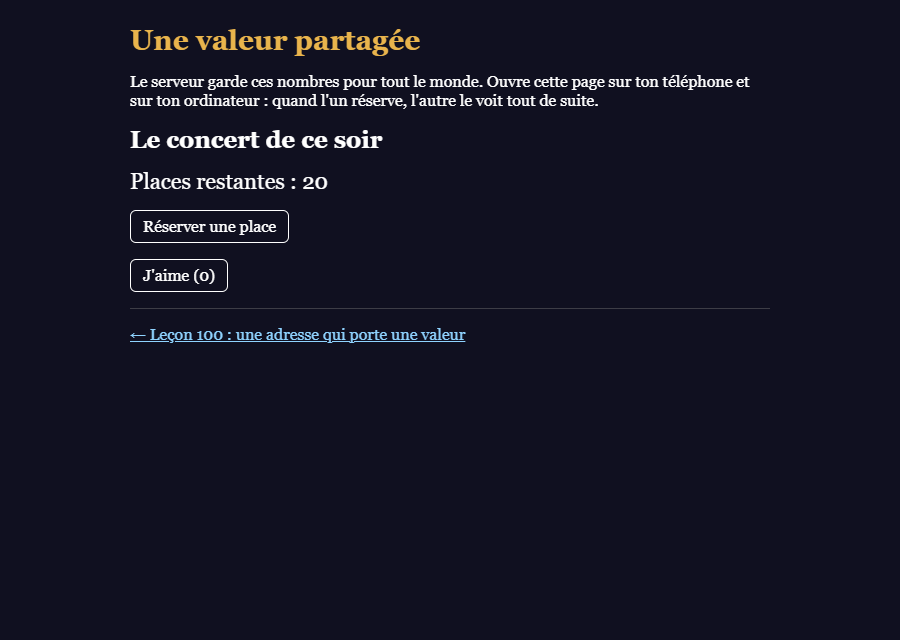

**Erreurs en route**

- Le premier essai des tests du moteur a raté : un test exige que chaque bloc du langage figure dans un exemple, et `Shared` n'y était pas avant que la leçon 101 rejoigne sa liste.
- Ma première version de la page prenait la réponse du serveur telle quelle : ce que le visiteur écrivait pendant l'attente aurait été effacé. Vu en relisant ; la page pose maintenant les seuls changements du geste sur son état du moment. Aucun essai ne le garde : la course est difficile à provoquer à coup sûr.
- Un texte partagé écrit d'après un texte trop long (un état forgé) était coupé pour les autres pages, pas dans la réponse à celui qui l'avait écrit. Corrigé et essayé.
- Le serveur d'essai renvoyait l'erreur du moteur avec le chemin du fichier sur le PC. Retiré.
- Dans un essai, j'avais écrit une attente qui n'attendait pas (`until("true")` rend la main tout de suite) ; elle attend maintenant la ligne du serveur qui compte les pages à l'écoute.
- La commande proposait `Request::upgrade` : en le lisant dans `tiny_http`, il est fait pour un WebSocket ; `into_writer` rend le même flux, sans en-tête de trop.

---

## 2026-10-08 — Seule la session Claude du PC fusionne ; la passation pour les autres IA

- Le quota de Claude est utilisé à 95 %. Yocthan veut que les autres IA puissent reprendre, par exemple Gemini par Antigravity, « sans pour autant commettre de fautes, ni pour autant qu'ils fassent des fusions. […] C'est toi qui seras le seul à faire de fusion », sans « déranger la version principale ».
- Écrits :
  - `proposals/Claude/passation-2026-10-08.md` : les dix règles, où en est le projet, ce qu'on peut faire sans risque ;
  - `GEMINI.md` à la racine, lu par les outils de Gemini ;
  - une section en haut d'`AGENTS.md`.
- `main` est protégée sur GitHub : envoi direct refusé, envoi forcé et effacement refusés, et une pull request n'entre qu'avec ses trois tests verts (« Moteur Rust », « Suite de conformité », « Navigateur »). La règle « personne d'autre ne fusionne » ne peut pas être imposée par GitHub, car toutes les IA passent par le même compte : c'est une consigne écrite.
- Les deux agents des lots 6 et 7 ont reçu l'ordre d'enregistrer et d'envoyer leur travail tel quel, sans rien fusionner, puis de s'arrêter. Lot 7 : PR 177. Lot 6 : branche `langage/lot6-partage`, PR en brouillon.

---

## 2026-10-08 — Lot 7 : des comptes chez l'auteur, une page réservée, le panier qui suit le compte

- Décidé par Yocthan le 2026-10-08 (« je suis d'accord avec tes recommandations ») : se connecter par **un mot de passe puis un code à 6 chiffres**, les clés d'accès ensuite ; **tout chez l'auteur**, comme Django, sans prestataire ; des pages qui marchent aussi sans JavaScript.
- Fait (`ADR-081`, PROPOSITION) : `holo serve` garde les comptes dans la base du site. Le mot de passe n'y est jamais en clair (son empreinte Argon2id) ; le code à 6 chiffres suit la RFC 6238, calculé par une application du téléphone (Aegis, FreeOTP…), sans Internet ni SMS ; un code ne sert qu'une fois ; cinq essais ratés, puis une attente qui double ; le même message pour un nom ou un mot de passe faux, et le même temps de réponse ; une session de 128 bits tirée au hasard, cookie `HttpOnly; SameSite=Lax`, dont la base ne garde que l'empreinte, oubliée après 14 jours sans visite, effacée en se déconnectant.
- Les pages de compte (`/account/signup`, `/account/signin`, `/account/code`, `/account`) sont fabriquées par le moteur, en HTML ordinaire, sans script, accessibles (étiquettes, erreurs reliées aux champs et lues par un lecteur d'écran, `autocomplete`).
- Dans la page : `Page(access: members)` ; `signedIn` et `{account}`, lus comme les autres valeurs, jamais changés. Les liens vers `/account`, `/account/signin`, `/account/signup` sont les seuls qui partent de la racine du site.
- Le panier suit le compte : sans JavaScript par les touchers, comme avant ; avec JavaScript, la page renvoie chaque toucher au serveur (`?mirror`), qui le rejoue avec le même arbitre sur l'état du compte. Jamais de valeurs. Ce qui était dans le panier avant la connexion suit aussi.
- Bibliothèques ajoutées, pour le PC seulement : `argon2` 0.6, `hmac` 0.13, `sha1` 0.11 (RustCrypto, la nouvelle génération). Pas de QR code (aucune bibliothèque de plus) : la clé se recopie, ou s'ouvre par un lien `otpauth://` sur le téléphone. Les clés d'accès restent la prochaine étape : il faudra `p256` et `sha2`, à accepter par Yocthan.
- Leçons 104 (se connecter), 105 (une page réservée), 106 (le panier qui suit le compte). Le serveur d'essai dit qu'il faut `holo serve` à la place des pages de compte et des pages réservées.
- Pour la fusion avec le lot 6 (construit en même temps) : la leçon 104 revient à la leçon 100 (les leçons 101 à 103 viendront entre les deux) ; la section du guide s'appelle « 6 untricies » pour ne pas prendre le nom que le lot 6 choisira.
- Exécuté : `cargo test --release` → 166 tests passent (dix nouveaux, dont les valeurs de référence de la RFC 6238) ; `cargo test` en mode debug, celui de GitHub : les tests des comptes en 5 secondes ; dans Chrome, `node outils/browser-tests.mjs compte` → 3 essais `OK` (le serveur d'essai ; un compte, son code calculé par l'essai, une page réservée, avec et sans JavaScript ; le panier sur trois appareils, avec et sans JavaScript) ; les essais `serve` → 8 `OK` ; la suite entière → 34 essais `OK`, aucun raté, 100 leçons ouvertes sans erreur (263 s).

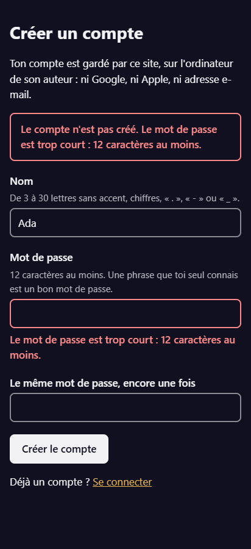

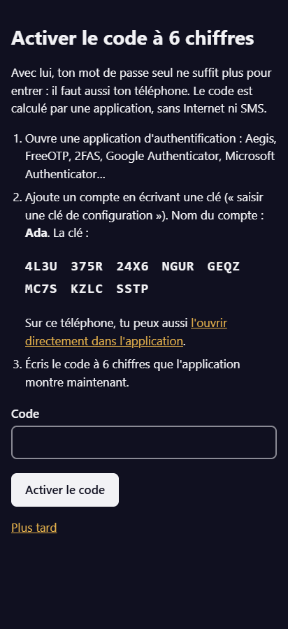

**Erreurs en route**

- Une erreur de compilation : j'avais écrit l'empreinte « pour rien » (un nom inconnu) de façon que Rust croie que l'empreinte d'un vrai compte devait vivre aussi longtemps que le programme.
- La vérification « on le lit, on ne le change pas » ne se faisait que si la page lisait `signedIn` : une page qui l'écrivait sans le lire passait jusqu'à une autre erreur, moins claire. Le test l'a vu ; la vérification se fait maintenant toujours.
- En relisant le diff : pour un membre connecté, toutes les réponses étaient marquées « jamais en cache », le moteur et son WebAssembly compris ; seules les pages et leurs textes le sont maintenant.
- Sur les captures : la page « Se connecter » ne disait pas pourquoi on y arrivait depuis une page réservée ; et « Le compte n'est pas créé : Le mot de passe… » était mal ponctué. Corrigés.
- Une de mes assertions attendait les attributs d'un champ dans le mauvais ordre.

---

## 2026-10-08 — Les mesures du téléphone remises, la mesure de la batterie prête

- Yocthan voulait mesurer la vitesse, la mémoire et la batterie, « jamais faite jusqu'au bout ». Le téléphone n'est plus apparu au PC : le câble avait pris un peu d'humidité. Yocthan : « n'attends pas mon téléphone […] il n'y en a pas aujourd'hui ».
- Prêt pour la prochaine fois : `moteur/outils/mesures/duree.js`. Il fait zoomer et dézoomer le Big Bang 15 minutes, 6 secondes dans chaque sens, et garde l'écran allumé (Wake Lock). Il relève, minute par minute, les images par seconde, l'image la plus lente, le tas JavaScript et la batterie. Lancé par le câble, il continue seul câble débranché, car branché le téléphone se recharge et la batterie ne se mesure pas. Essayé une minute sur le PC, dans Chrome sans fenêtre : il compte, garde l'écran et rend ses chiffres. La marche à suivre complète est dans `proposals/Claude/telephone-2026-10-07/README.md`.
- Resté sur le téléphone depuis le 2026-10-07 : « rester allumé » (`stay_on_while_plugged_in`) vaut 2 au lieu de 0, car le téléphone est parti avant la fin. À remettre au prochain branchement, ou par Yocthan dans les options de développement.
- Erreur commise et corrigée : un commit de cette étape portait l'adresse e-mail personnelle de Yocthan, alors que le dépôt est public. Il a été refait avec l'adresse `noreply` de GitHub avant tout envoi, et la consigne a été donnée aux deux agents des lots 6 et 7. Sur la recommandation de Claude, Yocthan a coché « Keep my email addresses private » dans GitHub : les fusions faites par GitHub portaient jusque-là l'adresse de son compte.

---

## 2026-10-08 — Les lots 6 et 7 commencés, d'autres tâches confiées à la session du nuage

- Yocthan : « commence-les tous, et je suis d'accord avec tes recommandations », puis « utilise les agents, délaisse d'autres tâches à l'autre session pour qu'on aille rapidement ; à la fin, tu fusionnes ».
- Ses recommandations acceptées : le lot 6 partage d'abord une valeur gardée par le serveur pour tout le monde, vue en direct, le serveur arbitrant ; le lot 7 se connecte par un mot de passe et un code à 6 chiffres, puis par des clés d'accès, tout chez l'auteur ; les liens remontent d'un dossier (`ADR-078`).
- Deux agents de la session du PC construisent les lots 6 (`langage/lot6-partage`) et 7 (`langage/lot7-comptes`), chacun dans son dossier ; la session principale fait les mesures du téléphone, relit et fusionne.
- Confiés à la session du nuage, en plus du lot 9 : les secondes et un chronomètre, une sélection de polices libres, l'historique dans une page, trois petites dettes des lots 4 et 5 (le tableau « Qui fait quoi »).
- Le même soir, Yocthan a essayé au doigt les leçons 1 à 100 sur son Galaxy Z Flip 5 : tout marche, les lots 4 et 5 compris. Restent les mesures par le câble.

---

## 2026-10-08 — Le dépôt devient public, sous un autre nom : `Oyo-Oyo`

- Décidé par Yocthan : passer le dépôt en public, pour que les tests de GitHub repartent (ils sont gratuits pour un dépôt public ; les minutes gratuites d'un dépôt privé étaient épuisées), et le renommer pour qu'il attire moins l'œil. Son choix : « Oyo Oyo ». GitHub n'accepte pas d'espace : `yocthanmabeka/Oyo-Oyo`. L'ancienne adresse redirige.
- Vérifié avant : les 462 enregistrements de l'histoire ne contiennent aucune clé, aucun mot de passe, aucun jeton, aucun fichier sensible (base, messages reçus, secrets), aucun e-mail personnel ni numéro de téléphone. Dit à Yocthan : son nom figure dans 77 fichiers (et dans le nom du compte), le métavers à 248 endroits ; un dépôt public peut être lu et gardé par n'importe qui, même s'il redevient privé.
- Ajouté (ses demandes) : `LICENSE`, « tous droits réservés », en français et en anglais (la police Carlito garde sa licence OFL) ; les tests des trois premiers prototypes dans leur propre fichier, lancés seulement si leur dossier change ; une nouvelle version d'une pull request annule les tests de l'ancienne.
- Gardé tel quel : l'ancienne adresse dans les messages d'archive aux autres IA et dans les transcriptions (ce sont des traces) ; seule la règle de synchronisation (`GITHUB-SYNC-POLICY.md`) dit le nouveau nom.

---

## 2026-10-08 — Lot 5 : des adresses qui portent des valeurs, dans le `holo serve` de la session du nuage

- Fait (`ADR-078`, PROPOSITION ; la forme est celle choisie par Yocthan, « le nom du fichier ») : un fichier `profil/{id}.holo` sert `/profil/123` ; la page lit `{id}` comme ses autres valeurs, sans pouvoir la changer. Le serveur, le moteur de la page, le serveur d'essai, l'éditeur, l'extension VS Code et `holo check` reçoivent les mêmes valeurs, jointes au texte de la page comme un petit fichier `@adresse`.
- **Deux serveurs, un seul gardé.** Pendant que la session du PC écrivait son `holo serve`, la session du nuage a fusionné le sien (PR 167, `ADR-074` : les boutons marchent sans JavaScript, l'état de chaque visiteur dans SQLite, quatre fils), puis a passé la main : Yocthan a confié les lots 5 à 7 à la session du PC. Son serveur fait plus que le mien : je l'ai gardé, j'ai repris ses PR 168 (les formulaires) et 169 (les sauvegardes), et j'ai porté les adresses dedans. Mon serveur est retiré.
- Les liens remontent d'un dossier (`../accueil.holo`), comme sur le web : **un retour sur une ancienne règle**, à valider par Yocthan.
- Leçon 100. Un agent a écrit le côté navigateur (la page, le serveur d'essai, l'éditeur, l'extension, la leçon et son essai) pendant que j'écrivais le moteur et le serveur.
- Exécuté : `cargo test --release` → 156 tests passent (trois nouveaux : les adresses, et dans le serveur, une adresse avec et sans JavaScript) ; dans Chrome, les essais du serveur (« holo serve sert une adresse qui porte une valeur » : « Bonjour, ada » fabriqué par le serveur, le moteur qui garde la valeur, le message rangé avec son modèle ; les boutons sans JavaScript ; les formulaires) et celui de la leçon 100 passent ; la suite entière → 31 essais `OK`, aucun raté, 97 leçons ouvertes sans erreur.
- **GitHub ne lance plus les tests** depuis cette nuit : « un paiement récent du compte a échoué, ou la limite de dépenses doit être augmentée ». Les minutes gratuites de GitHub Actions sont sans doute épuisées. Rien n'est fusionné sans eux : à Yocthan de décider (la limite de dépenses, rendre le dépôt public, ou attendre le mois suivant).

**Erreurs en route**

- Deux sessions ont écrit chacune leur `holo serve` en même temps : le tableau « Qui fait quoi » disait « la première libre », et chacune s'est crue la bonne. Une heure de travail en double ; la règle est maintenant qu'un lot porte le nom d'une seule session.
- Mon premier essai de `holo serve` dans Chrome a raté : le moteur de la page ne savait lire que les adresses en `.holo`. Toute page fabriquée nomme maintenant son fichier (`<meta name="holo-file">`).
- Trois défauts de mon premier serveur, relevés par l'agent : un « & » dans une valeur ouvrait une autre valeur ; un dossier accentué ne correspondait jamais ; une page refusée ne nommait pas son fichier. La jonction et la comparaison des adresses sont corrigées dans le moteur, et servent au serveur gardé.
- Le quota de messages se comptait par adresse : on pouvait remplir la base en inventant des adresses. Il se compte par modèle.
- Un essai du serveur de la session du nuage ratait sous Windows : il effaçait le dossier d'essai pendant que la base était encore prise. L'effacement réessaie.
- Mon assertion sur une page fabriquée était fausse : le contenu d'un `If` faux reste dans la page, caché (`hidden`).
- Trouvés en passant par l'agent : le bouton ▶ de l'extension VS Code ne marchait plus depuis la traduction en anglais ; une adresse mal encodée donnait 500 au lieu de 400 au serveur d'essai. Corrigés.

---

## 2026-10-08 — Lot 9, quatrième pas : un module qui dessine

- Fait (`ADR-088`) : `Drawing(…, shapes: fleur)` ; les formes d'un dessin peuvent venir d'une liste à champs, une par élément (`form`, et les champs des formes écrites). Un module rend cette liste comme n'importe quelle valeur : il « dessine » sans toucher au dessin du navigateur ; le moteur vérifie chaque forme et laisse de côté les fausses. Leçon 110 : une fleur dont le module calcule les pétales (un sinus sans bibliothèque).
- Raté puis corrigé : le premier essai déclarait dans `State` des éléments aux champs différents, ce que le moteur refuse ; les formes d'une liste arrivent pendant la visite (un module, des données), et l'essai les fait maintenant arriver ainsi.
- Vérifié : tous les tests du moteur ; dans Chrome, aucune forme au départ, puis 6 pétales et le cœur, puis 9 pétales (« 11 formes dessinées ») ; le module essayé dans Node avant, de 0 à 99 pétales (borné à 24).
- La session du PC a ouvert la PR 173 (lot 5, les adresses, sur `holo serve`) ; elle relie la leçon 96 à sa leçon 100, et ce lot la relie à la 97 : la suite finale est notée dans le tableau « Qui fait quoi ».

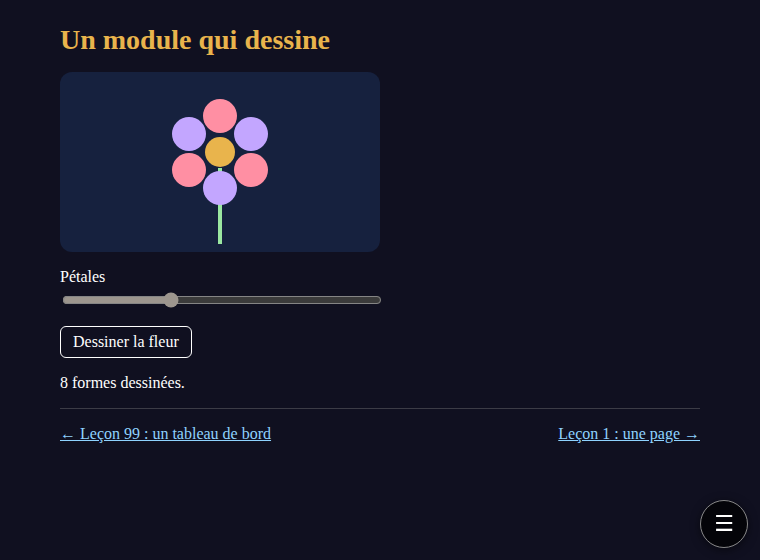

---

## 2026-10-07 — Lot 9, troisième pas : un tableau de bord, `Chart`

- Fait (`ADR-087`) : `Chart(kind: bars | line | pie, over:, value:, label:, title:)`, dessiné par le moteur en SVG d'après une liste à champs ; un tableau caché donne les mêmes chiffres au lecteur d'écran ; le graphique suit sa liste. Leçon 99 : des ventes reçues du serveur, en barres et en parts ; une vente ajoutée se dessine tout de suite. C'est le dixième parcours du « web viable » : recevoir, calculer, dessiner.
- Trouvé et corrigé : le moteur relisait au démarrage les données que le serveur venait de mettre dans la page ; une vente ajoutée avant leur retour était effacée (vu sur une capture où la sixième barre manquait). Une page servie avec ses données ne les relit plus qu'à son rythme.
- Raté puis corrigé : le tableau caché gardait sa vraie taille (un tableau ne se réduit pas à un pixel) et aurait pu faire défiler la page de côté sur un téléphone ; il est rangé dans un bloc caché.
- Vérifié : tous les tests du moteur ; dans Chrome, cinq puis six barres et parts, la vente gardée, le tableau caché lu ; les essais des données (« pas de lecture en trop », « gardées sans les relire ») ; axe-core, 99 leçons, 0 défaut en clair, et en sombre sur téléphone le seul défaut connu de la leçon 90.

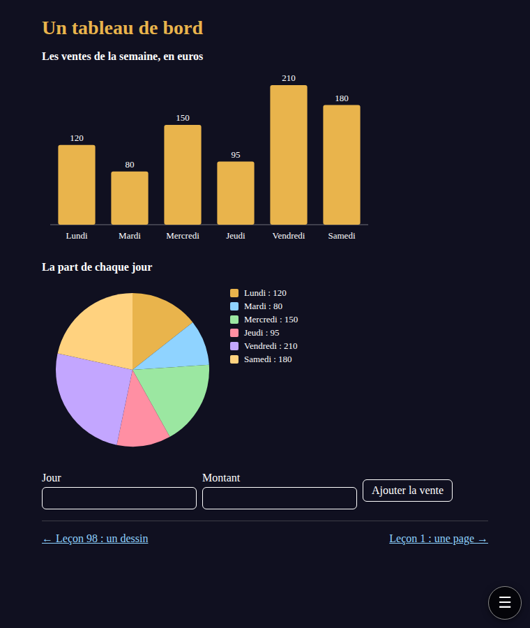

---

## 2026-10-07 — Lot 9, deuxième pas : le dessin vectoriel, `Drawing` ; GitHub Actions bloqué

- Fait (`ADR-086`) : `Drawing(label:, width:, height:, children: [ … ])`, fabriqué en SVG, nommé pour le lecteur d'écran ; quatre formes, `Rect`, `Circle`, `Line`, `Path` ; `fill`, `stroke`, `thickness`, `opacity` ; une mesure peut être le nom d'un nombre de la page, et la forme le suit. Le dessin trait par trait reste refusé. Leçon 98 : un paysage dont le soleil se lève et se couche derrière la colline.
- Vérifié : tous les tests du moteur ; dans Chrome, un SVG à sept formes, nommé pour le lecteur d'écran, le soleil de 70 à 30 en deux touchers, les proportions gardées.
- Raté puis corrigé : une vérification plus ancienne refusait un nombre à virgule dans `x` avec un message qui parlait de glissière et de plateau ; un dessin donne maintenant le sien.
- **Bloqué** : sur la PR 171, aucune vérification de GitHub n'a démarré. GitHub écrit : « The job was not started because recent account payments have failed or your spending limit needs to be increased » (les minutes de GitHub Actions du compte sont épuisées, ou un paiement a échoué). Sans CI verte, rien n'est fusionné : les PR 171 et suivantes attendent que Yocthan règle « Billing & plans » sur GitHub. Le travail continue en local, vérifié par les mêmes tests.

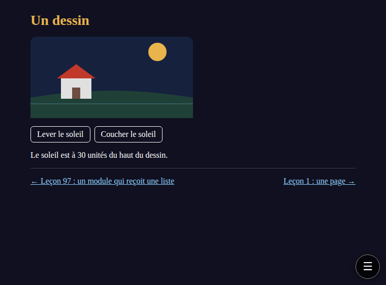

---

## 2026-10-07 — Lot 9, premier pas : des modules qui reçoivent une liste et rendent plusieurs valeurs

- Pris par la session du nuage, selon le tableau « Qui fait quoi » relu sur `main` après la PR 170.
- Fait (`ADR-077`) : `Module(input: [notes], output: [moyenne, meilleure, nombre])` ; des nombres à virgule, des textes, des listes. Le second contrat : le module offre `alloc` et `run(adresse, taille)` et échange un texte JSON ; le moteur relit sa réponse comme des données d'un serveur, et refuse toute la réponse si une valeur n'est pas annoncée ou n'a pas la bonne sorte. Le premier contrat (un nombre, un nombre) marche toujours. Leçon 97, avec deux modules en Rust : `bulletin.rs` et un `menteur.rs`, exprès.
- Vérifié : tous les tests du moteur ; dans Chrome, « 3 notes ; moyenne : 13,5 », puis 14,6 avec une note dont la matière contient des guillemets et des accolades ; le module menteur refusé (« admin »), rien de changé ; la leçon 69 rend toujours 5 050.
- Raté puis corrigé : le module de la leçon cherchait un guillemet avec une fonction qui saute les textes, et ne trouvait donc jamais de champ ; puis il prenait la liste entière pour le premier élément. Essayé dans Node avant le navigateur, avec des matières piégées.
- Corrigé au passage, dans les leçons du lot 8 (session du nuage) : la leçon 95 renvoyait à la leçon 88 au lieu de la 94 (relevé par la session du PC) ; la 96 mène maintenant à la 97.
- Audit axe-core : 97 leçons, 0 défaut en clair. En sombre sur téléphone (390 px), un défaut, dans la leçon 90 du lot 4 (session du PC) : la boîte qui défile (`.boite`) n'est pas atteignable au clavier (« scrollable-region-focusable »). Noté pour la session du PC, sans le corriger (règle du tableau « Qui fait quoi »).

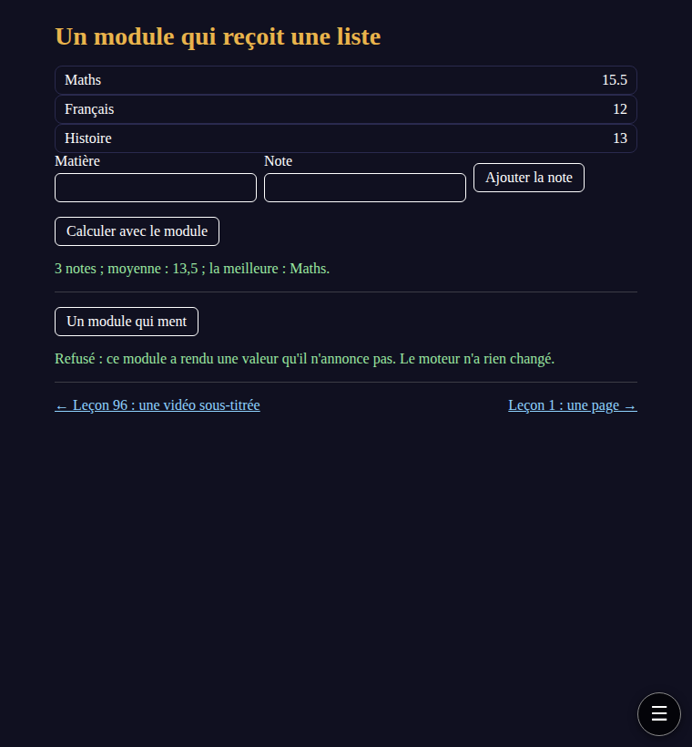

---

## 2026-10-07 — Les lots 5 à 7 à la session du PC, le lot 9 au nuage ; des règles pour ne plus s'entremêler

- Les deux sessions avaient pris les lots 5 à 7 à quelques minutes d'écart. Yocthan a décidé : « que vous ne puissiez plus vous entremêler entre les lots ; que chacun puisse avoir un lot différent ». La session du PC, inscrite la première sur `main` (PR 166), garde les lots 5 à 7 et analyse le travail de la session du nuage ; la session du nuage prend le lot 9.
- Raté : en trouvant le doublon, Claude (nuage) a demandé à Yocthan qui gardait les lots ; sans réponse tranchée, il a choisi le nuage et l'a écrit dans le tableau de la PR 167. Le programme de fusion automatique a fusionné cette PR quand sa CI est passée au vert, quelques minutes avant la décision de Yocthan. `holo serve` et les boutons sans JavaScript (`ADR-074`) sont donc sur `main`. Les PR 168 (les formulaires, `ADR-075`) et 169 (les sauvegardes, `ADR-076`) restent ouvertes, sans fusion automatique.
- Fait : le tableau « Qui fait quoi » corrigé ; cinq règles pour ne plus s'entremêler (seul Yocthan donne un lot, à une session nommée ; relire le tableau sur `origin/main` avant le code ; changer le tableau par une petite PR fusionnée avant le code ; une session qui a fini demande à Yocthan ; en cas de doublon, la première ligne arrivée sur `main` garde le lot) ; la passation pour la session du PC, `proposals/Claude/passation-lot5-2026-10-07.md`.
- Leçon : « la première libre » et « l'autre session » laissaient deux sessions se croire chacune la bonne. Une ligne du tableau nomme désormais une seule session.

---

## 2026-10-07 — Lot 5, troisième pas : les sauvegardes

- Fait (`ADR-076`) : `holo serve` sauvegarde sa base au démarrage (si la dernière copie a plus d'un jour) puis chaque jour ; `holo backup` en fait une tout de suite. Une copie entière, cohérente même pendant les écritures, dans `holo-data/backups/` ; les quatorze plus récentes restent.
- Vérifié : la copie se relit et contient la valeur d'un visiteur ; avec vingt vieilles copies, il en reste quatorze ; à la main, « Sauvegarde : … » au démarrage, et `holo backup`.
- Reste du lot 5 : les adresses `profil/{id}.holo`. Leur écriture dans la page est une décision de langage : proposée à Yocthan avant de construire.

---

## 2026-10-07 — Lot 5, deuxième pas : les formulaires reçus par `holo serve`, avec ou sans JavaScript

- Fait (`ADR-075`) : `holo serve` reçoit les formulaires `Form` comme `outils/server.mjs` (vérifiés à nouveau, fichiers reconnus à leurs octets), et les range dans sa base SQLite ; `holo messages` les affiche. Sans JavaScript, « Envoyer » part au serveur : les messages d'erreur reviennent sous les champs, puis « Merci » une fois corrigé. C'est le « commander » de la condition du lot 5.
- Vérifié : 152 tests du moteur ; dans Chrome, la leçon 88 sans JavaScript (quatre messages reliés à leurs champs, puis envoyé) et avec (envoyé sans recharger) ; deux messages rangés.
- Raté puis corrigé : dans l'essai avec JavaScript, « Merci » venait de la visite précédente, gardée par le serveur ; l'essai efface maintenant les cookies pour être un nouveau visiteur. Et le petit programme qui fusionne après la CI aurait fusionné sans aucune vérification si GitHub n'en lançait pas (conflit) : il exige maintenant cinq vérifications, toutes vertes.

---

## 2026-10-07 — Lot 5, premier pas : `holo serve`, et des boutons qui marchent sans JavaScript

- Yocthan a accepté la condition proposée après l'avis de Gemini : « la boutique marche avec JavaScript coupé » (« Oui, vas-y et continue »). La session du nuage prend les lots 5 à 7 ; le lot 9 revient à la session du PC.
- Fait (`ADR-074`) : `holo serve [dossier] [port]`, un serveur en Rust dans le moteur, avec une base SQLite (`holo-data/site.sqlite`) ; un numéro par visiteur, dans un cookie ; la page fabriquée avec ses valeurs ; un formulaire caché auquel les boutons et les champs se rattachent, sans changer la mise en page ; le même arbitre que le navigateur, côté serveur.
- Vérifié dans Chrome, JavaScript coupé : une tâche ajoutée puis faite (leçon 68), deux pommes et « 4 euros » calculés par le serveur (leçon 14) ; la touche Entrée n'ajoute rien ; JavaScript rallumé, le moteur repart des valeurs du serveur. Tous les tests du moteur et du navigateur passent.
- Raté puis corrigé : le moteur pour le navigateur ne se construisait plus (`holo serve` n'existe pas en WebAssembly) ; le nom `data-state`, déjà pris par les valeurs affichées, est devenu `data-visit` ; la touche Entrée aurait « appuyé » sur le premier bouton de la page : un bouton caché, en tête, la reçoit.
- Pas encore fait : les formulaires `Form` par `holo serve`, les sauvegardes, les adresses `profil/{id}.holo`.
- Les deux sessions avaient inscrit les lots 5 à 7 à quelques minutes d'écart (la PR 166 du PC, et ce lot). Claude (nuage) a d'abord tranché pour le nuage ; Yocthan a décidé l'inverse le même soir : voir l'entrée « Les lots 5 à 7 à la session du PC ».

---

## 2026-10-07 — La parité : ce qui agit ne se cache pas sur un seul appareil ; les choix du lot 5

- Décidé par Yocthan (« Refuser pour ce qui agit ») : `display: none` dans `phone:`, `computer:` ou `narrow:` cache une phrase ou une image, jamais un bouton, un lien, un champ, un formulaire ou un bloc qu'une règle écoute. Le moteur le refuse, avec le bloc et l'appareil où il manquerait (`ADR-069`).
- Décidé par Yocthan pour le lot 5 : `holo serve` en Rust avec deux bibliothèques éprouvées, `tiny_http` et `rusqlite` (SQLite comprise dans `holo.exe`, rien d'autre à installer) ; les adresses comme `/profil/123` par le nom du fichier, `profil/{id}.holo`. Noté dans `proposals/Claude/tout-le-web-2026-10/SYNTHESE.md`.
- Réservé dans le tableau « Qui fait quoi » pour les lots 5 à 7 : `ADR-078` à `ADR-085`, leçons 100 à 109.
- Exécuté : `cargo test --release` → 144 tests passent (un nouveau : `what_acts_exists_on_every_device`).

---

## 2026-10-07 — Lot 4 : la mise en page (téléphone, ordinateur, la place, ce qui dépasse, les proportions, le curseur, justifié, décrocher)

- Fait (`ADR-069`, PROPOSITION), dans l'ordre demandé par Yocthan :
  - `computer: { … }` (1024px ou plus) à côté de `phone: { … }` ; `Page { max-width: 960px; }` élargit la page ; `display: none` dans `phone:`, `computer:` et `narrow:` ;
  - `narrow: { … }` vaut dans une case de `Grid` de moins de 320px ; la page mesure les cases elle-même ;
  - un mot trop long passe à la ligne sans rien écrire ; `line-clamp: 3`, `min-width`, `min-height`, `max-height`, `overflow`, `white-space` ;
  - `aspect-ratio`, `object-fit` (une image est `cover` d'office, jamais déformée), `object-position` ;
  - `cursor` : 22 formes ou une image, avec la forme de secours ajoutée ;
  - `text-align: justify`, avec les mots coupés dans la langue de la page.
- **Décrocher la page**, décision de Yocthan sur son téléphone, « comme pour tourner » : par défaut, le zoom est celui du navigateur, et la page reste accrochée ; `Zoom(detach: true)` offre « Décrocher » dans le menu ☰. Avec des points, le moteur garde le zoom.
- **Les touches à l'écran**, sa règle du même soir (« si la fonction existe sur téléphone, elle doit strictement aussi exister sur ordinateur et vice-versa ») : au doigt, une page qui écoute des touches les montre en bas de l'écran. Les leçons 35 et 81 disent aussi comment lancer TalkBack et VoiceOver.
- **Le Big Bang mène aux leçons** : en haut à gauche, « Les leçons » et « La pile », et « Leçon 27 → » depuis la leçon 26. Sur le téléphone, rien n'y menait.
- **La séance au doigt** : Yocthan a essayé les leçons 1 à 88 sur son Galaxy Z Flip 5 ; « jusqu'à la 88e leçon, tout est bon », hormis six points : quatre corrigés (la PR 160 et ce lot), deux proposés pour le lot 7 (les secondes, des polices libres prêtes). Compte rendu, avec deux captures : `proposals/Claude/telephone-2026-10-07/README.md`.
- Dans la même pull request : le mode `--telephone` de `moteur/outils/browser-tests.mjs` (les essais dans le Chrome du téléphone branché, par le câble ; pas encore lancé jusqu'au bout) ; les mesures réparées : `moteur/src/web.rs` publie ses mesures avec des noms anglais (`fps`, `worst_ms`, `depth`…), ceux que lisent `web/measures.js` et `outils/mesures/`. Elles étaient cassées depuis l'`ADR-060`.
- Leçons 89 à 94 ; la leçon 77 mise à jour ; la 94 mène à la 95 du lot 8. Noté pour la session du nuage : sa leçon 95 renvoie encore à la leçon 88 (règle du tableau « Qui fait quoi » : on ne touche pas au lot de l'autre). Trois essais de plus dans Chrome : la mise en page (un ordinateur de 1280px, un téléphone de 400px), le zoom et les touches, le Big Bang.
- Exécuté : `cargo test --release` → 143 tests passent (3 nouveaux) ; dans Chrome, la suite entière → 27 essais `OK`, aucun raté (94 leçons ouvertes sans erreur ; la mise en page, 24 vérifications sur un ordinateur et un téléphone ; le zoom et les touches au doigt ; le Big Bang). Le tableau en ligne est republié.

**Erreurs en route**

- J'avais proposé à Yocthan `Relief(detach: true)` ; `Relief` n'existe qu'avec les points : c'est devenu `Zoom(detach: true)`.
- `narrow:` était d'abord prévu avec les « container queries » du CSS : une case de grille ne peut pas s'y mesurer elle-même, et l'auteur s'y serait trompé. La page mesure maintenant chaque case.
- La leçon de la place sautait du H1 au H3 : le moteur l'a refusée.
- La boîte de la leçon 90 n'avait pas assez de texte pour défiler à la taille d'un téléphone : l'essai l'a vu.
- Trouvé par l'essai, et qui aurait gêné sur le téléphone : quand le moteur grossit une page décrochée, Chrome sur téléphone élargit sa zone d'affichage, et le menu ☰ (avec « Accrocher ») partait hors de l'écran. Corrigé par `minimum-scale=1` : on grossit autant qu'on veut, on ne réduit pas sous la taille normale.
- Dans l'essai, après un pincement du navigateur lui-même, le Chrome d'essai ne transmettait plus les doigts simulés aux pages suivantes : ce pincement est passé en dernier.
- Trois tests du moteur attendaient l'ancienne page : deux sans la marque `data-zoom`, et le mien définissait deux fois le même style.
- J'avais d'abord ajouté cinq boutons à la main dans la leçon 77 ; la règle de parité de Yocthan les a remplacés par les touches à l'écran, pour toutes les pages.
- La fusion de la PR 160 a d'abord été bloquée par le garde-fou de Claude Code (« fusion sans relecture ») ; Yocthan l'a autorisée.
- Deux agents lancés pour aller plus vite se sont arrêtés à la limite du modèle Fable ; ils ont été relancés sur Opus.
- Je n'offrais que 15 formes de curseur, et ni `white-space: pre-wrap` : retirer une capacité du web sans raison va contre l'ordre de Yocthan. Relevé par l'agent qui écrivait la documentation ; les 7 formes et `pre-wrap` sont ajoutées, seul `pre` reste refusé, avec sa raison.
- Mon essai annonçait « 26 vérifications » ; il en fait 24. Relevé par le même agent, corrigé.
- Mes leçons allaient de 89 à 95, alors que la coordination des deux sessions, posée le même soir, réserve au lot 4 les leçons 89 à 94 (95 à 99 pour le lot 8, dans le nuage). La place a rejoint la leçon 89 (« L'écran et la place ») ; les suivantes ont descendu d'un cran.

---

## 2026-10-07 — Holoverse de 1970 à 2026 : l'avis de Gemini

- Codex a proposé (PR #153) un monde qui existe sans son dessin, visitable d'un terminal de 1978 au téléphone de 2026, et demandé l'avis de Claude et de Gemini.
- Claude a écrit le prompt pour Gemini (`docs/05-discussions/prompts/2026-10-07-gemini-metavers-tous-materiels.md`) ; Gemini a répondu (`docs/05-discussions/reponses/2026-10-07-gemini-metavers-tous-materiels.md`) : d'accord sur la séparation du monde et du dessin, et sur un parcours sans JavaScript d'abord ; contre le travail sur les vieilles machines ; tout cela après le web et la 3D.
- Proposé par Claude, à décider : un critère de plus au lot 5, « la boutique marche avec JavaScript coupé ».

---

## 2026-10-07 — Lot 8 du web : un encadré, des liens, des sous-titres, l'impression

- Pris par la session du nuage, selon le tableau « Qui fait quoi ».
- Fait (`ADR-073`) : `Aside` ; `A(newTab: true)` (avec `noopener` et « (s'ouvre dans un nouvel onglet) » lu par le lecteur d'écran) ; `A(download: true)`, seulement pour un fichier rangé à côté ; `Video(captions: "film.vtt")` ; les images après la première viennent en approchant (`loading="lazy"`) ; l'état `print:` dans un style, et à l'impression le moteur cache ses outils et écrit l'adresse des liens du web. Leçons 95 et 96.
- Pas fait : l'historique à l'intérieur d'une page (il attend le premier vrai serveur, lot 5).
- Raté puis corrigé : dans la leçon 95, les deux liens du menu étaient collés (un `Nav` ne sépare pas ses liens : ils vont dans un `Row`) ; le texte de remplacement de la seconde image décrivait une étoile dorée alors que l'image est un disque bleu.
- Vérifié : tous les tests du moteur ; dans Chrome, le téléchargement (« 95-programme.txt »), le nouvel onglet, la page vue à l'impression, la piste de sous-titres (« captions », en français, deux répliques) ; l'audit axe-core, 90 leçons et le site de référence, 0 défaut, en clair et en sombre sur téléphone.

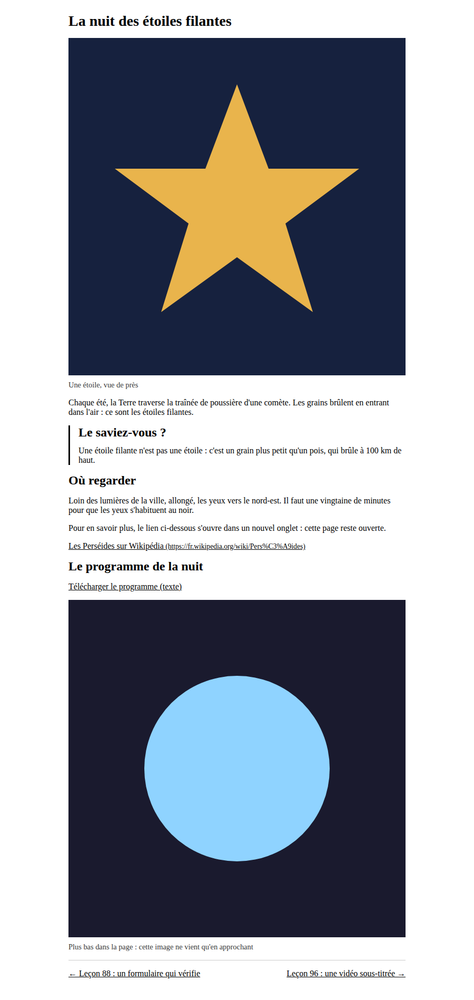

---

## 2026-10-07 — Deux sessions, un lot chacune

- Yocthan veut aller vite sans que les deux sessions se contredisent. Proposé et accepté (« Vas-y, commence ») : la session du PC prend le lot 4 (mise en page), la session du nuage le lot 8 (le HTML et les médias qui manquent) ; ensuite, une seule session pour les lots 5 à 7, l'autre pour le lot 9.
- Écrit : le tableau « Qui fait quoi » en haut d'`AGENTS.md`, avec des numéros de décision et de leçon réservés pour chaque session.

---

## 2026-10-07 — La 3D attendra la fin du web

- Yocthan : « que la 3D commence après les lots 9. Au lieu de s'empresser, c'est mieux qu'on puisse terminer le lot 9 et ensuite commencer la 3D tranquillement ».
- Noté dans la synthèse des avis (décision 1), dans le plan de la 3D (sa date de départ) et dans `AGENTS.md`. Le contenu des étapes de la 3D reste à valider ; les neuf lots du web passent avant.
- État au moment de la décision : lots 1, 2 et 3 faits (environ 27 % du plan, en séances estimées) ; prochain : le lot 4, la mise en page d'ordinateur et de téléphone.

---

## 2026-10-07 — Sur le téléphone : une fenêtre fermée couvrait les liens (leçon 63)

- Vu par Yocthan sur son Galaxy Z Flip 5, pendant la séance d'essais au doigt : à la leçon 63, le lien vers la leçon 64 ne se laissait pas toucher.
- Cause trouvée sur le PC, à la taille d'un téléphone (412 × 915, toucher simulé) : au point du lien, le navigateur touchait le titre de la fenêtre fermée. Une règle de base du moteur (`display: block` pour les enfants de `Main`) l'emportait sur la règle du navigateur qui cache une fenêtre fermée. La fenêtre, invisible mais présente, recouvrait le bas de la page.
- Corrigé dans `moteur/src/flat.rs` : `.holo-Dialog:not([open]){display:none}`.
- Exécuté : `node moteur/outils/browser-tests.mjs "fenêtre fermée"` → `OK` : lien touchable avant, fenêtre ouverte puis fermée, lien touchable après, et il mène à la leçon 64.

**Erreur**

- Aucun essai ne touchait ce qui se trouve sous une fenêtre fermée : la fenêtre n'était vérifiée qu'ouverte. C'est fait maintenant.

---

## 2026-10-07 — Lot 3 : des formulaires qui vérifient

- Fait (`ADR-068`, PROPOSITION) : `required: true`, `type: email`, `min:` en caractères pour un texte. À l'envoi, le moteur vérifie chaque champ : les messages s'écrivent sous les champs, dans la langue de la page, et un lecteur d'écran les lit ; le premier champ à corriger reçoit le clavier. Entrée envoie, un envoi à la fois, 15 secondes au plus. **Le serveur vérifie à nouveau** par le moteur (`holo form`) : un message forgé reçoit 422.
- Corrigé en chemin : un nombre à virgule partait à son échelle interne (« 1250 » au lieu de « 12.50 ») ; un défaut de mon lot 2f, trouvé en lisant le code.
- Une seule pull request pour le lot entier, à la demande de Yocthan d'aller plus vite. Sur le PC, seuls les nouveaux essais ont tourné ; GitHub relance la suite entière avant la fusion.
- Exécuté : `cargo test --release` → 140 tests passent (un nouveau) ; dans Chrome, l'essai de la leçon 88 : 4 messages, rien envoyé, les messages qui suivent la correction, Entrée, un seul envoi, l'échec après 14,9 s, le message forgé refusé (422, 5 erreurs).

**Erreurs en route**

- L'étiquette d'un champ s'est d'abord retrouvée dans sa balise : deux arguments dans le mauvais ordre.
- Des guillemets dans une règle de style fermaient la chaîne du moteur.
- Le champ e-mail ne gardait pas ce qu'on écrivait : il tombait dans la vérification d'une couleur.
- Mon essai interceptait toutes les demandes vers la leçon, y compris la lecture de la page elle-même : il ne compte plus que les envois.

---

## 2026-10-07 — Lot 2, septième partie : des dates (le lot 2 est terminé)

- Fait (`ADR-067`, PROPOSITION : Yocthan n'a pas encore validé) :
  - une date reste un texte « AAAA-MM-JJ », celui du champ date et des données JSON ;
  - `today`, la date du jour, que la page tient à jour et qui passe minuit ;
  - `{arrival:date}` donne « 10 octobre 2026 » (« 1er octobre » le premier du mois), `{arrival:weekday}` donne « samedi » ;
  - deux dates se comparent : `If(departure, over: arrival)`, `If(arrival, under: today)` ;
  - `due.add(7)`, `due.sub(1)`, `due.set(today)` ;
  - `Days(name: nights, from: arrival, to: departure)` compte les jours, et sert dans `total.mul(nights)` ;
  - `Input(type: date, min: today, max: "2026-12-31")`.
- Corrigé en chemin : le champ date acceptait « 2026-13-45 », pourvu que les chiffres soient à leur place. Il ne prend plus qu'un vrai jour du calendrier.
- Ajouté en chemin : `min:` sur un champ de nombre (`Input(value: quantity, min: 1)`). Il était refusé ; c'est un besoin du web (`<input type=number min>`). La longueur minimale d'un texte viendra avec les formulaires (lot 3), et elle est refusée avec cette raison.
- Le calendrier est dans `moteur/src/dates.rs`, d'après les algorithmes de Howard Hinnant, et vérifié jour par jour de 1900 à 2100.
- Leçon 87. Un essai de plus dans Chrome.
- Exécuté :
  - `cargo test --release` → 139 tests passent (3 nouveaux : le calendrier, les dates, les nuits) ;
  - le moteur léger fait 534 927 octets (521 785 avant ce lot) ;
  - l'essai de la leçon 87 dans Chrome : « 7 octobre 2026 », une arrivée dans trois jours, 7 nuits, 560,00 €, une arrivée hier refusée ;
  - `node outils/browser-tests.mjs` → 87 leçons ouvertes sans erreur, et les 22 essais passent, en 149 secondes.

**Erreurs en route**

- Un ancien essai attendait « over compare des nombres » sur un texte : le message dit maintenant « des nombres, ou deux dates ».
- Un autre attendait que `min:` soit refusé sur un champ de nombre ; il est maintenant permis. L'essai vérifie à la place le refus sur un texte, et « min doit être plus petit que max ».
- `Days` et `min` manquaient d'abord à la table des réglages des blocs : la vérification refusait avant même de lire ma règle.

---

## 2026-10-07 — Lot 2, sixième partie : des nombres à virgule, exacts

- Fait (`ADR-066`, PROPOSITION : Yocthan n'a pas encore validé) : `State(price: 12.50)` garde deux chiffres après la virgule, et reste exact. Le moteur garde 12,50 en nombre entier « à l'échelle » (1250) : 12,50 × 3 font 37,50.
  - `{price}` montre « 12,50 » en français, « 12.50 » en anglais ; `{price:number}` groupe par milliers.
  - `add`, `sub` et `set` refusent un nombre qui perdrait des chiffres ; `mul` et `div` arrondissent au plus proche (`sum.mul(1.1)`) ; entre nombres entiers, la division arrondit toujours vers le bas.
  - Les comparaisons sont exactes, même entre un entier et un nombre à virgule.
  - Un champ a le clavier décimal ; « 12,5 » et « 12.5 » sont compris.
  - `{"price": 12.5}` reçu va dans une valeur à virgule.
- Comment : le lecteur garde le nombre de chiffres écrits après la virgule (`12.50` en a deux). L'état voyage toujours en nombres entiers : la page, les valeurs gardées et les conditions n'ont presque rien changé.
- Pas encore, et refusé avec la raison : une glissière, une barre, une case, une place sur un plateau, `Prices` et `limit:` avec une valeur à virgule ; une fiche de liste à virgule ; les nombres négatifs.
- Leçon 86. Un essai de plus dans Chrome.
- Exécuté :
  - `cargo test --release` → 136 tests passent (un nouveau, `decimals_are_kept_exact`) ;
  - le moteur léger fait 521 785 octets (510 701 avant ce lot) ;
  - `node outils/browser-tests.mjs` → 86 leçons ouvertes sans erreur, et les 21 essais passent, en 145 secondes.

**Erreurs en route**

- Un ancien essai attendait que `State(cart: 1.5)` soit refusé : c'est maintenant permis. Il vérifie à la place qu'un nombre négatif, et plus de 6 chiffres après la virgule, sont refusés.
- Mon essai dans Chrome vidait le champ du prix sans lui donner le clavier. La page récrivait alors « 0.00 », et « 9.99 » s'ajoutait derrière : « 0.00999 ». Un visiteur a le clavier sur le champ qu'il vide, et la page ne récrit jamais ce champ. L'essai fait maintenant comme lui.
- Encore des barres obliques avalées par le terminal dans un script : écrit dans un fichier.

---

## 2026-10-07 — Lot 2, cinquième partie : les lignes d'une liste (une clé, le clavier gardé, le total)

- Fait (`ADR-065`, PROPOSITION : Yocthan n'a pas encore validé) :
  - `Repeat(over: tasks, key: id)` : une ligne reconnue par un champ de son élément ;
  - le clavier reste quand une ligne est refaite, et suit la ligne si elle change de place ;
  - `Filter(…, limit: shown, total: matching)` : « 4 sur 6 », et « Montrer plus » se cache quand tout est montré.
- Trois défauts, chacun d'abord constaté par une sonde sur le moteur de `main`, puis corrigés :
  - deux `Repeat(over:)` sur la même liste : après un changement, la seconde recevait les lignes de la première (« B: Pain » devenait « A: Pain ») ;
  - **un défaut de mon lot 2a** : une règle de ligne d'une liste calculée (`item.done.set(1)` sur `ordered`) était acceptée mais ne changeait rien. Elle change maintenant l'élément d'origine, et `tasks.remove(item)` est permis depuis ces lignes ;
  - le focus perdu dans une ligne refaite (relevé par l'exploration #82).
- Leçon 85 ; la leçon 82 montre le total. Trois essais de plus dans Chrome.
- Exécuté :
  - `cargo test --release` → 135 tests passent (4 nouveaux) ;
  - le moteur léger fait 510 701 octets (505 168 avant ce lot) ;
  - vérifié dans les deux sens : sans la reprise du clavier, l'essai de la leçon 85 rate ; remise, il passe.

**Erreurs en route**

- Encore une page d'essai sans champ pour `search` : la saisie était ignorée, et mon compte attendu était faux (« ri » ne trouve qu'une œuvre).
- Ma page d'essai mettait `gap` dans un style : HoloCode le refuse, à juste titre (`ADR-017`).
- Mon essai cherchait `.a .holo-line`, mais un style `.a` devient une classe préfixée dans la page. Il prend maintenant les deux listes dans l'ordre.

---

## 2026-10-07 — Lot 2, quatrième partie : la page du serveur arrive avec ses données

- Fait (`ADR-064`) : `holo html` lit le fichier de `Data(from:)` rangé à côté du `.holo`, 64 Ko au plus. L'arbitre le range comme dans le navigateur, puis `Shop.done`, et la page est fabriquée à partir de là. Un robot de recherche, ou un visiteur dont le moteur tarde, voit les données tout de suite. Le serveur de démonstration n'a rien eu à changer : il appelle déjà `holo html`.
- La page garde ce qu'elle a reçu (`data-received`). Le navigateur rejoue la même réception au démarrage, sans rejouer les effets (un son…), puis relit les données comme d'habitude. Sans ce rejeu, les valeurs de départ remplaçaient un instant celles des données.
- Exécuté :
  - `cargo test --release` → 131 tests passent (un nouveau : `the_server_page_starts_with_its_data`) ;
  - `holo html` sur la leçon 84 → « Chargement… » caché, les nouvelles et « 42 » déjà écrits ;
  - l'essai dans Chrome retient le fichier de données (il ne répond jamais au navigateur) : la page garde « 42 visiteurs » et ne montre pas « Chargement… ».
- Vérifié dans les deux sens : avec le rejeu coupé, cet essai rate (`données gardées sans les relire : false`) ; remis, il passe.

**Erreur en route**

- Mon essai du moteur cherchait « Arbre » avant « Zèbre » dans tout le HTML. Il trouvait d'abord les mots dans `data-received`, où l'ordre est celui du fichier. Il cherche maintenant dans la page seulement.
- L'essai « Data » du lot précédent a raté une fois : sa page arrive maintenant du serveur avec ses données (une lecture), puis le navigateur relit (une seconde). Il attendait « lectures 1 » fixe. Les deux arrivées sont réelles, donc je garde ce comportement, et l'essai compte à partir du nombre trouvé au départ.
- Exécuté ensuite : `node outils/browser-tests.mjs` → 84 leçons, et les 18 essais passent, en 147 secondes.

---

## 2026-10-07 — Lot 2, troisième partie : des données qui disent « arrivées » ou « échec »

- Fait (`ADR-064`, PROPOSITION : Yocthan n'a pas encore validé) :
  - `data: Data(name: Shop, from: "shop.json")` ;
  - `On(Shop.done, …)` quand les données sont arrivées, `On(Shop.failed, …)` quand elles ne sont pas arrivées (pas de réseau, une erreur du serveur, un fichier trop gros, illisible, ou plus de 10 secondes) ;
  - `On(Retry.tap, effect: Shop.refresh)` pour les relire ;
  - les mêmes mots que pour un module ou un formulaire.
- La page lit une seule fois à la fois, et laisse une seconde au moins entre deux lectures.
- Corrigé : le défaut D10 de l'exploration. Une seule image reçue hors du dossier (`../x.svg`, `javascript:…`), ou absente, effaçait toute la liste. Elle ne retire plus que l'image ; la ligne garde son texte de remplacement.
- Corrigé dans le guide : la section « Ce qui n'existe pas encore » annonçait comme absents l'envoi d'un fichier, la condition sur un champ dans une ligne et l'emplacement d'un composant, construits depuis `ADR-057` à `ADR-059`. Une autre phrase niait la liste de choix et l'envoi au serveur.
- Leçon 84. Un essai de plus dans Chrome : il imite le serveur par Chrome lui-même (son domaine Fetch), sans rien installer.
- Exécuté :
  - `cargo test --release` → 130 tests passent ;
  - `node outils/browser-tests.mjs` → 84 leçons ouvertes sans erreur, et les 17 essais passent, en 139 secondes ;
  - le délai de 10 secondes est mesuré à 10,0 s.

**Erreurs en route**

- Ma première règle de relecture jetait une demande faite moins d'une seconde après la précédente. Avec `loading.set(1)` dans la même règle, « Chargement… » serait resté affiché pour toujours. Je l'ai vu en écrivant l'essai des deux demandes rapprochées, avant de l'annoncer. Une demande trop proche attend maintenant son tour.
- `Data(name: stock)`, en minuscules, n'était pas refusé avec la règle des noms (`ADR-037`) : `Data` manquait à la table des réglages des blocs. Il y est.
- Deux fautes dans mes essais : `Text` s'écrit `
` dans une colonne, pas `` ; la réponse de `data()` a maintenant une troisième case.

---

## 2026-10-07 — Le grand tableau sans pourcentages

- La consigne du 2026-10-07 dit : pas de pourcentage de couverture sans méthode de calcul reproductible. Le grand tableau en publiait : « 84 % » pour HTML, « 77 % » pour l'ensemble, et un pourcentage par élément. C'étaient mes estimations, élément par élément, puis leur moyenne : aucune méthode ne les mesurait.
- Fait : les pourcentages sont retirés, de la page en ligne et de `docs/01-holocode/TABLEAU-WEB.md`, et même des données de la page. Restent le jugement par élément (oui, en partie, non, refusé, sans objet) et les comptes, qui se refont en comptant les lignes.
- Le résumé compte maintenant aussi l'élément « sans objet » : 130 éléments sur 130. L'ancien résumé n'en additionnait que 129.
- Exécuté : le générateur refait le fichier → 341 mots, 336 décidés ; la page s'ouvre dans Chrome sans fenêtre, et le résumé donne 62 éléments HTML, 34 CSS, 34 JavaScript, 130 en tout ; aucune colonne « Couverture ».
- Pas touché : le comparatif des langages (`COMPARATIF-LANGAGES-WEB.md`) note chaque langage sur 100, avec des poids écrits ; ce n'est pas une couverture, mais c'est aussi un jugement de Claude. À Yocthan de dire s'il le garde.

---

## 2026-10-07 — Lot 2, deuxième partie : comparer des textes

- Fait (`ADR-063`, PROPOSITION : Yocthan n'a pas encore validé) : un texte se compare à un texte, `If(size, is: "L")`, `If(size, not: "M")`, ou à une autre valeur de texte, `If(again, is: email)`. Une règle qui guette peut regarder un texte : `When(answer, is: "Paris", effect: score.add(1))`, au moment où le visiteur l'écrit ou où une règle le change. À la lettre près. Pas de mélange texte et nombre ; `over` et `under` pour les nombres seulement ; chaque refus dit pourquoi.
- Deux défauts trouvés par une sonde avant d'écrire le code, et corrigés :
  - une règle rangée sous une condition sur un texte, `If(name, not: "", rules: [ Every(…) ])`, ne se déclenchait jamais : l'arbitre ne voyait pas les textes. Il les reçoit maintenant ;
  - `If(found, is: 0)` sur une liste calculée (lot 2a) répondait « vrai » alors que la liste avait deux éléments : une liste calculée n'est pas relue de l'état, et la réponse ne la refaisait pas. Elle la refait maintenant.
- Vérifié aussi, pas un défaut : une règle `When` ou `Every` qui voudrait changer un texte ou une liste est refusée avec sa raison (`ADR-044`).
- Leçon 83. Un essai de plus dans Chrome.
- Exécuté : `cargo test --release` → 130 tests passent (3 nouveaux) ; `node outils/browser-tests.mjs` → 83 leçons ouvertes sans erreur, et les 16 essais passent, en 99 secondes. Le moteur léger passe de 500 825 à 503 185 octets.

**Erreurs en route**

- Quatre anciens tests attendaient l'ancien comportement (le refus de `When` sur un texte, les anciens messages, l'ancien nom `buyer|is=0`) : mis à jour, puisque c'est voulu.
- J'ai écrit `\"` dans un texte HoloCode : la langue n'a pas d'échappement ; un `"` ne s'écrit que dans un texte long `"""…"""`.
- Mon essai de la liste calculée tapait dans un champ qui n'existait pas : le moteur ignorait la saisie, et l'essai passait à moitié par hasard. Le champ est ajouté.
- Le tableau publie encore des pourcentages de couverture estimés : contraire à la consigne du 2026-10-07. Ils seront retirés dans une pull request à part.
- Sur GitHub, Chrome n'a pas démarré dans les 20 secondes prévues : l'essai du navigateur a échoué avant même le premier geste, et `fusionner.sh` a refusé la fusion, comme il le doit. Les pull requests 148 et 149 étaient passées avec le même outil : c'est la machine de GitHub qui a tardé. L'outil laisse maintenant Chrome choisir son port (le fichier `DevToolsActivePort`), attend une minute, relance Chrome une fois, et écrit ce que Chrome a dit s'il échoue encore.

---

## 2026-10-07 — Lot 2, première partie : chercher, filtrer, trier, montrer plus

- Yocthan a choisi l'écriture A, « une liste calculée, nommée », parmi trois.
- Fait (`ADR-062`) : `computed: [ Filter(name: found, from: articles, contains: search, in: [title], field: kind, is: chosen, sortBy: price, reverse: true, limit: shown) ]`, `Repeat(over: found, empty: "…")`, `{found}`. Sans majuscules ni accents ; une valeur vide ne filtre pas ; une liste calculée ne se change pas par une demande et ne se garde pas. `field`, `is` et `reverse` sont ajoutés par Claude dans la même idée : à valider par Yocthan, et marqués « à l'essai » dans le grand tableau.
- Comment : la liste calculée suit l'état que le moteur écrit ; la page la montre et la redessine comme une liste ordinaire, sans rien de nouveau dans le navigateur. La page fabriquée par le serveur la contient déjà.
- Leçon 82. Un essai de plus dans Chrome.
- Exécuté : 127 tests ; `node outils/browser-tests.mjs` → 82 leçons ouvertes et tous les essais de gestes passent.

**Erreurs en route**

- `Filter(name: found)` était refusé : la règle des noms (`ADR-037`) veut une majuscule pour un nom de bloc ; ici le nom désigne une liste, une valeur : `Filter` est mis à part.
- Une option vide dans `Choice` est refusée : la leçon a un bouton « Toutes les sortes » (`chosen.set("")`).
- Deux fautes dans mes essais : un cas de test cassait deux choses à la fois ; un retour à la ligne mal échappé dans une question envoyée à la page.

---

## 2026-10-07 — Lot 1 : des essais dans un vrai navigateur, et les limites

- Yocthan a donné l'ordre de terminer le web, dans l'ordre : d'abord renforcer les essais dans un vrai navigateur et les limites.
- Fait : `moteur/outils/browser-tests.mjs`. Il lance le serveur d'essai sur un port libre et Chrome sans fenêtre, piloté par son protocole, sans rien installer. Il ouvre les 81 leçons (aucune erreur, un titre) et joue 13 essais de gestes : le moteur au premier geste, le pincement à deux doigts, un module, les touches et les lettres qu'on coupe, Échap et une fenêtre, une liste qui change, une liste reçue du serveur, des données trop grosses refusées, un formulaire envoyé, l'apparition en descendant, le son, les tailles, la vue points au lecteur d'écran. Trois pages d'essai, dans `exemples/.essais-navigateur/` (un dossier que la pile ne montre pas).
- GitHub lance ces essais à chaque pull request : un sixième contrôle, « Navigateur — les leçons et les gestes ». Chrome y est déjà ; seul wasm-bindgen y est téléchargé, à la version du moteur, comme le fait `outils/build.ps1`.
- Les limites : le moteur les avait presque toutes. Deux étaient faibles : une liste reçue du serveur et un module étaient téléchargés en entier avant d'être coupés (64 Ko et 4 Mo). Ils sont maintenant lus morceau par morceau, et la lecture s'arrête dès que la limite est passée. Le guide donne toutes les limites, telles que le code les applique.
- Exécuté sur ce PC : `node outils/browser-tests.mjs` → les 14 essais passent, en 97 secondes.

**Erreur en route**

- Mon premier essai des données trop grosses fabriquait un fichier de 61 Ko, sous la limite : il a été pris, à juste titre. Grossi à 96 Ko : refusé.

---

## 2026-10-07 — La réponse de Codex, et la synthèse des deux avis

- Yocthan a collé la réponse de Codex au prompt « tout le web » ; Codex a aussi ouvert sa revue complète (PR 144, fusionnée). Rangée : `docs/05-discussions/reponses/2026-10-07-codex-tout-le-web.md`, avec la lecture de Claude.
- Écrit : `proposals/Claude/tout-le-web-2026-10/SYNTHESE.md`, en proposition. Ce sur quoi Codex, Gemini et l'exploration de l'issue #82 sont d'accord (l'ordre données, formulaires, mise en page ; le serveur avant la 3D ; des modules enfermés élargis ; l'appareil seulement sur permission) ; là où ils divergent (les essais dans un navigateur d'abord ; 24 séances pour Gemini, 44 à 64 pour Codex) ; un plan en neuf lots, environ 46 à 68 séances avant la 3D ; dix parcours qui définiraient le « web viable ». Tout attend la décision de Yocthan.
- Corrigé sur la remarque de Codex : un mot de passe est **haché** (Argon2id), pas chiffré, dans la proposition de serveur.

**Erreurs relevées par Codex**

- Notre prompt disait « mot de passe chiffré », et présentait « 77 % » trop vite comme un chiffre : c'est une estimation de Claude. Le résumé du grand tableau additionne 129 éléments sur 130 : il oublie le seul « sans objet ». À corriger dans le tableau.

---

## 2026-10-07 — Les dix pistes de Codex, explorées (issue #82)

- Yocthan : « Oui, commence le point 1 et 2. » Le point 1 : l'issue #82, explorer les dix pistes de Codex pour un site web complet.
- Fait : `proposals/Claude/exploration-web-complet-2026-10/`, une fiche par piste et une sur le duel de motion design, puis un rapport de synthèse (le tableau des dix pistes, les défauts trouvés, les mesures, la liste classée des travaux, les décisions à prendre). Statut : exploration ; rien n'est décidé.
- Fait par une équipe de huit agents (quatre explorent, quatre relisent) : 206 corrections des relecteurs, environ 1 480 actions, une heure trois quarts, 4,2 millions de tokens. Yocthan a demandé ensuite de couper ce mode : la plupart du travail n'en a pas besoin.
- Trouvé en vérifiant, et réparé le même jour : le pincement au doigt et les modules (PR 141), Échap et les fenêtres (PR 145).
- Mesuré par Claude (Chrome sans fenêtre, cache vide) : 8,4 Ko pour une page simple, 193 Ko quand le moteur arrive, 846 Ko en vue points, parce que le moteur complet arrive en plus du léger.

**Erreur en route**

- Les relecteurs ont laissé dans leur dossier de travail 265 Mo de profils Chrome temporaires : seuls les petits fichiers de preuve (1,7 Mo) sont versionnés.
## 2026-10-07 — Échap ferme de nouveau une fenêtre

- Trouvé par la relecture de l'issue #82 : depuis le lot 9 (`ADR-061`), quand une page écoute la touche Échap (`On(Key.escape, …)`), Échap ne fermait plus une fenêtre ouverte (`Dialog`) : mon code prenait la touche pour la règle de la page.
- Réparé : une fenêtre ouverte garde le clavier pour elle (Échap la ferme, Tab reste dedans). Vérifié dans Chrome sans fenêtre, sur une page qui a une fenêtre et une règle sur Échap : avant, la fenêtre restait ouverte ; après, elle se ferme, et Échap hors de la fenêtre déclenche toujours la règle.

**Erreur en route**

- C'était mon erreur, dans le lot 9 : mes essais du clavier ne faisaient pas ouvrir de fenêtre.

---

## 2026-10-07 — La réponse de Gemini sur « tout le web »

- Collée par Yocthan, rangée dans `docs/05-discussions/reponses/2026-10-07-gemini-tout-le-web.md`, avec la lecture de Claude. Gemini propose 8 lots (environ 24 séances) avant la 3D : données et texte (chercher, trier, centimes), formulaires vérifiés, grands écrans (au-delà de 640 px), serveur et valeurs partagées, comptes chez soi, détails du HTML, modules qui échangent du texte, dessin vectoriel et hors-ligne. Il juge le plan serveur et comptes « excellent ».
- Vérifié dans le moteur : les manques qu'il cite sont réels (la largeur de 640 px aussi).
- Reconnu : la traduction en anglais (`ADR-060`) avait cassé le pincement sur téléphone (`event.touches` traduit par erreur) et les modules ; la session du PC l'a réparé (PR 141). Une recherche de toutes les propriétés du navigateur renommées n'en trouve pas d'autre.

---

## 2026-10-07 — Le bon prompt pour Codex et Gemini : tout le web, avant le métavers

- Yocthan avait redit son but : « le code doit d'abord faire tout ce que les HTML CSS JavaScript savent faire et ensuite faire le métaverse ». Or le prompt préparé le même jour par l'autre session proposait de déclarer le web fini avec ce qui existe (l'option A). Yocthan : « c'est mieux que tu crées le bon prompt que je vais passer à Codex et à Gemini ».
- Écrit : `docs/05-discussions/prompts/2026-10-07-codex-gemini-tout-le-web.md`. Il part du but et de la règle « une mécanique, jamais une capacité » ; il liste toutes les dettes du web, vérifiées dans le code, en sept familles (données et calcul, formulaires, serveur et réseau, mise en page, HTML, médias, dessin et appareil) ; il reprend la proposition de serveur « chez soi d'abord » ; il demande des lots classés, le moyen de chaque capacité sans code libre, et ce qui peut attendre ou être refusé. L'ancien prompt porte une note : remplacé.

**Erreur en route**

- Le matin même, j'avais dit à Yocthan « le web de base est fini » ; il m'a repris. Ce but est maintenant dans ma mémoire, et le prompt le met en tête.

---

## 2026-10-07 — Deux pannes de la traduction en anglais, réparées

- Trouvées par l'exploration de l'issue #82, vérifiées avant d'être dites. La traduction du code (`ADR-060`) avait :
  - changé `event.touches` (les doigts posés sur l'écran, un nom du navigateur) en `event.keypresses`, qui n'existe pas, à six endroits : **sur un téléphone, on ne pouvait plus zoomer du tout**, ni pour lire plus gros, ni pour entrer dans les points ;
  - traduit la page, mais pas le petit programme de la boîte des modules, écrit dans un texte : la boîte attendait encore `octets` et `entree`, la page envoyait `bytes` et `entry` ; **aucun module ne marchait plus** (la leçon 69 rendait 0).
- Réparé. Vérifié dans Chrome sans fenêtre, sur `main` puis sur la réparation : le pincement à deux doigts donnait quatre erreurs et aucun zoom, il grossit maintenant la page jusqu'aux points, sans erreur ; le module de la leçon 69 échouait (« Argument 0 must be a buffer source »), il rend maintenant 5 050.

**Pourquoi personne ne l'a vu**

- Les tests de GitHub lancent le moteur en Rust et les prototypes en Python, mais aucune page dans un navigateur. Les essais dans Chrome de la traduction, et les miens pour le lot 9, n'ont touché ni au doigt ni aux modules. Il faudra un essai dans un navigateur à chaque PR qui touche `moteur/web/` (à proposer à part).

---

## 2026-10-07 — Un prompt pour Codex et Gemini : comment finir la partie web

- Yocthan : « que tu demandes les avis des GPT et des Gemini par rapport à tout ça via un prompt […] je n'arrive pas vraiment à comprendre complètement […] j'aimerais qu'on termine vraiment la partie web aujourd'hui, parce que ça a pris trop de temps. »
- Écrit : `docs/05-discussions/prompts/2026-10-07-codex-gemini-fin-du-web.md`, le même texte pour les deux, lisible sans le dépôt. Il rappelle ce que le web sait faire, ce qui manque (valeurs partagées, comptes, direct, vrai serveur), la règle « chez soi d'abord », la proposition résumée, et ce que Codex et Gemini avaient dit le 2026-10-04 sur le jeu à plusieurs. Il propose trois façons de finir (A : avec ce qui existe ; B : avec `holo serve` et des valeurs partagées restreintes, sur le PC seulement ; C : tout avant) et pose sept questions.
- Ajouté à la proposition : les six restrictions des valeurs partagées pour commencer ; `shared:` et `mine:` s'écrivent dans `Page`, comme `keep:`.
- Vérifié avant d'écrire les chiffres du prompt : 124 tests ; 81 leçons et le site de référence, 0 défaut d'accessibilité, en clair et en sombre sur téléphone ; le moteur léger, 157 Ko transférés.

---

## 2026-10-07 — Chez soi d'abord : la règle de Yocthan dans la proposition serveur et comptes

- Yocthan demande si HoloCode permet de tout faire d'abord sur son propre ordinateur, sans passer par Google, Apple, Microsoft ou un autre prestataire, comme avec Django ; il veut que l'auteur reste libre, comme dans l'open source. Il demande aussi ce que veut dire « partagé ».
- Réponse : oui. Ce qui existe tourne déjà entièrement sur le PC (pages, formulaires, fichiers envoyés), et le moteur refuse de charger une police, une image, un son, une vidéo ou un module depuis un autre site.
- Révisé : la proposition commence par sa règle ; un tableau la compare à Django ; les comptes sont tous gérés par le serveur de l'auteur (mot de passe et code à 6 chiffres, clé d'accès, lien affiché dans le terminal), « Se connecter avec Google » seulement plus tard, en option ; une section explique « partagé » (`keep`, `shared`, `mine`) avec l'exemple du tableau réservé de la leçon 75 ; l'hébergement passe à « plus tard ». Trois questions au lieu de quatre.
- Noté honnêtement : le dépôt est privé et sans licence (`UNLICENSED`) ; HoloCode ne sera libre qu'avec une licence choisie par Yocthan, le jour de la publication.
- Nouvelle consigne de Yocthan : chaque proposition s'affiche en entier dans la conversation.

---

## 2026-10-07 — Un fichier de thème se vérifie aussi en ligne de commande

- Yocthan : « Oui, commence le point 1 et 2. » Le point 2 : `holo check 72-theme.holo` refusait le thème de la leçon 72 (un fichier de styles seuls, `ADR-052`), que l'éditeur, lui, acceptait.
- Corrigé : le moteur sait dire si un fichier est un fichier de styles seuls (`is_styles_file`) ; la ligne de commande le vérifie alors comme l'éditeur. Corrigé en même temps : la faute d'un thème était annoncée à une colonne fausse (48 au lieu de 6), dans l'éditeur aussi, parce que le moteur ajoutait un morceau vide devant le texte, sur la même ligne ; il l'ajoute maintenant sur une ligne à part, et retire cette ligne de la position.
- Vérifié : 124 tests (un essai de plus sur la place de la faute) ; `holo check` sur le thème : « ok : un fichier de styles » ; un thème fautif : « ligne 2, colonne 6 : réglage inconnu « colour » », en ligne de commande comme dans l'éditeur ; les fichiers `.holo` du dépôt : les 23 refus voulus, plus aucun autre.

**Trouvé en route, à corriger à part**

- Un monde seul (un fichier qui commence par `Point(`) n'est pas vérifié pareil dans l'éditeur et en ligne de commande. L'éditeur refuse `budget:` (le cas valide `experiments/conformite-v0.1/cas/valides/04-budget-respecte.holo`) ; la ligne de commande laisse passer `seed: auto` (le cas refusé `E04-graine-non-fixee.holo`). Chacun a raison sur un cas et tort sur l'autre. J'ai d'abord voulu faire passer la ligne de commande par la vérification de l'éditeur, ce qui montrait l'écart : je ne l'ai pas gardé, pour ne pas changer deux comportements sans décision. La suite de conformité de GitHub, en Python, n'est pas touchée.

---

## 2026-10-07 — La pile, après le passage en anglais

- En relisant les outils renommés dans la nuit (`ADR-060`), trois restes de l'ancien nom : `show.mjs` ouvrait `/pile` (devenue `/stack`, donc une page introuvable) avec `voir=` au lieu de `show=` ; la pile passait la clé de l'éditeur sous `cle=` alors que l'éditeur lit `key=` (on ne pouvait plus enregistrer depuis la pile) ; le serveur affichait encore l'adresse `/pile`.
- Corrigé. Vérifié dans Chrome sans fenêtre : `/stack?show=…&key=…` ouvre la leçon 81 et le lien de l'éditeur garde la clé ; 109 pages dans la pile.

---

## 2026-10-07 — Lot 9 : la fin du web

- Yocthan, sur les manques du grand tableau : « Le seul manque en priorité […] si tu le fais, tu me dis quand est-ce que je veux le voir » ; « Plus de touches du clavier. Faire apparaître un bloc quand on descend. Régler un son. Bref, oui, oui. Ça, il faut le faire » ; « tu valides déjà le tout ».
- Fait et décidé (`ADR-061`) :
  - **Toutes les touches utiles** : `Key.enter`, `Key.escape`, les lettres `Key.a` à `Key.z` (celles écrites sur la touche), les chiffres `Key.digit0` à `Key.digit9` (par leur place : un clavier français marche sans Maj). Jamais Tab. Le menu ☰ offre « Touches à une lettre », pour les couper (la dictée vocale, WCAG 2.1.4).
  - **Apparaître en descendant** : `Enter(…, inView: true)`, guetté par la page légère, sans écouter le défilement ; sans JavaScript ou avec « moins de mouvement », tout se voit d'emblée.
  - **Le son réglé** : `volume:` de 0 à 1, `loop: true`, et `stop`.
  - **Des tailles qui suivent le visiteur** : l'auteur écrit des pixels, le navigateur reçoit des `rem` (marges, largeurs, hauteurs, coins, écarts) ; `height: screen` remplit l'écran sans le défaut de `100vh` sur un téléphone.
  - **La vue points se lit au lecteur d'écran** : la page reste sous les points, invisible mais lisible ; « Vue points » et « Vue web » sont annoncés ; Tab ramène la vue web.
- Leçons 77 à 81. Le grand tableau, remis à jour aussi pour les ajouts de la nuit (`ADR-050` à `ADR-059`, que la session du cloud n'y avait pas portés) : 333 mots, tous décidés ; il ne reste que deux manques « utiles », tous deux pour la 3D (dessiner des objets pleins).
- Vérifié dans Chrome sans fenêtre, d'abord sur l'ancien code, puis sur le code en anglais (voir plus bas).
- Pour l'entendre : ouvrir la leçon 81 dans la pile, lancer le Narrateur de Windows (Ctrl + Windows + Entrée), zoomer jusqu'aux points : il dit « Vue points » et lit toujours le texte.

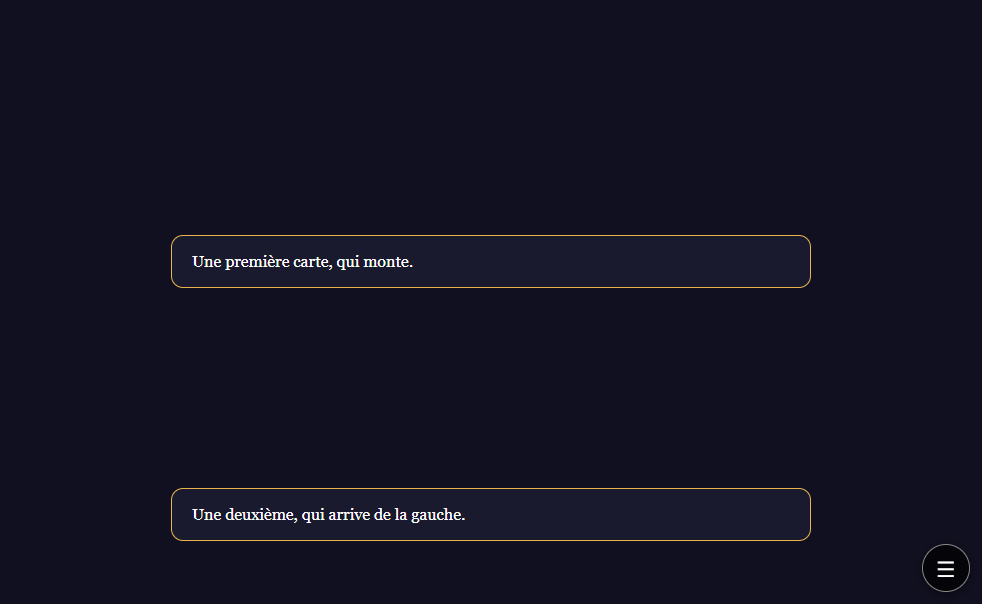

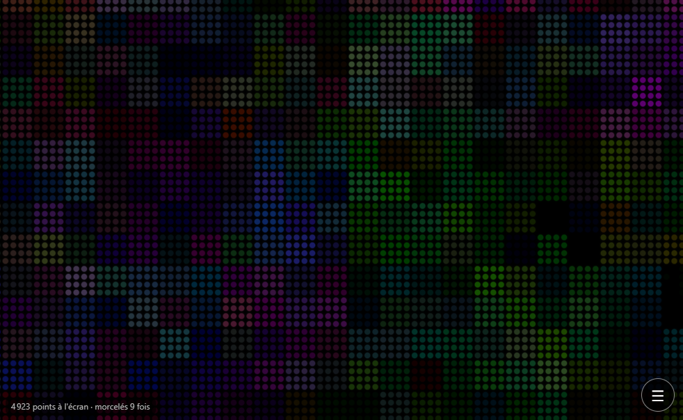

**Erreurs en route**

- Pendant que je construisais ce lot, une autre session (dans le cloud) a fusionné dix-neuf PR, dont le passage de tout le code en anglais (`ADR-060`) et une décision qui prenait déjà le numéro `ADR-048`. Ma première PR (137) ne pouvait plus fusionner : j'ai repris le lot sur le nouveau code, sous le numéro `ADR-061`, avec les leçons 77 à 81 (70 à 76 étaient prises). Je n'avais pas regardé `main` avant de commencer : désormais, je le relis avant chaque lot.
- J'avais écrit le volume en pourcentage (`volume: 40%`) : le langage n'accepte pas `%` dans un paramètre de bloc. Choisi plutôt de 0 à 1, comme l'opacité.
- Mon premier essai attendait qu'une seule carte entre ; en centrant la première, la deuxième était aussi à l'écran, et elle est entrée elle aussi, comme il se doit : l'erreur était dans mon test.
- La construction du moteur web est lente sur ce PC (jusqu'à seize minutes) ; le script `build.ps1`, lancé avec ses messages redirigés, s'arrête sur les messages de cargo : j'ai lancé les mêmes étapes à la main.

---

## 2026-10-07 — Tout le code du moteur passe en anglais

- Yocthan : « le code doit être 100 % en anglais, bien sûr. […] le commentaire, tu le mets en français pour que je comprenne ». Puis : « Oui, fais comme je le dis. »
- Fait (`ADR-060`) : environ 1 500 noms traduits dans le moteur Rust, les scripts du navigateur, le serveur d'essai, les outils et l'extension VS Code ; les fichiers sources renommés (`etat.rs` → `state.rs`, `page-moteur.js` → `page-engine.js`…) ; les attributs, classes et variables CSS du moteur ; les commandes (`holo test`, `holo files`, `holo vocabulary`) et les paramètres d'adresse (`?values`, `/editor?key=`, `/stack`). Les commentaires, les messages d'erreur, les textes de l'interface, les leçons et la documentation restent en français.
- Comment : un outil a relevé chaque identifiant hors commentaires et textes ; la table de traduction a été écrite à la main ; le compilateur Rust a signalé les `{nom}` restés dans les messages ; puis chaque page a été rouverte dans Chrome.
- Raté puis corrigé : deux pages HTML dupliquées par l'outil (positions non triées) ; `move` est un mot réservé de Rust (`translate`) ; des noms importés du wasm mis en camelCase ; `history` qui masquait `window.history` dans la pile ; l'audit qui cherchait `axis` au lieu d'`axe`.
- Vérifié : 123 tests ; les deux paquets wasm ; dans Chrome, le monde d'accueil, neuf leçons, le site de référence, l'éditeur et la pile ; l'audit axe-core, 76 leçons et le site de référence, 0 défaut.

---

## 2026-10-07 — Un serveur et des comptes, proposés

- Yocthan demande si les langages issus de JavaScript passent par Node.js pour le serveur et les comptes. Réponse : oui, presque toujours, avec deux programmes à garder d'accord.
- Écrit, en proposition : `proposals/Claude/serveur-et-comptes-2026-10-07.md`. Un serveur en Rust (`holo serve`) qui fait tourner le même arbitre que la page ; puis des valeurs partagées, des comptes sans mot de passe (clés d'accès), le direct à plusieurs. Quatre questions attendent Yocthan ; rien n'est construit.

---

## 2026-10-07 — Envoyer un fichier

- Yocthan : « L'envoi d'un fichier […] travaille aussi sur ça. »
- Fait (`ADR-059`) : `Input(type: file, value: photo, label: "…", accept: image, max: 2MB)` dans un `Form`. La valeur est le nom du fichier choisi. La page refuse tout de suite un fichier d'une autre sorte ou trop lourd ; le serveur demande au moteur ce que la page permet (`holo fichiers`), lit la sorte dans les premiers octets, et range le fichier dans `messages/fichiers/` sous un nom tiré au hasard.
- Corrigé au passage : dans un formulaire, l'étiquette d'un champ était sur la même ligne que lui (la leçon 64 aussi) ; elle est maintenant au-dessus, comme hors d'un formulaire.
- Vérifié : tous les tests du moteur ; dans Chrome, un fichier texte et une image de 2,1 Mo refusés, une vraie image envoyée et rangée ; au serveur, sans la page : faux PNG 415, trop lourd 413, champ inconnu 400, chemin dans le nom ignoré ; l'audit axe-core, 76 leçons et le site de référence, 0 défaut.

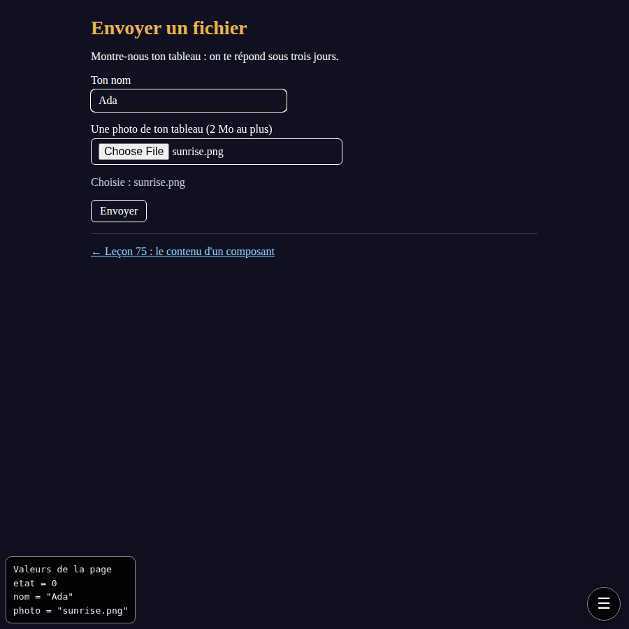

---

## 2026-10-07 — Un emplacement pour du contenu dans un composant

- Yocthan : « un emplacement pour contenu dans un composant. Oui […] dans Flutter, il y avait children […] et child ».
- Choisi : un seul mot, `children`, comme partout dans HoloCode ; `child` est refusé avec le bon mot.
- Fait (`ADR-058`) : `params: [title, children]` ; le mot `children` posé seul dans une liste du composant ; `Panel(title: "…", children: [ … ])` à l'appel. Le contenu est déplié chez la page, puis posé dans la copie sans être renommé. Une carte peut contenir une carte.
- Vérifié : tous les tests du moteur (sept refus) ; la leçon 75 et son essai écrit ; dans Chrome avec `?valeurs` (le bouton posé dans l'encadré change la valeur de la page) ; l'audit axe-core, 75 pages, 0 défaut.

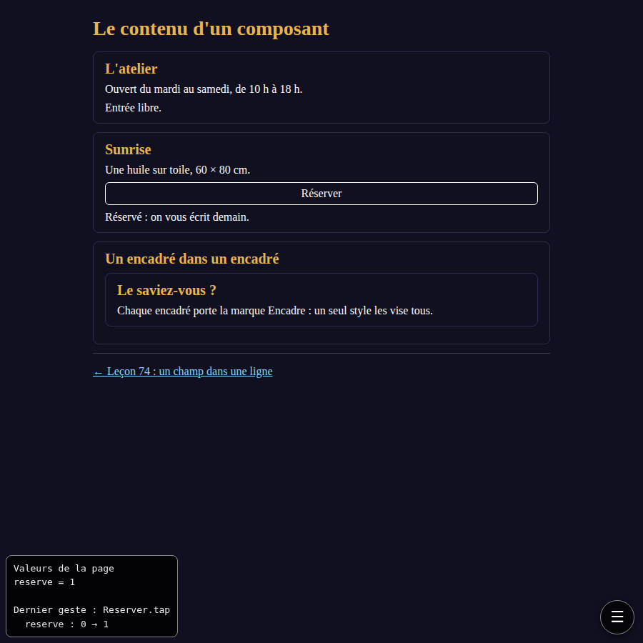

---

## 2026-10-07 — Un champ dans une ligne, et des lignes qui restent en place

- Yocthan : « travaille sur une condition sur un champ dans une ligne des listes. Les clés stables des listes, ok. »
- Fait (`ADR-057`) : `If(item.done, is: 1, children:, else:)` dans les lignes d'un `Repeat(over:)` (nombre : `is`, `not`, `over`, `under` ; texte : `is`, `not`) ; `item.done.set(1)`, `item.likes.add(1)` dans les règles de la ligne ; chaque ligne porte une clé tirée de son contenu, et la page ne remplace que les lignes nouvelles ou changées.
- Raté puis corrigé : la première version comparait le HTML du moment ; un pli ouvert y ajoute `open`, et la ligne était refaite. La page compare maintenant au HTML que le moteur avait fabriqué.
- Vérifié : tous les tests du moteur ; la leçon 74 et son essai écrit ; dans Chrome, le pli ouvert de la première tâche reste ouvert (le même nœud) quand on change la deuxième ; l'audit axe-core, 74 pages, 0 défaut, en clair et en sombre sur téléphone.

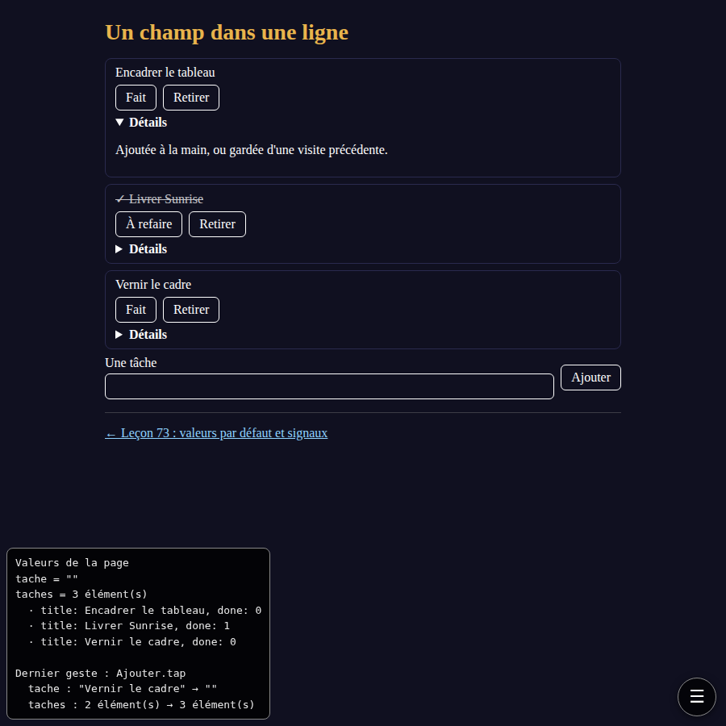

---

## 2026-10-07 — Le planning de la 3D, proposé

- Écrit : `docs/04-roadmap/PLAN-3D.md`, en proposition. Douze étapes, de la profondeur à la chaise mesurée sur le Flip 3, puis les mots du langage choisis après la chaise ; environ 15 séances. Une contrainte dite d'emblée : sans carte graphique dans le nuage, Claude ne voit pas l'image ; l'étape 0 essaie de lever cette limite.

---

## 2026-10-07 — `Component`, des valeurs par défaut, des signaux branchés par la page

- Yocthan : les propositions de Gemini et Codex validées ; « on doit prendre Component, vu qu'on aura besoin de Part pour la 3D » ; et pour l'essai au TalkBack : « c'est déjà bon » (noté tel quel ; aucun tableau de résultats n'a été rendu).
- Fait (`ADR-056`) : `Component` et `components:` remplacent `Part` et `parts:` (l'ancienne écriture est refusée avec le bon mot) ; `params: [title, price: 0, image: "…"]` ; `emits: [add]`, `On(Add.tap, emit: add)`, et `onAdd: cart.add(1)` à l'appel ; le panneau `?valeurs` montre le dernier geste et ce qu'il a changé.
- Migrés : les leçons 25 et 70, `exemples/site/commun.holo`, `site-reference/commun.holo` et `pied.holo`, le guide, `NOMS.md`, le serveur et l'audit d'accessibilité. Leçon 73 et son essai écrit.
- Vérifié : tous les tests du moteur ; la leçon 73 dans Chrome avec `?valeurs` (« Dernier geste : AddGift.tap ; cart : 12000 → 13000 ; likes : 0 → 1 »).

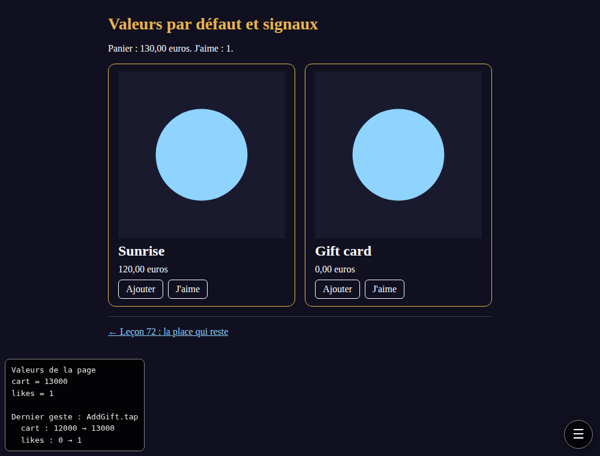

---

## 2026-10-07 — Une idée gardée au chaud : le langage, le socle et le framework

- Yocthan demande s'il faudra séparer HoloCode en un langage et un framework, comme Dart et Flutter, et si les blocs de base doivent devenir des composants (réponse : non, ce sont les briques des composants).
- Claude propose trois couches : le langage (la grammaire), le socle (les blocs du moteur, avec leurs garanties) et un framework de composants écrits en HoloCode. Yocthan : à garder au chaud, sans en faire une proposition ni un essai ; on continue ce qui est en cours.
- Rangé : `proposals/Claude/idees/langage-socle-framework-2026-10-07.md`.

---

## 2026-10-06 — Gemini répond sur les composants ; les chiffres d'opinion corrigés

- Gemini a répondu (`docs/05-discussions/reponses/2026-10-06-gemini-composants-et-comparatif.md`), sur l'état du matin : sa « combinaison gagnante » pour le restylage (variables et classe à l'appel) est celle qui était construite ; il propose en plus des valeurs par défaut, des signaux émis (`emits`, `onAdd:`), des noms internes privés, et `Component` plutôt que `Part`. Il jugeait le moteur léger et le fichier de styles prématurés : déjà faits, rien à défaire. Son tableau : HoloCode 68,5 %, Svelte 83 %.
- Le comparatif corrigé avec les pages officielles de Stack Overflow 2026 lues par Codex : en 2025, Phoenix était le framework le plus admiré, pas Svelte (mon erreur) ; les chiffres de State of JS restent non vérifiés. Ajouté : les trois tableaux côte à côte (§ 11).

---

## 2026-10-06 — L'accessibilité vérifiée ; les six points sont faits

- Point 6 du comparatif. Fait (`ADR-055`) : axe-core passé sur toutes les leçons et tous les sites d'exemple, dans Chrome. Avant : 69 leçons sur 70 sans défaut ; trois défauts de contraste (le badge de la boutique, la pastille de la leçon 38, les liens de la leçon 52 en thème clair) et la page des mondes (zoom interdit, ni repère ni titre). Tout est corrigé : **0 défaut sur 72 pages**, en thème clair et sombre, à 1000 et 390 pixels.
- Le moteur refuse maintenant un texte trop peu contrasté quand le même style donne les deux couleurs (4,5 pour 1, ou 3 pour 1 en grand). Il a trouvé les deux badges ; il ne pouvait pas voir les liens de la leçon 52 (deux styles différents) : c'est l'audit qui les a trouvés.
- Écrits : `moteur/outils/accessibilite.mjs` (l'audit) ; `docs/01-holocode/ESSAI-LECTEUR-D-ECRAN.md` (le protocole de l'essai humain, au TalkBack, à faire par Yocthan).
- Le comparatif est mis à jour (§ 10) : HoloCode passe de **70 % à 78,5 %** pour son public, selon Claude (Svelte 82 %).

**Erreurs en route**

- Mon contrôle de contraste lisait la valeur claire d'une variable redéfinie dans le thème sombre : faux refus de l'exemple du guide. Corrigé.
- En arrêtant le serveur d'essai, ma commande a encore arrêté le terminal qui la lançait.

---

## 2026-10-06 — Les outils de l'auteur

- Point 5 du comparatif. Fait (`ADR-054`) : `?valeurs` dans l'adresse montre les valeurs de la page à chaque geste ; `holo fmt` remet un fichier en forme (seuls les blancs changent) ; `holo essai page.holo page.essai` joue des gestes écrits et vérifie les valeurs (`tap`, `signal`, `type`, `receive`, `expect`).
- Trois essais écrits pour les leçons 68, 70 et 71, joués par les tests du moteur.
- `holo fmt` passé sur 74 fichiers d'exemples : 72 déjà en forme ; deux remis en forme, dont les lignes étaient vraiment mal alignées (`site-reference/commun.holo`, `pied.holo`).
- Vérifié : 117 tests ; le panneau dans Chrome sur les leçons 70 (`cart = 18000` après deux clics) et 71 (les trois articles et leurs champs).

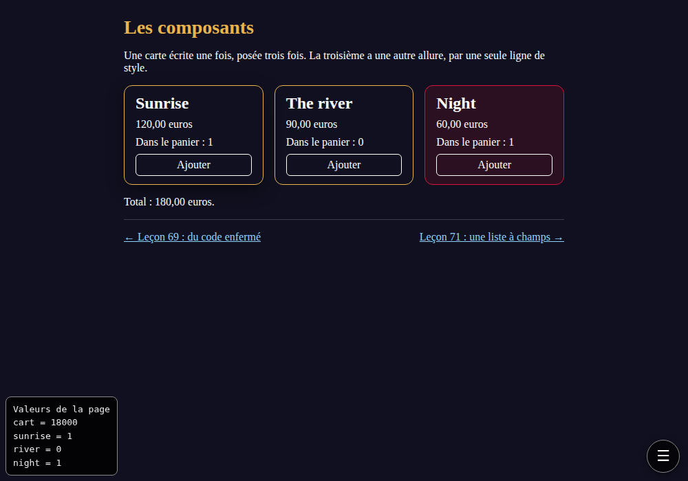

**Erreurs en route**

- La première mise en forme comptait un niveau par parenthèse ; les leçons en comptent un par ligne (`Row(children: [` ne décale que de deux espaces) : refaite.
- Elle déplaçait aussi des commentaires que l'auteur de la boutique avait alignés exprès : un commentaire seul, aligné plus loin, garde maintenant sa place.

---

## 2026-10-06 — Codex relit les composants ; deux styles importés ne se gênent plus en silence

- Codex a répondu au prompt sur les composants (PR 124, `proposals/GPT5.6/web-assez-utilisable-2026-10-07/`). Il constate que les composants à paramètres existaient déjà, refait le tableau (HoloCode à **74,6 %** pour son public, Svelte 85,4 %), et relève un défaut : les noms de style d'un fichier importé valent pour toute la page, et deux fichiers qui écrivent le même style se gênaient, le premier gagnant en silence.
- Corrigé (`ADR-050`, correction du jour) : deux fichiers importés qui écrivent le même style sont refusés, avec leurs deux noms. Les noms de style importés restent partagés avec la page, parce que le site de référence s'en sert comme d'un thème commun ; un composant qui ne veut rien partager se style par son nom.
- Vérifié : 115 tests ; toutes les pages de `exemples/site/` et `exemples/site-reference/` passent `holo check`.

---

## 2026-10-06 — Un moteur léger, le dessin à part

- Point 4 du comparatif. Fait (`ADR-053`) : une option de compilation `dessin` ; sans elle, le moteur léger lit, fabrique la page et arbitre, sans `wgpu`. La page prend le léger (`/pkg-leger/`) et ne fait venir le dessin (`/pkg/`) que si elle montre des points ou des mondes. L'éditeur prend le léger.
- Mesuré : moteur entier 626 Ko transférés, **moteur léger 149 Ko**, quatre fois moins. **L'objectif de 100 Ko n'est pas atteint** : ce qui reste est le cœur (lecture, vérifications et leurs messages, page, arbitre).
- Vérifié dans Chrome sans fenêtre : la leçon 70 ne télécharge que le moteur léger, ses boutons comptent (deux « Night » : 120,00 euros) ; la leçon 9, zoomée à la molette avec Ctrl, fait venir le dessin et passe en vue points.

**Limites et erreurs**

- Dans le nuage, Chrome n'a pas de carte graphique : le dessin des points n'a pas pu être regardé (« ni WebGPU ni WebGL 2 ne sont utilisables »). À vérifier sur le PC et le téléphone de Yocthan.
- En relançant le serveur d'essai, ma commande d'arrêt a aussi arrêté le terminal qui la lançait : relancé à part.

---

## 2026-10-06 — La place qui reste, et un thème partagé

- Point 3 du comparatif. Fait (`ADR-052`) : `grow:` sur un bloc rangé dans `Row` ou `Column` (comme `Expanded` en Flutter, de 1 à 12 parts) ; un fichier qui ne contient que des styles s'importe comme un thème (`import "theme.holo"`). Les noms de style multiples étaient déjà là avec les composants.
- Leçon 72 (`72-place-et-theme.holo`, avec son thème `72-theme.holo`) ; guide § 4 bis et § 5.
- Vérifié : 114 tests ; la leçon 72 dans Chrome, sur PC et en largeur de téléphone (390 pixels).

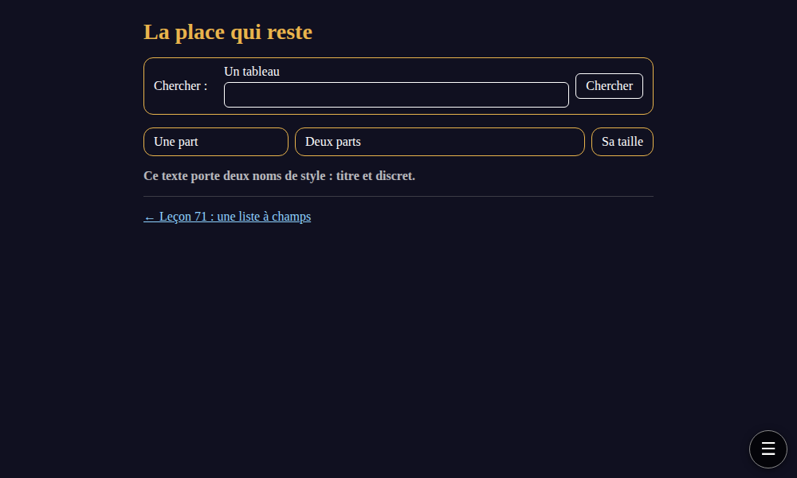

**Erreurs en route**

- La pull request des listes à champs (122) est d'abord tombée en rouge sur GitHub : j'avais écrit l'exemple du guide après avoir lancé les tests, et il commençait par un `H2` sans `H1`. Corrigé, puis fusionnée au vert. Leçon retenue : relancer les tests après chaque retouche du guide.
- Le champ qui grandit restait à 280 pixels : une règle CSS du champ passait devant la mienne. Corrigé.
- Le moteur vérifiait les réglages d'un champ de saisie avant de voir `grow:`, et le refusait. Corrigé.

---

## 2026-10-06 — Les listes à champs, aussi reçues du serveur

- Point 2 du comparatif, avec le feu vert de Yocthan. Fait (`ADR-051`) : `State(articles: [ Item(title: "Sunrise", price: 12000) ])`, `{item.title}` et `{item.price:cents}` dans les lignes, `articles.push(Item(title: name, price: price))`, et `Data` qui remplit une liste depuis un tableau JSON (objets ou textes).
- Leçon 71 (`exemples/lecons/71-liste-a-champs.holo` et son `71-catalogue.json`) ; guide § 6 septendecies.
- Vérifié : 113 tests (dont un texte saisi `<Night>` qui reste du texte, un champ « secret » envoyé par le serveur qui n'apparaît pas, une image en `javascript:` refusée) ; la leçon 71 dans Chrome : trois articles arrivés du fichier JSON, « Retirer » en enlève un, « Forest » à 9500 centimes s'ajoute et se montre « 95,00 euros ».

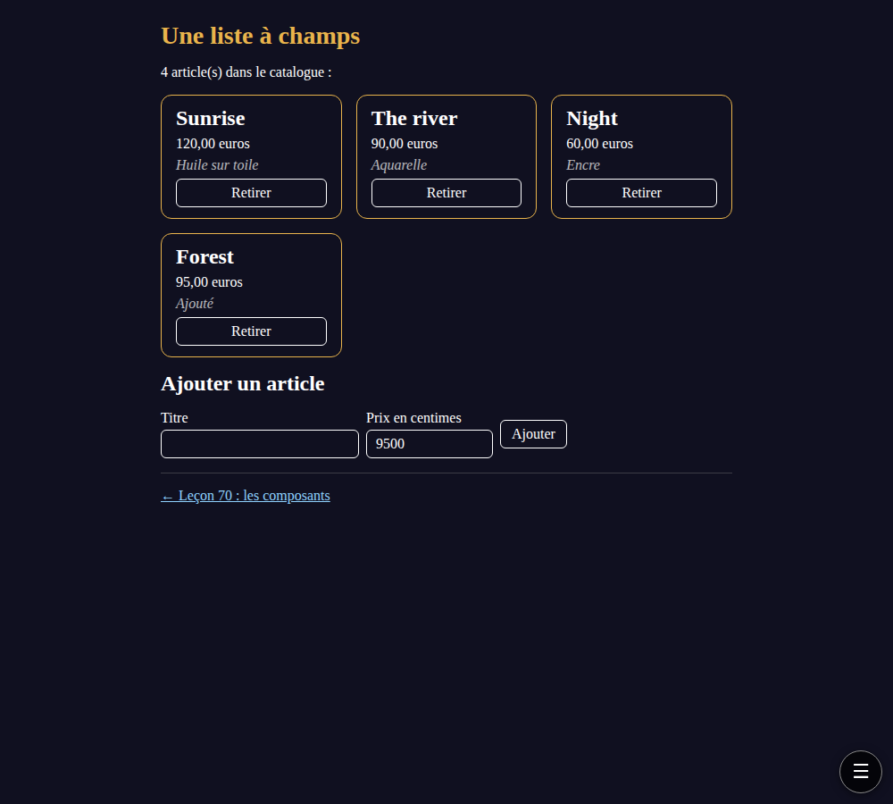

**Erreur en route**

- Le moteur refusait un `Item` hors d'une répétition (`ADR-040`) : il est maintenant permis dans `State` et dans une demande `push`.

---

## 2026-10-06 — Les composants, faits pour le web

- Yocthan : « J'aime le composant. C'est une notion de Flutter que j'adore […] il faudra des composants faits vraiment pour le web […] grâce au CSS, tu vas l'utiliser facilement » ; puis le feu vert pour les six points du comparatif.
- Fait (`ADR-050`) : un composant s'écrit une fois, `Part(name: ArticleCard, params: [title, price, qty], children: [ … ], rules: [ … ])`, dans `parts:` de la page ou dans un fichier importé ; il se pose comme un bloc, `ArticleCard(name: Sunrise, title: "Sunrise", price: 12000, qty: sunrise)` ; il se restyle de l'extérieur : `ArticleCard { … }` pour toutes les copies, `ArticleCard.promo(…)` et `.promo { … }` pour une seule, et ses variables (`.promo { --accent: crimson; }`). Un paramètre donné par le nom d'une valeur de la page la suit : c'est ainsi que le bouton d'une carte remplit le panier. Plusieurs noms de style par bloc (`P.card.big`), quatre au plus.
- Comme `Use` et `Repeat`, un composant est déplié à la lecture : le reste du moteur n'a pas changé. Un composant peut être répété (`Repeat(… children: [ ArticleCard(title: item.title, …) ])`) ; ses règles vont alors dans la répétition.
- Leçon 70 (`exemples/lecons/70-composants.holo`) ; guide § 6 sexies bis ; `NOMS.md`.
- Vérifié : 110 tests ; la leçon 70 dans Chrome sans fenêtre, sur le moteur compilé dans le nuage : trois cartes, la troisième rouge, deux clics sur « Night » et un sur « Sunrise » donnent 240,00 euros.

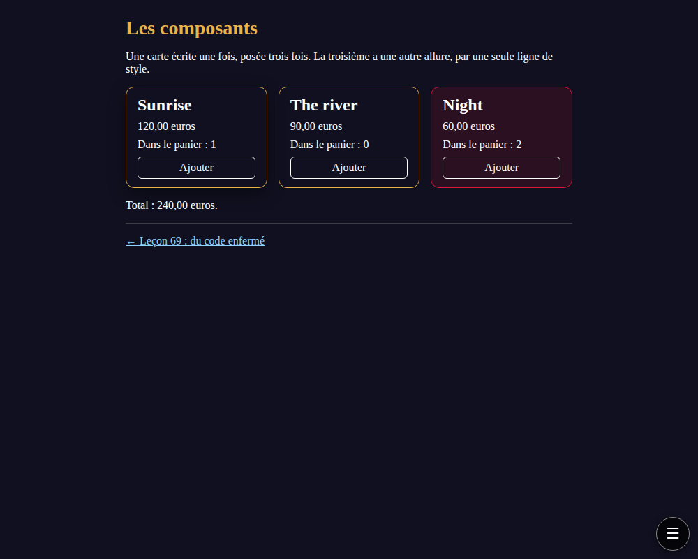

**Erreurs en route**

- Les règles d'un composant posé dans une répétition partaient dans la page, où `item` n'existe pas : elles vont maintenant dans la répétition.
- Un composant dont la racine est un autre composant n'était pas déplié : corrigé, avec le refus d'un composant qui se pose lui-même.
- Le premier essai dans Chrome cliquait trop vite : le moteur se charge au premier geste (`ADR-033`) ; avec une attente, les clics comptent.

---

## 2026-10-06 — HoloCode face aux langages et frameworks du web

- Yocthan, avant la 3D : comparer HoloCode « avec les meilleurs langages et frameworks web, en commençant par TypeScript et en terminant par Flutter », par pourcentage, avec l'avis des gens et celui de Claude, et dire pourquoi certaines notions ne sont pas reprises.
- Écrit : `docs/01-holocode/COMPARATIF-LANGAGES-WEB.md`. Neuf retenus : TypeScript, React, Angular, Vue, Svelte, SolidJS, Astro, Elm, Flutter. La même liste de tâches écrite dans les dix (HoloCode : 22 lignes, aucun code, rien à installer ; Svelte : 15 ; Flutter : 38 ; Elm : 50). Les avis des enquêtes (Stack Overflow 2025, State of JS 2025). Une note par critère.
- Résultat, selon Claude : HoloCode à **70 %** pour son public (Svelte 82 %, Vue 77 %, React 71 %, Flutter 70 %), **58 %** pour un développeur professionnel. Premier sur la facilité, la concision et l'accessibilité ; dernier sur les composants (un `Part` n'a pas de paramètres), ce qu'on peut construire, les outils et l'entraide.
- Yocthan, le même jour : les composants sont sa notion préférée de Flutter ; il les veut « faits pour le web », réutilisables deux fois avec une autre allure grâce au CSS ; puis les points 2 à 6. Avant de continuer, deux prompts : `docs/05-discussions/prompts/2026-10-06-gemini-composants-et-comparatif.md` et `2026-10-06-codex-composants-et-comparatif.md` (composants, même tableau rempli par eux, reste du plan).
- Proposé avant la 3D : des morceaux à paramètres, des listes à champs, la disposition qui manque, un moteur allégé pour les pages qui bougent, des outils, un essai au lecteur d'écran ; environ 81 % avec ces six points. Rien n'est décidé.

**Limites**

- Les chiffres des enquêtes viennent d'extraits de recherche : les pages de Stack Overflow et de State of JS étaient bloquées depuis la session. Stack Overflow 2026, sortie le jour même, n'a pas pu être lue.
- Les notes sont le jugement de Claude, qui juge son propre travail ; le nombre de lignes est la seule mesure.

---

## 2026-10-06 — La veille sur la 3D, et les décisions prises

- Yocthan : « vérifier ce que pensent les humains en 2026, exactement le 6 octobre […] et enfin tu mets décision prise ».
- Veille faite sur Internet (`docs/05-discussions/veille/2026-10-06-3d-web-et-mobile.md`) : WebGPU actif par défaut dans Chrome Android et Safari 26, pas dans Firefox Android ; tout le monde garde WebGL 2 ; sur certains Android, WebGPU est plus lent que WebGL 2 ; sur iPhone, des pages plantent dès 100 à 200 Mo ; la qualité adaptative est une pratique courante ; `KHR_gaussian_splatting` est ratifié ; glTF 2.1 est annoncé ; le mot « métavers » est mal vu depuis la fermeture d'Horizon Worlds en réalité virtuelle.
- Décisions écrites : **`ADR-048`** (HoloCode décrit une qualité, jamais une technique) et **`ADR-049`** (objets préparés à l'avance, paliers qui bougent pendant la visite, WebGL 2 obligatoire, chemin de base sans calcul général, Khronos PBR Neutral, meshoptimizer), acceptées. Le chantier attend le feu vert de Yocthan.

**Limites**

- Reddit, Poly Haven et plusieurs forums n'ont pas pu être lus directement : ce qui en vient est tiré d'extraits de recherche. Peu de discussions d'août à octobre 2026 trouvées. Le nombre de triangles de la chaise reste à confirmer.

---

## 2026-10-06 — La 3D réaliste : deux prompts avant de construire

- Yocthan veut commencer la 3D, « ultra réaliste si possible », mais sans faire exploser les machines : commencer bas, croître petit à petit, et s'aider d'extensions s'il le faut. Il demande l'avis de Codex et de Gemini avant la première ligne.
- Direction proposée par Claude, dans la discussion : abandonner les points pour les objets proches (sans profondeur, jamais réalistes) ; des modèles préparés à l'avance sur PC (la voie D de Codex), avec niveaux de détail et lumière précalculée ; des paliers de qualité automatiques (léger, normal, haut) ; le réalisme par la lumière et les matériaux. Premier essai envisagé : une chaise, en points et en objet plein, sur le Flip 3. Rien n'est décidé ni construit.
- Écrits : `docs/05-discussions/prompts/2026-10-06-gemini-3d-realiste.md` (sans accès au dépôt, tout le contexte dedans) et `2026-10-06-codex-3d-realiste.md` (réponse attendue par PR dans `proposals/GPT5.6/`). Les extensions y sont cadrées par `ADR-011` : pas de pont JavaScript, modules enfermés acceptés.
- Gemini a répondu le même jour (`docs/05-discussions/reponses/2026-10-06-gemini-3d-realiste.md`, lecture critique de Claude à la fin) : « oui, à condition de tout préparer hors ligne ». À vérifier avant d'y croire : l'onglet qui serait abattu à 350–450 Mo sur un téléphone d'entrée de gamme (ce qui remettrait en cause le 1 Go d'`ADR-005`), et le coût réel de KTX2. Codex a répondu par la PR 118 (`proposals/GPT5.6/3d-realiste-evolutive-2026-10-06/`), et ChatGPT a relu Gemini (`docs/05-discussions/reponses/2026-10-06-chatgpt-sur-gemini-3d-realiste.md`). Les trois disent : possible, sans revoir la vision. Synthèse de Claude, avec ce que Yocthan a à décider (`ADR-048` le principe, `ADR-049` la direction, puis le premier chantier) : `proposals/Claude/3d-realiste-2026-10/SYNTHESE.md`.
- Fait depuis une session dans le nuage, sans le PC de Yocthan : rien n'a été lancé ni mesuré.

**Erreur en route**

- Au début de la session, le dépôt `Metaverse` était invisible (Claude n'y avait pas encore accès) ; Claude a d'abord cherché dans les autres dépôts.

---

## 2026-10-06 — La pile : tout voir dans un seul onglet

- Yocthan, à court de batterie, avait fermé des fenêtres : « faire une stack […] qui me permettra de consommer moins de charges […] pour voir tout ce que tu crées ».
- Fait : **la pile**, `http://localhost:8080/pile`. Tout ce qui s'ouvre dans le navigateur (96 pages aujourd'hui : 69 leçons, les sites, les jeux, les jumeaux en HTML, les mondes), le plus récent en haut, rangé par jour, avec une recherche. La page choisie s'ouvre à côté de la liste ; sur un téléphone, à sa place, avec « ← La pile », et elle est arrêtée quand on revient. La date est celle du dernier commit du fichier (celle du disque pour un fichier pas encore versionné). Un morceau (`Part`), qui ne s'ouvre pas seul, se montre dans l'éditeur. « nouveau » marque ce qui a changé depuis la dernière visite.
- Pour montrer une page : `node outils/montrer.mjs /exemples/…`. La pile ouverte l'affiche elle-même, sans nouvel onglet ; s'il n'y en a pas, Chrome s'ouvre une fois, sur la pile. Seul ce PC peut le demander, pas un autre appareil du Wi-Fi. Rien ne tourne tant qu'on ne choisit rien ; la liste est relue quand on revient sur l'onglet.
- Corrigé en passant : l'éditeur ouvrait par défaut une leçon qui n'existe pas (`01-bonjour.holo`) ; c'est `01-page.holo`.
- Vérifié dans Chrome sans fenêtre : la liste (96 liens), la leçon 9 ouverte par l'adresse, puis la leçon 68 montrée par le serveur dans le même onglet ; sur un écran de téléphone, la page à la place de la liste, le retour qui l'arrête, rien qui dépasse de l'écran.

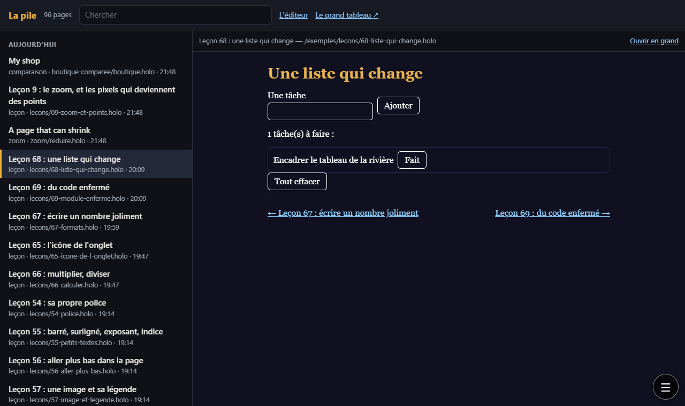

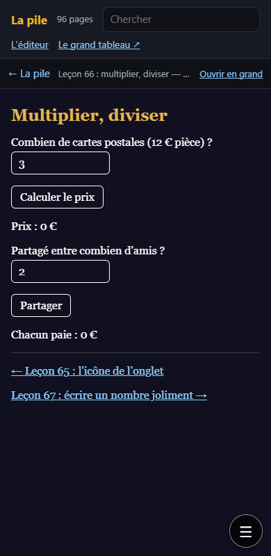

**Erreurs en route**

- Sur un écran de téléphone, la barre au-dessus de la page dépassait de 150 pixels (une colonne de grille qui prenait la largeur de son texte) : corrigé avant la PR.
- Mes essais depuis Git Bash envoyaient `C:/Program Files/Git/exemples/…` au lieu de `/exemples/…` (Git Bash convertit les chemins) : `montrer.mjs` retrouve maintenant le bon chemin.
- En relançant le serveur d'essai, l'ancien tenait encore le port : arrêté à la main.

---

## 2026-10-06 — Les PR de Codex fusionnées ; les quatorze noms tranchés

- Yocthan : « Il y a 14 mots à nommer […] tu fais le pull request des codex […] je suis tes recommandations. »
- Fusionnées, par le script et tests verts : les PR 72 (la contre-revue des noms par Codex), 74 (modèles 3D, arbitre partagé, noms ajoutés) et 79 (le cahier du site de référence). Ce sont des propositions, rangées dans `proposals/GPT5.6/` ; aucune ne change le moteur. Le dossier principal est revenu sur `main`, et le moteur en ligne de commande y est construit (l'extension VS Code s'en sert).
- Rangé : la branche `revert/gemini-v0.1` (et sa copie de travail) supprimée ; les issues #16, #20 et #84 fermées avec un mot d'explication. Il reste une issue ouverte, #82.
- Les noms (`ADR-047`) : douze gardés, deux changés. `Points(grid:)` devient `divisions:` (trois sens pour `grid`, c'était le défaut du CSS) ; `Points(depth:)` devient `levels:` (`depth` reste libre pour la profondeur de la 3D ; « levels » est le mot de Blender). `above` reste : `anchor`, que Codex lui-même jugeait son choix le moins solide, est le nom des liens sur le web. Les anciennes écritures sont refusées avec le bon mot, que l'éditeur remplace d'un clic.
- Les décisions qui attendaient les noms sont acceptées, écriture comprise : `ADR-017`, `019`, `021`, `022`, `023`, `024`, `026`, `028`, `031`.
- Vérifié : 106 tests ; les fichiers `.holo` du dépôt donnent les mêmes 23 refus voulus qu'avant ; `Points(grid: 4)` refusé ligne 3, colonne 18, avec « écris « divisions » » ; la leçon 9 dans Chrome, zoomée : 3 102 points, morcelés deux fois.

**Erreur en route**

- Ma première capture zoomait avant l'arrivée du moteur (il lui faut une dizaine de secondes dans le Chrome de test) : la page restait plate. Refaite en attendant le moteur.

---

## 2026-10-06 — Tout ce qui est construit et essayé est validé ; deux installations

- Yocthan, sur le relevé de ce qui restait : « valide le point 1, 2, j'ai testé et ça marche » ; « tu mets trop de trucs en essai, trop de trucs en attente […] tu valides déjà le tout » ; et, pour la suite, « fais-le et valide ».
- Validé : les lots 6, 7, 8 et l'éditeur (`ADR-043` à `ADR-046` : `ACCEPTÉ`). Le grand tableau compte 311 mots, **tous décidés** ; plus aucune mention « à l'essai » dans le guide, la comparaison, le tableau ou `AGENTS.md`.
- La spécification Python de Codex (`SPECIFICATION-V0.1.md`) est `REMPLACÉE` par le moteur et le guide (« je suis tes recommandations »). Seul HoloIR reste une proposition : rien n'est construit, on en reparlera avec la 3D.
- La règle de décision (`ADR-035`) est choisie : on part du travail à faire de l'auteur (la question de ChatGPT), la majorité des humains sert de vérification ; s'ils se contredisent, Yocthan tranche.
- La recette du site de référence : le verdict de Yocthan est bon (« mon verdict, il est déjà bon ») ; restent cinq débutants à trouver et le téléphone.
- **Installé**, avec l'accord de Yocthan (« Oui, installe ») : Chrome DevTools MCP pour Claude Code (issue #20), à la portée de l'utilisateur, avec `--isolated` (un profil Chrome vide, effacé à la fermeture). Essai minimal, Chrome sans fenêtre : la leçon 1 ouverte, son titre lu, tout fermé, en 10 secondes ; aucun processus resté ouvert. Les outils n'apparaissent qu'au démarrage d'une nouvelle session de Claude Code.
- **Installé** : l'extension VS Code 0.2.0 (la faute soulignée, l'ampoule, les mots proposés). Il faut recharger la fenêtre de VS Code.

**Erreurs en route**

- J'avais laissé à l'essai des lots que Yocthan avait déjà essayés et trouvés bons : c'est à lui de le dire une fois, pas à moi d'attendre une deuxième fois.
- En présentant la règle de décision, j'avais résumé l'option de ChatGPT par « ce qui demande le moins de travail » : c'était faux. Il s'agit du travail que l'auteur veut accomplir, pas de notre travail à nous.

---

## 2026-10-06 — Ce qui reste à faire, revérifié

- Yocthan : « Révérifie et dis-moi ce qui reste à faire… sans brûler tous mes tokens. » Un premier relevé par quinze agents a été arrêté à sa demande ; le relevé a été refait à la main, source par source : les statuts (`DECISIONS.md`), GitHub (pull requests, issues, branches), le dossier principal, les propositions, le grand tableau, les prompts, `AGENTS.md`.
- Trouvé en plus de ce que Claude avait annoncé de mémoire : les issues ouvertes #82 (une exploration des dix pistes de Codex, demandée à Claude, jamais rendue), #84 (la revue de Codex sur les refus, jamais publiée), #20 (installer Chrome DevTools MCP, autorisé par Yocthan le 2026-10-03, jamais fait) et #16 (la revue de Codex du 2026-10-03, dont les points B-01 à B-11 sont traités dans le code) ; quatorze noms contestés par Codex, et non deux ; la branche `revert/gemini-v0.1`, devenue sans objet (les tests de Gemini passent : 8 sur 8) ; le prompt de Codex sur les animations, sans réponse.
- Corrigé : deux phrases périmées d'`AGENTS.md` (les listes, le calcul et le code enfermé « restaient à faire » ; la synthèse des refus « attendait une décision ») et le statut de la synthèse des refus.

**Erreur en route**

- Ma première réponse, de mémoire, comptait deux noms contestés au lieu de quatorze et oubliait les issues ouvertes : c'est pour cela que Yocthan a demandé de revérifier.

---

## 2026-10-06 — L'éditeur : la faute à sa place, la correction d'un clic

- Yocthan, citant la ligne du tableau « Corriger d'un clic — dans l'éditeur ; le moteur reste strict — « Remplacer par H1 » — à faire : il faut un éditeur » : « Travaille sur l'éditeur now ».
- Fait (`ADR-046`, à l'essai) : **l'éditeur du navigateur**, `/editeur`, sur le PC et le téléphone, sans rien installer (le texte en couleurs, la page à côté mise à jour pendant qu'on écrit, la faute soulignée, le bouton « Remplacer « h1 » par « H1 » », les mots à toucher, l'enregistrement avec la clé affichée par le serveur, une sauvegarde de l'ancienne version) ; et **l'extension VS Code 0.2.0** (la faute soulignée avant même d'enregistrer, l'ampoule, les mots proposés). Une seule logique de correction, `moteur/web/corrections.js`. Le moteur donne `verifier_texte` et `vocabulaire` (en ligne de commande : `holo check -`, `holo vocabulaire`).
- Vérifié dans Chrome : « h1 » → « H1 » d'un clic et l'aperçu qui montre « Bonjour » ; « textx » → « text » ; les blocs proposés dans `children: [` ; l'enregistrement avec la clé, refusé sans elle ; les onglets sur un écran de téléphone. L'extension, avec une imitation de VS Code et le vrai moteur : la faute soulignée (ligne 4, « h1 »), l'ampoule et son remplacement, 241 mots proposés. 106 tests.
- L'extension n'est pas encore installée dans le VS Code de Yocthan : c'est une commande, qu'il décide de lancer.

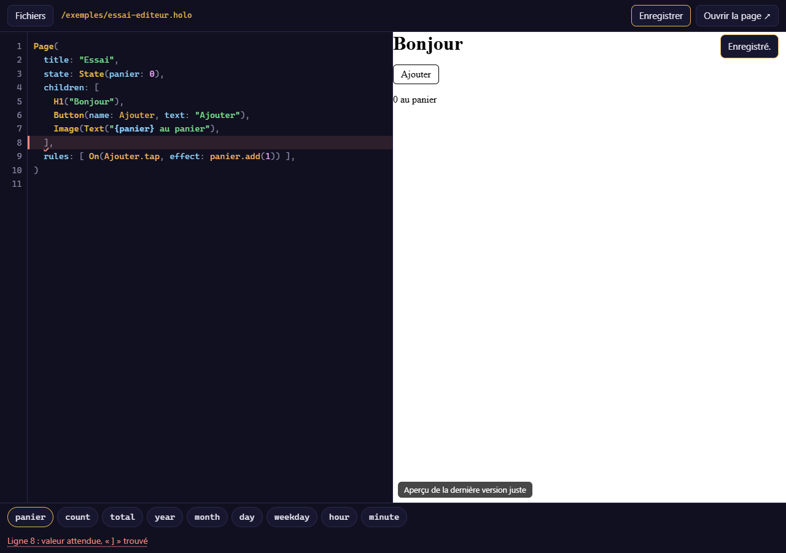

**Erreurs en route**

- Mes premiers essais de l'éditeur agissaient avant l'arrivée du moteur (8 secondes dans le Chrome de test) : fausses alertes, corrigées dans le test.
- Dans une liste `children: [`, l'éditeur proposait d'abord les réglages de la page au lieu des blocs : corrigé (il sait maintenant dans quelle sorte de liste on écrit).
- J'ai voulu réécrire `holo.rs` sans l'avoir relu depuis l'ajout de l'heure : l'outil l'a refusé ; relu, puis écrit.

---

## 2026-10-06 — Lot 8 : le premier module enfermé, et la preuve demandée par Codex

- Fait (`ADR-045`, à l'essai ; construction de `ADR-011`, partie C) : `module "…"` en haut du fichier ; `Module(name:, source:, input:, output:, time:, memory:)` ; `run`, `done`, `failed`. La boîte : un fil à part, une mémoire donnée par le moteur et plafonnée, rien d'autre ; arrêté au-delà de son temps. Les ponts `bridge js` et `bridge css` sont maintenant refusés. Leçon 69, et trois modules d'essai en Rust (`exemples/lecons/modules/`, 68 à 105 octets une fois compilés). Nouveau module du moteur : `modules.rs`.
- La preuve, dans Chrome : `compter` rend 5 050 ; `boucle` est arrêté après 2 000 ms, et la page a compté trois touchers pendant qu'il tournait ; `memoire` demande 64 Mo sous un plafond de 1 Mo et s'arrête. 105 tests.
- Rien n'a été installé : les modules sont compilés avec Rust et la cible WebAssembly déjà présents pour le moteur.

**Erreur en route**

- La pull request du lot 8 a été fusionnée sans `moteur/web/page-moteur.js` : j'avais oublié ce fichier dans la liste à commiter, et le script de fusion l'a signalé (« 1 uncommitted change ») après coup. Sans lui, la boîte du module n'existe pas dans la page. Réparé par une pull request de suite, aussitôt.

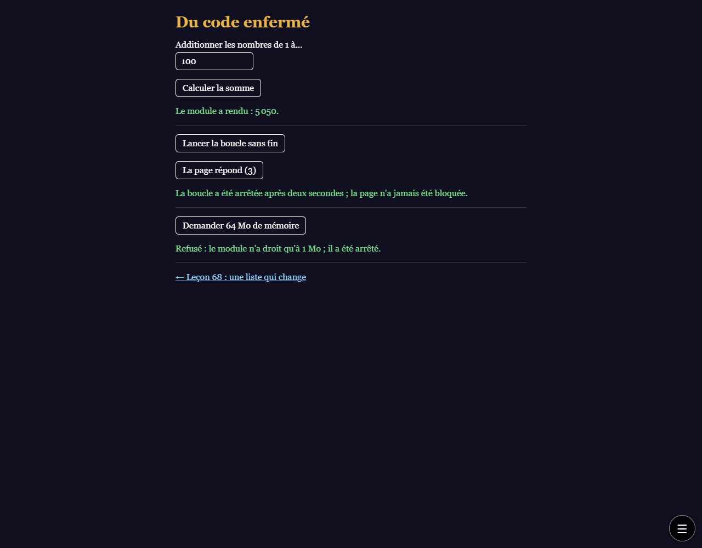

---

## 2026-10-06 — Lot 7 : une liste qui change pendant la visite

- Fait (`ADR-044`, à l'essai) : `State(taches: [])` ; `taches.push(tache)`, `taches.remove(item)` (la ligne touchée), `taches.clear()` ; `tache.set("")` ; `Repeat(over: taches, …)`, une ligne par élément, redessinée par le moteur quand la liste change ; `{taches}` et `If(taches, is: 0)` ; `keep:` garde la liste. Leçon 68. Nouveau module du moteur : `listes.rs`.
- Vérifié dans Chrome : trois ajouts (un texte d'espaces refusé), le champ vidé, la ligne du milieu retirée, « Rien à faire. Bravo ! » après « Tout effacer », la liste retrouvée après avoir rechargé la page. Un texte piégé, `Livrer <b>{tache}</b>`, reste du texte. 104 tests.

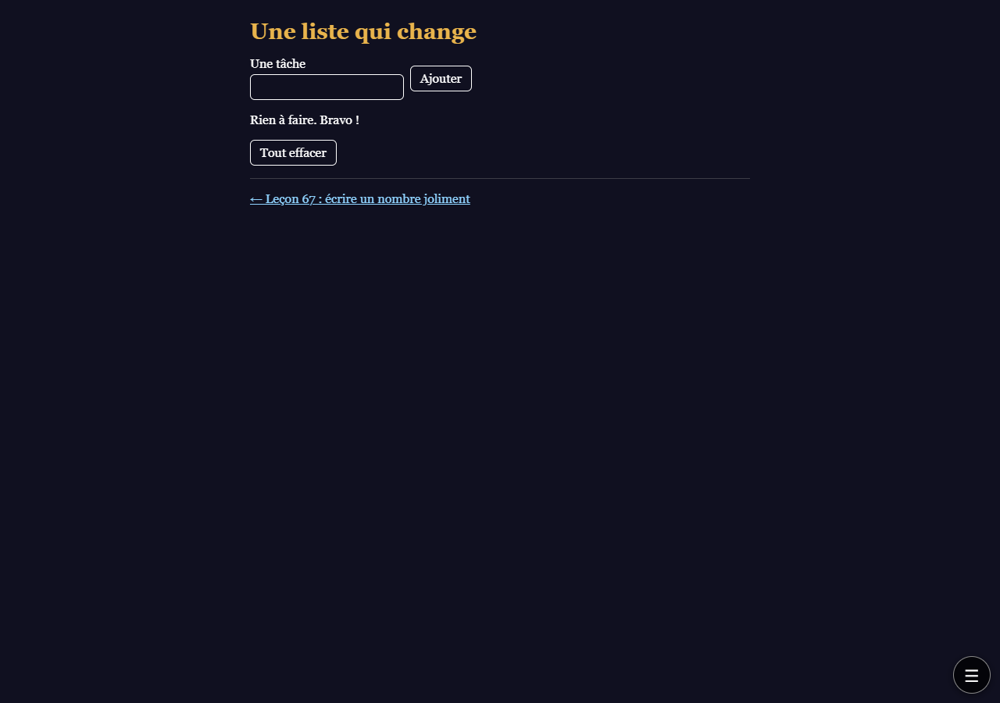

**Erreurs en route**

- Après un rechargement, la liste gardée était bien relue, mais la page fabriquée d'avance montrait encore l'ancienne : le moteur ne redessinait les listes qu'à un changement. Corrigé : il les redessine aussi à son arrivée.
- La leçon écrivait `border-bottom`, que HoloCode n'a pas : le moteur l'a refusé ; remplacé par `border`.
- Deux anciens tests attendaient des messages devenus plus précis (une valeur peut maintenant être une liste ; « a » est un texte) : mis à jour.

---

## 2026-10-06 — Lot 6 : multiplier, diviser, et écrire un nombre joliment

- Yocthan : « Oui, travaille sur ce qui reste. » Fait (`ADR-043`, à l'essai) : les demandes `mul` et `div` ; les formats `{minute:00}`, `{n:number}`, `{n:cents}`, `{weekday:name}`, `{month:name}`, et `{item.price:cents}` dans une répétition ; la langue de la page choisit les séparateurs et les noms. Leçons 66 et 67. Nouveau module du moteur : `format.rs`.
- Vérifié dans Chrome : « Nous sommes mardi 6 octobre 2026, il est 19 h 45. », « Visites : 1 234 567 » puis « 1 236 567 » après deux clics, « 1 234,50 € » ; 3 cartes à 12 € font 36 €, 18 € chacun pour deux. 103 tests.

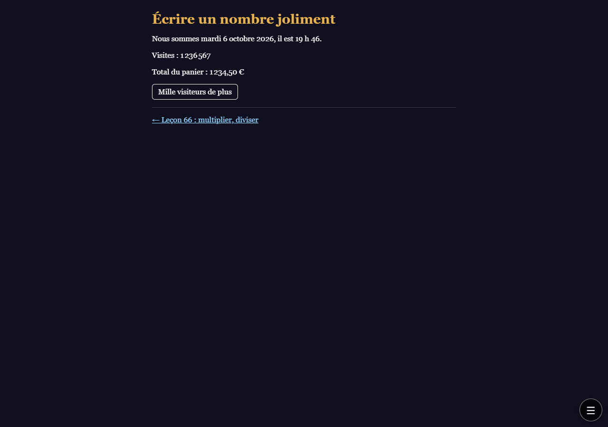

---

## 2026-10-06 — Ce qui restait « à l'essai » ailleurs

- Yocthan : « valide tout ce qui est à laisser [à l'essai] si tu n'as pas encore validé ».
- Recherché dans tout le dépôt. Mis à jour : le statut du moteur (`moteur/README.md`, `ACCEPTÉ`, mesuré à 60 images par seconde sur deux téléphones) ; l'en-tête de l'architecture (`ARCHITECTURE.md`, qui disait encore `EXPÉRIMENTATION` et « sans aucun HTML ») ; les titres « Décision (à l'essai) » des fiches déjà acceptées ; deux mentions dans le README de la boutique.
- **Non validé, exprès** : `docs/01-holocode/SPECIFICATION-V0.1.md`, la proposition en Python de Codex (GPT5.6). Le projet l'a remplacée par le moteur en Rust et le guide ; l'accepter dirait le contraire de ce qui est construit. Recommandation de Claude à Yocthan : la marquer `REMPLACÉ`. Décision attendue.

---

## 2026-10-06 — Les lots 1 à 5 validés

- Yocthan : « En fait, j'ai tout testé de tout ce qui était à laisser [à l'essai] et je trouve que c'est bon. Donc, euh, valide-le. »
- `ADR-038` à `ADR-042` passent en `ACCEPTÉ`. Toutes les fiches sont désormais acceptées, sauf HoloIR (`ADR-011`, partie D, proposition) et les ponts vers JavaScript (partie B, rejetés).
- Le guide, la comparaison, `AGENTS.md` et le grand tableau ne disent plus « à l'essai » : les 290 mots de HoloCode sont décidés. Tableau en ligne republié.
- Erreur trouvée en route : le guide disait encore « à l'essai » pour des écritures déjà validées le matin (`ADR-023` à `ADR-036`) ; corrigé en même temps.

---

## 2026-10-06 — ADR-011 précisée : la vue à plat reste du HTML, partout

- Yocthan a demandé pourquoi on perdrait ce que le web offre gratuitement, puis ce qu'est HoloIR ; après les réponses : « tu valides les différentes parties… A, B, C et D… on fait comme tu l'as dit ».
- Inscrit dans `ADR-011`, partie A : la vue à plat reste du vrai HTML, **même dans le navigateur propre au projet** (la phrase qui disait le contraire est barrée, pas effacée) ; la vue en profondeur recevra un jour une couche invisible pour les lecteurs d'écran. B (rejetée), C (direction acceptée) et D (proposition) ne changent pas.

---

## 2026-10-06 — Lot 5 : le HTML utile, et envoyer un message

- Fait (`ADR-042`, à l'essai) : `Page(icon:)` ; `~~barré~~`, `==surligné==`, `m^2^`, `H~2~O` ; `A(to: "#Horaires")` vers un bloc nommé (refusé s'il n'existe pas) ; `Image(caption:, phone:)` ; `Sound(label:)`, un lecteur ; `Slider` ; `Input(type: date | time | color)` ; `Progress` ; `Details` ; `Dialog` avec `open` et `close` ; `Form` avec `send`, puis `sent` ou `failed`. Leçons 55 à 65.
- L'envoi : décision de Yocthan, sur recommandation, le 2026-10-06 : les messages vont dans un fichier de son serveur local. Le serveur d'essai les range dans `messages/` (un fichier par page, une ligne par message, 16 Ko au plus, jamais versionné).
- Vérifié dans Chrome : les marques du texte ; le lien qui descend sans faire venir le moteur ; l'image légère choisie à 390 pixels de large ; le lecteur de son, à l'arrêt ; la glissière bornée (5 devient 20) ; la date, l'heure et la couleur ; la barre de progression ; les plis, sans moteur ; la fenêtre modale ouverte, puis fermée par « Oui, vider » ; **un vrai message arrivé** : `{"page":"/exemples/lecons/64-formulaire.holo","form":"Contact","values":{"nom":"Yocthan","message":"Bonjour, je voudrais le tableau de la rivière."}}`, et « Merci, ton message est arrivé. » à l'écran ; l'icône dans l'en-tête. 101 tests.
- Le moteur a refusé un exemple que j'écrivais pour le guide : une valeur appelée `day`, nom réservé depuis le lot 2 à l'heure du visiteur. Renommée `visit`.
- Couverture estimée après les cinq lots : HTML 82 %, CSS 78 %, JavaScript 48 % ; ensemble 72 % (53 % avant le lot 2, 47 % avant le lot 1) ; 290 mots, dont 66 à l'essai.

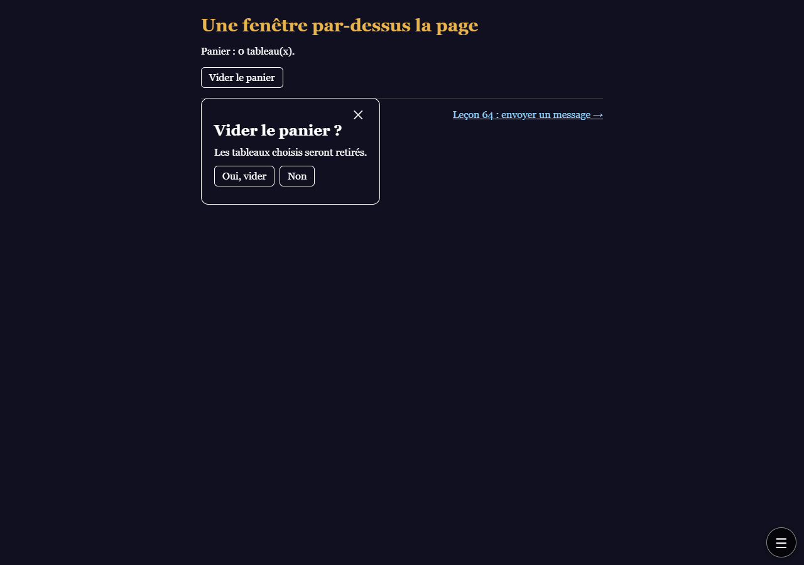

**Erreurs en route**

- La glissière semblait ne pas répondre : mon test lisait le nombre avant l'arrivée du moteur (plus de 9 secondes dans le Chrome de test). Vérifiée ensuite : 100, puis 110, puis 20.

---

## 2026-10-06 — Lot 4 : le CSS utile

- Fait (`ADR-041`, à l'essai) : `line-height` (sans unité), `letter-spacing`, `text-transform`, `text-decoration`, `box-shadow`, `text-shadow`, `rotate`, `scale`, `transition` ; `background` en dégradé ou en image (`url("fond.jpg")`, qui couvre toujours le bloc) ; les variables (`Page { --or: … }`, puis `color: --or;`) ; deux états de style, `dark:` et `phone:` (avec `display: none` seulement là) ; sa propre police, `fonts: [ Font(family:, source:) ]`, toujours affichée avec `font-display: swap`. Leçons 50 à 54. Le serveur sait maintenant servir les polices et les images `.png`, `.jpg`, `.webp`.
- La police de la leçon 54 est Carlito, libre (SIL Open Font License, « Copyright 2013 The Carlito Project Authors », lu dans le fichier lui-même), copiée depuis un paquet déjà présent sur le PC : rien n'a été téléchargé.
- Vérifié dans Chrome, par les styles calculés : majuscules et espacement, interligne, barré ; dégradé, ombre, image qui couvre ; la carte qui se redresse et grandit au survol ; les thèmes clair et sombre ; le bandeau caché sur un écran de 390 pixels ; Carlito chargée. 100 tests.
- Couverture estimée : CSS à 78 % ; ensemble de 56 % à 63 % ; 269 mots.

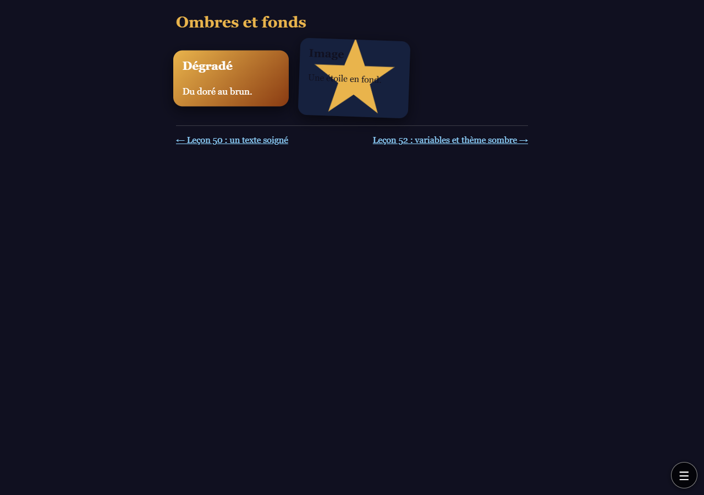

**Erreurs en route**

- Le message de refus de `display` avait perdu la phrase qu'un cas de conformité attend (« la disposition vient des blocs ») : remise.
- Mon premier essai du thème clair montrait le sombre : le Chrome de test suit le thème sombre de Windows. Le thème clair a été forcé pour le vérifier ; la page n'était pas en cause.

---

## 2026-10-06 — Lot 3 : écrire une carte une fois, la répéter

- Fait (`ADR-040`, à l'essai) : `Repeat(items: [ Item(…) ], children: [ … ], rules: [ … ])`. Dans le modèle, `item` désigne l'élément : `{item.title}`, `item.image`, `{item}`, `item.add(1)`. Un bloc nommé reçoit le nom de son élément (`Add` → `AddSunrise`) ; les règles du modèle sont écrites une fois par élément. Déplié à la lecture, comme `Use` : la page fabriquée d'avance est du HTML ordinaire. Leçon 49.
- Vérifié dans Chrome : trois cartes écrites une fois, chacune son bouton ; après trois ajouts, « Panier : 3 tableau(x), 330 € ». 99 tests.
- Couverture : `for, map` à 90 %, `template` à 85 %, les listes de valeurs à 50 % (une liste qui change pendant la visite reste à faire).

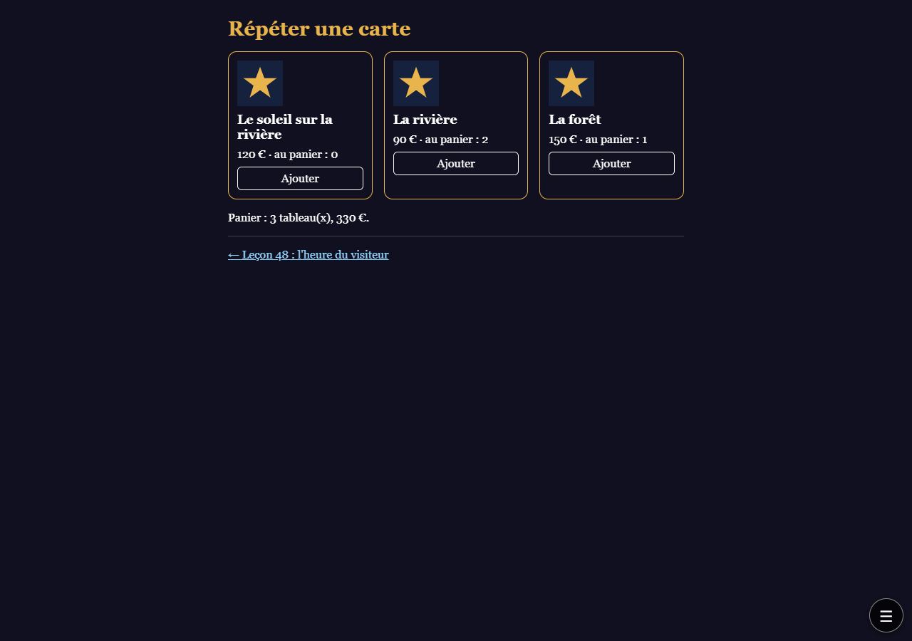

**Erreurs en route**

- Mon test oubliait un `H1` avant les `H2` : le langage l'a refusé, à raison.
- La première vérification dans Chrome cliquait avant l'arrivée du moteur (8 secondes dans le Chrome de test, sans carte graphique) : fausse alerte ; l'arbitre, appelé directement dans la page, répondait juste.

---

## 2026-10-06 — Lot 2 : le survol qui agit, le « sinon », plus tard, l'heure du visiteur

- Yocthan : « tu travailles sur le lot 2 jusqu'au lot 5… je suis tes recommandations. » Le lot 2 est fait (`ADR-039`, à l'essai) ; la page pour écouter ADR-011 est en ligne : https://claude.ai/artifact/28bt9BUqNTg7Bfq1DDm5kc
- Fait : `On(Carte.hover, …)` et `On(Carte.hoverEnd, …)` sur tout bloc nommé qui se voit ; `If(…, else: [ … ])` ; `After(3s, effect: …)`, qui part à l'ouverture ou, sous une condition, quand elle devient vraie ; l'heure du visiteur (`year`, `month`, `day`, `weekday`, `hour`, `minute`), tenue à jour à chaque minute. Leçons 45 à 48. Le serveur donne son heure au moteur (`HOLO_MAINTENANT`) pour la page fabriquée d'avance.
- Le choix du nom : `hover` plutôt que `near` (proposé pour la profondeur), parce que les styles disent déjà `hover:`.
- Contre les défauts du web : le survol est atteignable au clavier (le bloc reçoit le focus avec Tab) et au doigt (toucher survole, toucher ailleurs quitte) ; un survol ne peut pas emmener ailleurs.
- Vérifié dans Chrome : la page légère fait venir le moteur au premier survol, puis le rejoue (souris, clavier, doigt) ; le « sinon » suit le panier ; le bonjour arrive à 2 s et le message s'efface 3 s après l'ajout ; l'heure affichée passe de 18 h 33 à 18 h 34 à la seconde près. 97 tests. Tous les fichiers du dépôt passent, sauf les 23 refus voulus.
- Couverture estimée : ensemble de 53 % à 55 % ; 246 mots (22 à l'essai). Tableau en ligne republié.

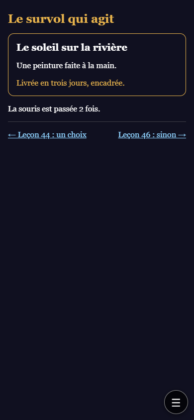

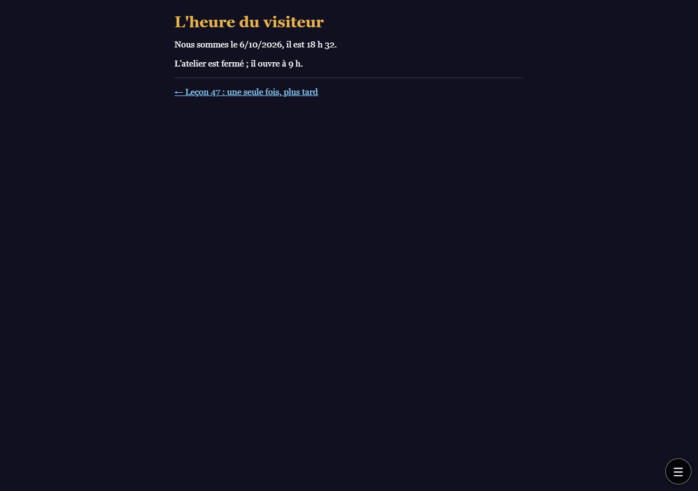

**Erreurs en route**

- Un script de modification passé directement au shell a été mal lu (une apostrophe) : rien n'a été écrit. Les scripts passent désormais par un fichier.
- Mon premier test du survol plaçait la souris à côté de la carte, et celui du « sinon » regardait avant l'arrivée du moteur : deux fausses alertes, corrigées dans le test, pas dans le moteur.
- Le premier Tab sur la page légère réveillait le moteur sans rejouer le survol : corrigé (le focus est noté puis rejoué comme la souris).
- `{minute}` s'affiche sans zéro devant (`18 h 5`) : les formats de date restent à faire.

---

## 2026-10-06 — Les quatre parties d'ADR-011 décidées ; une page pour l'écouter

- Yocthan : « Personnellement, je suis tes recommandations. » A (rendu par vue) : `ACCEPTÉ` ; B (ponts vers JavaScript et CSS) : `REJETÉ`, raison gardée ; C (deux étages, modules enfermés) : `ACCEPTÉ` pour la direction, construction à faire ; D (HoloIR) : reste `PROPOSITION`.
- Il demande aussi d'entendre la fiche à voix haute : une page avec un bouton « Écouter » lit tout le fichier, paragraphe par paragraphe, avec la voix française du navigateur.

---

## 2026-10-06 — ADR-006, 012 et 013 réunies dans ADR-011

- Yocthan : voir ADR-011, 012, 013 et 006 pour savoir ce qu'il y a à décider ; les réunir dans un seul fichier, ADR-011, et supprimer les autres.
- Fait : `docs/02-gouvernance/adr/ADR-011-rendu-par-vue.md` contient tout, sans rien perdre, en quatre parties (A : le rendu par vue ; B : les ponts, ancienne 012 ; C : les deux étages, ancienne 013 ; D : HoloIR, ancienne 006), avec en tête un tableau de ce qu'il y a à décider et la recommandation de Claude : valider A, ne pas construire B, valider la direction de C, laisser D en proposition. Chaque partie garde son statut jusqu'à la décision de Yocthan. Les fichiers 006, 012 et 013 sont supprimés ; le registre pointe vers les parties ; les numéros cités ailleurs restent compréhensibles.

---

## 2026-10-06 — Lot 1 : la langue et le partage, la vidéo, le tableau, le texte long, le choix

- Yocthan : construire tout ce qu'on a décidé d'ajouter. 48 éléments restaient (14 en priorité, 34 utiles) ; ils se construisent par lots. Le lot 1 prend les urgences sans choix d'architecture (`ADR-038`, à l'essai).
- Fait : `Page(lang:, description:, image:)` (repris dans l'en-tête par le serveur) ; `alt` obligatoire sur `Image` (`alt: ""` pour un décor) ; `Video(source:, label:)`, jamais lancée seule ; `Table(caption:, head:, rows:)` ; `Input(…, lines:)` pour un texte long ; `Choice(value:, label:, options:)`, et `menu: true` pour une liste déroulante. Leçons 40 à 44. Une petite vidéo d'essai fabriquée avec ffmpeg, déjà sur le PC (62 Ko).
- Vérifié dans Chrome : la langue, la description et l'image dans l'en-tête ; la vidéo a ses boutons, ne part pas seule, et joue ; le tableau a sa légende, ses titres et ses lignes ; un texte de deux lignes est gardé tel quel ; un bouton rond et une option de liste changent la valeur. 96 tests.
- Couverture estimée : HTML de 52 % à 63 % ; ensemble de 47 % à 53 %. Restent 6 urgences (l'envoi d'un formulaire, les listes et la répétition, le survol comme signal, l'accessibilité fine) et 34 éléments utiles.

**Erreurs en route**

- La page légère ne réveillait pas le moteur quand on cochait un bouton rond ou choisissait une option : elle n'écoutait que les boutons nommés et l'entrée dans un champ. Corrigé.
- En relisant l'état d'une page, le moteur enlevait les retours à la ligne d'un texte long. Corrigé, avec un test.
- Deux fois, le script d'essai de Claude a coupé sa propre sortie au retour à la ligne, et fait croire à une perte de texte.
- Le script de fusion a refusé la première fois : une sonde de Codex (`proposals/GPT5.6/revue-langage-securite-2026-10-03`) avait une image sans `alt`, et le nouveau refus l'arrêtait avant qu'elle teste le poids déclaré. Claude a seulement ajouté `alt: ""` à cette image ; la sonde vérifie toujours la même chose.

---

## 2026-10-06 — Tout ce qui était à l'essai est validé

- Yocthan : « Qu'est-ce que tu attends pour valider tous ceux qui sont à l'essai ? Que tout passe au vert. » Claude attendait son accord : le statut d'une décision est à lui.
- Validées (`ACCEPTÉ`) : `ADR-025` (conditions, texte), `ADR-027` (saisie, valeurs gardées), `ADR-029` (imports), `ADR-030` (données du serveur), `ADR-032` (formes, comparaison de valeurs), `ADR-033` (site léger), `ADR-034` (mouvement), `ADR-035` (une mécanique refusée, jamais une capacité), `ADR-036` (repères, titres, texte qui grandit, états, superposition). Les 224 mots de HoloCode sont tous décidés.
- Laissées telles quelles, et dites à Yocthan : `ADR-011` (le rendu par vue : construit, mais c'est un choix d'architecture), `ADR-012` et `ADR-013` (les ponts vers JavaScript et les modules enfermés : jamais construits), `ADR-006` (une proposition).

---

## 2026-10-06 — Le grand tableau : HoloCode d'abord, avec tous ses mots

- Yocthan : HoloCode doit venir en premier, avant HTML, CSS et JavaScript, et on doit pouvoir voir tous ses mots-clés, comme ceux du web.
- Fait, sur la page en ligne et dans `docs/01-holocode/TABLEAU-WEB.md` : HoloCode en premier dans le filtre de langage, dans les résumés et dans la première colonne ; une partie nouvelle, « Les mots de HoloCode » : **224 mots** en 106 lignes, rangés par sorte (blocs, paramètres, mots-valeurs, signaux, demandes, styles, unités, le fichier), avec ce qu'ils font, leur équivalent sur le web, et leur état (142 décidés, 82 à l'essai, d'après les fiches de décision).
- Erreur de Claude : le premier résumé disait « 106 sortes de mots » ; c'étaient des lignes, dont certaines regroupent plusieurs mots (`H1, H2, H3`). Corrigé : on compte les mots.

---

## 2026-10-06 — L'écriture de Flutter, décidée par Yocthan

- Yocthan : « On peut garder les deux, mais Flutter, c'est la base pour moi. » Claude a signalé que garder les deux ferait deux écritures du même mot, contre l'avis unanime des trois IA, et lui a proposé trois façons ; il a choisi « Flutter seul + correction » (`ADR-037`, accepté).
- Fait : un nom de valeur s'écrit `appleX` (sans `_`), un nom de bloc `AddSunrise`, une place `topRight`. Une ancienne écriture est refusée avec le bon mot, y compris entre accolades dans un texte (`{apple_x}` → « écris `{appleX}` »). Exemples, leçons, guide et moteur convertis. Leçon 39. 95 tests ; tous les fichiers `.holo` du dépôt vérifiés.

---

## 2026-10-06 — Les majuscules : les avis de ChatGPT et Gemini ; plus rien d'avalé en silence

- Réponses et synthèse : `docs/05-discussions/reponses/2026-10-06-majuscules-et-casse.md`. ChatGPT, Gemini et Claude s'accordent : respecter la casse, refuser une faute avec le bon mot, corriger d'un clic dans un éditeur, garder `KB`. **Seul désaccord** : joindre deux mots par `_` (Gemini : plus facile sur un téléphone) ou en camelCase (ChatGPT). Claude penche pour `_`. À Yocthan de trancher.
- **Corrigé tout de suite**, puisque les trois avis étaient d'accord : chaque bloc a la liste de ses paramètres, et un paramètre inconnu ou mal écrit est refusé (`Page(Title: …)` → « écris `title` ») ; un nom de bloc doit commencer par une majuscule (`name: buy` → « écris `name: Buy` ») ; `x`/`y` hors d'un plateau et `align` hors d'un `Stack` sont refusés avec la phrase qui dit où les mettre. 95 tests du moteur ; les 79 fichiers `.holo` du dépôt vérifiés : seuls échouent ceux qui doivent échouer (pages piégées exprès, anciennes propositions en français, dont une qui écrivait `titre:` et passait jusqu'ici en silence).
- Le tableau en ligne a une section nouvelle sur l'écriture des mots. Yocthan demande qu'il soit **toujours** tenu à jour.

---

## 2026-10-06 — La boutique comparée, mise à jour des deux côtés

- Demande de Yocthan : actualiser le site qui compare HoloCode à HTML, CSS et JavaScript. Les deux versions de la boutique ont reçu les mêmes ajouts : en-tête et menu, pied de page, pastille « New » sur le tableau, survol et focus des boutons, un titre de niveau 4, des textes qui suivent le réglage du visiteur.
- Vérifié par captures côte à côte, sur ordinateur et sur téléphone : identiques.
- Mesuré : 9 Ko contre 8 Ko téléchargés (579 Ko le 2026-10-04, avant le site léger) ; même premier affichage ; 176 lignes en HoloCode contre 348 en web (90 + 103 + 155).

**Erreurs de Claude**

- Dans la version web, une règle de marges ajoutée était plus « forte » que celles de la grille, du menu et de la pastille : la grille passait à une colonne et la pastille tombait sous l'image. Corrigé avec `:where()`. C'est la cascade que HoloCode refuse, et Claude y est tombé en écrivant le jumeau.
- Le point lumineux était centré côté web et à gauche côté HoloCode depuis le 2026-10-03 ; aligné.
- Le script qui écrivait ce journal s'est arrêté sur une variable réutilisée ; la pull request est partie sans lui. Ajouté à part.

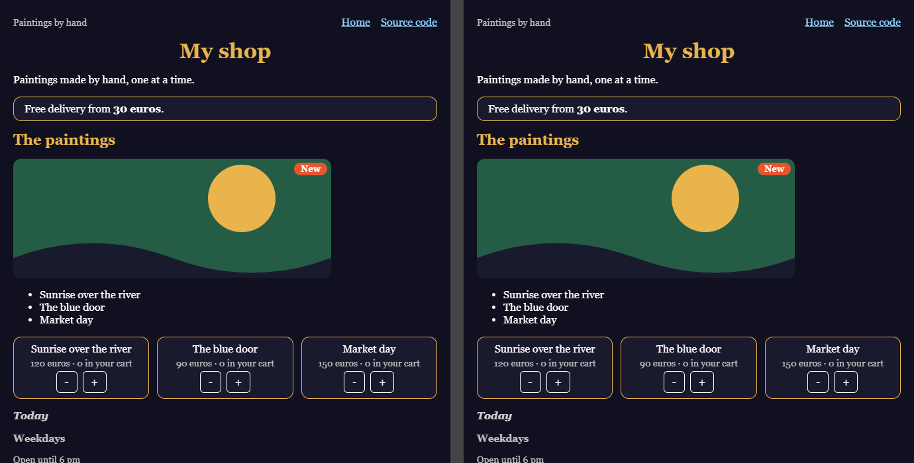

---

## 2026-10-06 — Un prompt sur les majuscules et la casse

- Demande de Yocthan : un prompt pour ChatGPT et Gemini sur les majuscules, avec tous les mots du langage, la question « le langage respecte-t-il la casse ? », et le désaccord de Claude.
- `docs/05-discussions/prompts/2026-10-06-majuscules-et-casse.md`. Claude a d'abord essayé dix fautes de casse dans le moteur : huit sont refusées avec le bon mot à écrire ; **deux passent** : `Page(Title: …)` est accepté sans rien dire et le titre est perdu (un défaut), et `Button(name: buy, …)` est accepté avec une minuscule.
- Rien n'est changé avant les réponses et la décision de Yocthan.

---

## 2026-10-06 — Les repères, les titres jusqu'à H6, le texte qui grandit, le survol, la superposition

**Ce que Yocthan a dit** : « Oui, vas-y, commence la construction de tout ce qu'on vient de décider. »

**Fait** (`ADR-035` et `ADR-036`, à l'essai)

- Le principe : refuser une mécanique, jamais une capacité (`ADR-035`).
- Les repères `Header`, `Nav`, `Main`, `Footer`. L'en-tête et le pied posés dans la page sortent du contenu principal, comme il se doit.
- Les titres jusqu'à `H6` (correction d'`ADR-020`).
- Le texte qui suit le réglage « texte plus grand » du visiteur, sans rien écrire : le moteur écrit les `px` d'une taille de texte en `rem` ; un titre de plus de 24px rétrécit sur un écran plus étroit que la page.
- Les états dans un style : `hover: { … }`, `focus: { … }`, `active: { … }` (correction d'`ADR-017`).
- La superposition : `Stack(children: [ … ])` et `align: top_right` sur un enfant.
- Les leçons 35 à 38 ; le site de référence en profite (en-tête, menu et pied en repères, une pastille « Nouveau », un bouton qui réagit au survol). 94 tests du moteur.
- Le grand tableau mis à jour : couverture estimée de 43 % à 47 % (HTML 52 %, CSS 53 %).

**Vérifié dans Chrome** : un en-tête, un menu, un contenu principal et un pied de page, l'en-tête hors du contenu ; la souris sur le bouton change sa couleur, la touche Tab y met une bordure blanche ; la pastille dans le coin de l'image ; un titre de 18px passe à 27px quand le visiteur règle son texte à 24 au lieu de 16 ; le titre de 96px du film fait 58,5px sur un téléphone de 390px et ne déborde plus.

**Erreurs en route**

- La pastille se posait au bord de la page : le `Stack` prenait toute la largeur. Puis, corrigé trop vite, l'image de la carte rétrécissait. Le `Stack` prend maintenant la place qu'on lui donne, et son image la remplit.
- Mon premier essai du survol visait un endroit vide de la page.

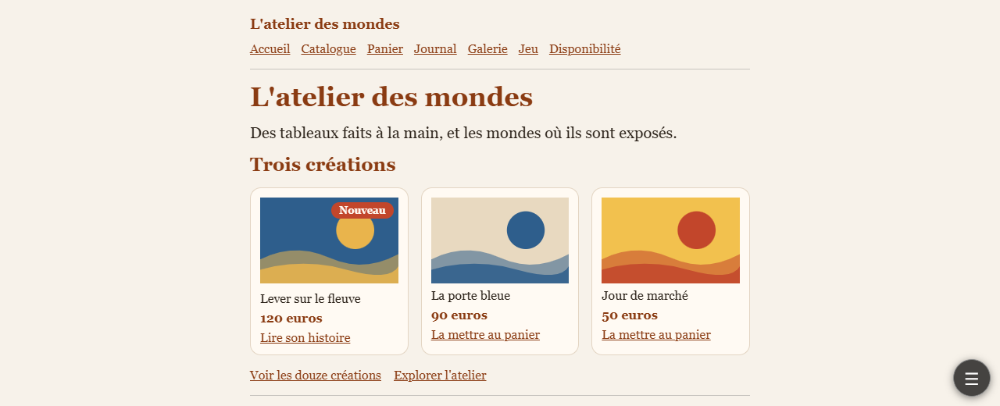

---

## 2026-10-06 — La réponse de ChatGPT, et la synthèse des quatre avis

- Réponse de ChatGPT : `docs/05-discussions/reponses/2026-10-06-chatgpt-refus.md`. Synthèse : `proposals/Claude/pourquoi-ces-refus-2026-10/SYNTHESE.md`.
- Les quatre avis (humains, Gemini, ChatGPT, Claude) s'accordent sur presque tout : garder les refus de `div`, de la page modifiée à la main, de `position` pour la mise en page et de la cascade ; ajouter `Main`, `Nav`, `Header`, `Footer`, les états (`hover`, `focus`), la superposition en blocs et des tailles de texte qui suivent le réglage du visiteur ; jamais de code libre, mais du calcul enfermé. Trois sur quatre veulent les titres jusqu'à `H6` tout de suite ; Claude se range à cet avis.
- Le principe proposé par ChatGPT : refuser une mécanique, jamais une capacité.
- ChatGPT conteste la règle de Yocthan (suivre la majorité des humains) : sur les forums parlent surtout des développeurs. Sur ces huit refus, les deux méthodes donnent le même résultat.
- Rien n'est construit : Yocthan décide.

---

## 2026-10-06 — Un prompt pour ChatGPT, à la place de Codex

- Le quota de Codex est épuisé ; celui de ChatGPT (conversation simple) ne l'est pas. Yocthan veut un avis rapide, sans travail sur le dépôt : une comparaison et un jugement de nécessité.
- `docs/05-discussions/prompts/2026-10-06-chatgpt-refus.md` : tout est dedans (le projet, le tableau, les huit refus, l'avis de Gemini, ce que disent les humains, la recommandation de Claude), avec la consigne de ne pas travailler.

---

## 2026-10-06 — Les refus face aux avis des humains

**Ce que Yocthan a demandé** : vérifier sur Stack Overflow, Reddit, Twitter et les forums ce que les humains pensent des éléments refusés. Sa règle : si la majorité montre que l'élément manque ou le défend, on lève le refus ; si elle en dit surtout du mal, on le garde.

**Fait** : `proposals/Claude/pourquoi-ces-refus-2026-10/AVIS-DES-HUMAINS.md`, avec ses sources. Trois enquêtes chiffrées (State of CSS 2026, WebAIM 2024, Stack Overflow 2025), des textes d'experts, des discussions de développeurs.

**Résultat selon la règle** : garder les refus de `div`, `section`/`article`, la page modifiée à la main, `position` pour la mise en page, la cascade et `!important`. Lever ceux des repères (`nav`, `header`, `footer`, `main` : 63 % des utilisateurs de lecteurs d'écran s'en servent au moins parfois), de `h4` à `h6`, et de la superposition (en bloc). Assouplir celui de `script` : la plainte contre l'interdiction est forte (AMP abandonné par la plupart des grands éditeurs), mais Claude recommande du code enfermé plutôt que du code libre. Ajouter : des tailles de texte qui suivent le réglage du visiteur.

**Limites dites dans le document** : ce n'est pas un vote mondial ; Twitter n'a pas pu être fouillé directement ; les forums parlent surtout pour des développeurs, pas pour des débutants.

---

## 2026-10-06 — La réponse de Gemini sur les refus

- Gardée dans `docs/05-discussions/reponses/2026-10-06-gemini-refus.md`, avec la lecture de Claude.
- Gemini garde `div`, `script`, la page modifiée à la main et la cascade ; il assouplirait les titres (jusqu'à `H6`), la superposition (un bloc `Stack` ou `Badge`) et les repères (des blocs `Header`, `Nav`, `Main`, `Footer`). Pour le survol : des états écrits dans le style (`hover: { … }`). Refus manquant selon lui : les tailles de texte en pixels.
- Claude change d'avis sur un point : des blocs plutôt qu'un rôle pour les repères, parce qu'un non-programmeur comprend `Nav(…)`.
- On attend Codex, puis Yocthan décide.

---

## 2026-10-06 — Le grand tableau face au web, et pourquoi ces refus

**Ce que Yocthan a demandé**

- Un grand tableau lisible : chaque élément de HTML, CSS et JavaScript, s'il existe en HoloCode, à combien de pourcents, et s'il doit exister. Puis : « Dis-moi pourquoi tu as refusé certains éléments, écris-le sur GitHub, que Codex et Gemini puissent le voir. » Il décidera après leurs avis s'il faut admettre ce qui est refusé.

**Fait**

- Le tableau, 129 éléments : une page à filtrer pour Yocthan, et la même chose dans le dépôt, `docs/01-holocode/TABLEAU-WEB.md`. Couverture moyenne estimée : HTML 47 %, CSS 47 %, JavaScript 32 %, ensemble 43 %. Dix-sept manques mis en priorité (formulaire envoyé, listes, tableaux, vidéo, survol, tailles qui s'adaptent, repères pour lecteurs d'écran…).
- Le pourquoi de chaque refus : `proposals/Claude/pourquoi-ces-refus-2026-10/README.md`. Pour chacun : ce qu'il évite, un exemple, qui l'a décidé, ce qu'il coûte, l'avis de Claude aujourd'hui.
- Deux prompts : `docs/05-discussions/prompts/2026-10-06-gemini-refus.md` (tout est dedans) et `2026-10-06-codex-refus.md`.

**Erreurs de Claude, trouvées en écrivant le pourquoi**

- Le tableau classait `h4` à `h6` « refusés exprès » ; la fiche `ADR-020` dit « on en ajoutera si un vrai besoin apparaît ». Corrigé : « pas encore ».
- Le refus de `section` et `article` n'a jamais été décidé par Yocthan : c'est un jugement de Claude. Le tableau l'attribuait à `ADR-009`. Corrigé, et Claude propose maintenant d'admettre les repères (`nav`, `header`, `footer`, `aside`) pour les lecteurs d'écran.

---

## 2026-10-06 — La page qui attend le moteur (suggestions de Codex)

**Ce que Yocthan a demandé** : « Travaille sur ce qu'a suggéré Codex. » Claude a pris dans ses deux revues ce qui ne demande aucune décision de Yocthan : les cas E02, E03 et F14 de la recette du site de référence.

**La cause commune** : en arrivant, le moteur redessinait toute la page. Une saisie commencée était effacée, le focus perdu, le film relancé.

**Fait** (correction de `ADR-033`)

- Le moteur reprend la page fabriquée par le serveur au lieu de la redessiner ; ce qui a été écrit en l'attendant passe par l'arbitre.
- Un bouton touché pendant l'attente le montre aussitôt ; le signe disparaît quand le toucher est rejoué.
- Si le moteur ne peut pas arriver : un bandeau honnête, aucun toucher rejoué en cachette, un bouton « Réessayer ».
- Le serveur local sait simuler un moteur lent (`HOLO_MOTEUR=lent:5000`) ou en panne (`HOLO_MOTEUR=panne`).

**Vérifié dans Chrome (PC)** : trois touchers pendant 5 s d'attente donnent exactement 3 créations ; « Éloïse 🌍 » tapé avant le moteur reste, focus compris ; la panne est dite ; le film continue. Le site de référence, la boutique et le jeu marchent comme avant.

**Erreur en route** : le premier banc d'essai retardait chacune des trois pièces du moteur (15 s au lieu de 5), et le serveur neuf compressait le moteur pour la première fois : les premières lectures se faisaient avant son arrivée.

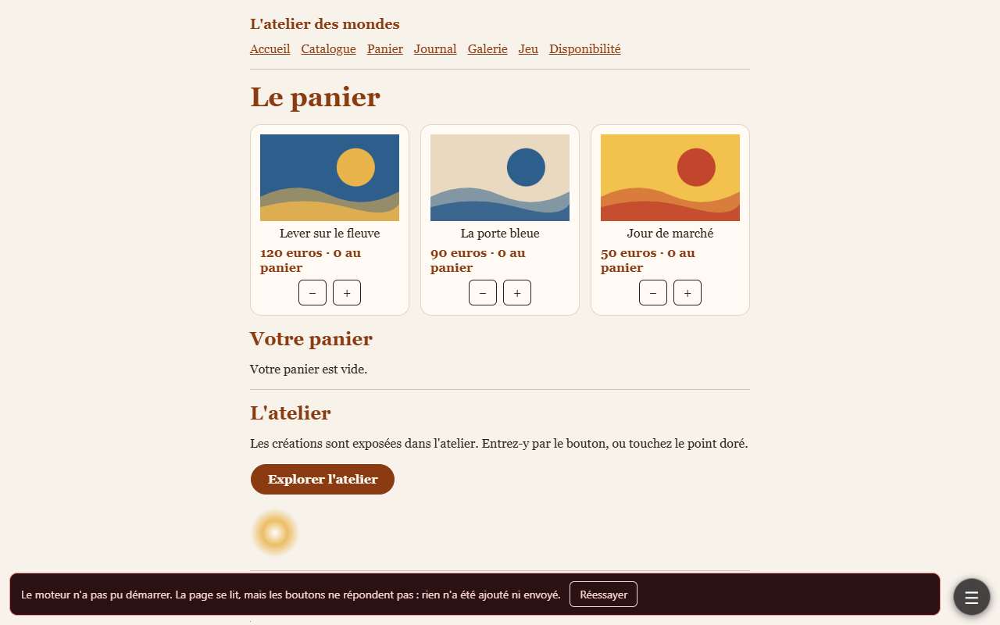

---

## 2026-10-06 — Les deux films du motion design, identiques point par point

**Ce que Yocthan a relevé**

- « Pourquoi les deux showreels ne se ressemblent pas point par point ? Je t'avais dit de construire exactement le même, ligne par ligne ; seule l'extension devait changer. Tu n'as pas rempli les conditions. »

**Erreur de Claude**

- Il avait compris « tous les curseurs à 100 % » comme « chaque langage à son maximum », et avait donné au film web des particules, un morphing en cœur, un cube et la souris que HoloCode n'a pas. La comparaison n'était donc pas à fonctions égales, ce que Codex demande aussi (`C01`).

**Corrigé**

- `exemples/motion/web/showreel.html` est maintenant le jumeau exact du film HoloCode : les 36 éclats sont relus dans le fichier `.holo`, et tout le reste reprend les mêmes valeurs. Vérifié sur sept images prises aux mêmes instants : identiques.
- L'ancienne version est gardée, hors comparaison : `showreel-max.html`.
- Mesures honnêtes : 206 lignes contre 184 ; 14 193 octets contre 21 377 ; 10 Ko téléchargés contre 4 Ko ; 0 ligne de JavaScript contre 7.

**Défaut trouvé en comparant** : quand le moteur arrive dans la page, il la redessine, et le film HoloCode repart de zéro. À corriger.

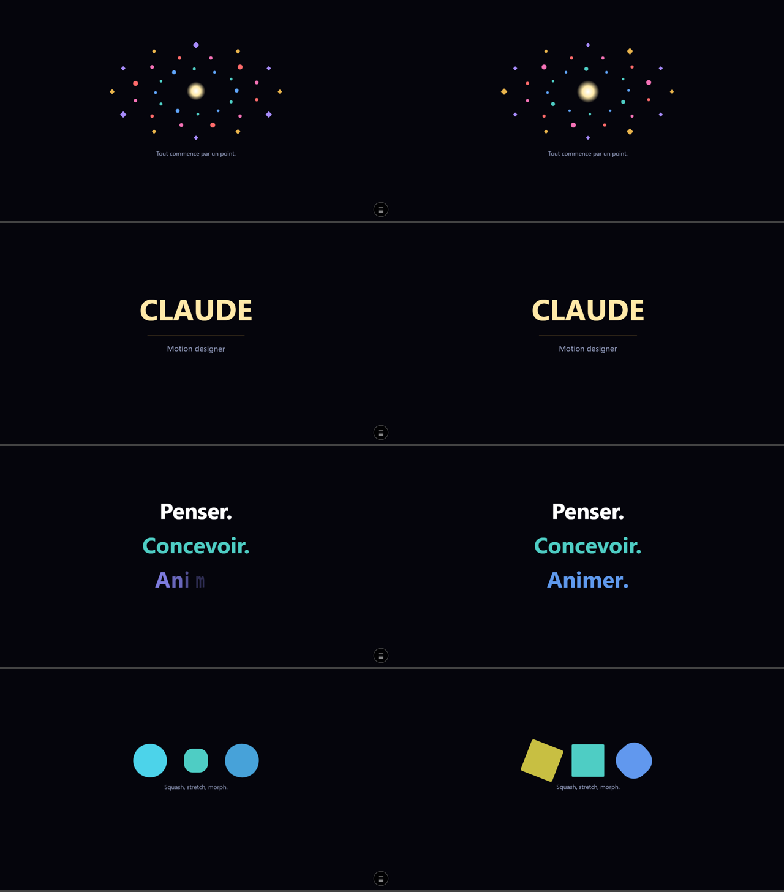

---

## 2026-10-06 — Le site de référence de Codex, construit

**Ce que Yocthan a demandé**

- « Construis le site d'après les conditions de Codex et lance-le sur Chrome. » Le cahier des charges est la PR 79 de Codex (`proposals/GPT5.6/site-reference-2026-10-06/`), encore ouverte : Claude ne l'a pas fusionnée.

**Fait**

- « L'atelier des mondes », dans `exemples/site-reference/` : accueil (page témoin, ordinaire), catalogue de douze créations, fiche, panier et atelier (le même panier à plat et dans le monde ; un jardin dans un autre fichier ; un monde planté dans un pixel ; points, relief, carrefour), journal, disponibilité (`Data`), jeu (pause, reprise, meilleur score gardé, `within`), galerie animée. Menu et pied de page en morceaux importés. Aucun mot ajouté au langage.
- Premier passage de la recette, sur PC seulement : `exemples/site-reference/RECETTE-2026-10-06.md`. Le parcours du panier donne `(3,330)`, `(2,210)`, `(0,0)`, `(0,0)` ; l'accueil pèse 8 Ko sans le moteur.

**Erreurs en route**

- Un fichier ne peut contenir qu'un seul morceau (`Part`) : le pied de page a dû aller dans son propre fichier, `pied.holo`.
- Les premiers essais automatiques disaient que rien ne marchait : huit Chrome lancés en même temps, et des lectures faites 350 ms après le premier toucher, avant l'arrivée du moteur. Relancés un par un, en attendant le moteur : tout passe.

**Pas fait** : les mesures sur téléphone, les essais avec des débutants, le verdict de Yocthan, et les quatre extensions (formulaire envoyé, listes, objets pleins, jeu à plusieurs), qui restent bloquées.

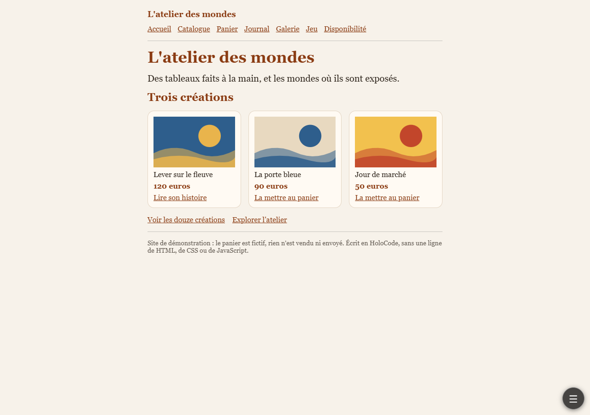
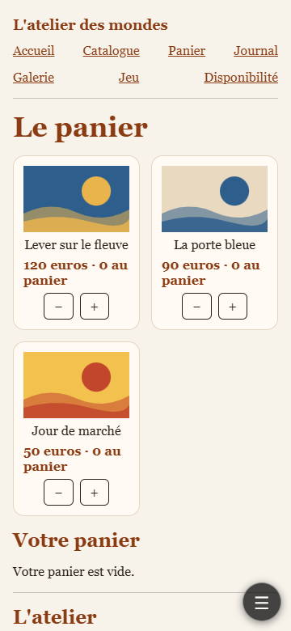

---

## 2026-10-04 — Le mouvement en HoloCode, et le duel du motion design

**Ce que Yocthan a demandé**

- Faire du motion design en HoloCode et en HTML, CSS, JavaScript, séparément, « tous les curseurs à 100 % », comme un CV pour être embauché ; puis : « fais une amélioration, sinon HoloCode sera battu ».

**Fait** (`ADR-034`, à l'essai)

- Le mouvement dans le langage : `enter: Enter(…)` (on écrit d'où le bloc part), `loop: Loop(…)` (où il va), `Scenes` et `Scene(for:)`. Dix choses bougent (`opacity`, `x`, `y`, `scale`, `rotate`, `flip`, `tilt`, `blur`, `hue`, `round`), sept caractères nommés (`linear` à `bounce`, dont le ressort), `letters:` et `each:`. Le moteur en fait du CSS : la page bouge sans le moteur.
- Les leçons 32, 33, 34. Guide, noms, comparaison avec le web.
- Deux films en sept scènes : `exemples/motion/holocode/showreel.holo` et `exemples/motion/web/showreel.html`, et leur comparaison dans `exemples/motion/README.md`.
- 93 tests du moteur.

**Le verdict**

- En puissance, le web gagne : 520 particules physiques, morphing en n'importe quelle forme, cube en 3D, réaction à la souris.
- En écriture, HoloCode gagne : environ 100 lignes sans programmer (206 avec les 36 éclats écrits un par un), contre 311 dont 200 de JavaScript. Téléchargé : 10 Ko contre 7 Ko.

**Erreurs en route**

- Dans le film web, les particules filaient hors de l'écran (trop rapides), et des cercles fantômes restaient sur le ciel (le voile sombre ne s'efface jamais tout à fait). Corrigé : vitesses réduites, et on estompe ce qui est dessiné au lieu de peindre du noir par-dessus.
- Un son a un réglage `loop` à lui : le mouvement le prenait pour un `Loop`. Les sons sont laissés hors du mouvement.

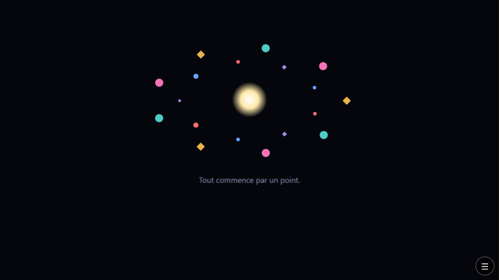
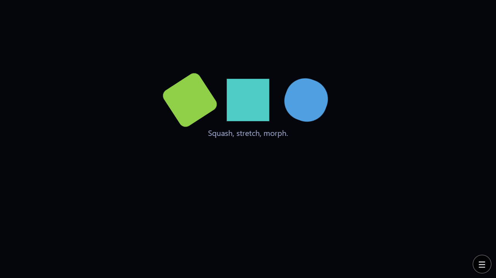

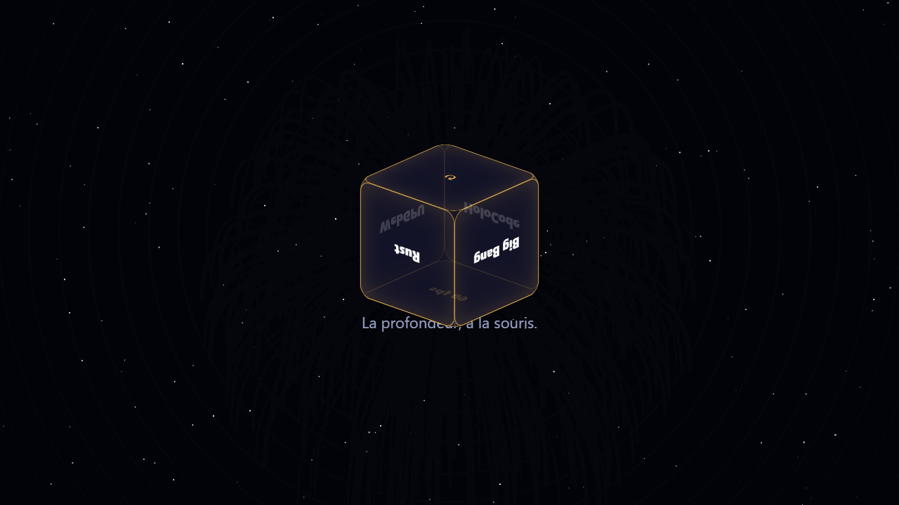

---

## 2026-10-04 — Trois avis sur 100 : Claude 50 %, Gemini 65 %, Codex 75 %

- Les réponses de Codex et de Gemini à la même question, et la lecture de Claude : `docs/05-discussions/reponses/2026-10-04-avis-sur-100.md`.
- Tous trois : pas encore les objectifs. Ce qui manque, d'un même avis : un téléphone modeste mesuré dans la durée ; des débutants qui créent seuls ; des objets pleins ; l'envoi d'un formulaire et les listes ; plus tard, le jeu à plusieurs.
- Gemini, sans accès au dépôt, demande des choses qui existent déjà (`Row`, `Column`, le panier à plusieurs articles).
- Codex relève la première image 3D (environ 3,5 s au premier chargement). Le site léger risque de l'allonger : à mesurer.

---

## 2026-10-04 — Le site léger : 8 Ko au lieu de 579

**Ce que Yocthan a demandé**

- « Sur 100 %, le projet te convainc à combien ? Est-ce ultra léger ? » Claude a répondu environ 45 %, et non : la boutique pesait 579 Ko, contre 6 Ko pour sa jumelle en HTML, parce que tout le moteur partait dès l'ouverture. Sa recommandation numéro un : ne télécharger le moteur qu'au besoin. Yocthan : « Oui, vas-y. »

**Fait** (`ADR-033`, à l'essai)

- La page d'entrée est coupée en deux : `page.html` (la page légère, 12 Ko non compressés) et `page-moteur.js` (le moteur de la page, chargé à la demande).
- Le moteur n'est demandé qu'au premier geste qui en a besoin : un bouton nommé, un lien vers un point, un champ, le menu, le zoom. Ce qui a été touché en l'attendant est rejoué ; le menu touché s'ouvre.
- Une page vivante (horloge, clavier, données, glissement) le demande tout de suite : c'est le moteur qui la marque, `data-vivant`. Une page aux valeurs gardées aussi, s'il y a vraiment quelque chose de gardé.
- 91 tests du moteur.

**Mesuré dans Chrome**

| | Avant | Après |
|---|---|---|
| Boutique, à l'ouverture | 579 Ko | **8 Ko** |
| Boutique, après le premier « + » | 579 Ko | 594 Ko (le moteur arrive ; le panier passe à 1) |
| Jeu de la pomme | moteur tout de suite | moteur tout de suite ; la partie se joue comme avant |

- Le menu touché avant l'arrivée du moteur s'ouvre ; « Enter the workshop » touché avant l'arrivée du moteur mène bien à l'atelier.

**Ce que cela coûte**

- Le premier toucher attend le moteur : imperceptible ici, en local ; pas mesuré sur un réseau lent ni sur un téléphone bon marché.
- Une saisie commencée avant l'arrivée du moteur peut être effacée quand il redessine la page.

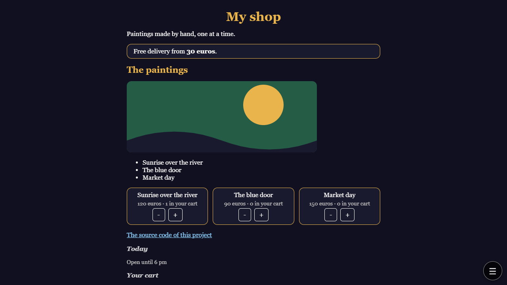

---

## 2026-10-04 — Un plateau aux proportions fixes

- Yocthan, après la réponse de Gemini : le serveur et le jeu en ligne attendront ; d'abord que le métavers lui plaise, en local. Claude n'ajoute donc aucune bibliothèque réseau : elles ne serviraient qu'au serveur.
- Fait, à l'essai : un plateau garde ses proportions (640 de large, `height` de haut). Il rétrécit sur un téléphone, ses formes et ses points avec lui. Les rencontres se calculent dans les unités du plateau : la même partie partout. La page ne mesure plus la largeur de l'écran.
- Vérifié dans Chrome : sur un écran d'ordinateur (1280 de large), juste avant la prise, le bas de la pomme est 6,4 pixels au-dessus du panier ; sur un écran de téléphone simulé (360 de large), 2,9 pixels. C'est le même écart, à l'échelle du plateau : la partie est la même. Avant « Play », rien ne bouge.
- Ce que cela coûte : sur un téléphone en hauteur, un plateau large laisse du vide en dessous. L'auteur peut choisir un plateau plus haut.
- Codex a rendu sa revue pendant ce temps (PR 74). Quatre défauts qu'il a trouvés sont corrigés ici, sans décision à prendre : le test du guide échouait sur un dépôt aux fins de ligne Windows ; un son demandé lors d'un appel pouvait ressortir avec la réponse d'un glissement, d'une saisie ou de données ; un compte de tirages falsifié au maximum faisait planter le moteur en mode test ; `within` mesure l'écart sur chaque axe, et le guide le dit maintenant.
- Erreur de Claude : la branche était partie d'une copie de `main` pas à jour ; la pull request était en conflit, et les tests en ligne ne démarraient pas. Le script de fusion a attendu dix minutes avant que Claude regarde pourquoi.

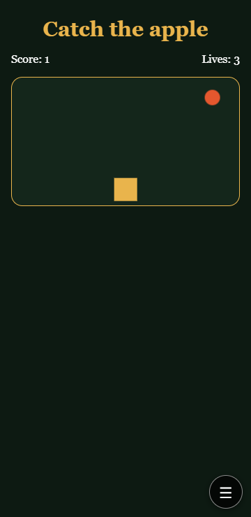

---

## 2026-10-04 — La réponse de Gemini sur les objets en volume et le jeu à plusieurs

- Gardée dans `docs/05-discussions/reponses/2026-10-04-gemini-3d-et-plusieurs.md`, avec la lecture critique de Claude.
- Gemini recommande : des points dont la taille grandit de près (l'objet paraît plein) ; un jeu à plusieurs par WebSocket, sur le modèle de Croquet (le serveur ne calcule rien, il numérote et renvoie les gestes) ; et, avant tout, des rencontres calculées dans des unités de plateau fixes, jamais en pixels.
- Ce dernier point contredit ce que Claude venait de fusionner (la rencontre dépend de la largeur de l'écran). Claude est d'accord avec Gemini.
- Rien n'est construit : on attend la réponse de Codex, puis le choix de Yocthan.

---

## 2026-10-04 — La rencontre se fait au contact ; des règles sous condition ; deux prompts pour Gemini et Codex

**Ce que Yocthan a vu**

- Dans le jeu de la pomme : « Le rond, quand il s'approche du carré, au lieu de le toucher, il pénètre vraiment en profondeur, et après ça déclenche. Il fallait que dès que sa circonférence touche l'un des côtés, ça réagisse. C'est comme ça qu'on construit du bon. »
- Pour les modèles 3D et le jeu à plusieurs : il veut l'avis de Gemini et de ChatGPT avant de choisir, et demande un prompt.

**La cause**

- La rencontre était jugée sur l'écart entre les places des deux objets, sans regarder leur taille ni leur forme. Tant que tout était des points lumineux, cela ne se voyait pas ; avec un rond et un carré, c'est flagrant.

**Corrigé**

- Sans `within`, deux objets se rencontrent au moment où le bord de l'un touche le bord de l'autre. L'arbitre connaît la taille et la forme de chacun et la hauteur du plateau ; la page lui donne la largeur du plateau, qui dépend de l'écran.
- Un test le fixe au pixel près : la pomme (44) est prise quand son bas atteint le dessus du panier (64), pas avant, pas après.
- `within` reste, pour juger sur l'écart entre les places.

**Un second défaut, trouvé en vérifiant à l'écran**

- Le jeu jouait tout seul avant « Play » et après la fin : la pomme, cachée, tombait, était « rattrapée » (un point, un son demandé), puis repartait d'une place au hasard. « Play » ne remettait pas cette place : la première pomme tombait loin du panier.
- Corrigé sans mot nouveau : `If(lives, over: 0, rules: [ … ])`. Le même `If` que pour montrer des blocs, avec `rules` à la place de `children` : les règles rangées dedans ne valent que si la condition est vraie. On y range `Every` et `When`. « Play » remet aussi la pomme et le panier au milieu.
- La leçon 31, `exemples/lecons/31-regles-sous-condition.holo` : un chronomètre qui ne compte que lancé.
- Mesuré dans Chrome, image par image : avant « Play », rien ne bouge et le score reste à 0 ; à l'image qui précède la prise, le bas de la pomme est 6 pixels au-dessus du panier. Elle n'entre plus dedans. (La pomme descend par pas d'environ 9 pixels : la prise se fait au pas où elle touche.)
- 90 tests du moteur.

**Ce que cela coûte**

- La même partie ne se joue plus tout à fait pareil sur un écran large et sur un téléphone. Pour un jeu à plusieurs, il faudra un plateau de taille fixe, ou des unités de monde : question posée à Gemini et à Codex.

**Les prompts**

- `docs/05-discussions/prompts/2026-10-04-gemini-3d-et-plusieurs.md` (sans accès au dépôt, tout est dedans) et `2026-10-04-codex-3d-et-plusieurs.md` (avec le dépôt ; il lui demande aussi de relire les noms ajoutés depuis sa contre-revue).

**Erreur de Claude**

- Claude avait joué la partie par un test qui ne regarde que les nombres : le score montait, donc « ça marchait ». Il n'avait pas regardé à l'écran le moment du contact.
- Le jeu qui joue tout seul était noté dans `ADR-026` comme une limite sans gravité. Avec le son et les rencontres, c'était un défaut, et Claude ne l'avait pas relu.

---

## 2026-10-04 — Les formes, le meilleur score ; deux propositions pour ce qui reste

**Ce que Yocthan a dit**

- Le son : « J'ai kiffé. » Puis : « Fais ce qui reste à faire. »

**Fait** (`ADR-032`, à l'essai ; `ADR-031`, le son, passe à « accepté pour l'instant »)

- **Les formes** : `Shape(form: circle, color: "#E9B44C", size: 48px)`. Quatre formes : rond, carré, triangle, losange. Une forme nommée se touche, se place sur un plateau, se fait glisser, et peut être guettée par une rencontre. Dans le jeu de la pomme, la pomme est un rond et le panier un carré.

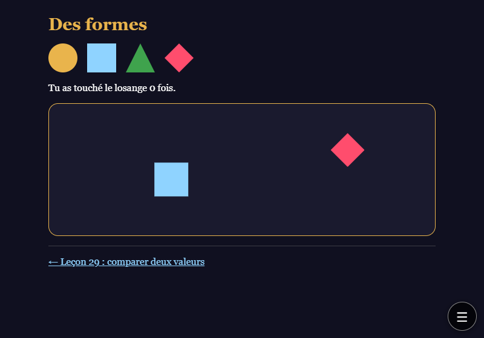

- **Comparer deux valeurs, fixer d'après une autre** : là où l'on écrit un nombre, on peut écrire le nom d'une valeur. `When(score, over: best, effect: best.set(score))`. Le jeu de l'étoile garde le meilleur score d'une visite à l'autre.
- Deux leçons : la 29 (comparer deux valeurs) et la 30 (les formes).
- 90 tests du moteur. Vérifié dans Chrome : le record suit le score dès qu'il est dépassé, et reste après rechargement.

**Ce que Claude n'a pas construit, et pourquoi**

- **Les modèles 3D** et **le jeu à plusieurs**. Ce sont les deux derniers morceaux des étapes 6 et 7, et les deux choix d'architecture les plus lourds depuis le choix de Rust : un second moteur de dessin ou non ; un serveur qui tourne en permanence, avec la question de qui il laisse faire quoi. Yocthan a donné le champ libre pour construire ce qui a été recommandé et expliqué ; ces deux-là ne l'ont pas encore été. Claude les a posés dans `proposals/Claude/modeles-3d-et-jeu-a-plusieurs-2026-10/`, avec trois options chacun et une recommandation.

---

## 2026-10-04 — Étape 6, premier morceau : le son

**Fait** (`ADR-031`, à l'essai)

- `Sound(name: Ding, source: "ding.wav")` : un son, qui ne se voit pas. `Ding.play` le fait entendre, dans l'effet d'une règle, seul ou dans une liste. Les trois sortes de règles peuvent jouer un son.
- Une règle de temps ou une règle qui guette ne peut demander que cela hors des demandes : `Workshop.enter` y est refusé (on n'emmène pas le visiteur ailleurs sans geste).
- Les deux jeux ont leurs sons : un quand on attrape, un quand une pomme est perdue. Les trois petits fichiers de son ont été fabriqués par un script (deux notes qui s'éteignent, sept à onze kilo-octets).
- La leçon 28, `exemples/lecons/28-son.holo`.
- 88 tests du moteur. Vérifié dans Chrome avec un vrai clic : un appui, un son ; dans le jeu de la pomme, « Pop » à la pomme rattrapée, « Lost » à la pomme perdue.

**Erreur en route**

- Les premiers essais automatiques ne comptaient aucun son joué. Le moteur n'y était pour rien : un navigateur ne joue un son qu'après un vrai geste, et un clic déclenché par un script n'en est pas un. Refait avec un clic de souris simulé par le navigateur lui-même.

**Ce qui reste de l'étape 6, et l'étape 7**

- Les formes, les images dans la vue en profondeur, les modèles 3D : c'est le gros de l'étape 6. Le moteur de dessin ne sait aujourd'hui dessiner que des points ; il faut l'étendre. Claude ne l'a pas commencé.
- L'étape 7 (partie gardée, jeu à plusieurs avec un arbitre sur un serveur) n'est pas commencée.

---

## 2026-10-04 — Étape 5, fin : les données venues du serveur

**Ce que Yocthan a dit**

- « On y va. »

**Fait** (`ADR-030`, à l'essai)

- `data: Data(from: "stock.json", every: 30s)` : la page va chercher un fichier de données rangé à côté d'elle, à l'ouverture puis à un rythme. Le fichier est un objet JSON à plat ; chaque nom remplit la valeur de `State` du même nom.
- C'est l'arbitre qui range : une valeur déclarée, de la bonne sorte, dans ses bornes. Le reste est laissé de côté ; un fichier mal formé ne change rien. Le lecteur du fichier est écrit dans le moteur, sans bibliothèque.
- La page ne parle qu'au serveur d'où elle vient.
- La leçon 27, `exemples/lecons/27-donnees.holo`.
- 87 tests du moteur. Vérifié dans Chrome : le fichier `.json` changé sur le disque, la page est passée de « Ouvert aujourd'hui jusqu'à 18 h » à « Fermé pour la soirée » en deux secondes, sans rechargement.

**Ce que l'étape 5 ne donne pas**

- Les listes : on ne reçoit pas « tous les articles du catalogue ».
- L'envoi : la page n'envoie rien au serveur.
- Ces deux manques pèsent sur la cible « 70 % de SolidJS » : Claude l'estimerait plutôt à 60 % après cette étape.

---

## 2026-10-04 — Les leçons : un fichier par notion

**Ce que Yocthan a dit**

- « À chaque étape, à chaque nouveau code injecté, qu'il y ait un fichier qui explique exactement une seule chose. » Il aurait voulu le demander dès le départ. « Dans le guide, vu que c'est dense, comprendre sera compliqué. » Il demande aussi de le faire pour tout ce qui existe déjà, de la première notion à aujourd'hui.
- Continuer avec les étapes 5, 6 et 7, lui envoyer les corrections à voir, et ouvrir dans Chrome ce qui s'exécute.

**Fait**

- `exemples/lecons/` : vingt-six leçons, de la première page au Big Bang. Chaque leçon est un petit fichier `.holo` : les commentaires du haut disent ce qu'on apprend et quoi essayer, le code le montre, et un lien en bas mène à la leçon suivante. On les suit dans Chrome et dans VS Code côte à côte.
- L'index est `exemples/lecons/README.md`. L'accueil des démonstrations y mène.
- Un test du moteur vérifie toutes les leçons : une leçon qui ne marche plus fait échouer les tests.
- La règle est notée dans `AGENTS.md` : chaque notion ajoutée reçoit sa leçon, dans la même pull request.

**Ce qui n'est pas fait**

- Les étapes 5 (fin), 6 et 7 : elles restent à faire, une par une.

---

## 2026-10-04 — Étape 5, première moitié : les imports, et un site de deux pages

**Ce que Yocthan a dit**

- Le jeu de la pomme : « c'est bon ». Il n'avait pas vu que le second onglet ouvert était le jeu de l'étoile, déjà joué.
- Codex : attendre qu'il ait fini sa réflexion sur les noms (son quota revient vers 13 h 40), puis trancher l'ensemble.
- Ensuite, l'étape 5.

**Trouvé dans le dossier de Yocthan**

- La contre-revue de Codex sur les noms, `proposals/GPT5.6/autocritique-noms-2026-10-04/README.md`, ajoutée mais pas encore poussée. Claude ne l'a pas touchée. Codex y retire presque toutes ses propositions et en garde trois (`divisions`, `levels` dans `Points`, `anchor`).
- Une espace en trop dans `exemples/jeu/attraper.holo` bloquait la mise à jour du dossier : retirée, copie gardée.

**Fait** (`ADR-029`, à l'essai ; `ADR-028` passe à « accepté pour l'instant »)

- **Les imports.** Un fichier importé est un morceau : `Part(name: Menu, children: [...])`, avec ses styles. La page écrit `import "commun.holo"` en haut, puis `Use(Menu)` là où elle veut le morceau. Les styles du morceau viennent avec lui ; si la page écrit le même style, le sien reste.
- **Un site de deux pages**, `exemples/site/` : le menu et le thème sont écrits une fois, dans `commun.holo`.

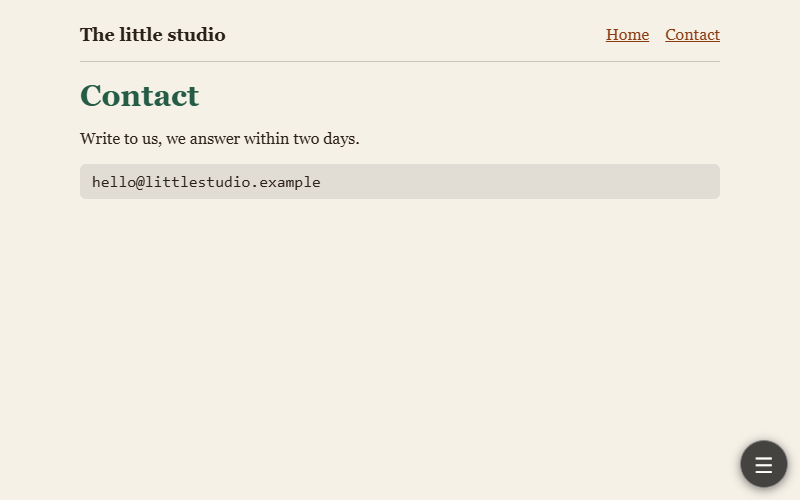

- Le moteur ne lit toujours aucun fichier lui-même : la page d'entrée et le moteur en ligne de commande vont chercher les imports et les joignent au texte.
- 85 tests du moteur. Vérifié : `holo check`, la page fabriquée d'avance par le serveur, et Chrome.

**Ce qui n'est pas fait de l'étape 5**

- Les données venues d'un serveur.

**Limites**

- Un morceau n'a ni paramètres, ni valeurs, ni règles.
- Une erreur dans un morceau est signalée à la ligne de l'`import`.

---

## 2026-10-04 — Des règles plus courtes, une sorte de règle en moins, et le glissement

**Ce que Yocthan a dit**

- « À chaque fois qu'il y a un truc à exécuter, tu vas l'exécuter sur Chrome. Tu as ma permission. » Trop de messages à répéter sinon.
- Finir l'étape 4 avec le glissement.
- Sur les quatre sortes de règles : « Il faudra que tu puisses voir comment les diminuer. Plus c'est verbeux, plus on s'éloigne de l'objectif du langage, qui est de faire des trucs de manière simple. Quand c'est utile, c'est normal que ça soit verbeux ; quand c'est pas utile, il faut chercher une manière de faire correctement la chose. »

**Fait**

- **Plusieurs demandes dans une règle**, entre crochets : `On(Play.tap, effect: [score.set(0), lives.set(3), apple_y.set(0)])`. Le jeu de la pomme passe de treize règles à six ; celui de l'étoile, de neuf à cinq ; « vider le panier », de trois à une.
- **Une sorte de règle en moins.** `Meet` disparaît : une rencontre s'écrit `When(Basket, meets: Apple, within: 9, effect: …)`. Il reste `On` (un geste), `Every` (le temps), `When` (un moment).
- **Le glissement** : `drag: true` sur un bloc d'un plateau. Sa valeur suit le doigt ou la souris ; rattraper la pomme en glissant compte. Les deux boutons du jeu ne servent plus : retirés.
- Les fichiers `.holo` à essayer sont désormais ouverts dans Chrome sans attendre qu'il le demande.

**Erreur de Claude**

- La première version de l'étape 4 ajoutait un mot par besoin (`When`, puis `Meet`) et une ligne par demande. Claude l'avait signalé comme un risque sans le corriger ; c'est Yocthan qui a tranché.

---

## 2026-10-04 — Étape 4 : le clavier, les règles qui guettent, les rencontres, et un deuxième jeu

**Fait** (`ADR-028`, à l'essai)

- **Un deuxième jeu sans code** : `exemples/jeu/panier.holo`. Une pomme tombe ; on la rattrape avec un panier, au clavier ou par deux boutons ; trois pommes perdues, la partie est finie.

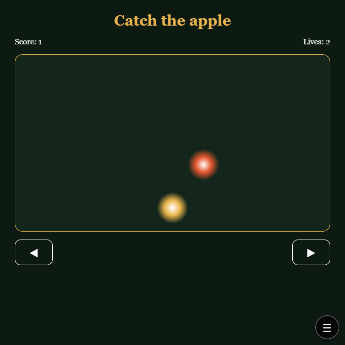

- Ce que ce jeu a demandé au langage :
  - **`Key`** : le clavier, dans une règle `On`. Les flèches et l'espace.
  - **`When(apple_y, over: 99, effect: …)`** : une règle qui guette. Elle se déclenche au moment où la condition devient vraie.
  - **`Meet(Basket, Apple, within: 9, effect: …)`** : la rencontre de deux blocs posés sur un plateau.
  - Une valeur qui sert de place reste entre 0 et 100 : le panier ne sort pas.
- Faire tomber la pomme n'a demandé aucun mot : `Every(100ms, effect: apple_y.add(3))`.
- 84 tests du moteur ; la partie y est rejouée battement par battement. Joué dans Chrome avec de vraies touches : le panier va à droite et revient, la pomme rattrapée donne un point, la suivante, manquée, coûte une vie.

**Ce qui n'est pas fait dans l'étape 4**

- Le glissement du doigt.

**Ce qui inquiète**

- Le langage a maintenant quatre sortes de règles : `On`, `Every`, `When`, `Meet`. Et une règle ne fait qu'une demande, donc rattraper la pomme prend trois lignes. Si un troisième jeu demande encore une nouvelle sorte de règle, il faudra chercher une forme plus générale plutôt que d'ajouter un mot.

---

## 2026-10-04 — Étape 3, fin : les valeurs de texte et le champ de texte

**Ce que Yocthan a dit**

- Le jeu : « J'ai fait un score de 7, donc ça marche vraiment. » Puis : « Tu termines l'étape 3, et après on passe à l'étape 4. »

**Fait** (`ADR-027`, à l'essai)

- Une valeur peut être un texte : `State(buyer: "")`. `{buyer}` le montre. `If(buyer, is: "")` et `If(buyer, not: "")` disent s'il est vide ou rempli.
- `Input(value: buyer, label: "…", max: 20)` : le même bloc que pour un nombre. Comme la valeur est un texte, le champ est un champ de texte.
- Un texte se garde par `keep`, comme un nombre.
- La boutique demande le prénom de l'acheteur et écrit « This order is for … ». Sa jumelle web aussi.
- 83 tests du moteur. Vérifié dans Chrome avec « Zoé <b>&; Arc » : montré lettre pour lettre, aucune balise créée, retrouvé après rechargement.

**Choix**

- Un seul bloc `Input`, dont le genre vient de la valeur. En HTML, `input` a vingt-deux genres.
- Un texte ne se compare qu'au vide. Comparer deux textes appellerait vite « contient », « commence par », puis des expressions.

**Erreur en route**

- Un test attendait qu'un prénom de treize caractères passe dans un champ borné à douze. C'est le test qui avait tort : le moteur coupait bien.

---

## 2026-10-04 — Le jeu corrigé et validé ; étape 3 : la case, le champ, les valeurs gardées

**Ce que Yocthan a dit, après avoir joué**

- « Techniquement, c'est pas mal. Je valide les jeux. » Mais il n'a pas pu gagner une partie : « on commence avec un petit handicap », et « l'étoile est ultra rapide sur PC ». Sur téléphone, toucher est un seul geste ; à la souris, il en faut deux.
- « Tu corriges, ensuite tu fais l'étape 3. »

**Le jeu, corrigé** (`ADR-026`, qui passe à « accepté pour l'instant » sur sa décision)

- Claude avait d'abord joué une partie entière automatiquement dans Chrome : 42 touchers, l'étoile jamais hors du plateau, écran de fin, rejouer. C'est là qu'il a vu la première seconde trop courte. Mais un test automatique vise sans effort : il n'a pas vu que le jeu était trop dur pour une main.
- Chaque règle `Every` a maintenant sa propre horloge, et quand un geste change une valeur, l'horloge de cette valeur repart de zéro. Mesuré dans Chrome : après « Play », 30 à 0,8 s, 29 à 1,2 s.
- L'étoile bouge toutes les deux secondes, et reste deux vraies secondes là où elle arrive après un toucher.

**Étape 3, première moitié** (`ADR-027`, à l'essai)

- **`Checkbox(value: gift, label: "…")`** : une case ; cochée, la valeur vaut 1.
- **`Input(value: tip, label: "…", max: 50)`** : un champ où l'on écrit un nombre. L'étiquette est obligatoire. C'est l'arbitre qui change la valeur, et il la borne.
- **`keep: [noms]`** : les valeurs que le navigateur du visiteur garde. On recharge, le panier est encore là.
- La boutique : une case « Gift wrap » et un pourboire, qui apparaissent dès que le panier n'est plus vide. Sa jumelle web fait de même, avec `localStorage` écrit et relu à la main.

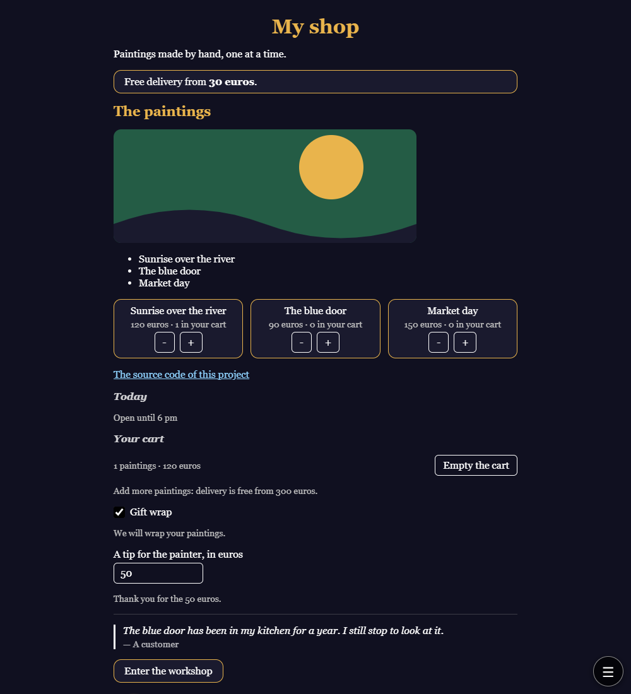

- 82 tests du moteur. Vérifié dans Chrome : 999 écrit dans le champ devient 50 ; après rechargement, la case, le pourboire et le panier sont encore là.

**Ce qui reste de l'étape 3**

- Le champ de texte (un nom, une recherche). Il demande des valeurs qui soient du texte : c'est le prochain morceau.

**Limite vue**

- La page arrive du serveur avec les valeurs de départ, puis prend les valeurs gardées : on peut voir « 0 » un instant.

---

## 2026-10-04 — Étape 2 du planning : le temps, le hasard, le plateau, et un premier jeu

**Fait** (`ADR-026`, à l'essai)

- **Un jeu entier, sans une ligne de code** : `exemples/jeu/attraper.holo`. On touche une étoile le plus de fois possible en trente secondes ; elle change de place chaque seconde, et chaque fois qu'on la touche. Soixante lignes, commentaires compris.

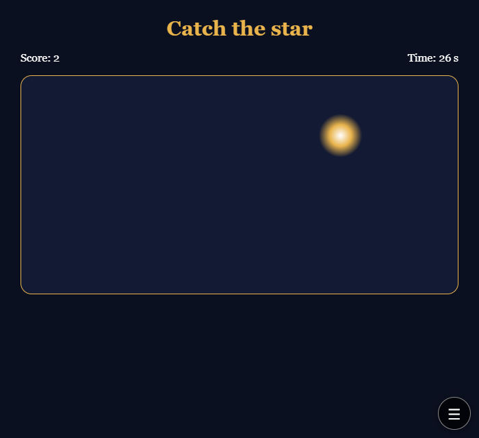

- Trois mots de plus, ceux que le jeu demandait :
  - **`Every(1s, effect: …)`** : une règle qui se répète. L'horloge se tait quand on ne regarde pas.
  - **`random`** : `star_x.random(100)` tire un nombre de 0 à 100. Le hasard est rejouable : une suite fixée par le nom de la page.
  - **`Board`** : un plateau où l'on place un bloc par `x` et `y`, de 0 à 100. Si `x` est le nom d'une valeur, le bloc la suit.
- Commencer et finir n'ont demandé aucun mot : le temps ne descend pas sous zéro, et les conditions montrent le jeu ou l'écran de fin.
- 81 tests du moteur. Joué dans Chrome : « Play », 30 secondes ; l'étoile bouge ; deux touchers, score 2.

**Limites**

- Les règles `Every` tournent tant que la page est ouverte, même le jeu fini : elles demandent, et rien ne change.
- Pas de meilleur score : on ne compare pas deux valeurs.
- L'étoile saute d'une place à l'autre : pas de mouvement continu.
- `x` et `y` écrits hors d'un plateau sont ignorés en silence. À refuser.

---

## 2026-10-04 — Les conditions décidées à un seul endroit

**Ce que Yocthan a dit**

- Sur la limite signalée (les conditions calculées à deux endroits) : « Tu réunis, tu fais ce qu'il y a à faire, et après on passe au point 2. »

**Fait**

- Une condition n'est plus décidée qu'à un endroit : dans le moteur (`etat::conditions`), au premier affichage comme après chaque changement. La page d'entrée ne compare plus rien : elle demande au moteur et cache ce qu'il dit faux.
- Au passage : l'aperçu d'un autre fichier, dans un portail, montre ses propres valeurs et ses propres conditions, et non celles du fichier où l'on est.

---

## 2026-10-04 — Étape 1 du planning : les conditions, et le texte qui manquait

**Ce que Yocthan a dit**

- Sur les cibles et le planning en sept étapes : « Oui, commence. »

**Fait** (`ADR-025`, à l'essai)

- **Les conditions** : `If(count, is: 0, children: [...])`. Quatre comparaisons, en mots : `is`, `not`, `over`, `under`. Plusieurs valent ensemble. Pas de « sinon » : on écrit une seconde condition.
- **Le texte** : `Hr()` (un trait), `Quote("…", by: "…")` (une citation), `Code("…")` (du texte tel quel), les accents graves dans une phrase, le retour à la ligne gardé dans un texte entre trois guillemets, `Image(alt:)`.
- La boutique : « Your cart is empty » disparaît au premier ajout ; un message annonce la livraison offerte, et un code apparaît à partir de 300 euros. Sa jumelle web fait de même, en montrant et cachant à la main.

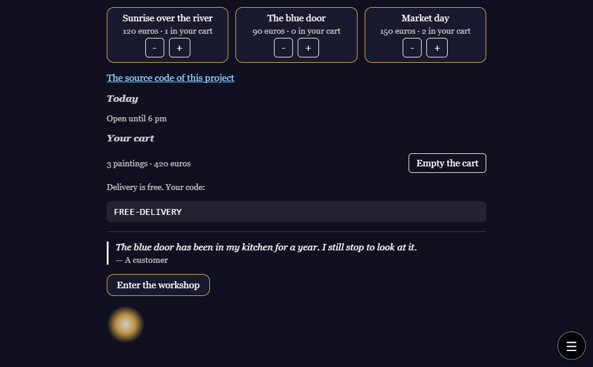

- 78 tests du moteur. Vérifié dans Chrome : les quatre conditions de la boutique changent bien au fil des ajouts.

**Ce qui n'est pas fait, alors que c'était annoncé**

- **Les listes répétées.** Répéter un bloc pour chaque article demande des valeurs qui soient des listes ; nous n'avons que des nombres. Claude l'avait mis dans l'étape 1 sans voir cette dépendance. Reporté.
- `alt` reste facultatif : l'obliger casserait la suite de conformité partagée avec les prototypes des autres IA.

**Limites**

- Les conditions sont évaluées deux fois : en Rust au premier affichage, en JavaScript ensuite. Deux copies d'une même règle peuvent diverger.
- On ne compare qu'à un nombre écrit dans le fichier. Pas de « ou ».

**Erreurs en route**

- Une ligne rangée dans une condition s'affichait en colonne : la règle de style de la condition passait après celle de la ligne. Vu sur la capture, corrigé.
- Le texte tel quel avait deux fonds superposés. Vu sur la capture, corrigé.

---

## 2026-10-04 — Les cibles par famille et un planning en sept étapes

**Ce que Yocthan a demandé**

- Se rapprocher au maximum dans chaque famille, avec un équilibre : « HoloCode ne cherche pas seulement à être un langage, mais un langage qui permet de faire à la fois du web et du jeu dans le web. Donc, en gros, un métavers. » Il évoque les mondes créés à partir d'une vidéo. Il veut la cible pour chaque famille et un planning pour l'atteindre vite.

**Proposé par Claude** (dans `docs/01-holocode/COMPARATIF-CONCURRENTS.md`)

- Cibles : 70 % de SolidJS pour le web, 50 % de Three.js pour la 3D, 30 % de Roblox et 10 % d'Unreal pour le jeu, 40 % de Rust sans le chercher.
- Sept étapes, une trentaine de séances : conditions et listes ; le temps, le hasard et un premier jeu ; formulaires ; objets qui bougent ; imports et données ; formes, images, son et modèles ; partie gardée et jeu à plusieurs.
- Les mondes tirés d'une vidéo ne sont pas dans le planning : le calcul se fait sur des serveurs ; HoloCode pourrait en accueillir le résultat après l'étape 6.

**Rien n'est décidé ni construit.** L'ordre des étapes attend l'accord de Yocthan.

---

## 2026-10-04 — Le garde-fou de fusion avait un trou

**Erreur**

- La pull request 56 (un document) a été fusionnée alors qu'un de ses cinq tests n'était pas fini : le script a affiché « 5 terminés, tous verts » avec seulement quatre résultats. Le test est passé ensuite, et `main` est au vert. Mais le garde-fou n'a pas tenu son rôle.

**La cause**

- `outils/fusionner.sh` lisait l'état des tests en trois appels séparés. Le dernier test s'est terminé entre deux lectures : compté « terminé » par l'une, sans résultat pour l'autre, et un résultat vide n'était pas refusé.

**Corrigé**

- Une seule lecture par tour. Un test sans résultat compte comme « en cours ». La fusion est refusée tant qu'il en reste un.

---

## 2026-10-04 — HoloCode face aux meilleurs de chaque famille ; ce qui manque pour un jeu

**Ce que Yocthan a demandé**

- La liste des frameworks et des langages concurrents de JavaScript, les plus rapides, proches ou non du métavers. Puis : prendre le meilleur de chaque famille, l'aligner, et dire à combien de pour cent HoloCode s'en approche ou le dépasse. Il a relevé qu'Unreal manquait.
- « Il faudra qu'on pense à créer des outils, ou à rajouter des mots dans le langage, pour pouvoir construire un vrai jeu à 100 % sur HoloCode. »

**Fait**

- `docs/01-holocode/COMPARATIF-CONCURRENTS.md` : HoloCode face à SolidJS (35 %), Rust (30 %), Three.js (20 %) et Unreal (3 %), critère par critère. Ce sont des jugements de Claude, pas des mesures, sauf deux lignes. Conclusion : HoloCode ne gagne nulle part sur la puissance, partout sur la facilité, et il est seul à faire d'un même fichier un site lisible et un monde.
- Dans le même document : les dix choses qui manquent pour écrire un jeu, et une méthode (un premier jeu très petit, qui ne demande que les conditions, le temps et le hasard).

**Rien n'est construit.** Le premier jeu et ses mots attendent le choix de Yocthan.

---

## 2026-10-04 — Yocthan valide le panier et la disposition ; première comparaison de vitesse avec le web

**Ce que Yocthan a dit**

- Il a essayé : le bouton unique (« c'est pas mal, j'ai bien aimé »), le Big Bang (« ça fonctionne comme prévu »), le panier (« ça fonctionne »).
- Sur ce qui était à l'essai : « Oui, j'ai kiffé. Les paniers, les états, tout ça. Valide-le pour l'instant. »
- Ensuite : comparer avec d'autres sites, « histoire de voir si le langage est plus rapide que la majorité des langages ou pas ».
- Le téléphone : déjà essayé deux fois aujourd'hui, inutile d'insister. « Si quelque chose passe, ça veut dire que ça marche. » Un téléphone d'entrée de gamme : pas avant trois mois.
- Les trois personnes : plus tard. Pour l'instant, le cycle reste entre lui et les IA.
- Codex : il attend le retour du quota. Il va dormir.

**Fait**

- `ADR-023` (le panier) et `ADR-024` (la disposition) passent d'`EXPÉRIMENTATION` à « `ACCEPTÉ` pour l'instant », sur sa décision. L'écriture reste à revoir avec les noms.
- Première mesure, boutique en HoloCode contre la même en HTML, CSS et JavaScript, dans `exemples/boutique-comparee/README.md`. Résultat dit sans détour : HoloCode n'est pas plus rapide (premier affichage à peu près égal), il est près de cent fois plus lourd à la première visite (le moteur, 570 Ko, téléchargé une fois), et l'auteur écrit deux fois moins de lignes, sans JavaScript.

**À ne pas refaire**

- Ne plus redemander le téléphone à chaque message. Yocthan le rebranchera quand il voudra une mesure.

**Suite possible**

- Comparer avec React, Vue ou Svelte demande de les installer : à lui de le dire.

---

## 2026-10-04 — Un seul bouton pour les outils du moteur ; un prompt pour Codex sur les animations

**Ce que Yocthan a dit, après avoir essayé les sept fichiers**

- Les animations du salon et du jardin sont presque celles qu'il cherchait. « Après révision, je me suis rendu compte que c'est moi qui avais tort. C'est pas vraiment mal, mais il y a quand même des changements à faire. » Il veut faire évaluer les animations par ChatGPT (Codex) et avoir sa proposition.
- Il y a trop de boutons, partout. Il en veut un seul, en bas à droite, « comme une superposition sur Android », « comme les menus dans les jeux » : on appuie, les autres apparaissent, et une croix referme.

**Fait**

- Les outils du moteur (Vue points, Carrefour, Tourner, De face) sont rangés derrière un seul bouton rond, en bas à droite. On appuie : ils apparaissent au-dessus ; le bouton devient une croix. Échap referme aussi. Changer de vue ou ouvrir le carrefour referme le menu ; « Tourner » le laisse ouvert, pour garder « De face » sous la main. Seuls les outils utiles à la page sont listés : sur le salon, il n'y a que « Carrefour ».

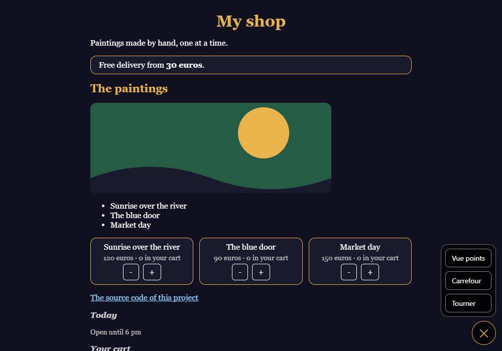

- Le prompt pour Codex : `docs/05-discussions/prompts/2026-10-04-codex-animations.md`.

**Ce qui n'est pas fait**

- La porte du Big Bang (`index.html`) garde ses deux boutons, « pause » et « mesures ».
- Le bouton rond recouvre le coin du site : un site qui a quelque chose à cet endroit sera gêné. À voir avec l'avis de Codex.

---

## 2026-10-04 — Un bouton est un lien : un passage ordinaire, pas un point qui s'ouvre

**Ce que Yocthan a dit**

- Le site fait ce qui était prévu, sauf « Enter the workshop » : l'animation part du point lumineux sous le bouton, pas du bouton, et grossit comme si elle absorbait le visiteur. « Quand tu entres par une porte, est-ce que tu as besoin d'une animation bizarre ? Par défaut, il faut des animations normales. » « C'est même pire que le web ancien. » « Il y a certains endroits où ça doit fonctionner comme le web normal, et d'autres où ça doit fonctionner comme le métavers. Là, tu chamboules tout. C'est un désordre, visuellement. »

**L'erreur de Claude**

- En retirant le carrefour, Claude a fait partir du point l'animation d'un clic sur le bouton. Le visiteur appuie à un endroit et voit quelque chose bouger ailleurs : il ne peut pas comprendre. Et un bouton qui mène ailleurs est un lien ; il n'a pas à déclencher un effet de métavers.

**Corrigé**

- Par un **bouton** : un passage ordinaire, comme sur le web. La page s'efface, la suivante apparaît, en un tiers de seconde. Pareil pour revenir (« Back to the shop »).
- En touchant **le point lui-même** : le point s'ouvre où il est et grandit. C'est là qu'on est dans le métavers, et le mouvement part de ce qu'on a touché.
- Avec les animations réduites, le changement est immédiat.

**À retenir**

- Le mouvement part toujours de ce que le visiteur a touché.
- Web normal par défaut ; l'effet de métavers seulement là où le visiteur agit sur un objet du métavers (un point, le zoom).
- Yocthan dit qu'une version de la veille, « vers 2 heures », était parfaite. Claude ne sait pas laquelle ; à lui demander ce qu'elle faisait.

---

## 2026-10-04 — Entrer dans un point y mène directement

**Ce que Yocthan a vu**

- En appuyant sur « Enter the workshop », il y a bien une transition, mais il arrive sur le carrefour au lieu d'arriver dans l'atelier. « Le carrefour, c'est utile quand l'utilisateur a choisi de mettre d'autres mondes comme destination. Quelqu'un qui est déjà habitué au web ne va pas trouver ça normal. »

**Corrigé**

- Entrer dans un point mène directement au site : le point s'ouvre là où il est sur la page, grandit jusqu'à remplir la fenêtre, et devient le site. Pareil pour un point touché, un point planté dans un pixel, et un point qui mène à un autre fichier du même serveur.
- Le carrefour ne s'ouvre plus que sur demande : son bouton, ou une règle `portals`.
- Exception gardée : vers le fichier d'un autre serveur, on passe encore par le carrefour, qui affiche le nom du serveur et attend un clic. C'est une protection demandée par Codex.
- Guide et `ADR-022` mis à jour.
- Vérifié dans Chrome : de la boutique à l'atelier, et du salon au jardin (un autre fichier), sans carrefour. Le panier suit.

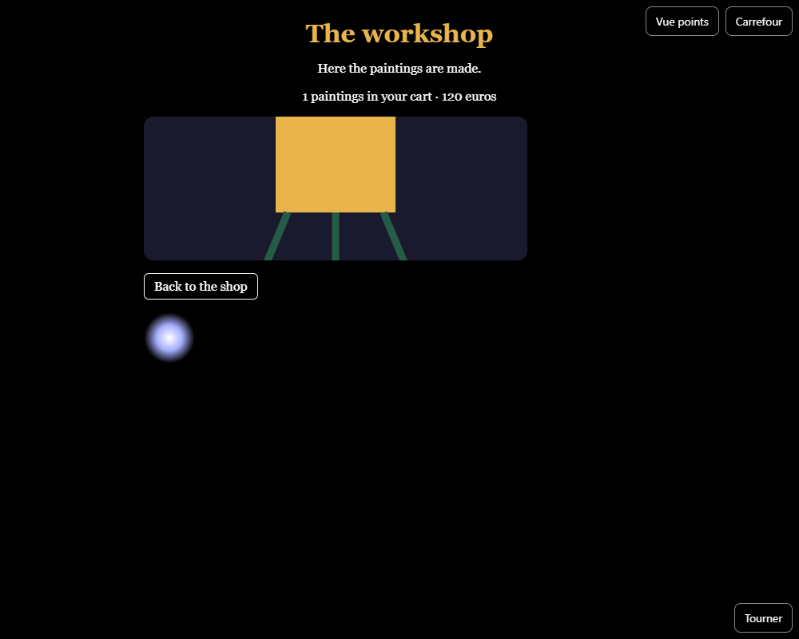

**Erreur de Claude**

- Ce passage obligé par le carrefour datait du 3 octobre. Il mélangeait deux choses : aller quelque part, et choisir où aller. Claude ne l'avait pas vu comme un défaut.

---

## 2026-10-04 — Big Bang : le point nous absorbe, au lieu de disparaître

**Ce que Yocthan a vu**

- Il a demandé d'ouvrir tous les sites pour les essayer. Dans le Big Bang : « Le point devrait s'agrandir et nous faire immerger à l'intérieur. Ici, en grossissant, au lieu de nous absorber, il disparaît. C'est un gros problème. »

**La cause**

- On entrait dans le point visé à un zoom fixe, alors qu'il n'occupait encore qu'un quart de l'écran. L'image était alors remplacée d'un coup par le nouveau monde, dessiné comme un petit point entier. Le point n'avait pas le temps de nous entourer : il sautait.

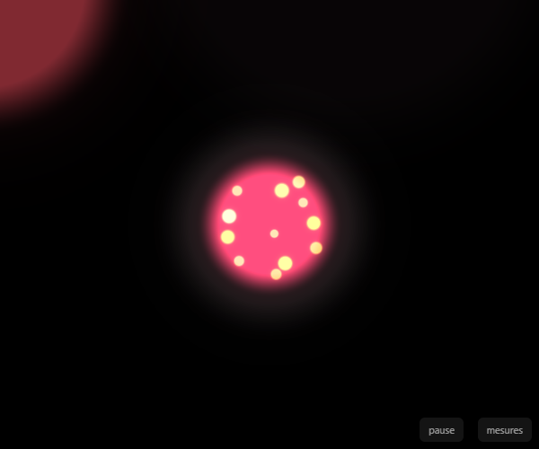

**Corrigé**

- On entre quand le point visé déborde de l'écran de tous les côtés.
- Le monde qu'il contient se voit dedans et grandit avec lui ; ses points sont placés exactement là où le nouveau monde les dessine une fois entré. Un test le vérifie : aucun point n'apparaît d'un coup.
- La couleur du point, qui remplissait l'écran, se dissipe autour de nous en moins d'une demi-seconde.
- En ressortant, on retrouve le point quitté à la taille qu'avait son monde, refermé.

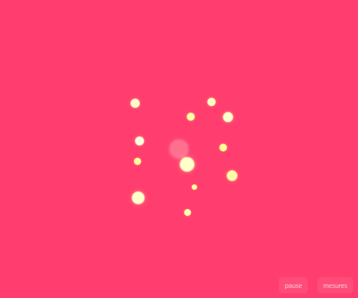

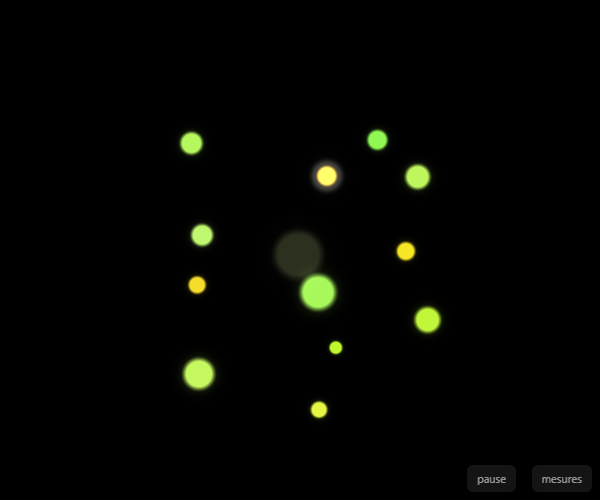

- 76 tests du moteur.

**Ce qui change par ailleurs**

- Il faut zoomer plus longtemps pour entrer dans un point (environ une fois et demie plus).
- Le téléphone n'était plus détecté par le câble : les sites n'ont été ouverts que sur l'ordinateur.

---

## 2026-10-04 — Le mode de secours mesuré sur le Flip 3

**Fait**

- Yocthan a déverrouillé le Flip 3. Mesure en WebGL 2, forcé par `?webgl` : 60,2 images par seconde en zoomant dans le Big Bang, 59,8 en vue points sur la boutique (image la plus lente : 33 ms), entrée en vue points en 318 ms, 86 Mo pour l'onglet. Détail dans `moteur/README.md`.
- Le réglage « rester allumé sur USB » a été activé pour la mesure, puis remis.

- Corrigé au passage, le défaut noté plus bas : un bouton touché avant que le moteur soit prêt n'est plus perdu. Le toucher est noté, puis rejoué dès que le moteur est là.

**Ce que cela dit, et ne dit pas**

- Le chemin de secours marche et n'est pas plus lent que WebGPU sur ce téléphone.
- Le Flip 3 reste un téléphone puissant : la moitié du risque relevé par Gemini est levée, pas l'autre. Un téléphone d'entrée de gamme reste à mesurer.

---

## 2026-10-04 — Le panier a des prix et un total

**Ce que Yocthan a dit**

- « Tu as des champs libres. » Dit une seconde fois, après la proposition de panier.

**Fait**

- Claude a construit l'option qu'il recommandait (la plus petite), à l'essai : `prices: Prices(sunrise: 120, blue_door: 90)` donne le prix de chaque article ; le moteur calcule `{count}` (le nombre d'articles) et `{total}` (ce qu'ils coûtent). L'auteur n'écrit aucun calcul. Détail dans `ADR-023`.
- La boutique : chaque tableau a ses boutons « + » et « - », et le panier affiche le nombre et le total. Sa jumelle en JavaScript fait la même chose, avec une boucle et un affichage remis à jour à la main.

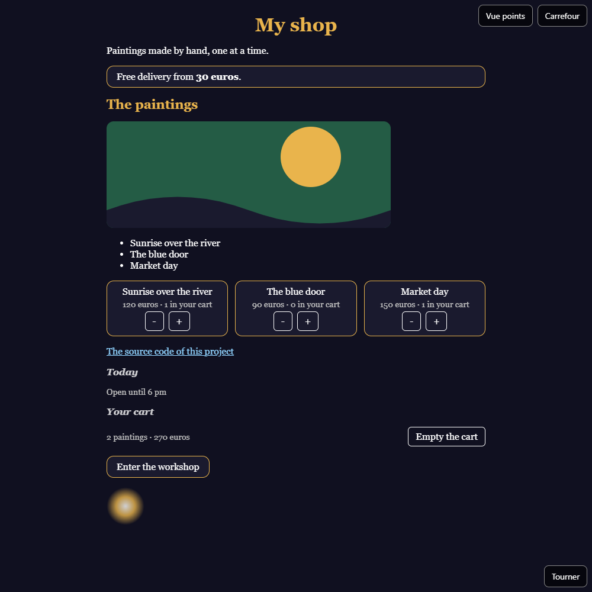

- Vérifié dans Chrome : 120, 240, 390 euros ; retirer un tableau absent ne change rien ; puis 270. 74 tests du moteur.

**Choix faits par Claude, à juger par Yocthan**

- Les mots `Prices`, `{count}`, `{total}`. Avec `prices:`, les noms `count` et `total` sont pris par le moteur ; sans, ils restent libres.
- Un prix est un nombre entier : pas de centimes.

**Limites**

- Les articles sont écrits d'avance dans le fichier. Le panier est un affichage, pas une commande.
- Vider le panier demande une règle par article.
- Trouvé en essayant : depuis que le serveur envoie la page déjà fabriquée, les boutons sont visibles avant que le moteur soit prêt, et un clic fait pendant ce temps est perdu. Sur téléphone, au tout premier chargement, cela peut durer quelques secondes. À corriger.
- Le mode de secours n'est toujours pas mesuré sur le Flip 3 : téléphone verrouillé.

**Erreur en route**

- Le premier essai du panier affichait « 0 » après chaque clic : c'était le défaut ci-dessus, la capture cliquait avant que le moteur soit prêt.

---

## 2026-10-04 — Les points s'activent ; un plancher de lisibilité ; proposition pour le panier

**Ce que Yocthan a dit**

- Il n'avait pas compris les quatre points posés après la réponse de Gemini. Claude les a réexpliqués avec un exemple chacun.
- Puis : « J'ai confiance en toi. Je suis toutes tes recommandations. Tu as le champ totalement libre pour faire ce que tu trouves bien pour le projet. »

**Fait, sur ces quatre points**

1. **Les points s'activent.** Sans `points:` dans le fichier, une page ne devient jamais des points : on la grossit pour lire, c'est tout. Planter un site dans un pixel (`pixels:`) les active aussi. `relief:` sans points est refusé.
2. **Plancher de lisibilité.** `Points(after:)` va de 2 à 16 (avant : de 1 à 16). On peut toujours doubler la taille du texte.
3. **Le panier avec articles et total : une proposition, rien de construit.** Trois options comparées dans `proposals/Claude/panier-articles-2026-10/README.md` ; Claude recommande la plus petite (des quantités et une table de prix).
4. **Le mode de secours.** `?webgl` dans l'adresse fait passer le moteur en WebGL 2, pour le mesurer. Essayé sur le PC : 60 images par seconde dans le Big Bang.

- Vérifié dans Chrome : le salon (sans `points:`) s'arrête à un zoom de 4 et reste une page, sans bouton « Vue points » ; la boutique (avec `points:`) passe en points comme avant.
- 72 tests du moteur.

**Ce qui n'est pas fait**

- La mesure du mode de secours sur le Flip 3 : le téléphone était verrouillé.

**Jusqu'où va le « champ libre », tel que Claude le comprend**

- Il vaut pour construire ce qui a été recommandé et expliqué. Il ne change pas les règles écrites : les statuts des décisions restent à Yocthan, les noms attendent Codex, une pull request d'une autre IA attend son accord.

---

## 2026-10-04 — La seconde réponse de Gemini (au prompt du jour), lue par Claude

**Ce que Yocthan a apporté**

- La réponse de Gemini au prompt du 4 octobre : cohérence 2D et 3D, lisibilité, l'état, les mots, trois risques, un tableau de recommandations. Le prompt datait d'avant la disposition : son troisième risque (« pas de `Row` ») est déjà levé.

**Ce que Claude retient**

- Gemini donne raison à Yocthan sur le fond : partout (WebXR, Google Maps, visionOS), l'auteur offre la 3D et le visiteur la déclenche par un geste. Il répond aussi à la question laissée ouverte : pour lui, le passage en points doit s'activer par l'auteur, comme la rotation.
- Une règle d'accessibilité précise (WCAG 1.4.4) : le texte doit pouvoir grossir jusqu'à 200 % en restant du texte. Notre défaut est à 400 %, mais le langage permet `Points(after: 1)` : la borne basse devrait être 2.
- Pour le panier : la suite la plus petite serait une liste d'articles tenue par le moteur, avec un nombre et un total qu'il calcule lui-même (`{cart.count}`, `{cart.total}`), sans formule écrite par l'auteur.
- Les noms : il garde `State`, `add`, `sub`, `set`, `Relief`, `Points`, `Portals`. Il conteste `tilt`, `after`, `fragment`, `grid`, `depth`, `shrink`, `levels`. Parmi ses propositions, celles en un seul mot vont avec le style du langage : `turn`, `from`, `divisions`, `steps`.
- Le risque numéro un reste le téléphone d'entrée de gamme, jamais mesuré, et le repli sans WebGPU, jamais mesuré non plus.
- Une idée simple : faire essayer la boutique à trois personnes qui ne connaissent pas le projet.

**Ce que Claude conteste**

- « visionOS exige un bouton » et « `model-viewer` ne s'éveille qu'au clic » sont trop affirmés : une application visionOS peut s'ouvrir directement en immersif, et `model-viewer` se révèle par défaut dès qu'il est chargé. La tendance qu'il décrit est juste, pas la règle absolue.
- « L'onglet plantera dès le premier million de points » : au repos, ce million est une image ; le moteur ne dessine jamais plus de quelques milliers de points. Cela reste à mesurer, mais ce n'est pas acquis.
- Ignorer `tilt` quand les animations sont réduites : tourner est un geste volontaire, par un bouton. Claude le laisserait offert.
- `zoomAt`, `splitAt`, `maxNesting` : deux mots collés, contre le style du langage.

**Rien n'est décidé.** Les noms attendent Codex. Le passage en points à activer, la borne de `after` et la suite du panier attendent le feu vert de Yocthan.

---

## 2026-10-04 — La disposition ; la page fabriquée d'avance en Rust ; animations réduites ; un garde-fou de fusion

**Ce que Yocthan a dit, après la lecture de Gemini**

- Réduire les animations : cela s'active ou se désactive, « ça dépendra de chacun », et par défaut on reste au niveau normal, pour ne pas perturber.
- « Il faut vraiment qu'on voie le Row et les colonnes. »
- La sortie HTML côté serveur : d'accord, « mais c'est mieux de connecter avec un langage bas niveau ».
- Les noms : faire ce qu'il y a à faire en attendant Codex, puis lui donner la liste de tous les noms face à ceux de HTML, CSS et JavaScript.
- Les fusions : corriger ce qui peut conduire en erreur.

**Fait**

- **La disposition** (`ADR-024`, à l'essai) : `Row`, `Column`, `Grid`, avec `gap`, `align`, `columns`. Une ligne trop longue passe à la ligne ; une grille perd des colonnes sur un écran étroit. La boutique a une grille de trois tableaux et les boutons du panier côte à côte ; sa jumelle web aussi.

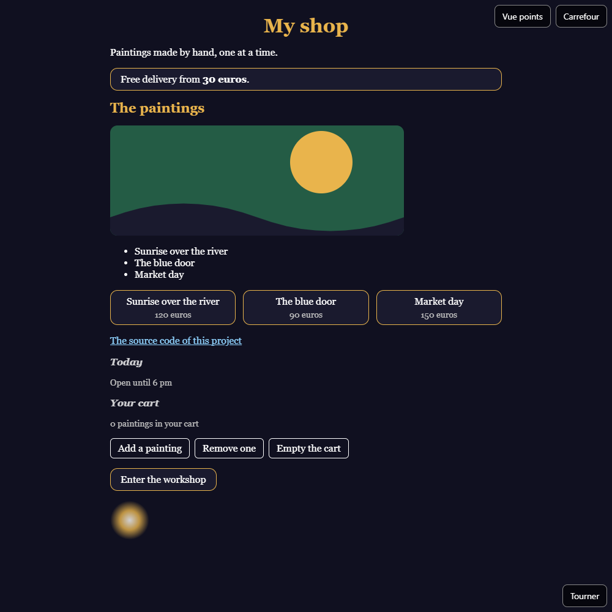

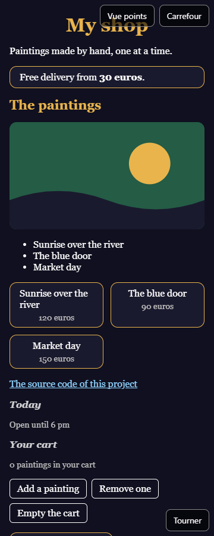

- **La page fabriquée d'avance, en Rust.** `moteur/src/bin/holo.rs` : le même moteur, compilé pour le PC. `holo check` vérifie un fichier, `holo html` écrit sa page. Le serveur de démonstration s'en sert : la page arrive avec son contenu et son titre, lisible par un robot ou un navigateur qui ne lance pas le moteur. Sans ce programme, tout marche comme avant.
- **Animations réduites.** C'est le réglage que chacun a déjà dans son téléphone ou son ordinateur. Sans lui, niveau normal. Avec lui : la page ne devient pas des points toute seule au zoom, pas de transition de portail. Le bouton « Vue points » reste offert.
- **Un pixel planté est un vrai bouton** : on l'atteint au clavier, un lecteur d'écran dit son nom.
- **`outils/fusionner.sh`** attend la fin des tests et refuse la fusion s'ils ne sont pas tous verts.
- **`docs/01-holocode/NOMS.md`** : chaque mot de HoloCode face à celui du web (repris, changé, nouveau), puis les mots du web qu'on n'a pas pris.
- 72 tests du moteur.

**Ce qui n'est pas fait**

- En vue points, un lecteur d'écran ne lit toujours rien.
- La sortie HTML d'avance ne vaut que pour le serveur de démonstration ; il n'y a pas encore de vrai hébergement.
- « Réduire les animations » suit le réglage de l'appareil ; il n'y a pas de bouton dans la page pour le changer. À voir avec Yocthan si c'est ce qu'il voulait.
- Le nouveau bloc `Grid` porte le même mot que `Points(grid:)` : collision à trancher avec les noms.

**Erreurs en route**

- Le test du vocabulaire a échoué dès l'ajout de `Row` : la boutique ne l'employait pas encore. C'est son rôle.
- Le serveur tenait une variable `HOLO_DEPOT` vide pour un dossier : corrigé.

---

## 2026-10-04 — La réponse de Gemini (au premier prompt), lue par Claude

**Ce que Yocthan a apporté**

- La réponse de Gemini : comparaison avec dix technologies, antécédents historiques, critique de l'ordre des chantiers, critique des noms, accessibilité, trois risques.
- Elle répond au prompt d'avant : elle dit que `State` n'existe pas, alors que le panier a été fusionné le même jour. Le prompt du 4 octobre (`docs/05-discussions/prompts/2026-10-04-gemini.md`) reste à lui donner.

**Ce que Claude retient comme juste**

- Les antécédents vont dans le sens de Yocthan : JanusVR a échoué parce qu'il fallait marcher vers une porte pour lire la page suivante ; Prezi a donné le mal des transports. Donc le site normal d'abord, et la 3D activée par l'auteur.
- Un site caché dans un pixel ne se devine pas : le défaut de `pixels:` est la découvrabilité.
- Noms : `grid` heurtera la future disposition en grille ; `tilt` ne dit plus « faire le tour » ; `depth` et `levels` se ressemblent trop.
- Accessibilité : la vue points ne tient pas compte de « réduire les animations » ; en vue points, rien n'est dit à un lecteur d'écran ; un pixel planté n'est pas atteignable au clavier.
- Un robot ou un vieux navigateur qui n'exécute pas le moteur ne voit rien : il manque une sortie HTML faite côté serveur.
- Les imports arrivent trop tard dans l'ordre des chantiers.

**Ce que Claude conteste**

- « Batterie cinq à dix fois plus élevée », « onglet tué à 300 ou 400 Mo » : aucun chiffre sourcé. Mesuré ici : 88 et 99 Mo, et aucune image dessinée par le moteur tant qu'on lit la page.
- « Activer le moteur seulement au seuil de zoom » : c'est déjà le cas.
- Les noms proposés (`attachTo`, `maxRecursion`, `triggerScale`) sont en deux mots collés, contre le style du langage ; et `levels` proposé pour `depth` existe déjà dans `Zoom`.
- « Le compilateur refuse qu'on cache une information essentielle dans un point » : un vérificateur ne sait pas ce qui est essentiel.
- Une erreur de date : Pad est de 1993 (Perlin et Fox), Pad++ de 1994 (Bederson et Hollan).

**Rien n'est décidé.** Les noms attendent Codex ; les suites proposées par Claude attendent le feu vert de Yocthan.

---

## 2026-10-04 — Le panier, première action avec état ; la rotation s'active

**Ce que Yocthan a dit**

- « De face, la rotation ne marchait pas. » Il veut qu'elle marche de face, mais qu'elle soit activée, pour la cohérence : « Si d'autres peuvent donner tout le temps en 3D, ça va vraiment déranger la vision et la lisibilité du site. »
- « Fais le panier. On va voir ce que ça donne. Et après, on va en juger. »
- Les noms attendront le retour de Codex, dont les quotas sont épuisés. Le téléphone : essayé, c'est bon.
- Il donne maintenant le prompt à Gemini, et veut le texte dans un fichier.

**Fait**

- **Le panier** (`ADR-023`, à l'essai). `state: State(cart: 0)` déclare une valeur ; `{cart}` dans un texte l'affiche ; `cart.add(1)`, `cart.sub(1)`, `cart.set(0)` sont des demandes écrites dans l'effet d'une règle. L'arbitre est dans le moteur (`moteur/src/etat.rs`) : le bouton ne change rien lui-même. La boutique a son panier, et sa jumelle en HTML et JavaScript aussi, pour comparer. Le panier suit le visiteur dans l'atelier.

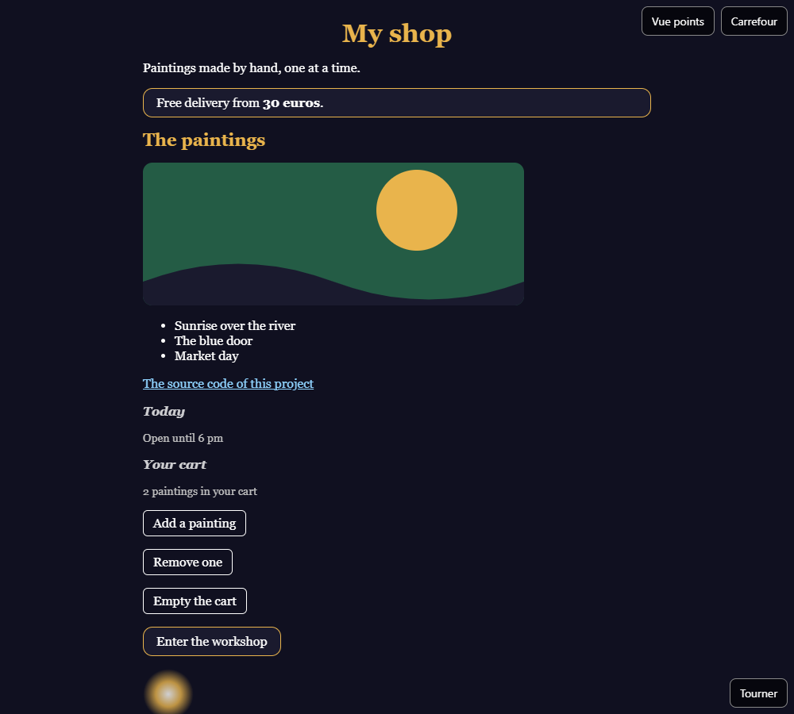

- **La rotation s'active.** Sans `Relief(tilt:)`, une page ne tourne plus : c'est un site ordinaire. Avec, le bouton « Tourner » est offert dès la page de face ; la page devient ses points sans que rien ne change à l'écran, puis tourne sous le doigt.

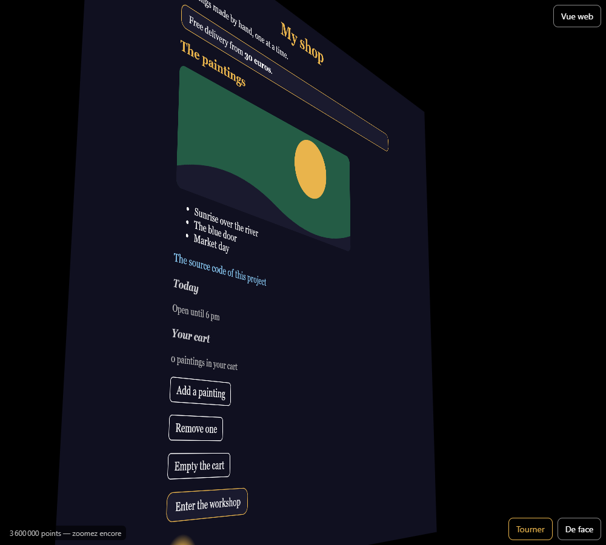

- Le prompt pour Gemini est dans `docs/05-discussions/prompts/2026-10-04-gemini.md`. Il se suffit à lui-même, Gemini n'ayant pas accès au dépôt.
- 71 tests du moteur. Vérifié dans Chrome : 0, 1, 2, 3, puis 2 après un retrait ; un retrait à zéro reste à zéro.

**Ce que Claude a compris, et qui reste à confirmer**

- « La rotation ne marche pas de face » a été lu ainsi : sur le site ordinaire, rien ne permettait de tourner ; il fallait d'abord passer en vue points. Si Yocthan voulait dire autre chose, c'est à reprendre.
- Le défaut de `tilt` a changé deux fois dans la journée : 52deg, puis 360deg, puis 0deg (éteint). Le dernier suit sa demande de cohérence.
- Le passage en points au zoom reste offert d'office. Doit-il lui aussi s'activer ? Question posée.

**Limites du panier**

- Des nombres entiers seulement ; pas de condition, pas de total ; rien n'est gardé après un rechargement.
- `cart.add(1)` ouvre une parenthèse avec une minuscule : une exception à la règle des majuscules, limitée à l'effet d'une règle.
- Pas encore de cas dans la suite de conformité.

**Erreurs en route**

- La première capture du panier était blanche : le serveur d'essai compressait encore le moteur quand la capture est partie. Refaite avec une attente plus longue.
- Le serveur d'essai lancé avec `HOLO_DEPOT` vide ne trouvait aucun fichier : une variable vide n'est pas une variable absente.

---

## 2026-10-04 — Faire le tour de la page ; deux réglages de plus ; le Flip 3 mesuré

**Ce que Yocthan a demandé**

- Mesurer sur son Galaxy Z Flip 3.
- « La rotation n'est pas à 360 degrés, elle est bloquée à un certain angle. »
- Créer les réglages utiles pour ce qui existe, et les mettre dans le langage s'ils n'y sont pas.
- Un téléphone modeste sera difficile à trouver : régler d'abord tous les paramètres, on verra ensuite.

**Fait**

- `Relief(tilt:)` va jusqu'à `360deg`, et c'est la valeur par défaut. On fait le tour de la page ; par derrière, on la voit à l'envers, comme une feuille tenue devant une lampe. Un auteur qui écrit `tilt: 52deg` garde sa limite.

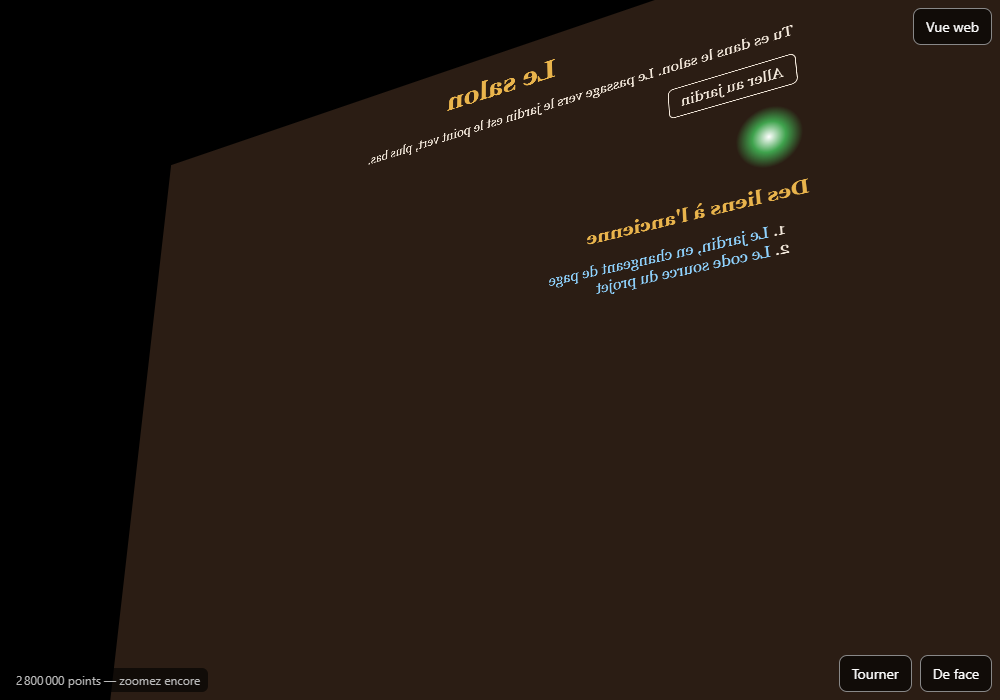

- Par derrière, pointer et glisser restent justes : le zoom vise l'endroit sous le doigt, la page suit le doigt. Vue par la tranche, le moteur ne calcule que les points proches de l'endroit regardé.
- Deux réglages existaient dans le moteur sans mot pour les écrire : `Zoom(speed:)` (vitesse du zoom à la molette, 0.25 à 4) et `Portals(duration:)` (temps d'ouverture d'un portail, 0ms à 2000ms). Guide, inventaire, boutique et `ADR-021` mis à jour ; 67 tests.
- Mesure sur le Flip 3 (Snapdragon 888, 2021), WebGPU : 60,3 images par seconde en zoomant dans le Big Bang, 60,2 en vue points (image la plus lente : 33 ms), entrée en vue points en 221 ms, 99 Mo pour l'onglet. Pas moins bien que le Flip 5.

**Ce qui n'est pas vérifié**

- Le pincement à deux doigts n'a été essayé que par simulation, pas avec de vrais doigts : à Yocthan de l'essayer.
- Tourner la page se fait par le bouton « Tourner », le bouton droit ou Maj. Au doigt, il faut passer par le bouton : pas de geste à deux doigts pour tourner.
- Toujours pas de téléphone modeste.

**Erreurs en route**

- Un test existant se servait de `speed` comme exemple de paramètre inconnu : il a échoué quand `speed` est devenu un vrai mot. Remplacé par un mot qui n'existe pas.
- La première capture « par derrière » montrait la boutique arrêtée à 52 degrés : le serveur lisait le fichier de la branche principale, où `tilt: 52deg` est encore écrit. C'était la limite de l'auteur qui jouait, pas un défaut. Capture refaite sur le salon.
- `sur_la_page` refusait tout regard venant de derrière la page : corrigé, avec un test.

---

## 2026-10-04 — Au doigt, le pincement ne menait plus aux points ; `ADR-010` accepté

**Ce que Yocthan a montré**

- Une vidéo de son téléphone : en pinçant la page de la boutique, elle grossit, mais ne devient jamais des points. « Les zooms ne donnent plus comme avant. »
- Sur la mesure : d'accord pour cocher la décision du moteur en Rust, tout en la vérifiant plus tard sur un téléphone plus modeste. Un Galaxy Z Flip 3 conviendrait-il ?

**La cause**

- Claude a lu la vidéo image par image. Au doigt, c'était le zoom de Chrome qui prenait le pincement : il grossit tout l'écran à sa façon, sans rien dire à la page. Le zoom de la page n'écoutait que la molette. La limite était écrite dans le journal du 3 octobre (« sur un écran tactile, le premier pincement n'est pas encore capté »), mais avec le zoom ordinaire ajouté ensuite, elle est devenue un vrai défaut : le chemin vers les points était fermé au doigt.

**Fait**

- La page suit maintenant le pincement à deux doigts, par le même chemin que la molette : la page vivante grossit jusqu'à `Points(after:)`, puis ses pixels deviennent des points, sans lever les doigts ; et dans l'autre sens au retour. Le zoom de Chrome est retiré sur ces pages ; on défile toujours avec un doigt.
- Vérifié dans Chrome avec deux doigts simulés : en les écartant, la page passe à un agrandissement de 4, puis en vue points.
- `ADR-010` (le moteur en Rust) passe de `EXPÉRIMENTATION` à `ACCEPTÉ`, sur décision de Yocthan après la mesure. Une condition de réexamen est ajoutée : la mesure sur un téléphone d'entrée de gamme.

**Réponse donnée sur le Z Flip 3**

- Il est utile à mesurer (deux ans plus ancien), mais ce n'est pas un téléphone modeste : c'était un haut de gamme en 2021 (Snapdragon 888, 8 Go). « Modeste » veut dire 4 Go de mémoire ou moins et un processeur d'entrée de gamme, comme un Galaxy A de la série basse.

---

## 2026-10-04 — La mesure sur téléphone, enfin

**Fait**

- Yocthan a branché son Galaxy Z Flip 5 par câble et activé le débogage USB. Claude a relié le téléphone au serveur du PC (`adb reverse`), puis lu les mesures du moteur directement dans le Chrome du téléphone (`adb forward` et le protocole de débogage de Chrome). L'outil est rangé dans `moteur/outils/mesurer-telephone.mjs`.
- Résultats, WebGPU actif :

| Mesure | Résultat |
|---|---|
| Big Bang, zoom continu à travers 7 mondes | 59,8 images par seconde, image la plus lente 16,9 ms |
| Première image, moteur en cache | 336 ms (3,5 s au tout premier chargement) |
| Boutique, page normale | prête en 122 ms, le moteur ne dessine rien |
| Boutique, entrée en vue points | 264 ms pour 1 118 880 points |
| Boutique, zoom en vue points, 4 morcellements | 59,7 images par seconde, jamais plus de 6 344 points à l'écran |
| Mémoire de l'onglet | 88 Mo en part propre, 10 Mo de tas JavaScript |

- C'est la mesure qu'attendaient `ADR-005` (tourner sur le matériel existant) et `ADR-010` (le moteur en Rust) depuis le premier jour. Elle est favorable. Leur statut reste à Yocthan.

**Ce que la mesure ne dit pas**

- Une seule série, sur un téléphone haut de gamme. Ni la batterie, ni l'échauffement dans la durée, ni le mode sans WebGPU, ni un téléphone modeste.
- Une image a pris 50 ms pendant le zoom en vue points : un accroc, à surveiller.

**Erreurs en route**

- L'ancienne adresse Wi-Fi donnée à Yocthan (`10.105.109.17`) n'était plus la bonne, et un VPN tournait sur le PC : par le câble, on évite les deux.
- Une première mesure a été prise pendant que l'écran du téléphone était en veille : une image en trois minutes. Jetée et refaite, écran allumé. Claude a activé puis remis le réglage « rester allumé sur USB ».

---

## 2026-10-04 — La seconde revue de Codex : ses défauts corrigés

**Ce qui s'est passé**

- Yocthan a envoyé à Codex et à Gemini les messages de relecture préparés par Claude. Codex a répondu par la pull request n° 39 : une revue critique, sept fichiers hostiles et un harnais de test. Yocthan a demandé de vérifier et de fusionner : fait, après lecture complète. Puis : « pour le reste, fais ce qu'il y a de mieux ».
- La revue est sérieuse. Elle montre que le guide promettait plus que le moteur ne tenait. Claude a relu son propre code et confirme chaque défaut repris ci-dessous.

**Corrigé**

| Défaut trouvé par Codex | Correction |
|---|---|
| `Zoom(max:)` ne bornait pas le zoom ordinaire | Il borne le zoom entier ; `Points(after:)` plus grand que `Zoom(max:)` est refusé |
| `Portals(count:)` ne bornait pas les sites écrits | Il borne tout le carrefour ; un rond « + N autres » dit ce qui n'est pas montré |
| La vérification acceptait `A(to: "javascript:…")` | Elle refuse tout ce que l'affichage refuserait |
| Une adresse en `#@…` contactait un autre serveur sans geste ; le carrefour lisait tous les fichiers distants | Un clic, un serveur, un fichier ; une adresse distante propose le passage |
| Chez quelqu'un d'autre, rien ne le disait plus | Un bandeau du moteur, « Vous êtes chez … », avec « Revenir » |
| `http` vers n'importe quelle adresse, y compris le réseau privé | `https` ; `http` seulement vers sa propre machine |
| Mémoire bornée en nombre de fichiers, pas en taille ; aucun délai | 256 Ko par fichier, 8 secondes, lecture arrêtée au-delà |
| `density: 3` pouvait demander des centaines de Mo | Huit millions de points au plus |
| `above:` acceptait un repère hors de l'écran | Le repère doit être dans le même site |
| Aucune limite avant l'analyse d'un fichier | 262 144 octets, 100 000 mots, 64 niveaux d'emboîtement |
| L'image de la page restait en mémoire après la vue points | Elle est rendue à la sortie |

- Les trois sondes de Codex qui constataient des défauts sont retournées : elles vérifient maintenant que ces défauts ne reviennent pas. Ce changement touche son dossier, avec l'accord de Yocthan.
- Vérifié avec deux serveurs locaux et de vrais gestes : zéro requête vers l'autre serveur à l'ouverture de la page, à l'ouverture du carrefour, et à l'arrivée par une adresse en `#@…` ; une seule après le clic ; le bandeau s'affiche, « Revenir » ramène.
- Tests du cœur : 66 sur 66 ; harnais de Codex : 7 sur 7.

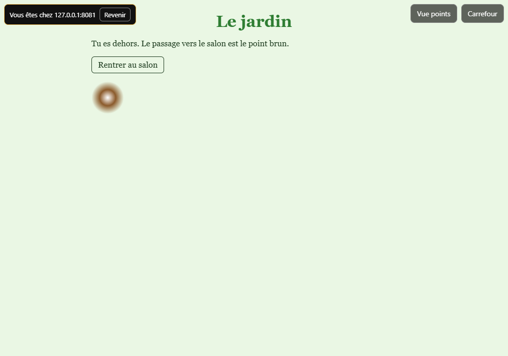

**Non corrigé, et dit**

- Le poids déclaré d'une image (`weight`) n'est pas comparé à son poids réel.
- Pas d'en-tête `Content-Security-Policy` sur le serveur de démonstration.
- Les noms : Codex en juge une dizaine mauvais et propose des remplacements. Rien n'est renommé : c'est à Yocthan de trancher. Claude lui a préparé les questions à poser à Codex.

**Leçon**

- Claude avait écrit dans le guide et dans `ADR-022` des protections qu'il n'avait pas vérifiées dans tous les chemins (l'adresse ouverte directement). Une promesse de sécurité s'écrit après l'avoir mise à l'épreuve, pas avant.

---

## 2026-10-03 — Les deux limites revues ; HoloCode comparé au web, balise par balise

**Ce que Yocthan a demandé**

- Revoir les deux limites annoncées : si elles sont bonnes, les laisser ; si elles sont mauvaises, les corriger. Il en donne l'autorisation.
- Que Claude fasse à fond sa part de la mise à l'épreuve face aux balises du web classique, puis lui donne la liste de ce qu'il doit faire de son côté.

**Les deux limites**

- « Seuls les fichiers rangés à côté sont acceptés » : mauvaise limite, corrigée. `Point(inside: "https://…/jardin.holo")` mène au fichier d'un autre serveur. Le portail affiche le nom du serveur ; un tel fichier n'est lu qu'à l'ouverture du carrefour, jamais d'avance ; il passe par le vérificateur. Le serveur local envoie l'en-tête qui autorise cette lecture.
- « Rien ne borne le nombre de passages » : bonne limite pour les passages (on tourne dans une maison autant qu'on veut), mauvaise pour la mémoire. Le moteur ne garde plus que les 32 derniers fichiers lus.
- Vérifié avec deux serveurs locaux sur deux ports, donc deux sites différents pour Chrome : bouton, carrefour (le portail affiche « Ailleurs · 127.0.0.1:8081 »), franchissement, arrivée dans le jardin de l'autre serveur sans rechargement ; un cran de dézoom ramène au départ ; l'adresse en `#@…` ouvre directement le fichier distant.
- Une contrainte des navigateurs, écrite dans `ADR-022` : la barre d'adresse ne peut pas montrer l'adresse d'un autre serveur ; elle affiche le fichier de départ suivi de `#@` et de l'adresse réelle.

**La comparaison**

- [`docs/01-holocode/COMPARAISON-WEB.md`](../01-holocode/COMPARAISON-WEB.md) : HTML balise par balise, puis CSS et JavaScript, avec pour chaque ligne « fait », « exprès » ou « manque ». Verdict écrit sans détour : HoloCode sait « lire et se promener », pas encore « agir » ; le manque le plus gênant est la disposition. Suit un ordre proposé en dix rangs pour combler les manques.

**Ce qui revient à Yocthan** (liste donnée dans la conversation)

- Mesurer sur le téléphone ; écrire un vrai petit site pour sentir ce qui gêne ; relire les noms proposés ; choisir l'ordre des manques ; faire relire par Codex et Gemini.

---

## 2026-10-03 — Aller ailleurs : le lien `A`, et le point qu'on traverse d'un fichier à l'autre

**Ce que Yocthan a posé**

- Entre les mondes, pas de rechargement ni de redirection : « on traverse la porte du salon et on va au jardin, avec les mêmes jambes ». Seuls l'animation et le zoom font la transition. Le lien normal reste pour un vrai changement de site, à l'ancienne. « Porte » était une façon de parler.
- Pourquoi le lien ne s'écrit-il pas `A`, comme en HTML ? Et les listes, les `UL`, `LI` ?
- Dézoomer doit faire ressortir du monde où l'on est.
- À noter en mémoire : tout ce qui se fait doit être documenté, et avoir son élément dans le langage, pour que lui ou quelqu'un d'autre puisse reprendre le travail.

**Fait** (`ADR-022`)

- `A("texte", to: "adresse")` : le lien classique. Claude avait proposé `Link` ; Yocthan a demandé `A`, et il a raison : c'est le mot de HTML, et `link` y désigne autre chose.
- `Point(inside: "jardin.holo")` : le monde d'un point peut être un autre fichier. On y passe sans changer de page : carrefour, portail, animation ; l'adresse devient celle de l'autre fichier ; « retour » ramène. Les fichiers voisins sont lus d'avance.
- Dézoomer, quand la page est à sa taille normale, fait ressortir : au site, au fichier, ou hors du monde calculé d'où l'on venait.
- `List(ordered: true)` numérote une liste ; un élément de liste peut être un lien. Pas de `UL`, `OL`, `LI`.
- Nouvel exemple, `exemples/maison/` : un salon sombre et un jardin clair, deux fichiers.
- Vérifié avec de vrais gestes envoyés à Chrome, une marque posée dans la page prouvant qu'elle n'a pas été rechargée : bouton « Aller au jardin », le carrefour s'ouvre sur le jardin ; clic sur le portail, l'adresse devient `jardin.holo`, le fond devient clair, la page n'a pas été rechargée ; un cran de dézoom, retour à `salon.holo`.
- Guide mis à jour (liens, listes, passage entre fichiers, inventaire). Tests du cœur : 64 sur 64.

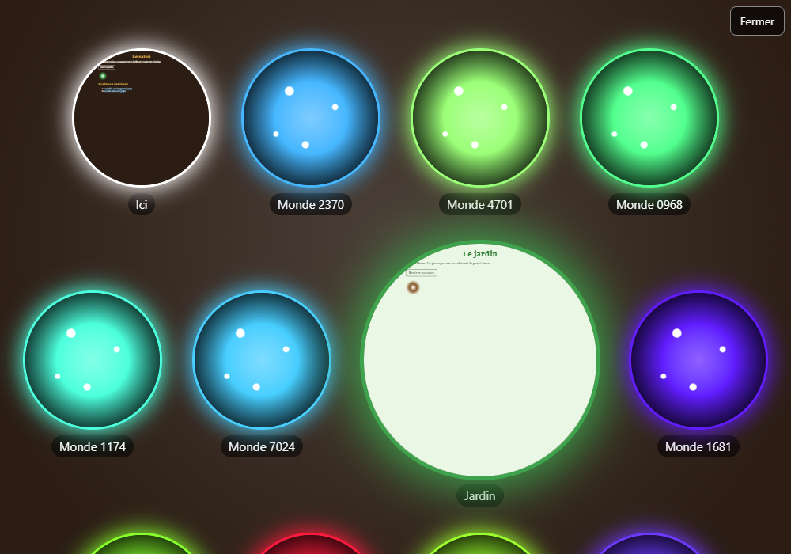

**Erreur trouvée en vérifiant**

- Les aperçus des portails laissaient déborder leurs styles : l'aperçu du jardin (clair) repeignait celui du salon. Chaque aperçu est maintenant enfermé.

**Limites**

- Seuls les fichiers rangés à côté sont acceptés, pas le site d'un autre auteur sur un autre serveur.
- Rien ne borne le nombre de passages entre fichiers.

---

## 2026-10-03 — Chaque notion a son mot ; un carrefour rempli de mondes

**Ce que Yocthan a demandé**

- Vérifier que chaque notion apportée au site a son équivalent, son mot-clé, dans le code source : l'image, le pixel, la fragmentation, les zooms ; et chaque action : activer ou désactiver le zoom, passer d'un site à l'autre. Le son n'a pas encore été travaillé.
- Le carrefour lui plaît, mais : il n'y a que deux ou trois mondes ; il veut que des mondes remplissent toute la page. Là où le curseur se pose, le monde doit apparaître comme avant (la feuille). Une petite lumière au fond, pour y voir s'il fait noir. Et un sens de défilement à choisir : à l'horizontale, à la verticale, en diagonale, en liste ou en grille.

**Fait**

- L'inventaire est dans le guide, partie « Chaque notion et son mot » : dix-sept notions ont leur mot, huit n'en ont pas encore (le son, la vidéo, le survol, réagir au zoom par une règle, la disposition, les liens entre fichiers, les formulaires, le personnage).
- Deux mots manquaient pour ce qui existait déjà, ils sont ajoutés : `Zoom(active:)` pour permettre ou interdire le zoom, et le bloc `Portals(layout:, count:, size:, brightness:)` pour le carrefour. La page gagne la capacité `portals` : `On(Map.tap, effect: Shop.portals)` ouvre le carrefour par une règle.
- Le carrefour remplit la fenêtre : les sites écrits dans le fichier d'abord, avec leur contenu, puis des mondes calculés à partir d'une graine, jusqu'à `count`. Chaque monde calculé est une boule de lumière de sa couleur ; un clic l'ouvre en profondeur (le Big Bang), à l'adresse `fichier.holo#~graine`, et « Retour » ramène au site.
- Là où le curseur se pose, le monde grandit et devient une feuille lisible.
- Le fond est éclairci par une lueur (`brightness`).
- Quatre dispositions : `grid`, `row` (on défile de gauche à droite), `column` (de haut en bas), `diagonal`.
- Vérifié avec de vrais gestes envoyés à Chrome : douze portails ; le survol agrandit ; un clic sur un monde calculé donne l'adresse `#~13044733080473193766` et le moteur dessine ; « Retour » ramène au site.
- Tests du cœur : 62 sur 62.

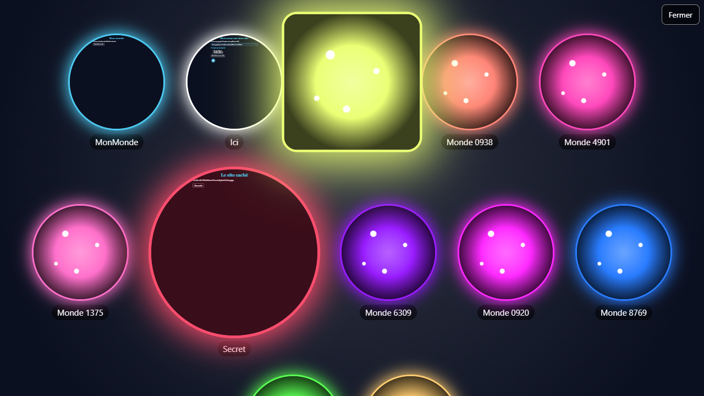

**Limites**

- Les mondes calculés ne contiennent pas de site : ce sont des univers de points. Y poser des sites écrits par d'autres personnes demande les liens entre fichiers.
- Les dispositions `row`, `column` et `diagonal` sont lues et appliquées, mais Claude n'a capturé que la grille.

---

## 2026-10-03 — Glisser déplace la page pendant tout le zoom

**Ce que Yocthan a relevé**

- Depuis le zoom ordinaire, on ne pouvait plus déplacer le site en glissant, à gauche ou à droite, comme on le faisait en vue points. Il ne savait plus comment se rapprocher d'un point : « ça devient n'importe quoi ».

**La cause**

- Claude avait fait deux zooms qui se suivent (la page vivante jusqu'à × 4, les points ensuite) avec deux façons de se déplacer : la barre de défilement d'abord, le glissement ensuite. Et en revenant des points, la page reprenait à l'endroit d'où l'on était parti, pas à celui où l'on était arrivé.

**Fait**

- Dès que la page est grossie, glisser la déplace, dans tous les sens : le geste est le même du début à la fin du zoom. Une main l'indique. Un double clic sélectionne toujours un mot.
- En revenant de la vue points, la page vivante reprend là où l'on se trouvait.
- Vérifié avec de vrais gestes envoyés à Chrome (voir la pull request).

---

## 2026-10-03 — Le carrefour à portails, le zoom ordinaire avant les points, la limite des niveaux

**Retour de Yocthan sur la boucle**

- Le bref noir à l'ouverture d'un site dérange. Son idée : à la place, des points gros et proches, prêts à être cliqués, « comme les portails de Strange dans Avengers Endgame » : des mondes déjà là, sur toute la page, qui incitent à changer de monde. C'est ce qu'il appelait la « roadmap métaverse ».
- Pas de fond noir quand le site est clair : il faut suivre le style du site.
- Les points autour de la feuille ne doivent pas être seulement calculés par la graine.
- Mettre une limite au nombre de niveaux.
- Un visiteur est habitué à zoomer pour lire, à sélectionner, à copier. Le zoom doit d'abord rester normal ; la « métaversification » ne commence qu'à partir d'une certaine profondeur.
- Question : une photo, une vidéo se décomposent-elles de la même façon ?

**Fait**

- **Le carrefour.** Entrer dans un point qui contient un site n'ouvre plus une feuille dans un monde noir, mais des portails ronds posés sur le fond du site où l'on est. Chaque portail montre le site où il mène, en petit. Autour du portail visé : les autres sites contenus dans la page, le site où l'on est, celui d'où l'on vient. Ce sont de vrais sites, écrits dans le fichier, pas des points tirés d'une graine. Un bouton « Carrefour » l'ouvre à tout moment.
- **Plus de noir.** Un clic sur un portail le fait grandir jusqu'à remplir la fenêtre, et il devient le site, sans recharger la page. Le fond de la fenêtre prend la couleur du site.
- **Le zoom ordinaire d'abord.** Ctrl + molette grossit d'abord la page vivante, jusqu'à `Points(after: 4)` : le texte reste du texte. Au-delà, ses pixels deviennent des points. En revenant, on retrouve la page grossie, puis sa taille normale. Pendant le zoom ordinaire, le moteur ne dessine rien.
- **La limite.** `Zoom(levels: 8)` : un fichier qui emboîte plus de sites est refusé, avec la ligne du point de trop.
- Vérifié avec de vrais gestes envoyés à Chrome : un cran de zoom, page vivante grossie 1,9 fois, zéro image dessinée ; trois crans, passage aux points ; retour à la taille normale en dézoomant. Zoom sur le pixel rose, clic : le carrefour s'ouvre sur « Secret » ; clic sur le portail : adresse `#Secret`, sans rechargement.
- Guide et `ADR-021` mis à jour. Tests du cœur : 60 sur 60.

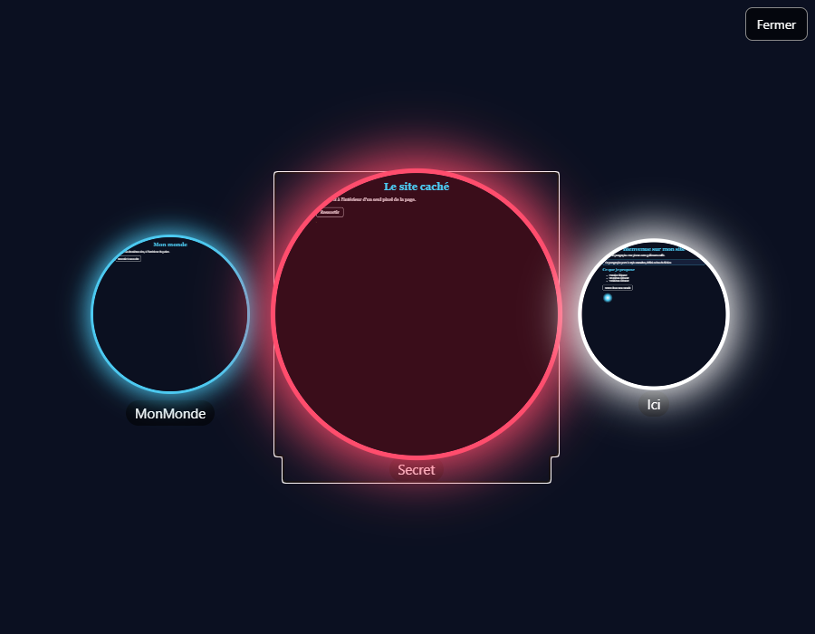

**Réponse donnée sur la photo et la vidéo**

- Une photo dans la page se décompose déjà comme le reste : ses pixels font partie de l'image de la page. Une vidéo, pas encore : il faudrait redécomposer chaque image, vingt-cinq fois par seconde. C'est faisable pour la partie visible à l'écran, mais c'est un chantier à mesurer.

**Retiré**

- La « vue personnage » (la page en feuille dans un monde noir) et la feuille d'un site dans le monde de son point : le carrefour les remplace. Yocthan avait précisé que la vue personnage vaut pour un jeu, où le monde est l'environnement du joueur.

**Erreurs en route**

- Le zoom ordinaire, fait d'abord avec la propriété `zoom` du CSS, déplaçait la mise en page : ce qui était sous la souris n'y restait pas. Refait avec un vrai agrandissement.
- À la fusion de la pull request n° 33, une coupure de réseau a masqué le résultat des vérifications ; la fusion est partie quand même. Contrôlé juste après : tout était vert. À l'avenir, vérifier avant, dans une commande séparée.

**Limites**

- En vue points sur un site clair, les points sont lumineux sur fond noir : le blanc de la page devient des points blancs.
- Les portails ne montrent que les sites à un pas de distance ; il n'y a pas encore de carte d'ensemble.
- La première entrée en vue points prend un instant (la page est redessinée dans une image).

---

## 2026-10-03 — La boucle : un site dans un pixel, dans un site, dans un pixel…

**Retour de Yocthan sur le site planté dans un pixel**

- Le site caché apparaît bien, mais il s'arrête à la vue personnage. Il veut qu'un deuxième clic, ou un zoom, l'agrandisse jusqu'à sa taille normale, et qu'on retrouve alors le même mécanisme que pour le site d'origine : zoomer, voir les pixels, cliquer, entrer. « La boucle va continuer jusqu'à l'infini. »
- Il a aimé les points derrière la feuille. Il les veut répartis sur toute la fenêtre plutôt qu'un fond noir : l'utilisateur cliquera sur d'autres sites, d'autres mondes. « Ce sera vraiment le multivers. »

**Fait**

- Le monde d'un point s'ouvre en grand comme une page. Un deuxième clic sur la feuille, ou un zoom qui la grossit assez, et le site caché prend toute la fenêtre : c'est alors un site comme un autre, avec ses boutons, sa vue points, sa vue personnage.
- Un `World` accepte `pixels:` : un site peut en contenir un autre, qui en contient un autre. Le site de Yocthan a maintenant trois niveaux (son site, « Le site caché » dans un pixel rose, « Le trésor » dans un pixel doré du site caché).
- Chaque site a son adresse : le fichier, puis `#` et le chemin des points, comme `mon-site.holo#Secret/Tresor`. Le bouton « retour » du navigateur remonte d'un niveau, et une règle `leave` aussi.
- Les points du monde entourent la feuille sur toute la fenêtre : la feuille est plus petite, et l'on part d'un peu plus près.
- Vérifié avec de vrais gestes envoyés à Chrome : zoom sur le pixel rose, clic, feuille ; clic sur la feuille, adresse `#Secret` et site en grand ; zoom sur le pixel doré, clic, feuille du trésor ; clic, adresse `#Secret/Tresor` ; bouton « Remonter », adresse `#Secret`.
- Guide mis à jour. Tests du cœur : 59 sur 59.

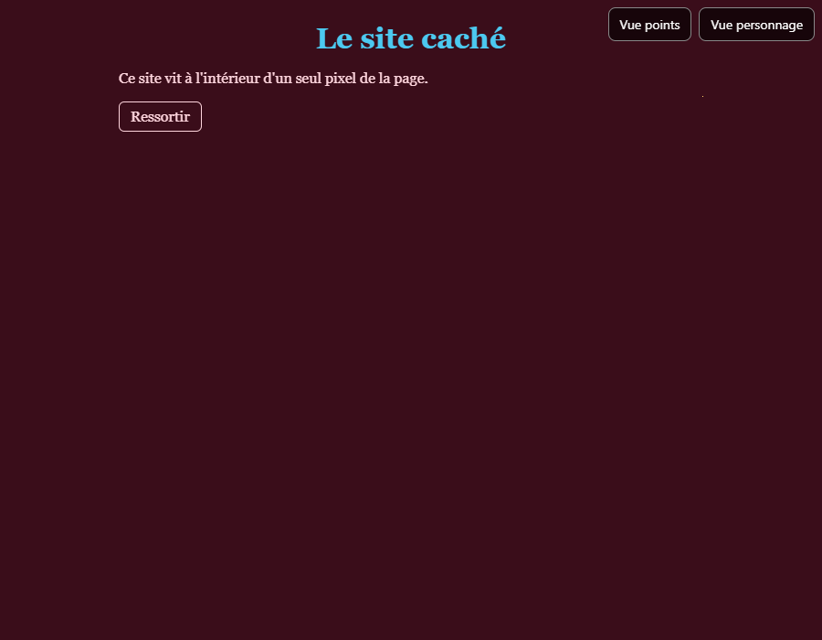

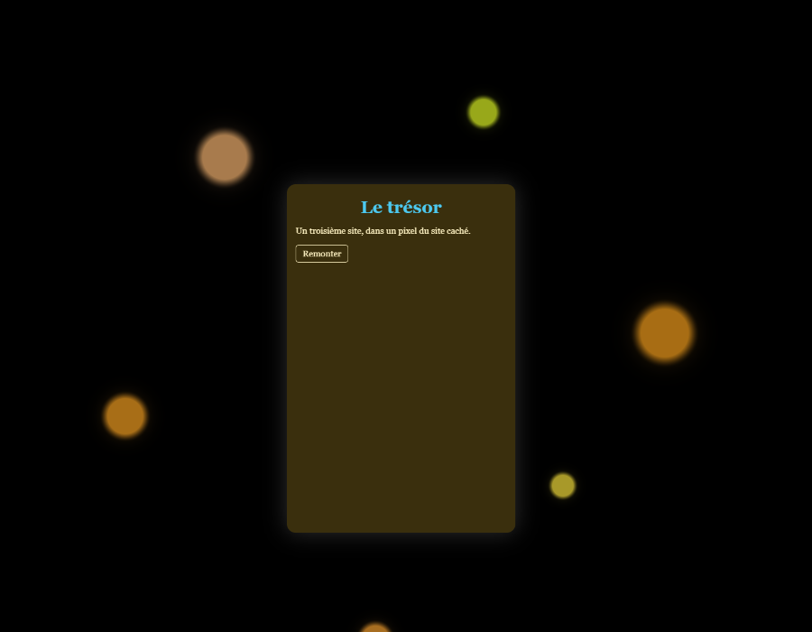

**Limites, dites à Yocthan**

- Ouvrir un site en grand recharge la page : il y a un bref noir entre la feuille qui grossit et le site en grand.
- Les points autour de la feuille sont ceux que la graine calcule : on peut y entrer (c'est le Big Bang), mais ils ne contiennent pas de site écrit. Y poser de vrais sites est le chantier A.
- Le nombre de niveaux n'est pas limité : le garde-fou que Yocthan a évoqué reste à décider.

---

## 2026-10-03 — Un site planté dans un pixel de la page

**Ce que Yocthan a demandé**

- Le chantier A (voir la source d'un point, écrire dans un point) est confirmé en premier. Pour la police du rendu natif : « fais ce qui est le mieux », donc Noto Serif.
- Il a d'abord voulu apprendre à écrire : Claude lui a fait un site de départ à lui, `exemples/mon-site/mon-site.holo` (dans son dossier, hors GitHub), et une leçon en cinq règles.
- Sur la vue personnage, il a précisé : elle vaut pour un jeu, où le monde est l'environnement du joueur (Trevor, son téléphone et sa ville sont dans un point dédié à GTA). Pour un site, il veut voir ceci : choisir un pixel de la page, y planter un site d'une autre couleur, zoomer, cliquer dessus, s'en approcher, et y entrer ; et ce site du dedans doit se voir en vue personnage, puisqu'il est à l'intérieur d'un point. « Tu le fais, et après on en parle. »

**Fait**

- `Page(pixels: [ Point(name:, above:, color:, inside: World(...)) ])` : un point planté dans un pixel de la page, juste au-dessus du bloc nommé par `above`, à l'extrémité droite. Au repos il fait un pixel. En vue points il grossit avec les autres ; un clic dessus fait s'approcher, puis entrer.
- Le site contenu dans un point (celui-ci, mais aussi l'atelier de la boutique) ne s'affiche plus sur un panneau en bas de l'écran : c'est une feuille posée dans le monde du point, qui tourne et grandit avec lui, comme la page en vue personnage.
- Vérifié avec de vrais gestes envoyés à Chrome sur le site de Yocthan : trois crans de zoom sur le pixel, un clic, et l'on se retrouve devant « Le site caché », rose sombre, dans son monde.
- Le guide a une nouvelle partie, avec un exemple relu par le test. Tests du cœur : 58 sur 58.

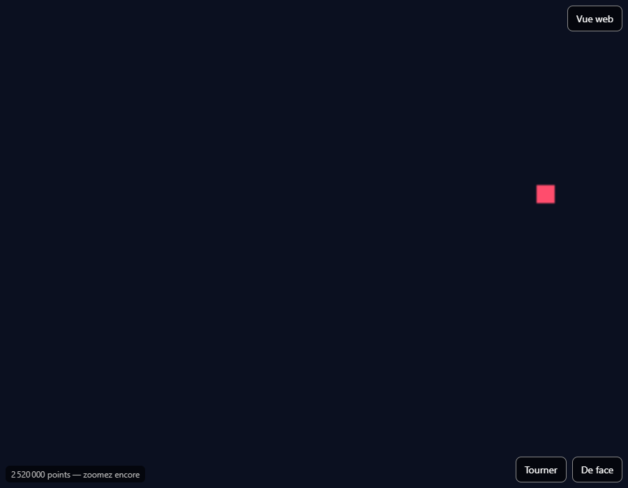

**Provisoire, dit à Yocthan**

- `pixels:` et `above:` sont une écriture d'essai, faite pour voir l'effet. On ne sait placer un point que « au-dessus d'un bloc, à droite ».
- Les millions d'autres points de la page restent calculés : on ne peut rien écrire dedans.
- L'approche est un zoom rapide, pas encore une vraie traversée ; en sortant du site caché on revient à la page entière, pas à l'endroit où l'on avait zoomé.

---

## 2026-10-03 — Le guide de l'auteur : comment écrire en `.holo`

**Ce que Yocthan a relevé**

- « Supposons que je veux écrire en `.holo`. Qu'est-ce que je fais ? Je n'ai pas encore vu la documentation. » Il avait raison : le langage avançait, mais rien n'expliquait à un auteur comment s'en servir.
- Le fichier du Big Bang n'avait pas bougé depuis le premier jour.
- Il ne voyait pas à l'écran les fichiers sur lesquels on travaille.

**Fait**

- [`docs/01-holocode/GUIDE.md`](../01-holocode/GUIDE.md) : le guide de l'auteur. Onze parties, de la première page aux réglages de vue, avec un aide-mémoire et la liste de ce qui n'existe pas encore. Ses sept exemples sont relus par un test du moteur : un exemple qui ne marcherait plus ferait échouer le test.
- `moteur/mondes/big-bang.holo` : chaque ligne est maintenant expliquée, et les deux réglages facultatifs (`color`, `palette`) sont montrés en commentaire, prêts à être essayés. Le comportement du Big Bang, validé par Yocthan, n'est pas changé.
- Le guide, la boutique et le Big Bang sont ouverts dans le VS Code de Yocthan.
- Yocthan a donné son accord pour le rendu natif des lettres (le moteur dessine lui-même les lettres, sans passer par une image). Police proposée : Noto Serif, à défaut d'autre choix de sa part. Rien n'est commencé.
- Tests du cœur : 57 sur 57.

**Erreur de méthode, à retenir**

- Claude a ajouté au langage pendant une journée entière sans écrire la notice à mesure. À l'avenir : chaque ajout au langage met à jour le guide dans la même pull request.

---

## 2026-10-03 — Sobriété : le moteur ne dessine que lorsqu'on bouge ; la question du « natif »

**Ce que Yocthan a relevé**

- Il voit beaucoup de fichiers `.png` liés aux images quand Claude travaille. Il veut un langage vraiment natif, qui ne passe pas par des images, même si tout peut devenir image.
- Vérifier la consommation : l'énergie ne doit être dépensée que lorsqu'on entre dans la « métaversification », pas quand on lit un site.
- Il ne savait plus dans quel fichier se trouve la boutique : `exemples/boutique-comparee/boutique.holo`.

**Mesuré, puis corrigé**

- Sur le site normal, le moteur ne fait rien : aucune zone de dessin n'existe, zéro image dessinée. C'était déjà le cas.
- En vue points, le moteur redessinait soixante fois par seconde même quand rien ne bougeait. Il s'arrête maintenant de lui-même après quelques images immobiles, et repart au premier geste. Le suivi côté page fait de même.
- Mesure avec de vrais gestes envoyés à Chrome, sur `boutique.holo` : site normal pendant 5 s, 0 image ; trois crans de zoom, 12 images ; puis 8 s sans toucher, toujours 12 ; un cran de plus, 16. Avant la correction, 8 s d'attente coûtaient environ 480 images.
- Un monde (le Big Bang) continue de se dessiner en permanence : ses points pulsent. La pause existante le coupe quand l'onglet est caché.

**Sur les images**

- Les `.png` de `docs/06-journal/images/` sont les captures que Claude prend pour vérifier son travail et tenir ce journal. Le langage ne s'en sert pas.
- L'essai sur image fixe (`mosaique.html` et son `boutique.png`) est supprimé : il n'avait plus de raison d'être depuis que la vue points part du fichier `.holo`.
- Il reste un vrai passage par l'image, dit à Yocthan : pour obtenir les points, la page est redessinée en mémoire dans une image dont on lit les pixels. Aucun fichier n'est écrit, mais le moteur ne sait pas quel point appartient à quelle lettre. Pour que ce soit natif, le moteur doit dessiner lui-même les lettres et les formes à partir des blocs. C'est un chantier à part, proposé à Yocthan ; rien n'est construit.

---

## 2026-10-03 — Ce que fait le moteur s'écrit maintenant dans le fichier : `Zoom`, `Points`, `Relief`

**Ce que Yocthan a relevé**

- Tout ce qu'on a ajouté n'apparaît pas dans les fichiers `.holo`. Il regardait `big-bang.holo`, six lignes : « on a programmé tout un monde, mais je ne vois même pas les traces de ces mondes-là. Comment les gens vont-ils programmer ? » Il avait raison : les seuils, la grille, le relief et les limites étaient des nombres écrits dans le moteur.
- En dézoomant trop fort, le site rétrécissait et sortait de son cadre.
- Il faut des garde-fous des deux côtés (zoomer sans fin, dézoomer sans fin), programmés par l'auteur. Réduire le site jusqu'à la taille d'un pixel doit être possible, mais seulement si l'auteur l'active.

**Fait**

- Trois blocs s'écrivent dans la page (`ADR-021`) : `Zoom(max:, shrink:)`, `Points(size:, fragment:, grid:, depth:, density:)`, `Relief(height:, tilt:)`. Le moteur les lit et s'y tient. Deux unités de plus : `px` et `deg`. Chaque réglage a des bornes que l'auteur ne peut pas dépasser ; une valeur hors bornes est refusée avec sa ligne.
- `exemples/boutique-comparee/boutique.holo` écrit ces réglages, avec un commentaire par ligne. Nouveau fichier `exemples/zoom/reduire.holo`, qui les change : la page s'y réduit jusqu'à devenir un seul point.
- Le rétrécissement du site : c'était le zoom de Chrome lui-même (Ctrl + molette vers l'arrière), que la page ne retenait que dans certains cas. Elle le retient maintenant toujours. Sans `shrink: true`, dézoomer sur la page ne fait rien.
- Vérifié avec de vrais gestes envoyés à Chrome : trois crans en arrière sur la boutique ne changent rien ; les mêmes sur `reduire.holo` réduisent la page ; douze crans en font un point.
- Tests du cœur : 56 sur 56.

**Réponse donnée à Yocthan sur les six lignes**

- Un fichier `.holo` dit ce que l'on veut, pas comment le faire : `big-bang.holo` dit « un point, graine 1, douze fragments », et le moteur (environ 3 500 lignes de Rust) fait le reste. C'est voulu, pour qu'un non-programmeur puisse écrire. Mais il avait raison sur le fond : ce qui se règle doit se voir dans le fichier.

**Limites**

- Les noms sont une proposition de Claude, à confirmer par Yocthan.
- Les seuils de zoom d'un `Point` seul (le Big Bang) sont encore dans le moteur ; la vue personnage et la vue « roadmap » ne sont pas décrites dans le langage.

---

## 2026-10-03 — La mosaïque gagne la profondeur (l'axe Z) et de belles lettres

**Retour de Yocthan sur la mosaïque**

- Il a beaucoup aimé (« je suis à l'extase »). La pull request n° 28 est fusionnée.
- Deux défauts : on ne voit qu'en 2D, il manque le Z ; et les lettres sont « quasiment horribles », presque illisibles.

**Fait**

- **Le Z.** Chaque point a maintenant trois coordonnées. De face, la page reste plate comme une feuille, et les points sont exactement à la place des pixels. Quand on la fait tourner (bouton « Tourner », bouton droit de la souris, ou Maj), on la voit de biais, en perspective, et ce qui est lumineux se soulève au-dessus du fond : les lettres deviennent des objets en relief. Les points nés d'un morcellement ne sont pas tous à la même hauteur. L'image ordinaire, tant qu'on la voit, tourne de la même façon : c'est la feuille de papier dans l'espace.
- **Les lettres.** Trois causes de laideur, trois corrections. L'image d'origine portait des franges bleues et orange (le lissage coloré des écrans plats) : elle est reprise sans. Elle était trop grossière : elle est reprise deux fois plus fine (2560 × 1440, soit 3 686 400 points au repos). Et en se morcelant, chaque pixel devenait un carré aux couleurs tirées au hasard : la couleur d'un point né d'un morcellement est maintenant celle de l'image à cet endroit précis, fondue entre les pixels voisins, et sa graine ne la déplace que peu aux premiers niveaux.
- Tests du cœur : 52 sur 52, dont : le zoom garde sous le doigt le même pixel même quand la page est de biais ; un aller et retour entre la page et l'écran retombe au même endroit.

- **Une seule adresse, une seule page.** Yocthan a relevé deux choses : la barre d'adresse montrait `mosaique.html` au lieu du fichier `.holo`, puis, après une première correction, que `boutique.holo?` et `mosaique.html` ne se comportaient pas de la même façon, avec un `?` en trop. Il avait raison : c'étaient deux portes séparées. Il n'y en a plus qu'une. On ouvre `http://localhost:8080/exemples/boutique-comparee/boutique.holo` : c'est le site normal, vivant. On zoome dessus (Ctrl + molette, ou pincer) : la même page devient des points, sans changer d'adresse ni recharger. On dézoome jusqu'au bout : on retrouve le site normal. C'est le zoom qui déclenche la vue, comme il le demandait ; un bouton « Vue points » reste pour les écrans tactiles.
- Pour y arriver, le moteur fabrique la page, puis on la redessine dans une image (un SVG qui la contient, possible parce que c'est le moteur qui l'a fabriquée) dont chaque pixel devient un point. Ce n'est plus une image fixe prise d'avance : si l'on change le fichier, les points changent.
- Vérifié avec de vrais gestes envoyés à Chrome par l'outil de capture (variable `HOLO_GESTES`) : cinq crans de Ctrl + molette sur le titre font apparaître les points ; deux crans en avant puis quatre en arrière ramènent au site normal.

**Erreur en route**

- Le relief était compté en pixels de l'image : en zoomant très profond, il devenait immense et le moteur cherchait des points sur des milliards de cases. Un test est resté bloqué. Le relief est maintenant borné à 80 pixels d'écran.

**Limites**

- Le relief vient de la lumière : ce qui est clair se soulève. Sur une page à fond blanc et texte noir, ce serait l'inverse de ce qu'on veut. Il faudra partir de la page elle-même, où le moteur sait ce qui est une lettre.
- On tourne la page jusqu'à 52° environ, pas au-delà : on ne peut pas encore passer derrière ni se placer entre deux lettres.
- Dans la vue points, la page est une image d'elle-même : ses boutons ne répondent pas tant qu'on n'est pas revenu au site normal.
- Ctrl + molette est le geste de zoom de Chrome : la page l'intercepte. Sur un écran tactile, le premier pincement n'est pas encore capté ; il faut le bouton « Vue points ».
- Tourner la page à la souris et les gestes au doigt ne sont pas essayés par Claude.

---

## 2026-10-03 — VS Code reconnaît le langage : extension HoloCode

**Fait**

- Yocthan a demandé que VS Code reconnaisse le langage, et que ce soit le fichier `.holo` qu'on lance, pas un fichier `.html`.
- `outils/vscode-holocode/` : une extension VS Code. Elle colore les fichiers `.holo` (blocs, paramètres, styles, textes, unités, couleurs, commentaires) et ajoute un bouton ▶ en haut à droite de l'éditeur (ou `Ctrl+Alt+H`) qui enregistre le fichier et l'ouvre dans le navigateur à sa propre adresse.
- Le paquet se fabrique avec un script Python (`empaqueter.py`), sans rien installer d'autre. L'extension est installée dans le VS Code de Yocthan (`holoverse.holocode`).
- Le serveur local accepte une variable `HOLO_DEPOT` : il affiche alors les fichiers `.holo` d'un autre dossier que celui où le moteur a été construit. Il est relancé ainsi, pour que ce que Yocthan écrit dans son dossier principal soit ce qui s'affiche.

**Limites**

- Le bouton ▶ n'ouvre que les fichiers de `exemples/` et de `moteur/mondes/`.
- Les erreurs ne sont pas soulignées dans l'éditeur ; elles s'affichent dans le navigateur. Les souligner demandera de brancher le vérificateur du moteur sur VS Code (c'est le `holo check` de la liste des manques de Codex).
- La coloration n'a pas été contrôlée par Claude à l'écran : seules la validité des fichiers et l'installation ont été vérifiées.
- L'essai de mosaïque reste une page à part (`mosaique.html`), parce qu'il part d'une image et non d'un fichier `.holo`.

---

## 2026-10-03 — La mosaïque : la page est faite de points, un par pixel

**Ce que Yocthan a précisé après avoir vu la vue personnage**

- La vue lui plaît, mais passer de « vue web » à « vue personnage » par un bouton donne l'impression de changer de lien, pas d'être dans un métavers. À revoir.
- Il ne veut pas de points lumineux décoratifs au fond. **Tous les éléments de la page sont des points** : le titre « My shop », le fond, les couleurs. Le site est une image découpée en pixels, et chaque pixel est un point, rangé exactement à sa place. Le nombre de points est celui des pixels visibles. Chaque point contient d'autres points ; c'est le zoom qui les révèle.
- Une lettre est traversée par plusieurs pixels : elle contient donc plusieurs points, donc plusieurs mondes, et elle peut aussi être vue comme un objet (son exemple de la personne en casque placée entre le « 3 » et le « D »). Le monde d'un point doit donc se rattacher au caractère auquel il appartient.
- La vue « roadmap » : une carte qui répertorie les mondes actifs à un moment donné, sous forme de gros points, comme la carte des niveaux d'un jeu. Plus tard.
- Le zoom du Big Bang, déjà validé, reste tel quel ; il faut le « redisposer » pour que ce soit performant. Cela servira aussi pour la vidéo et pour des mondes générés par une IA.

**Fait**

- Pull request n° 27 (vue personnage) fusionnée.
- `moteur/src/mosaique.rs` : une image vue comme un ensemble de points. Au repos, un point fait exactement un pixel et l'image ordinaire suffit. En zoomant, les pixels grossissent et deviennent des points lumineux alignés ; au-delà de 40 pixels, chaque point se morcelle en une grille de 4 × 4, et ainsi de suite jusqu'à vingt niveaux. La graine d'un point se calcule à partir de sa place : rien n'est stocké.
- Les calculs donnés à Yocthan se vérifient : on ne dessine jamais plus de points que l'écran ne peut en montrer (un test le contrôle sur soixante zooms successifs). Sur l'image de 1280 × 720, soit 921 600 points au repos, il y a entre 4 000 et 12 000 points à l'écran quel que soit le niveau.
- Essai visible : `http://localhost:8080/mosaique.html`, sur une image fixe de la boutique. Molette ou pincement pour zoomer, glisser pour se déplacer.
- Les points décoratifs autour de la feuille, en vue personnage, sont éteints.
- Nouvel outil `moteur/outils/capturer.mjs` : prend une capture après une attente en temps réel. Les captures précédentes étaient prises trop tôt, avant le premier dessin.
- Correction : un titre dont le style fixait les marges n'était plus centré dans la page. Le centrage vient maintenant du conteneur.
- Tests du cœur : 49 sur 49.

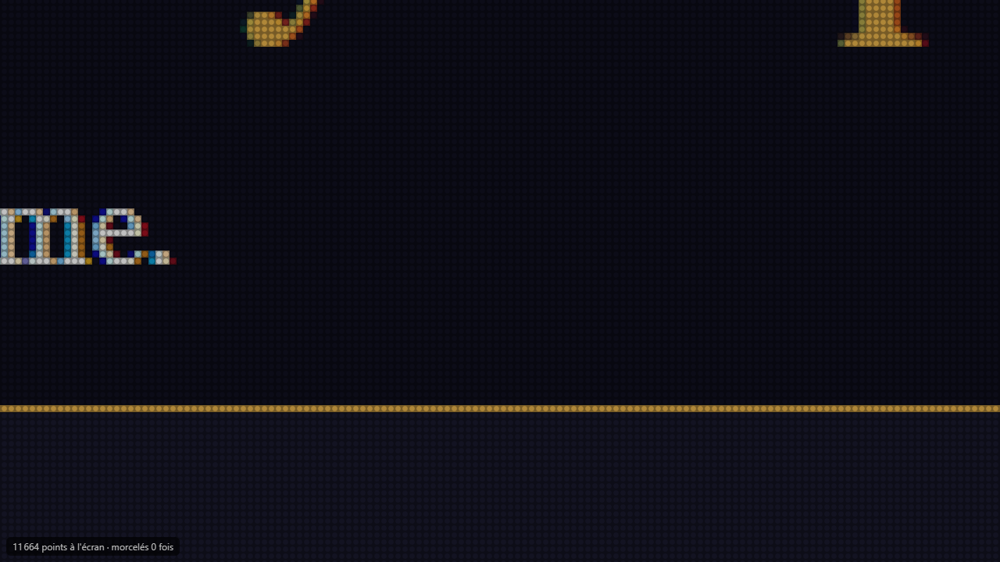

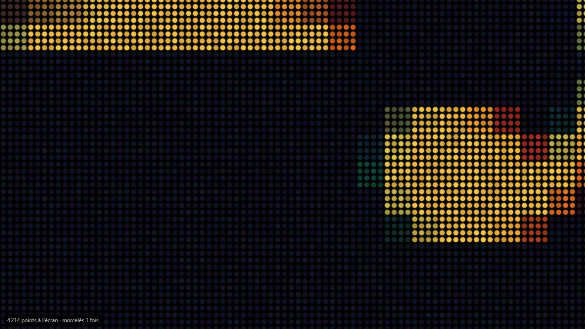

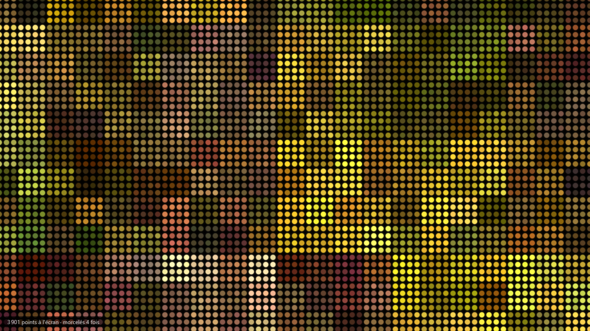

**Limites, dites à Yocthan**

- C'est une image fixe : Chrome ne donne pas au moteur les pixels d'une page vivante. Les boutons ne marchent donc pas dans cet essai.
- Les mondes des points ne sont pas encore rattachés aux caractères : avec une image, le moteur ne sait pas quel pixel appartient à quelle lettre. Il faudra partir de la page elle-même.
- On zoome et on se déplace à plat. Regarder la page de biais, et la vue « roadmap », ne sont pas faits.
- Le bord des lettres montre des points bleus et orange : c'est le lissage des polices de l'écran, présent dans l'image d'origine.

---

## 2026-10-03 — La vision se précise (le téléphone de Trevor) ; première vue « personnage »

**Ce que Yocthan a précisé**

- Par défaut, on est devant un site web normal. Le métavers vient en plus.
- Un site est comme une feuille de papier : plate, mais c'est un vrai objet dans un espace en 3D.
- Dans GTA, quand Trevor regarde son téléphone, le menu est en 2D à l'intérieur du monde en 3D. Pareil ici : si l'utilisateur est un **personnage**, il voit le site comme une surface posée dans le monde ; sinon il voit le site en 2D classique. Trois situations : il utilise le web (vue classique), il joue son propre personnage (par ses yeux), il joue à un jeu (personnage vu de dos).
- La peau paraît lisse ; en zoomant, on découvre les microbes. Le zoom révèle les mondes.
- Une option « rendre en 3D » donnera du volume à un élément important, comme des lettres entre lesquelles on peut se placer.
- Il a ainsi corrigé la proposition de Claude (tout piloté par le zoom, la page qui « devient » un lieu) : rien ne change de nature, c'est le même objet vu d'une autre place. Et il a relevé, avec raison, que dans la première démo la page disparaissait pour laisser place à un autre écran.

**Fait**

- Yocthan a confirmé qu'il voit bien les points en 3D dans l'atelier : la pull request n° 26 est fusionnée.
- Feu vert pour un premier pas, à corriger ensuite petit à petit. `moteur/web/page.html` a maintenant un bouton « Vue personnage » : la même page, sans être rechargée, devient une feuille posée au centre d'un monde, avec les points lumineux autour. Elle tourne avec le monde quand on le fait tourner, grandit quand on s'approche, et reste une vraie page : le texte se lit, le bouton marche. « Vue web » ramène au site classique.
- Moteur : `Navigation::surface` dit où poser une surface plate dans le monde ; `changer_de_monde` passe d'un monde à l'autre sans relancer la carte graphique. Tests du cœur : 42 sur 42.
- Un sommaire, `http://localhost:8080/accueil.html`, ouvre chaque démonstration à part.

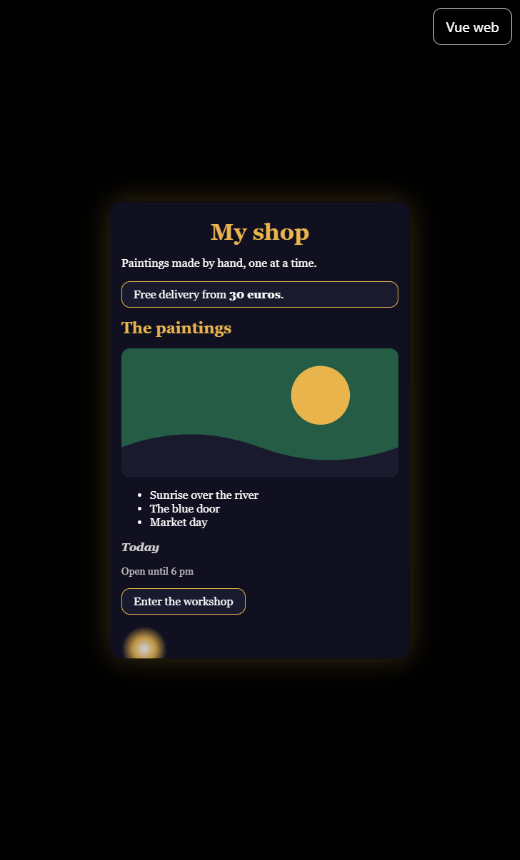

- Yocthan a demandé de lancer le fichier `.holo` lui-même dans Chrome, et non `page.html`. Le serveur local ouvre maintenant un `.holo` par sa propre adresse (`http://localhost:8080/exemples/boutique-comparee/boutique.holo`) : quand le navigateur demande le fichier pour l'afficher, il reçoit la porte d'entrée du moteur, qui va chercher le fichier. C'est le rôle que tiendra plus tard un navigateur qui sait lire le `.holo`.

**Erreur en route**

- Le serveur renvoyait encore le texte brut : l'outil qui a écrit la modification avait transformé deux `` en caractères invisibles dans le test. Trouvé en lançant une copie du serveur avec un affichage de contrôle.

**Provisoire, à décider**

- Le monde où la page est posée n'est écrit nulle part dans le fichier : sa graine est tirée du nom de la page. Le langage ne sait pas encore dire « un monde qui contient une page ».
- C'est une vue par les yeux (première personne). Le personnage vu de dos demande un corps à dessiner : chantier à part.
- La feuille est toujours dessinée devant les points, même ceux qui devraient passer devant elle.

**Ce qui n'est pas vérifié**

- Les captures montrent l'affichage des trois états. Les gestes (faire tourner le monde, zoomer, passer d'une vue à l'autre plusieurs fois) n'ont pas été essayés par Claude dans un vrai navigateur. La pull request reste ouverte jusqu'au retour de Yocthan.

**Note sur les captures**

- Les captures sans écran sortaient noires parce qu'elles étaient prises trop tôt : avec un délai de 15 secondes de temps simulé, la vue en profondeur apparaît.

---

## 2026-10-03 — Proposition : le même web en 3D, et la comparaison avec les concurrents

**Fait**

- Yocthan a demandé de s'inspirer des éléments de HTML, CSS et JavaScript pour créer ceux de HoloCode, de voir comment chacun se représente en 3D, d'innover, et de comparer avec les frameworks JavaScript et les autres langages. Claude a écrit une proposition : [`proposals/Claude/web-en-3d-2026-10/`](../../proposals/Claude/web-en-3d-2026-10/README.md). Rien n'y est décidé, rien n'est ajouté au moteur.
- Idée principale, « option C » : le plan de la page (`H1`, `H2`, `H3`) devient la profondeur. Chaque titre avec son contenu devient un point ; zoomer révèle les sous-titres. La règle d'`ADR-020` qui interdit de sauter un niveau y trouve son utilité.
- Deuxième idée : le lien est une porte. `Link(to: "autre.holo")` est un lien à plat et un point dans lequel on entre en profondeur.
- Comparaison écrite sans embellir : les signaux (Solid, Vue, Svelte) et l'arbitre (Elm) existent ailleurs ; A-Frame déclare déjà de la 3D en balises ; VRML a échoué dans les années 1990 ; Elm est juste sur le fond et peu adopté. Ce qui est propre à HoloCode est l'assemblage : une description pour deux vues, la profondeur tirée du sens, un monde dans une graine, tout vérifié avant d'exécuter.

- Yocthan veut observer le site et le point séparément avant de donner sa réflexion. Ajout d'un sommaire (`http://localhost:8080/accueil.html`) qui ouvre chaque démonstration à part : la boutique en HoloCode, la boutique en web, le Big Bang seul, et le point de l'atelier seul (`moteur/mondes/atelier.holo`).

**En attente**

- La pull request n° 26 (vue à plat et entrée dans un point) n'est pas fusionnée : Yocthan n'a pas encore dit s'il voit les points en 3D derrière le panneau.

---

## 2026-10-03 — La boutique en HoloCode s'affiche dans Chrome : vue à plat et entrée dans le point

**Fait**

- Yocthan a demandé à voir les deux versions tourner dans Chrome. La version web tournait déjà ; pour la version HoloCode, il a fallu construire l'affichage. C'est l'étape « vue à plat » prévue, avancée d'un cran.
- `moteur/src/plat.rs` : d'un fichier `.holo` vérifié, le moteur fabrique une page web ordinaire, HTML et CSS (`ADR-011`). L'auteur n'en écrit pas. Tout ce qu'il écrit est échappé : aucun texte ne peut devenir du code.
- `moteur/src/regles.rs` : les noms en double, les règles (`On(Open.tap, effect: Workshop.enter)`), les capacités inconnues et les budgets dépassés sont maintenant vérifiés. La page d'accueil (`moteur/web/page.html`) ne décide de rien : chaque toucher est envoyé au moteur, qui répond par les effets demandés.
- Entrer dans le point ouvre la vue en profondeur du point (le Big Bang, avec sa graine, sa couleur et sa palette) ; le contenu du monde se lit sur un panneau devant (option A d'`ADR-018`). « Back to the shop » ramène à la page et met la vue en profondeur en pause.
- `color` et `palette` d'un `Point` sont lus par le moteur (`ADR-017`) ; sans couleur imposée, la graine décide, dans les deux vues.
- Le serveur local sert aussi `exemples/`. Adresses : `http://localhost:8080/page.html` (HoloCode) et `http://localhost:8080/exemples/boutique-comparee/web/index.html` (web).
- Tests du cœur : 40 sur 40. Les seize cas refusés de la suite de conformité sont maintenant tous refusés par le moteur.

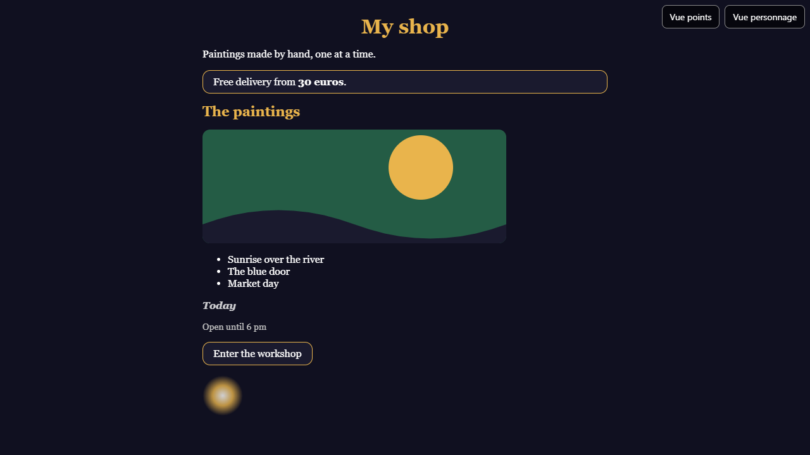

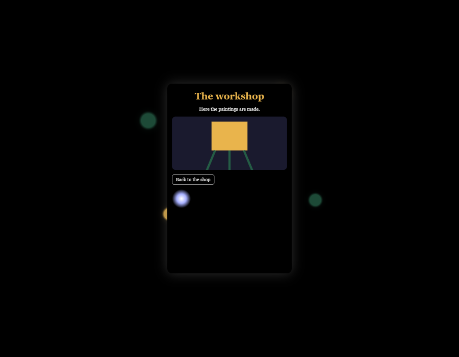

**Ce qui n'est pas vérifié**

- Sur les captures prises sans écran, la zone de dessin 3D reste noire (le Big Bang seul aussi, avec cette méthode de capture) : les points derrière le panneau n'ont pas pu être contrôlés par Claude. À Yocthan de dire ce qu'il voit dans son Chrome.

**Limites**

- Le point `Storeroom`, écrit dans le monde de l'atelier, apparaît sur le panneau mais on ne peut pas encore y entrer : la vue en profondeur ne connaît que les points nés de la graine.
- Le fond donné au monde par son style est caché par la zone de dessin 3D.
- Une seule vue en profondeur par page pour l'instant.
- Du Markdown, seuls le gras et l'italique sont rendus.
- L'option B d'`ADR-018` (chaque bloc devient une boule) n'est pas faite.

**Erreurs en route**

- Premier essai : zoom de départ à 3,7, qui faisait entrer dans un enfant du point au lieu du point lui-même. Corrigé à 2.
- Le thème de la page n'atteignait pas le monde intérieur (police différente) : le monde est maintenant rangé dans la page.

---

## 2026-10-03 — La même boutique écrite deux fois : HoloCode, et HTML, CSS, JavaScript

**Fait**

- Avant d'afficher la boutique, Yocthan a demandé un même exemple dans les deux écritures, avec tout le vocabulaire du langage, tel qu'on s'en servirait pour un métavers. Il est dans [`exemples/boutique-comparee/`](../../exemples/boutique-comparee/README.md).
- `boutique.holo` : 62 lignes utiles. La version web : 178 (36 de HTML, 61 de CSS, 81 de JavaScript). Pour la page seule, l'écart est faible ; il vient presque entièrement du point et du monde, que le web doit fabriquer à la main.
- La version web fonctionne dans un navigateur. Ses graines sont calculées en JavaScript avec `BigInt` et donnent les mêmes valeurs que le moteur (vérifié sur quatre valeurs de référence).
- La version HoloCode est relue par un test du moteur, qui contrôle aussi qu'aucun bloc, aucun paramètre et aucun réglage de style ne manque dans l'exemple. Tests du cœur : 29 sur 29.

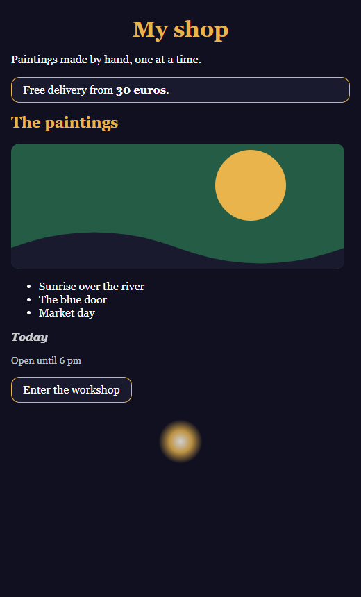

**Limites, dites dans le README de l'exemple**

- La version HoloCode n'est pas encore affichée : la comparaison porte sur l'écriture, pas sur le résultat à l'écran.
- Les imports y sont en commentaire (lus par le moteur, pas appliqués). Les unités de longueur et de durée, `true` et `false` n'ont pas encore d'emploi dans le langage.
- La version web triche : le monde intérieur est chargé d'avance et caché, et ses points sont sur un cercle, pas sur une sphère.

**Erreur corrigée en route**

- Claude avait écrit `margin: 0 auto` dans le thème de la page : c'est de la disposition (centrer), que le vérificateur refuse à juste titre. Retiré de la version HoloCode, et rangé dans la partie « disposition » de la version CSS.

---

## 2026-10-03 — Les styles s'écrivent comme en CSS, avec sept règles pour servir aussi aux jeux

**Fait**

- Ordre de travail validé par Yocthan (point B) : d'abord la boutique dans les deux vues, les mesures sur téléphone en parallèle, le langage « système » plus tard.
- Yocthan a relevé que le style d'un jeu n'est pas celui d'un site, et demandé une solution cohérente dès le départ. Comparaison faite : le cœur commun est « un paquet nommé de réglages d'apparence qu'on pose sur une chose » (`.card` en CSS, un matériau dans Unity). Sept règles proposées et validées, écrites dans `ADR-017`.
- Sa condition : l'écriture reste celle du CSS de base, avec des accolades, pas un bloc `Style(...)` répété. Claude recommandait l'écriture en blocs ; Yocthan a décidé autrement, et sa raison tient : le CSS est simple à écrire, c'est son mécanisme qui pose problème. La question ouverte d'`ADR-017` est fermée.
- Moteur : le lecteur accepte `P.card(...)` et lit les styles après le bloc racine ; nouveau fichier `moteur/src/styles.rs` qui les vérifie. Tests du cœur : 28 sur 28. Les styles ne sont pas encore appliqués à l'écran.
- Suite de conformité : 22 cas (6 acceptés, 16 refusés), dont la boutique `06` et cinq refus (`E12` à `E16`).

**Choix faits par Claude, à réexaminer si besoin**

- Les blocs `Theme(...)` et `Style(...)` sont retirés : avec l'écriture CSS, le thème est le style de `Page` ou de `World`. Les garder aurait fait deux écritures pour la même chose.
- Les noms des réglages sont ceux du CSS (`font-size`, `border-radius`), mais un seul nom par réglage : `background-color` est refusé avec « écris `background` ».
- Le vérificateur ne connaît que quinze réglages, les tailles en `px` et en `%`, et une trentaine de noms de couleur. C'est plus strict que le CSS ; la liste grandira.
- Un bloc ne porte qu'un nom de style (`P.card`, pas `P.card.big`), pour ne pas avoir à départager deux styles nommés.

**Limites**

- Les accolades restent interdites dans un bloc (`ADR-015`) ; elles ne servent qu'aux styles.
- Importer un fichier de styles n'est pas encore possible : le moteur refuse tous les imports.

---

## 2026-10-03 — `Text`, `P` et `H1` : le texte comme en HTML, sans ses défauts

**Fait**

- Yocthan a demandé une comparaison avant de choisir entre `P`/`H1` et `Text`, en relevant lui-même que `Text` est le mot qui sert dans un terminal. Résultat : `Text` est le bloc de base (du texte sans rôle) ; `P` et `H1` à `H3` sont un `Text` avec un rôle. Décision écrite dans `ADR-020`, acceptée par Yocthan.
- Il a demandé pourquoi les minuscules seraient un mal. Réponse franche donnée : la majuscule n'est pas une nécessité technique, c'est une aide à la lecture (`Text(...)` le bloc, `text:` le réglage) ; le vrai défaut serait d'accepter deux écritures. Règle retenue : un bloc commence par une majuscule, un réglage par une minuscule ; `h1` est refusé avec « écris `H1` ».
- Nouvelle consigne de travail : à chaque ajout au langage, comparer d'abord les options et vérifier qu'on ne répète pas un défaut de HTML, de CSS ou de JavaScript. Écrite dans `AGENTS.md`.
- Moteur : nouveau fichier `moteur/src/blocs.rs`. Il vérifie que chaque bloc d'un fichier existe et que les titres ne sautent pas de niveau. Rien n'est encore affiché pour ces blocs. Tests du cœur : 23 sur 23.
- Suite de conformité : 16 cas (5 acceptés, 11 refusés). Le cas `01` utilise `H1` et `P` ; nouveaux cas `05`, `E09`, `E10`, `E11`.
- Question de Yocthan : le point et le pixel sont-ils la même chose, et que font Unreal et Unity ? Réponse : un pixel est sur l'écran et ne contient rien ; les moteurs 3D parlent de sommets, de particules, de voxels, de nuages de points. Deux techniques proches de sa vision, à garder en tête : le *Gaussian splatting* (un monde fait de points lumineux, tiré de photos ou de vidéos) et Nanite d'Unreal (le détail ajusté au pixel d'écran).

**Choix fait par Claude, à réexaminer si besoin**

- Yocthan avait approuvé « le vérificateur signale » un saut de niveau. Claude en a fait un refus, pas un simple avertissement : la suite de conformité ne connaît que « accepté » et « refusé », et tolérer l'erreur est justement ce qui a rendu ce défaut courant en HTML. La fiche prévoit de revenir à un avertissement si cela gêne.

**Limites**

- Le Markdown écrit dans un texte (`# Titre`) n'est pas lu par le moteur : la règle des niveaux ne porte que sur les blocs.
- `P.card(...)` n'est pas encore accepté par le lecteur ; cela attend la décision sur la place des styles.

---

## 2026-10-03 — Le point est un pixel ; la proposition de coordination de Codex est intégrée

**Fait**

- Yocthan a expliqué d'où vient le mot « point » : sa réflexion part du pixel. Une image est faite de pixels ; un monde est fait de points ; quand on zoome sur un point, il se divise en mondes. Il a laissé Claude trancher le nom selon ce que le mot désigne en 3D : **le bloc s'appelle `Point`**, défini comme « le pixel de l'Holoverse ». `Pixel` aurait heurté l'unité `px` des styles ; `Voxel` désigne un cube dans une grille. Fiche `ADR-016` complétée.
- Idée technique qui en découle, notée pour un prochain sprint : mesurer la limite de perception en pixels d'écran, et ne développer le monde d'un point que lorsqu'il occupe assez de pixels pour qu'on y voie quelque chose. Autre idée de Yocthan : partir d'une image ou d'une vidéo dont chaque pixel serait un point.
- Sur le texte, Yocthan veut l'écriture de HTML et CSS sans leurs défauts : on écrit un paragraphe, un titre, et on le stylise facilement. Claude propose des blocs `P` et `H1`, et des styles par type de bloc ou par nom à point ; à confirmer.
- Codex a répondu au prompt sur l'outillage (PR n° 19) : pas de pont direct entre IA, GitHub comme boîte aux lettres, pas de serveur MCP pour l'instant, la mesure sur téléphone par `adb` et `chrome://inspect`, et une liste priorisée des manques du projet. Yocthan a délégué la décision à Claude : la proposition est fusionnée après lecture complète, et ses parties légères sont appliquées. Un modèle de pull request et un modèle d'issue sont actifs dans `.github/`, onze étiquettes sont créées, la règle de fusion et la boîte aux lettres sont écrites dans `AGENTS.md`.

**Erreur commise**

- Claude avait daté du 4 octobre l'étape précédente et les fiches `ADR-016` à `ADR-019`, alors que tout s'est passé le 3. Les dates sont corrigées.

**Ce qui n'a pas été repris de Codex, et pourquoi**

- Le commentaire obligatoire « VALIDÉ POUR FUSION » de Yocthan sur chaque pull request : Yocthan veut aller vite et n'avoir presque rien à faire. Son accord n'est exigé que pour les pull requests des autres IA et pour celles qui changent une décision.
- Le contrôle automatique qui refuse une pull request sans les champs du modèle : gardé en exemple dans le dossier de Codex, pas activé, tant qu'on n'a pas vu le modèle servir.

---

## 2026-10-03 — Le langage passe en anglais ; quatre décisions sur la forme

**Fait**

- Yocthan a pris point par point les décisions en attente sur le langage. Les mots sont **en anglais** (contre l'avis de Codex, qui proposait le français d'abord), avec une règle née de sa remarque sur `split` : un mot que les programmeurs connaissent garde son sens. D'où `fragments` et non `split`, `leave` et non `exit`, `On` et non `When`, `brightness` et non `light`, `children` comme en Flutter. `ADR-016`.
- La forme : un `Theme`, des styles nommés avec le point du CSS (`.card`), et des réglages par bloc ; trois façons de colorer un point. `ADR-017`. La vue en profondeur : option A, seuls les points ont de la profondeur ; l'option B sera montrée pour comparer. `ADR-018`. Le texte s'écrit sans artifice, comme « Hello World » ; un `.md` ne s'importe que pour un long texte. `ADR-019`.
- Le moteur et la suite de conformité sont traduits. Le Big Bang s'écrit `Point(name: Origin, seed: 1, brightness: 1.0, fragments: 12)`. Les unités de taille deviennent `KB`, `MB`, `GB`. Le moteur refuse les anciens mots français en indiquant le mot à écrire (cas `E08`). La suite compte douze cas, et le moteur en lit trois directement dans ses tests : c'est le premier lien réel entre les deux. 19 tests.

**Reste ouvert**

- Le nom du bloc `Point` (`Point`, `Sphere` ou `Orb`) : pour un programmeur, `Point` est une coordonnée.
- La place des styles dans le fichier.

**Leçon**

- Un outil de Claude altérait les barres obliques inverses dans les commandes longues ; un test a ainsi été écrit avec un vrai saut de ligne au lieu de `\\n`. Sans gravité, mais les modifications de code passent désormais par des fichiers de script ou par l'éditeur, plus par des commandes en ligne.

---

## 2026-10-03 — La revue de Codex, et trois défauts corrigés

**Fait**

- Codex (ChatGPT) a répondu au prompt de Yocthan par une pull request (n° 15) rangée dans `proposals/GPT5.6/revue-2026-10-03/` : une revue exécutée (18 tests, compilation WebAssembly, suite de conformité, 501 856 octets Brotli mesurés), un avis sur chaque décision, des réponses aux trois questions du langage, une boutique complète en `.holo` et des sondes reproductibles. Lecture conseillée : `proposals/GPT5.6/revue-2026-10-03/README.md`.
- Trois défauts réels relevés par Codex sont corrigés dans le moteur : les graines passaient par un nombre flottant (2^53 + 1 devenait 2^53), elles sont désormais lues comme des entiers exacts ; un `import` était accepté puis ignoré en silence, il est refusé tant qu'il n'est pas appliqué ; le test qui devait figer les valeurs des graines était une tautologie, il fige maintenant de vraies valeurs. 19 tests.
- Les chiffres sont mis au propre : 19 tests et non 17 ; poids en octets exacts avec Ko = 1 000 octets (502 435 octets transférés) ; « rien n'est stocké » devient « le décor est régénérable » ; la pile de navigation coûte 16 octets par niveau ; la mémoire affichée par la page n'est que le tas JavaScript.
- Codex recommande, pour le langage : un vocabulaire français canonique en v0.1 (`import`, `module`, `pont` gardés), puis éventuellement un profil anglais par table d'alias ; un `Theme` de page plus des paramètres locaux, avec une priorité simple ; `couleur: graine` par défaut, `couleur: "#..."` ou `palette: [...]` pour l'auteur. Il propose de réordonner le travail : la boutique dans les deux vues, la navigation fiable, la mesure téléphone, puis une action avec état arbitré ; les ponts avancés et le navigateur natif ensuite. Ces choix restent à Yocthan.

**Erreurs et leçons**

- Claude a fusionné la pull request de Codex par erreur : elle portait le numéro 15 que Claude croyait être celui de sa propre pull request « pause », ouverte au même moment ; il l'a sortie du mode brouillon et fusionnée sans l'avoir lue. Aucun dégât, parce que Codex avait respecté la règle et n'avait rien écrit hors de son dossier, mais la règle « ne fusionner que ce qui a été lu et testé » a été enfreinte. Leçon : vérifier l'auteur et la branche d'une pull request avant de la fusionner, jamais seulement son numéro.
- Les trois défauts corrigés étaient dans du code que Claude avait écrit et testé : un test tautologique passe toujours. Leçon : un test doit pouvoir échouer.

---

## 2026-10-03 — Un bouton pause, et le dossier de Yocthan remis sur `main`

**Fait**

- Yocthan a demandé une pause pour le Big Bang, parce qu'il sentait la mémoire monter. Un bouton « pause » est ajouté à côté de « mesures » (PR n° 15) : le moteur ne calcule ni ne dessine plus rien jusqu'à « reprendre ». Le monde se met aussi en pause tout seul quand l'onglet est caché. Ce que la pause économise, c'est le processeur, la carte graphique et la batterie ; la mémoire du moteur, elle, est fixe (le moteur lui-même, environ 2 Mo de WebAssembly plus ce que Chrome réserve) et ne grandit pas avec la profondeur : un niveau traversé pèse 16 octets.
- Le dossier VS Code de Yocthan était resté sur une vieille branche du 21 septembre : il ne voyait ni le moteur ni les fichiers `.holo`. Il est remis sur `main`. Codex (ChatGPT) a déposé sur sa machine un dossier `TestByYou/` (une démonstration pédagogique qui extrait un bloc `holo` d'un `.md`) et une copie `revue-codex-2026-10-03/` ; ils ne sont pas dans Git.
- Explication en arbres, à la demande de Yocthan : l'arbre d'un fichier `.holo` (l'équivalent du DOM) et l'arbre du chemin, du fichier aux pixels de Chrome.

**Leçon**

- Un serveur lancé par Claude s'arrête au bout de deux heures ; il est maintenant lancé détaché de la session, et tient jusqu'au redémarrage du PC.

---

## 2026-10-03 — Le journal, AGENTS.md, et GitHub comme canal entre les IA

**Fait**

- Création de ce journal et d'`AGENTS.md` (PR n° 13), à la demande de Yocthan : un rapport tenu à chaque étape, et un point d'entrée pour toute IA branchée sur le projet.
- Rafraîchissement de mémoire sur le langage, à la demande de Yocthan : origines, décisions, correspondance HTML/CSS/JavaScript → blocs/paramètres/règles, démonstration pas à pas depuis un fichier vide, comparaison avec Dart/Flutter et avec le web classique. Trois questions restent à trancher : les mots du langage (français ou anglais), la forme (paramètres, `Theme`, ou les deux), les couleurs du Big Bang (par la graine, par l'auteur, ou les deux).
- Yocthan a demandé si Claude pouvait contrôler l'ordinateur avec un curseur visible : non depuis Claude Code ; c'est « Claude Cowork » ou « Claude in Chrome ». Pour relier les IA, il a choisi GitHub comme canal unique (commentaires de pull requests, issues) plutôt qu'un pont MCP. Gemini Code Assist est à installer sur le dépôt par Yocthan (une application GitHub ne s'installe pas en ligne de commande).

**À faire**

- Yocthan va soumettre la ligne du projet à Codex (ChatGPT) avec un prompt préparé par Claude ; la réponse arrivera dans le dépôt.
- Trancher les trois questions du langage, puis donner un sens à `Page`, `Texte`, `Bouton`, `Theme`, `Quand` dans le moteur.

---

## 2026-10-03 — Corrections après le premier essai, et publication de tout ce qui manquait

**Fait**

- Yocthan a essayé le Big Bang et a demandé trois corrections, livrées dans la PR n° 11 : les mesures sont cachées par défaut (bouton « mesures » en bas à droite, ou `?mesures=1`) ; on touche une boule pour la viser, et la rotation ne change plus une boule touchée ; la boule visée est signalée par un halo blanc qui respire.
- Les documents de fond (`VISION`, `PARADIGME`, `ARCHITECTURE`, `ROADMAP`, README) sont mis en accord avec les décisions et le sprint (PR n° 10). Le texte d'origine de ChatGPT est conservé ; les ajouts sont marqués et datés.
- Les fiches `HC-010` à `HC-012` et les transcriptions des sessions Claude sont publiées (PR n° 12). L'export est fait par `outils/exporter_sessions_claude.py`, qui ne garde que les messages de Yocthan et les réponses de Claude.
- Ce journal et `AGENTS.md` sont créés (PR n° 13).

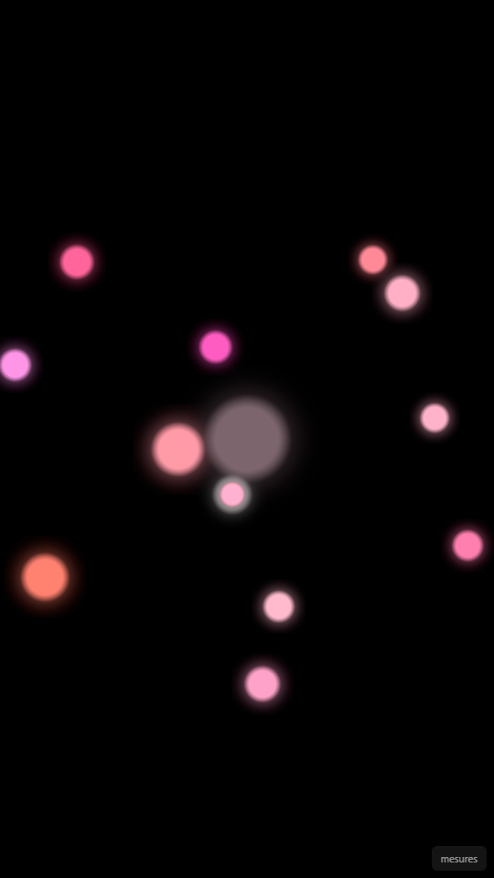

**Erreurs et leçons**

- Le moteur choisissait la cible tout seul (la boule la plus proche du centre) sans le montrer : pour Yocthan, l'entrée semblait aléatoire. Leçon : tout ce que le moteur décide à la place de l'utilisateur doit être visible, ou laissé à l'utilisateur.
- Les mesures affichées en permanence gênaient l'expérience. Un outil de sprint n'a pas sa place devant l'utilisateur.
- Le serveur de démonstration lancé par Claude s'arrête au bout de deux heures : Yocthan doit le relancer lui-même (`node outils/serveur.mjs` dans `moteur/`).

**À faire**

- Les mesures sur le Samsung Z Flip 5 (Chrome) : elles décident d'`ADR-005` et d'`ADR-010`.
- Yocthan veut maintenant parler du langage : ce que les humains écriront chaque jour, les extensions, l'écriture de sites.

---

## 2026-10-03 — Le sprint Big Bang : la première preuve exécutable

**Fait** (PR n° 9, fusionnée)

- Rust 1.99 installé sur le PC de Yocthan (profil minimal, cible WebAssembly). La connexion était lente (80 Ko/s) ; l'installation par défaut, qui téléchargeait la documentation, a été remplacée par une installation minimale.
- Un moteur en Rust (`moteur/`, 1 529 lignes), compilé en WebAssembly, qui dessine avec `wgpu` : WebGPU, ou WebGL 2 en repli. Il lit un fichier `.holo` de huit lignes au format en blocs d'`ADR-009`, le cas `02-big-bang` de la suite de conformité.
- Un point lumineux se morcelle en douze points quand on zoome ; on s'approche d'un point, on aperçoit déjà le monde qu'il contient, on y entre ; ce monde contient lui-même des points, sans fin ; en dézoomant on ressort. Rien n'est stocké : chaque monde naît de sa graine, un niveau traversé coûte 16 octets.
- 17 tests du cœur en Rust pur, qui passent aussi sur GitHub (job ajouté au flux de tests).
- Mesuré sur le PC : 1 893 Ko de moteur réel, **489 Ko transférés** (cible : moins de 2 Mo), page HTML de 1 Ko identique pour tous les mondes.

| Zoom 0 | Zoom 0,8 | Zoom 3,4 | Zoom 4,6 |
|---|---|---|---|
| 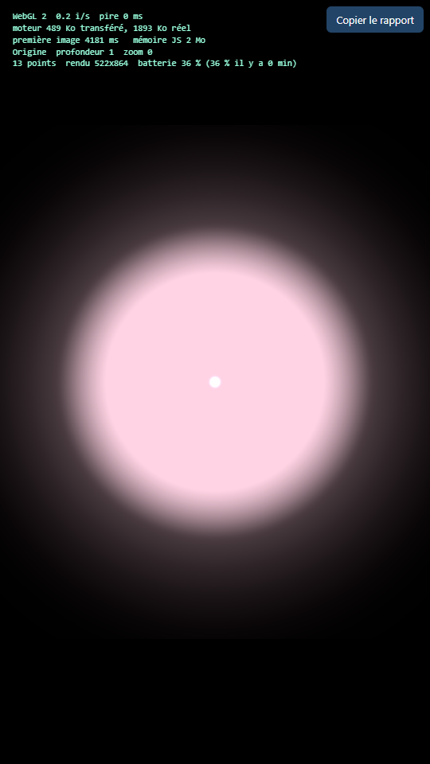 |  |  |  |

**Erreurs et leçons**

- `wgpu` ne retombe pas tout seul sur WebGL 2 quand WebGPU existe mais ne donne aucun adaptateur : le repli a dû être écrit à la main, en recréant la zone de dessin (une zone qui a reçu un contexte WebGPU n'en accepte plus un autre).
- Deux tests du cœur ont échoué au premier passage : avance octet par octet dans un texte accentué, et points pas exactement sur la sphère. Corrigés avant toute publication.
- Les images par seconde mesurées sur le PC sans carte graphique n'ont aucun sens ; elles n'ont pas été reportées. La seule mesure qui compte est celle du téléphone, et elle n'est pas faite.

---

## 2026-10-02 — Tout fusionner, puis ne garder que ce qui marche

**Fait**

- Sur ordre de Yocthan, les cinq pull requests en attente depuis le 21 septembre ont été fusionnées dans `main` : les trois prototypes, les décisions, les tests automatiques et la suite de conformité.
- Les tests automatiques ont alors montré ce que les README ne disaient pas : ChatGPT 8 sur 8, Claude 27 sur 27, Gemini 3 sur 4. `main` était rouge.
- Yocthan a précisé la règle : on ne fusionne que ce qui marche, et on revoit le reste. Gemini a reçu un fichier de consignes avec les résultats réels et la revue ; il a rendu une version corrigée (PR n° 7) : 6 tests sur 8, cinq défauts sur huit réellement corrigés. Les deux échecs venaient d'une seule ligne, qui empêchait d'entrer dans un nœud sans enfants. Sur ordre de Yocthan, Claude a corrigé cette ligne dans un commit à son nom : 8 sur 8, `main` au vert.
- Le README de Gemini a été corrigé là où la mesure le contredisait (PR n° 8) : la mémoire comptée n'est pas constante, elle croît de 64 Ko par niveau descendu.

**Erreurs et leçons**

- Claude a fusionné la proposition de Gemini alors qu'un test échouait, parce que l'ordre « tout fusionner » est arrivé avant la règle « seulement ce qui marche ». Une pull request de retrait a été préparée puis fermée sans fusion, la correction ayant suffi.
- Gemini a deux fois déroulé ses tests « à la main » en suivant son intention plutôt que son code. Leçon pour toutes les IA : un résultat de test ne s'annonce pas, il s'exécute.
- Le copier-coller depuis l'interface de Gemini abîme le code (indentation, `__init__` en gras) ; la demande de mettre chaque fichier dans un bloc de code a réglé le problème.

---

## 2026-09-21 — Les décisions, les trois prototypes et la revue de ChatGPT

**Fait**

- Claude a lu le dépôt créé par ChatGPT et donné son avis franc : le paradigme holoscénique n'a pas de primitive nouvelle (ECS, Datalog, règles de production, F#, Inform 7, Verse), et sa valeur possible est la synthèse ; l'originalité du projet est dans la vision de Yocthan (le point qui contient des mondes, le zoom, le web qui devient métavers, le budget de 1 Go).
- Trois prototypes en Python, un par IA : ChatGPT (noyau minimal), Claude (lois, capacités, vérificateur, journal causal), Gemini (nœud fractal, zoom, budget mémoire). Comparés par Claude, juge et partie ; ChatGPT a relevé qu'ils ne testent pas le même problème.
- Yocthan a pris ses premières décisions techniques, inscrites dans `ADR-007` à `ADR-015` : le métavers est une mise à jour du web avec deux vues ; le fichier `.holo` est une vraie source ; des blocs nommés par leur sens, texte Markdown dans les blocs ; moteur en Rust ; ponts JavaScript et CSS seulement en première version ; l'IA crée mais le monde se lit sans elle ; tout changement d'état passe par un arbitre. Il a aussi tranché les propositions de ChatGPT (`ADR-003` à `ADR-005` acceptées, `ADR-006` en proposition).
- ChatGPT a relu l'ensemble (note globale 5,5 sur 10, preuve sur téléphone 0 sur 10) : trop de décisions acceptées avant mesure (quatre sont passées en `EXPÉRIMENTATION`), `ADR-014` trop absolue (reformulée), dossiers non uniformes (uniformisés), pas de tests automatiques (ajoutés), pas de banc commun (suite de conformité créée).

**Erreurs et leçons**

- Claude a d'abord répondu « non » à la question « y aura-t-il des appels ? » avant de se corriger : il y en a, de deux sortes, et une troisième est interdite. Les absolus ne tiennent pas.
- Yocthan a observé que l'holoscénique ressemblait à l'objet : c'est vrai, et la description honnête l'a remplacé dans les documents. Ne pas revendiquer une révolution que le premier programmeur venu démonterait.
- « La documentation court plus vite que le moteur » (ChatGPT) : les trois IA et Yocthan ont fait de la preuve sur téléphone la priorité.

---

## 2026-09-20 — Le cadrage de la vision

Yocthan expose à Claude sa vision (`HC-011`) : remodeler l'usage du web en monde explorable, par sprints de 24 heures, horizon 2030. Le Big Bang : un point lumineux qui se morcelle en points, chacun contenant un monde ; la sphère est aussi le premier personnage. Le premier test doit tenir dans 1 Go et tourner sur n'importe quel téléphone actuel. Genie 3 n'est accessible qu'en inspiration. Yocthan veut un langage entièrement nouveau, verbeux mais simple, dans l'esprit de Dart et Flutter. Claude propose la génération par graine et objecte que battre C, Rust et Zig comme langage généraliste est hors de portée d'une personne seule.

---

## 2026-09-19 — Le faux départ

Claude a reçu le brief de Yocthan et a construit, sans en discuter, une première démonstration (sphère en WebGL, JavaScript, 24 Ko), en commençant même à nommer un langage. Yocthan l'a arrêté : rien n'avait été discuté. Tout a été effacé. Règle née ce jour-là, et depuis toujours respectée : **on discute d'abord ; aucune création de fichier, aucune décision technique, aucun nom sans son feu vert.** Détail dans `HC-010`.
