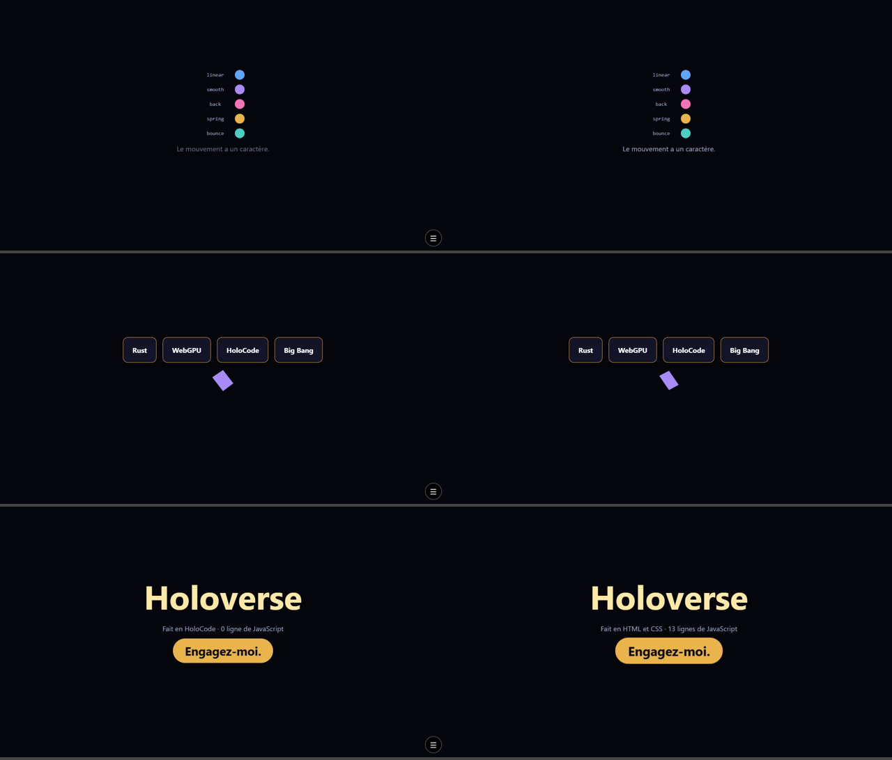

# Le duel du motion design : HoloCode contre HTML et CSS

Le même film, en sept scènes : le Big Bang, le titre, trois mots, le morphing, le laboratoire des courbes, la profondeur, la signature. **Les deux versions sont identiques point par point** : mêmes formes aux mêmes places, mêmes couleurs, mêmes moments, mêmes durées, mêmes courbes.

- [`holocode/showreel.holo`](holocode/showreel.holo) — HoloCode, avec le mouvement (`ADR-034`). Aucune ligne de JavaScript.
- [`web/showreel.html`](web/showreel.html) — son jumeau exact, en HTML et CSS, écrit comme l'écrirait un développeur web expérimenté (variables CSS, une animation réutilisée par tous les blocs). 7 lignes de JavaScript : couper les titres en lettres, relancer le film.
- [`web/showreel-max.html`](web/showreel-max.html) — **hors comparaison** : le même scénario, poussé au maximum de ce que le web sait faire (520 particules physiques, morphing en cœur, cube en 3D, réaction à la souris). Il montre ce que HoloCode ne sait pas encore faire.

Pour les voir : le serveur local (`node moteur/outils/server.mjs`), puis `http://localhost:8080/exemples/motion/holocode/showreel.holo` et `http://localhost:8080/exemples/motion/web/showreel.html`.

## Mesuré, sur les deux jumeaux

| | HoloCode | HTML et CSS |
|---|---|---|
| Lignes utiles (sans commentaires ni lignes vides) | 206 | 184 |
| Octets du fichier | **14 193** | 21 377 |
| Téléchargé à l'ouverture (Chrome, mesuré) | 10 Ko | **4 Ko** |
| JavaScript écrit | **0** | 7 lignes |
| Ce qu'il faut savoir pour l'écrire | `Enter`, `Loop`, `Scenes`, et les noms des blocs | `@keyframes`, variables CSS, `calc`, `cqw`, `aspect-ratio`, `translate`, `filter`, `linear()`, `clip-path`, `nth-child`, et du JavaScript |
| Moins de mouvement demandé par le visiteur | automatique | écrit à la main (une règle `@media`) |
| Résultat à l'écran | identique | identique |

## Le verdict de Claude, à fonctions égales

- **Le nombre de lignes ne départage pas** : il dépend de la mise en page. Les 36 éclats prennent 3 lignes chacun en HoloCode, une seule en HTML. En caractères, HoloCode est un tiers plus court.
- **Le poids téléchargé est à l'avantage du web** : 4 Ko contre 10 Ko. La page HoloCode porte le CSS que le moteur a fabriqué (plus long que celui écrit à la main) et la porte d'entrée de la page.
- **La vraie différence est ce qu'il faut savoir.** Le jumeau web est écrit avec des techniques d'expert ; une personne qui ne programme pas ne l'écrirait pas. Le fichier HoloCode se lit comme une phrase : « entre depuis 40 pixels plus bas, invisible, en ressort ».
- **En puissance, le web reste devant** (voir `showreel-max.html`).

## Un défaut trouvé en comparant

Quand le moteur arrive dans la page (au premier toucher, ou par une adresse avec `?`), il redessine la page : le film HoloCode repart alors de zéro. Sans geste, le film n'a pas besoin du moteur et ne saute pas. À corriger : le moteur devrait reprendre la page déjà affichée au lieu de la redessiner.

