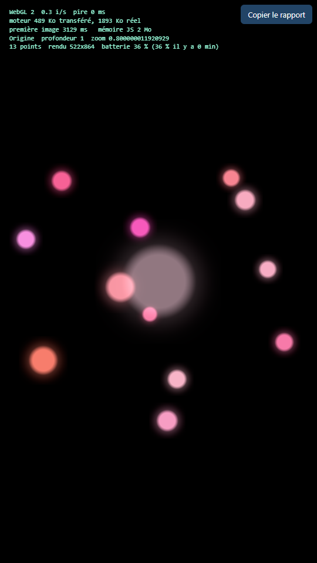
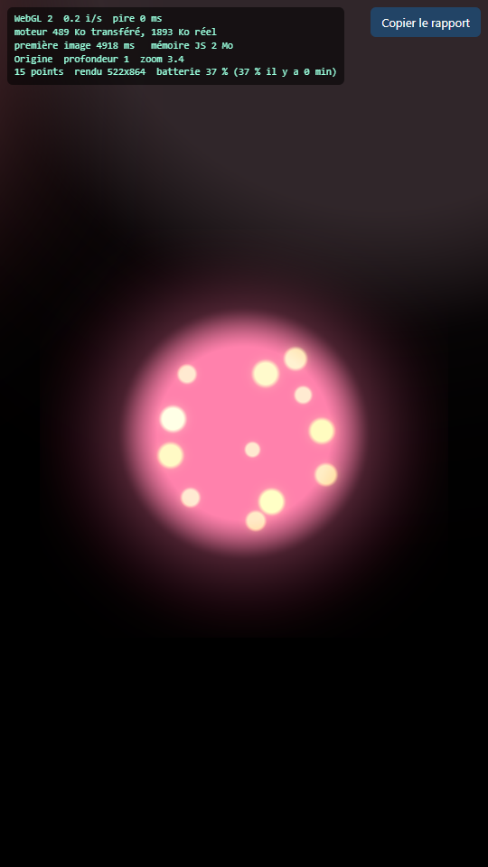
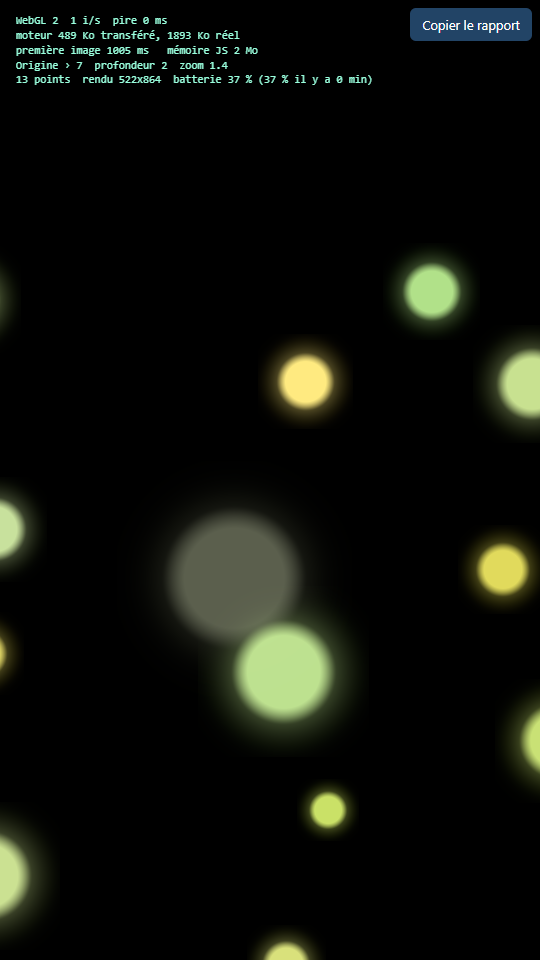

# Moteur HoloCode — sprint Big Bang

- L'éditeur (`ADR-046`) : `http://localhost:8080/editor?key=…`, l'adresse exacte affichée au démarrage du serveur.
- **La pile** : `http://localhost:8080/stack` — tout ce qui a été créé, le plus récent en haut, dans un seul onglet ; la page choisie s'ouvre à côté de la liste (sur un téléphone, à sa place). Pour montrer une page sans ouvrir de nouvel onglet : `node outils/show.mjs /exemples/lecons/09-zoom-et-points.holo` (la pile ouverte l'affiche ; s'il n'y en a pas, Chrome s'ouvre une fois, sur la pile).
- Statut : `ACCEPTÉ` — mesuré sur deux téléphones (environ 60 images par seconde) ; « valide tout ce qui est à laisser [à l'essai] si tu n'as pas encore validé » (Yocthan, 2026-10-06)
- Décisions mises à l'épreuve : `ADR-005` (téléphone, navigateur, 1 Go), `ADR-007` (vue en profondeur), `ADR-008` (même fichier, même résultat), `ADR-009` (format `.holo`), `ADR-010` (moteur Rust, WebAssembly, `wgpu`)
- Auteur : Claude, à la demande de Yocthan, le 2026-10-03

## Ce que c'est

La première preuve exécutable de la vision de Yocthan : un point lumineux qui se morcelle en points quand on zoome, et dans chaque point un monde, qui contient lui-même des points, sans fin. Tout est piloté par un fichier de huit lignes, [`mondes/big-bang.holo`](mondes/big-bang.holo) :

```holo
Point(
  name: Origin,
  seed: 1,
  brightness: 1.0,
  fragments: 12,
)
```

Le vocabulaire est en anglais depuis `ADR-016` ; le moteur refuse les anciens mots français en indiquant le mot à écrire.

Le décor n'est pas stocké, il est régénérable : chaque monde se calcule à partir de sa graine, et chaque point enfant reçoit une graine dérivée de celle de son parent. Descendre de mille niveaux coûte mille fois 16 octets (la graine du monde quitté et l'index du point traversé) ; le monde actif et l'aperçu du point visé sont en mémoire, le reste non. Ce qu'un humain ajoutera un jour (une commande, un objet déposé) devra être enregistré : une graine ne recrée pas les achats. Le même fichier donne le même univers sur toutes les machines, à la version du générateur près : si l'algorithme change, les mondes changent ; le test `les_valeurs_sont_figees` sert de garde-fou.

Le moteur est écrit en Rust, compilé en WebAssembly, et dessine avec `wgpu` : WebGPU quand le navigateur l'offre, WebGL 2 sinon. Le même code pourra plus tard tourner en natif, dans le navigateur propre au projet.

## Comment on s'en sert

- **Pincer** (ou la molette) : zoomer. Le point se morcelle, puis on s'approche du point visé, on aperçoit le monde qu'il contient, et on y entre.
- **Toucher** un point : il devient le point visé, signalé par un halo blanc qui respire ; c'est dans lui que l'on entre en zoomant. Tant qu'on n'a touché aucun point, la cible est celui qui est au centre.
- **Glisser** avec un doigt : tourner le monde.
- **Pincer dans l'autre sens** : dézoomer jusqu'à ressortir dans le monde parent.
- **Pause** : le bouton « pause », en bas à droite, arrête tout calcul et tout dessin ; « reprendre » relance. Le monde se met aussi en pause tout seul quand l'onglet est caché.
- Les mesures sont cachées : le petit bouton « mesures », en bas à droite, les affiche avec le bouton « Copier le rapport » (ou `?measures=1` dans l'adresse).

## Construire et lancer

Il faut Rust (avec la cible `wasm32-unknown-unknown`) et Node.

```powershell
cd moteur
.\outils\build.ps1        # cargo test, cargo build (wasm), wasm-bindgen → web/pkg
node outils/server.mjs        # http://localhost:8080
```

Le script construit deux paquets : `web/pkg` (le moteur entier, avec le dessin) et `web/pkg-light` (le moteur léger, sans le dessin, `ADR-053`) ; une page prend le léger, et ne fait venir le dessin que si elle montre des points ou des mondes. Le script télécharge `wasm-bindgen` 0.2.100 dans `outils/bin/` s'il manque. Le serveur compresse en Brotli, comme un vrai hébergement, pour que le poids transféré affiché soit le vrai.

Paramètres d'adresse utiles : `?zoom=3.4` démarre à un zoom donné (pour les captures), `?world=nom` charge `mondes/nom.holo`.

## Tester sur le téléphone

1. Lance le serveur sur le PC ; il affiche une adresse `http://192.168.x.x:8080` (ou `10.x.x.x`).
2. Sur le téléphone, connecté au même Wi-Fi, ouvre cette adresse dans Chrome.
3. **WebGPU exige une page « sécurisée »** : en `http://` sur une adresse locale, Chrome ne l'offre pas, et le moteur tourne en WebGL 2. C'est déjà une mesure utile. Pour mesurer WebGPU, au choix :
   - sur le téléphone, ouvre `chrome://flags/#unsafely-treat-insecure-origin-as-secure`, ajoute l'adresse du PC (par exemple `http://192.168.1.20:8080`), active, relance Chrome ;
   - ou branche le téléphone en USB avec le débogage activé, et dans Chrome sur le PC, `chrome://inspect` → « Port forwarding » : `8080` → `localhost:8080`. Sur le téléphone, `http://localhost:8080` est alors sécurisé.
4. Laisse tourner 15 minutes en zoomant et dézoomant, puis appuie sur « Copier le rapport » et colle le résultat dans une discussion ou dans le dépôt.

Le rapport contient : le moteur de rendu utilisé, les images par seconde, la pire image en millisecondes, le temps jusqu'à la première image, le poids du moteur transféré et réel, la mémoire JavaScript (Chrome), la profondeur atteinte, et la batterie au départ et à l'arrivée.

## Ce qui est mesuré sur le PC

| Mesure | Résultat | Cible du sprint |
|---|---|---|
| Tests du cœur (`cargo test`, Rust natif) | 66 sur 66 (17 au premier sprint, 18 avec le toucher, 19 avec les corrections de la revue Codex, 23 avec la vérification des blocs de texte, 28 avec les styles, 29 avec l'exemple de la boutique comparée, 40 avec la vue à plat et les règles, 42 avec la vue personnage, 49 avec la mosaïque, 52 avec sa profondeur, 56 avec les réglages de vue écrits dans le fichier, 57 avec les exemples du guide, 58 avec les points plantés dans un pixel, 59 avec les sites emboîtés, 60 avec la limite du nombre de niveaux, 62 avec le carrefour, 64 avec les liens et les passages entre fichiers, 66 avec les corrections de la seconde revue Codex) ; dix-sept cas de la suite de conformité y sont lus directement | |
| Poids du moteur WebAssembly, brut | 1 942 815 octets (1 943 Ko, 1 Ko = 1 000 octets, comme dans la suite de conformité) | |
| Poids transféré (Brotli, qualité 11, mesuré localement) | **502 435 octets (502 Ko)**, plus 14 373 octets de JavaScript | moins de 2 Mo |
| Commit de cette mesure | `8348169`, PC Windows, Rust 1.99 ; le flux GitHub affiche le poids brut à chaque changement | |
| Fichier de la page HTML | 1 Ko, le même pour tous les mondes | |
| Fichier `.holo` du monde | 8 lignes | |
| Repli WebGPU → WebGL 2 | Vérifié : sans carte graphique, le moteur bascule tout seul | |
| Parcours complet en captures d'écran | point entier → morcellement → plongée avec aperçu du monde intérieur → entrée (« Origine › 7 ») | |

Les images par seconde et la mémoire mesurées sur le PC sans carte graphique (rendu logiciel) n'ont aucun sens et ne sont pas reportées. **Les mesures qui comptent sont celles du téléphone : les voici.**

## Ce qui est mesuré sur le téléphone

Samsung Galaxy Z Flip 5 (SM-F731N), Chrome 153, le 2026-10-04, commit `d89c1e6`. Le téléphone est relié au PC par câble ; il ouvre `http://localhost:8080`, ce que Chrome tient pour une page sûre, donc WebGPU est offert. Écran vu par Chrome : 360 × 777, densité 3 ; zone de dessin : 720 × 1698 (la densité est plafonnée à 2).

| Mesure | Résultat |
|---|---|
| Mode graphique | WebGPU |
| Big Bang au repos | 59,7 images par seconde ; image la plus lente : 16,8 ms |
| Big Bang, zoom continu pendant 6 s, à travers 7 mondes emboîtés | 59,8 images par seconde ; image la plus lente : 16,9 ms |
| Première image, premier chargement | 3 521 ms |
| Première image, moteur déjà en cache | 336 ms |
| Boutique, page normale | prête en 122 ms ; le moteur ne dessine rien (0 image), aucune zone de dessin |
| Boutique, entrée en vue points | 264 ms ; 1 118 880 points au repos (720 × 1554) |
| Boutique, vue points, zoom continu pendant 6 s jusqu'à 4 morcellements | 59,7 images par seconde ; image la plus lente : 50,1 ms ; jamais plus de 6 344 points à l'écran |
| Tas JavaScript | 10 Mo |
| Mémoire du processus de l'onglet, vue points ouverte (`dumpsys meminfo`) | 88 Mo en part propre (PSS), 179 Mo résidents (RSS) |

Samsung Galaxy Z Flip 3 (SM-F711N, Snapdragon 888, 8 Go, Android 15), Chrome 153, le 2026-10-04, même méthode, sur la branche `langage/rotation-et-reglages`. Un téléphone de 2021, deux ans plus ancien. Écran vu par Chrome : 360 × 744, densité 3.

| Mesure | Résultat |
|---|---|
| Mode graphique | WebGPU |
| Big Bang au repos | 60,1 images par seconde ; image la plus lente : 16,8 ms |
| Big Bang, zoom continu pendant 6 s, à travers 6 mondes emboîtés | 60,3 images par seconde ; image la plus lente : 16,8 ms |
| Première image, moteur déjà en cache | 168 ms (753 ms à la première ouverture de la séance) |
| Boutique, entrée en vue points | 221 ms ; 1 071 360 points au repos (720 × 1488) |
| Boutique, vue points, zoom continu pendant 6 s jusqu'à 4 morcellements | 60,2 images par seconde ; image la plus lente : 33,3 ms ; jamais plus de 5 980 points à l'écran |
| Tas JavaScript | 17 Mo |
| Mémoire du processus de l'onglet, vue points ouverte (`dumpsys meminfo`) | 99 Mo en part propre (PSS), 241 Mo résidents (RSS) |

Le même Flip 3, le même jour, en **mode de secours WebGL 2** (adresse en `?webgl`), commit `64a157a` :

| Mesure | Résultat |
|---|---|
| Mode graphique | WebGL 2 |
| Big Bang, zoom continu pendant 6 s, à travers 6 mondes emboîtés | 60,2 images par seconde ; image la plus lente : 16,8 ms |
| Première image, premier chargement de cette version | 3 398 ms |
| Boutique, entrée en vue points | 318 ms ; 1 071 360 points au repos |
| Boutique, vue points, zoom continu pendant 6 s jusqu'à 4 morcellements | 59,8 images par seconde ; image la plus lente : 33,3 ms ; jamais plus de 5 980 points à l'écran |
| Tas JavaScript | 10 Mo |
| Mémoire du processus de l'onglet (`dumpsys meminfo`) | 86 Mo en part propre (PSS), 217 Mo résidents (RSS) |

Sur ce téléphone, le mode de secours est aussi fluide que WebGPU. Cela dit que le chemin WebGL 2 marche et n'est pas plus lent ; cela ne dit rien d'une carte graphique modeste.

Ce téléphone ne fait pas moins bien que le Flip 5. Ce n'est toujours pas un téléphone modeste : c'était un haut de gamme en 2021.

Ce que ces mesures ne disent pas : la consommation de batterie, l'échauffement dans la durée, le comportement sans WebGPU (WebGL 2), et celui d'un téléphone plus modeste. Une seule série a été faite.

Pour mesurer le mode de secours (WebGL 2) sur un appareil qui a WebGPU, ajouter `?webgl` à l'adresse.

Pour refaire les mesures : `adb reverse tcp:8080 tcp:8080`, `adb forward tcp:9222 localabstract:chrome_devtools_remote`, ouvrir la page dans Chrome sur le téléphone (écran allumé et déverrouillé), puis `node outils/measure-phone.mjs big-bang.holo @outils/mesures/big-bang.js` ou `node outils/measure-phone.mjs boutique.holo @outils/mesures/vue-points.js`.

## Captures (Chrome sans fenêtre, rendu WebGL 2 logiciel)

| Zoom 0 | Zoom 0,8 | Zoom 3,4 | Zoom 4,6 |
|---|---|---|---|
|  |  |  |  |

## Critères d'abandon du sprint

Repris de la proposition de Gemini, à vérifier sur le téléphone :

| Mesure | Cible | Abandon si |
|---|---|---|
| Fluidité | 60 images par seconde | saccades de plus de 50 ms à l'entrée dans un point |
| Mémoire de l'onglet | moins de 300 Mo, stable avec la profondeur | elle croît avec la profondeur |
| Première image | moins de 1 seconde | |
| Batterie | | plus de 20 % perdus en 15 minutes |

## Limites et choix à discuter

- **La vue en profondeur ne lit que `Point`.** Il sait déjà lire toute la grammaire brouillon (blocs, listes, textes Markdown, unités, imports) et refuse le code libre dans un bloc, mais seul `Point` reçoit un sens. Les autres blocs (`Page`, `Text`, `P`, `H1`, `Button`…) sont vérifiés (ils existent, les titres ne sautent pas de niveau, `ADR-020`), ainsi que les styles écrits comme en CSS (`ADR-017`), mais rien de cela n'est encore affiché ; la vue à plat viendra ensuite.
- **Les positions des points dépendent de sinus et cosinus.** Les entiers (graines, nombres de points, couleurs) sont identiques partout ; les positions pourraient différer d'un milliardième entre un PC et un téléphone. Ce sera invisible, mais ce n'est pas strictement « même fichier, même résultat » : à régler si l'on veut des mondes partagés au bit près.
- **La transition d'entrée est un fondu**, pas une continuité parfaite : le monde intérieur aperçu avant d'entrer et le monde affiché après ne coïncident pas exactement.
- **Aucune loi ni phénomène** : ce sprint ne porte que sur la navigation et le poids.
- **Densité de pixels plafonnée à 2** pour ménager la chauffe du téléphone.
- `wgpu` est fixé à la version 24 ; une montée de version demandera quelques retouches.
- **Lexique** : un entier écrit sans point ni unité est gardé exact (jusqu'à 18 446 744 073 709 551 615) ; une unité se colle au nombre (`500Ko`, pas `500 Ko`) ; un `import` est refusé par ce sprint tant qu'il n'est pas appliqué, plutôt qu'ignoré en silence. Ces trois points viennent de la revue Codex du 2026-10-03.
- La mémoire mesurée par la page (`usedJSHeapSize`) n'est que le tas JavaScript, pas la mémoire totale de l'onglet : seule une mesure dans les outils de Chrome sur le téléphone donnera le vrai chiffre.

## Fichiers

| Fichier | Rôle |
|---|---|
| `src/holo.rs` | Lecture d'un fichier `.holo` : mots, blocs, erreurs avec ligne et colonne |
| `src/seed.rs` | Graines et nombres pseudo-aléatoires reproductibles, en arithmétique entière |
| `src/universe.rs` | Du bloc `Point` au monde ; les enfants et leurs graines |
| `src/navigation.rs` | Morcellement, zoom, entrée, sortie ; produit la liste des disques à dessiner |
| `src/renderer.rs`, `src/renderer.wgsl` | Dessin avec `wgpu` : un disque lumineux par instance, mélange additif |
| `src/web.rs` | Zone de dessin, doigts, molette, boucle d'affichage, mesures dans `window.__holo` |
| `web/index.html` | La seule page HTML, générée une fois pour tous les mondes |
| `web/measures.js` | L'affichage des mesures et le bouton « Copier le rapport » |
| `outils/server.mjs` | Serveur local avec compression Brotli ; envoie la page déjà fabriquée si `holo` est construit |
| `src/bin/holo.rs` | Le moteur en ligne de commande, pour le PC ou un serveur : `cargo build --release --bin holo`, puis `holo check fichier.holo` (vérifier) et `holo html fichier.holo` (écrire le HTML de la page) |
| `outils/build.ps1` | Construction complète |
